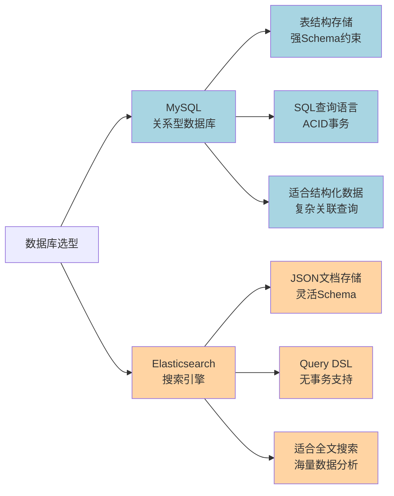
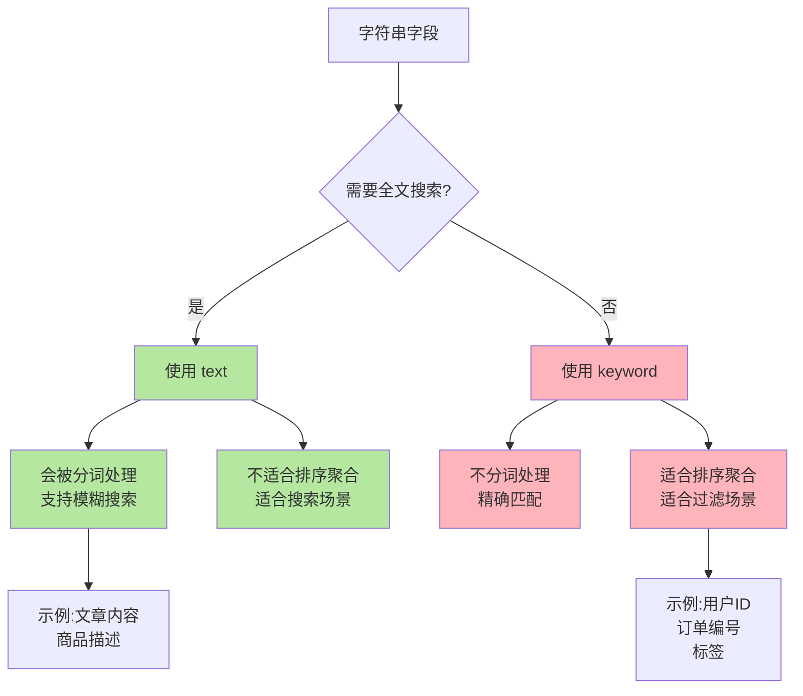
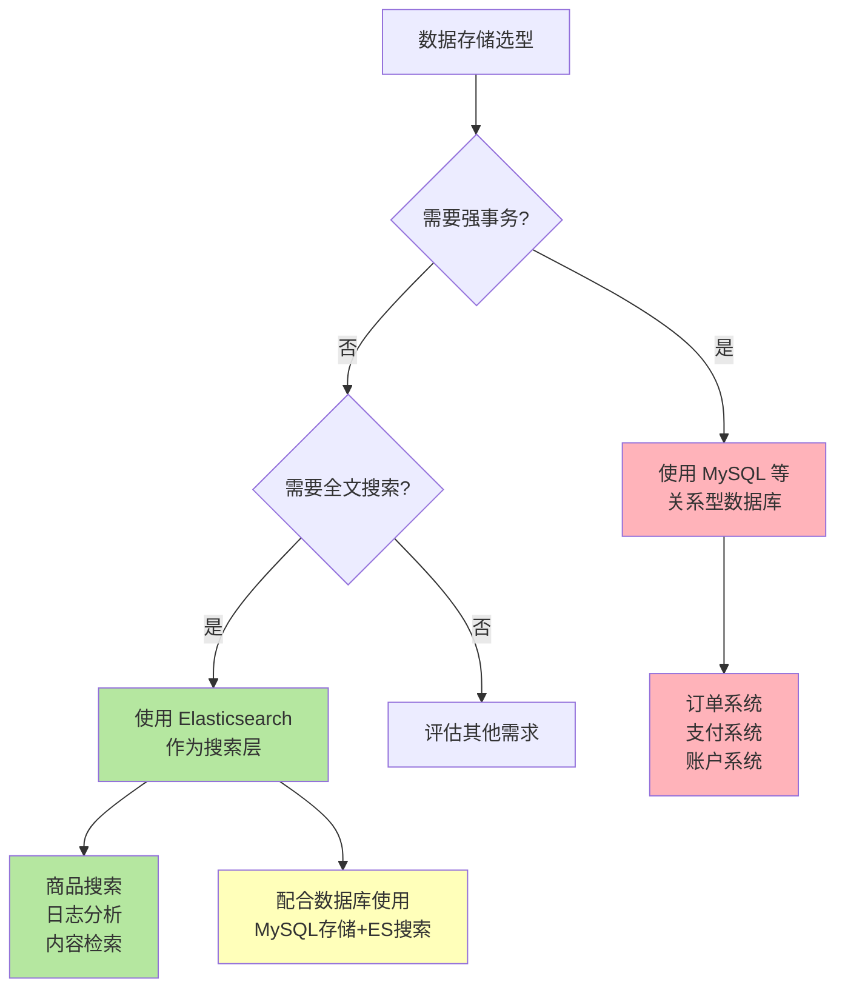

# Elasticsearch基础与数据类型

## 什么是 Elasticsearch

Elasticsearch 是一个开源的分布式搜索和分析引擎，专为处理大规模数据设计，具备强大的全文搜索、实时分析和高可扩展性等特点。

### 核心特点

**分布式架构**：Elasticsearch 采用分布式存储架构，将数据分散存储在多个节点上，有效降低单节点压力，显著提升系统整体性能和可用性。

**基于文档存储**：与传统关系型数据库不同，Elasticsearch 采用文档模型存储数据，使用 JSON 格式组织信息。相关数据通常存储在同一个文档中，而非分散在多个关联表中，这种设计更适合非结构化和半结构化数据的存储与检索。

**强大的全文搜索**：Elasticsearch 的核心优势在于全文搜索能力。数据索引时会自动建立倒排索引，使其在处理海量文本数据搜索时表现出色，远超传统关系型数据库。

**灵活的查询语言**：采用 Query DSL（领域特定语言）作为查询语言，基于 JSON 格式，支持全文搜索、组合查询、过滤、聚合等多种复杂操作，相比传统 SQL 更加灵活。

### 主要应用场景

Elasticsearch 在实际业务中有广泛的应用场景：

1. **全文搜索引擎**：用于网站内容检索、商品搜索、文档查询等场景，提供快速精准的搜索体验
2. **日志分析系统**：配合 ELK（Elasticsearch、Logstash、Kibana）技术栈，实现日志收集、分析和可视化，帮助企业了解系统运行状况
3. **实时数据分析**：支持对大规模数据进行实时查询和聚合分析，为数据科学家提供强大的分析能力
4. **业务监控告警**：实时监测系统性能指标、业务数据变化，及时发现异常并触发告警
5. **推荐系统**：基于用户行为数据进行实时分析，提供个性化推荐服务

### 与 MySQL 的核心差异

**数据模型**：MySQL 使用表、行、列的关系型结构组织数据，通过外键建立表间关联；Elasticsearch 使用 JSON 文档存储，相关数据聚合在同一文档中。

**查询语言**：MySQL 使用成熟的 SQL 语言，强类型且标准化；Elasticsearch 使用基于 JSON 的 Query DSL，更加灵活，特别适合复杂的搜索场景。

**全文搜索能力**：MySQL 虽然提供基本的全文搜索功能，但其设计初衷是处理结构化数据的存储和查询；Elasticsearch 则是为全文搜索而生，在大规模文本检索场景下性能远超 MySQL。

**事务支持**：MySQL 完整支持 ACID 事务，适合金融系统等对数据一致性要求极高的场景；Elasticsearch 不支持传统意义上的事务，仅保证单文档操作的原子性。

## Elasticsearch 的数据类型

Elasticsearch 支持丰富的数据类型，以满足不同场景的存储和检索需求。

### 核心数据类型

**字符串类型**：
- `text`：用于全文文本数据，如博客文章、产品详情等。支持分词和全文检索，但不适合排序和聚合操作
- `keyword`：用于结构化文本，如标签、邮箱地址、状态码等。不进行分词，适合精确匹配、排序和聚合

**数值类型**：
- `long`、`integer`、`short`、`byte`：不同范围的整数类型
- `double`、`float`：浮点数类型，用于存储小数
- `scaled_float`：通过缩放因子将浮点数转为整数存储，兼顾精度和性能

**日期类型**：
- `date`：存储日期或日期时间信息，支持多种格式

**布尔类型**：
- `boolean`：存储 true 或 false 值

**二进制类型**：
- `binary`：存储二进制数据

**复杂类型**：
- `object`：嵌套文档结构，文档内可包含子文档
- `nested`：特殊的对象类型，用于存储数组，数组中每个元素都是独立可搜索的文档

### text 与 keyword 的区别

这是 Elasticsearch 中最容易混淆的两种类型，理解它们的差异对于正确建立索引至关重要。

**text 类型**专为全文搜索设计，存储时会对文本进行分词处理，将文本分解成独立的词项（term），便于搜索引擎进行全文检索。由于经过分词，text 字段不适合用于排序或聚合查询。典型应用场景包括文章正文、产品描述、用户评论等需要模糊搜索的内容。

**keyword 类型**用于精确值匹配，不进行分词，将文本作为一个完整不可分割的单元存储。正因为不分词，keyword 类型非常适合用于聚合（如计数、去重）和排序操作。但它不支持全文搜索，只能进行精确匹配查询。典型应用场景包括用户标签、订单编号、状态字段等需要精确查询的内容。

### 与 MySQL 类型映射

在实际业务中，经常需要将 MySQL 数据同步到 Elasticsearch，了解两者的类型映射关系非常重要：

| MySQL 类型 | Elasticsearch 类型 | 说明 |
|:---|:---|:---|
| VARCHAR | text 或 keyword | 需全文搜索用 text，精确匹配用 keyword |
| CHAR | keyword | 固定长度字符串，通常用 keyword |
| BLOB/TEXT | text | 大文本内容使用 text，支持全文检索 |
| INT、BIGINT | long | 整数类型统一映射为 long，支持更大数值范围 |
| TINYINT | byte | 小整数可映射为 byte 类型 |
| DECIMAL、FLOAT、DOUBLE | double 或 float | 根据精度需求选择，或使用 scaled_float |
| DATE、DATETIME、TIMESTAMP | date | 所有日期时间类型统一映射为 date |
| TINYINT(1) | boolean | MySQL 中常用 TINYINT(1) 表示布尔值 |

## Elasticsearch 的事务支持

Elasticsearch 虽然可以作为数据存储使用，但它**不支持传统关系型数据库的 ACID 事务**。这是由其设计目标决定的。

### 为什么不支持事务

Elasticsearch 的核心定位是**搜索引擎**，而非传统数据库。它的设计重点是提升查询性能和搜索效率。如果要支持复杂的事务操作，必然会引入大量的锁机制和一致性协议，这会严重影响查询性能，与 Elasticsearch 的设计初衷相悖。

在分布式环境下，为了保证 ACID 特性需要实现分布式事务，这会带来巨大的性能开销和复杂度。Elasticsearch 选择牺牲事务支持，换取更高的吞吐量和更好的水平扩展能力。

### 单文档原子性

虽然不支持跨文档事务，但 Elasticsearch **确保单个文档的操作是原子性的**。这意味着对单个文档的创建、更新、删除操作要么完整成功，要么完整失败，不会出现部分更新的情况。

例如，当更新一个订单文档时，文档的所有字段要么全部更新成功，要么保持原样，不会出现只更新部分字段的情况。

### 应用场景建议

对于需要严格事务保证的业务场景（如订单处理、支付结算、库存扣减），应使用 MySQL、PostgreSQL 等支持 ACID 事务的关系型数据库。

对于搜索、分析类场景，使用 Elasticsearch 可以获得更好的性能。实际应用中，常见的架构是"MySQL + Elasticsearch"组合：MySQL 作为主数据存储保证数据一致性，Elasticsearch 作为搜索层提供高性能检索能力。通过数据同步机制（如 Canal、Logstash 等）将 MySQL 数据实时或准实时同步到 Elasticsearch。
