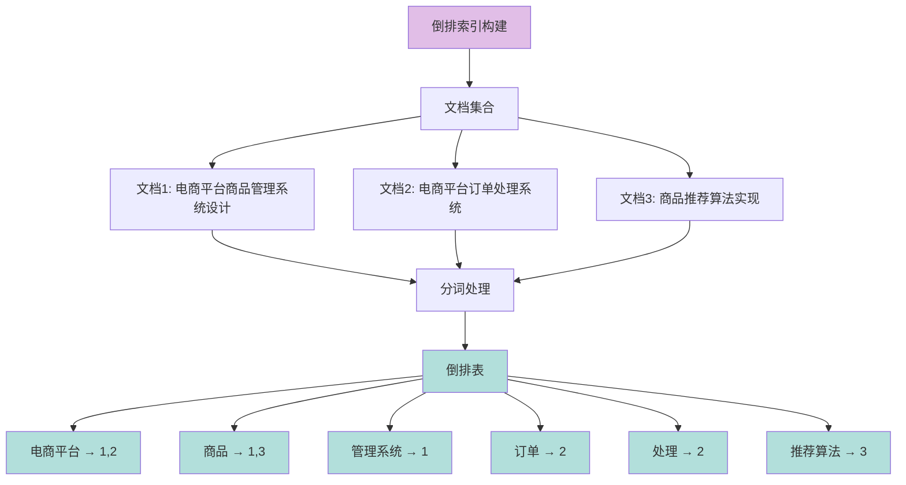
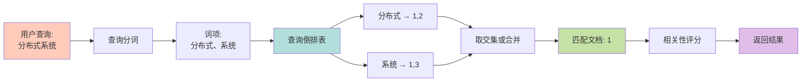
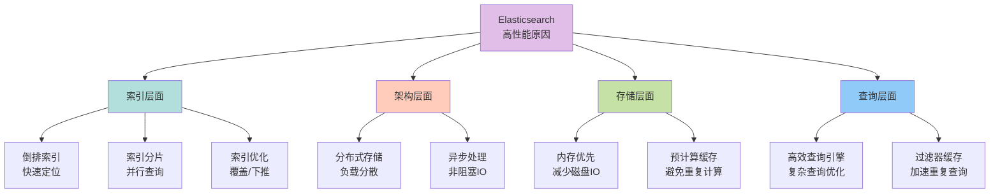

# 倒排索引原理与性能优势

## 倒排索引的原理

倒排索引（Inverted Index）是 Elasticsearch 实现高效全文搜索的核心数据结构，也是搜索引擎的基石技术。

### 什么是倒排索引

传统的索引结构是"正向索引"，以文档为中心：每个文档包含若干词汇，然后为文档建立索引。查询时需要扫描所有文档，检查是否包含目标词汇，效率较低。

**倒排索引则完全相反**，它以词汇为中心：每个词汇对应包含该词的所有文档列表。查询时直接通过词汇定位到相关文档，无需全表扫描，大幅提升检索效率。



### 倒排索引的构建过程

倒排索引的建立主要分为两个关键步骤：

#### 第一步：文档分词

假设我们有以下三份技术文档：

| 文档ID | 文档内容 |
|:---|:---|
| 1 | 分布式系统架构设计与实践 |
| 2 | 分布式缓存技术深度解析 |
| 3 | 系统架构优化最佳实践 |

Elasticsearch 首先会对这些文档进行分词处理。默认使用标准分词器（Standard Analyzer），将文本分解成独立的词项（Term）。

经过分词后，提取出的词项包括："分布式"、"系统"、"架构"、"设计"、"实践"、"缓存"、"技术"、"深度"、"解析"、"优化"、"最佳"等。

#### 第二步：生成倒排表

将分词得到的词项作为索引，记录每个词项出现在哪些文档中，同时可以记录词项在文档中的位置、出现频率等信息，形成倒排表：

| 词项 | 文档ID列表 | 词频信息 |
|:---|:---|:---|
| 分布式 | 1, 2 | 1:1, 2:1 |
| 系统 | 1, 3 | 1:1, 3:1 |
| 架构 | 1, 3 | 1:2, 3:1 |
| 设计 | 1 | 1:1 |
| 实践 | 1, 3 | 1:1, 3:1 |
| 缓存 | 2 | 2:1 |
| 技术 | 2 | 2:1 |
| 深度 | 2 | 2:1 |
| 解析 | 2 | 2:1 |
| 优化 | 3 | 3:1 |
| 最佳 | 3 | 3:1 |

#### 第三步：索引优化与压缩

生成倒排表后，Elasticsearch 会对其进行压缩优化，减少存储空间占用。常用的压缩算法包括：
- **Variable Byte Encoding**（可变字节编码）：针对整数序列的高效压缩
- **Frame of Reference**（参考帧）：利用整数之间的差值进行压缩
- **Roaring Bitmap**：针对文档ID列表的位图压缩

最后将压缩后的倒排表持久化到磁盘，同时在内存中缓存热点数据，确保查询时能够快速访问。

### 倒排索引的查询流程

当用户搜索"分布式系统"时，Elasticsearch 的处理流程如下：



1. **查询分词**：对搜索关键词"分布式系统"进行分词，得到 ["分布式", "系统"]
2. **查找倒排表**：在倒排索引中查找这两个词项，得到 "分布式" → [1, 2]，"系统" → [1, 3]
3. **文档匹配**：根据查询类型（AND/OR）合并结果，如果是 AND 查询则取交集得到文档1
4. **相关性评分**：使用 TF-IDF、BM25 等算法对匹配文档进行相关性打分
5. **返回结果**：按相关性得分排序后返回给用户

整个过程无需遍历所有文档内容，直接通过索引定位，查询效率极高。

## Elasticsearch 为什么这么快

Elasticsearch 之所以能提供毫秒级的查询响应，得益于多方面的技术优化。

### 核心性能优势



#### 倒排索引结构

这是 Elasticsearch 性能的基石。倒排索引将文档中的每个词项与包含该词的文档进行映射。当搜索请求到来时，ES 能够快速查找包含所有搜索词的文档，而不需要逐个扫描文档内容，查询时间复杂度从 O(n) 降低到接近 O(1)。

#### 分布式架构与分片机制

Elasticsearch 使用分布式存储技术，将数据分散在多个节点上，单节点的压力被分散到整个集群，整体性能线性提升。

每个索引被划分成多个分片（Shard），查询操作可以在多个分片上并行执行，然后汇总结果。这种并行化处理机制大幅提升了查询速度，特别是在大数据量场景下优势明显。

#### 内存优先策略

ES 采用内存优先的存储策略，将热点数据和索引结构缓存在内存中。相比传统磁盘数据库，内存访问速度快几个数量级，能够大大减少磁盘 I/O 次数，显著提升数据存储和查询效率。

常用的缓存包括：
- **文件系统缓存**：操作系统级别的页缓存
- **查询缓存**：缓存查询结果
- **请求缓存**：缓存聚合请求的结果
- **字段数据缓存**：缓存排序和聚合用的字段数据

#### 预计算与结果缓存

Elasticsearch 在数据写入时就进行了大量预处理工作，将计算结果预存储到索引中。查询时无需重新计算，直接返回预计算结果，大幅减少查询时的计算开销。

例如，对于聚合查询，ES 可以在索引阶段就构建好聚合所需的数据结构（如 doc values），查询时直接使用，避免临时计算。

#### 高效的查询引擎

Elasticsearch 内置了高效的查询引擎，支持多种查询类型，并针对不同场景提供了优化策略：

- **索引覆盖**（Index Covering）：查询所需字段完全来自索引，无需访问原始文档
- **索引下推**（Index Pushdown）：将过滤条件下推到索引层面，减少数据传输
- **查询改写**（Query Rewriting）：自动优化查询语句，选择最优执行路径
- **布尔查询优化**：智能调整多条件查询的执行顺序，优先执行过滤性强的条件

#### 异步请求处理

ES 采用异步非阻塞的请求处理机制，基于 Netty 框架实现。当请求到达时，系统立即返回响应句柄，实际处理在后台异步完成，避免长时间阻塞等待，显著提升系统吞吐量和用户体验。

这种异步模型允许 ES 用较少的线程处理大量并发请求，避免了传统同步模型的线程上下文切换开销。

### 性能优化示例

以电商搜索场景为例，假设要搜索"无线蓝牙耳机"：

```json
GET /products/_search
{
  "query": {
    "bool": {
      "must": [
        { "match": { "title": "无线蓝牙耳机" }}
      ],
      "filter": [
        { "range": { "price": { "gte": 100, "lte": 500 }}}
      ]
    }
  }
}
```

执行过程：
1. **分词处理**：将"无线蓝牙耳机"分词为 ["无线", "蓝牙", "耳机"]
2. **倒排查询**：并行查询三个词项的倒排表，快速定位候选文档
3. **过滤缓存**：价格范围过滤条件被缓存，后续相同查询直接使用缓存结果
4. **分片并行**：如果索引有5个分片，查询在5个分片上并行执行
5. **结果合并**：协调节点收集各分片结果，合并排序后返回

整个过程通常在几十毫秒内完成，即使数据量达到千万级别。

### 性能对比

相比传统数据库的全文搜索，Elasticsearch 的性能优势明显：

| 操作类型 | MySQL LIKE 查询 | Elasticsearch |
|:---|:---|:---|
| 1000万文档中模糊搜索 | 5-10秒 | 10-50毫秒 |
| 复杂条件聚合统计 | 10-30秒 | 100-500毫秒 |
| 多字段组合搜索 | 需建多个索引，仍较慢 | 毫秒级响应 |

通过倒排索引、分布式架构、内存优化、预计算等多重技术的协同作用，Elasticsearch 实现了传统数据库难以企及的搜索性能。
