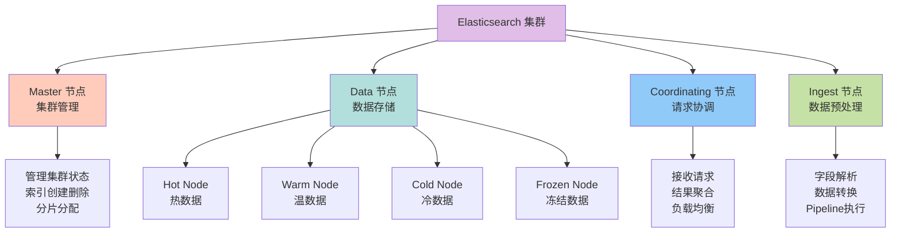
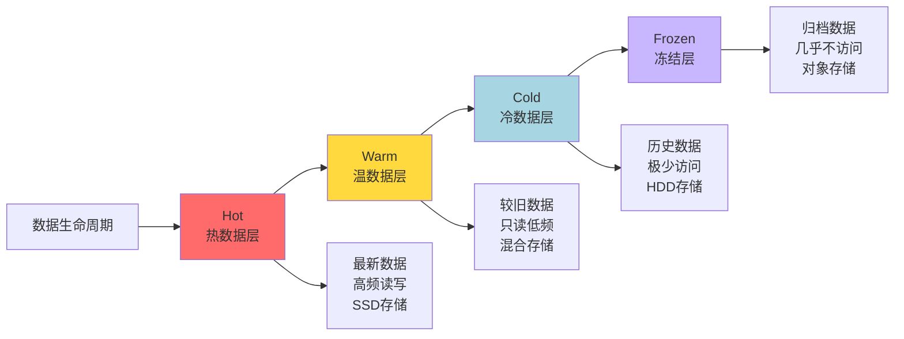
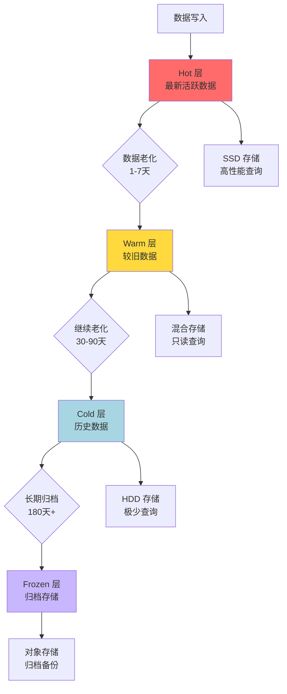
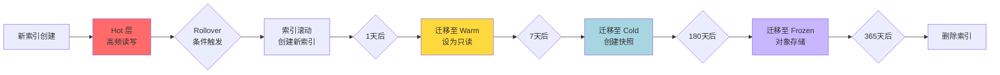

# 集群架构与节点角色

## 集群节点角色体系

从 Elasticsearch 7.x 版本开始，特别是到了 8.x 版本，ES 强烈推荐并默认使用基于角色的节点分工来优化集群稳定性。在早期版本中，节点角色划分较为模糊，但现代版本已经建立了完善的角色体系。

### 核心节点角色



#### Master 节点 - 集群大脑

Master 节点是集群的控制中心，负责所有集群级别的管理操作：

**主要职责**：
- 管理集群状态（Cluster State），包括索引元数据、节点信息、分片分配状态等
- 创建或删除索引
- 跟踪其他节点的加入和离开
- 决定分片分配到哪个数据节点
- 执行分片的重新分配和平衡

**重要特性**：
- 集群同一时刻只能有一个活跃 Master 节点，通过选举产生
- Master 节点不负责数据文档的读写操作，因此负载通常不高
- 为避免脑裂问题，建议配置奇数个 Master-eligible 节点（如 3 或 5 个）

配置示例：
```yaml
node.name: master-node-1
node.roles: [ master ]
```

#### Master-Eligible 节点 - 候选节点

Master-Eligible 节点是具备成为 Master 资格的节点，但当前不一定是 Master。为确保集群稳定性，通常会设置多个候选节点。

**最佳实践**：
- 配置奇数个候选节点（通常 3 或 5 个），防止脑裂
- 候选节点通常不承担数据存储角色，专注于集群管理
- 当主节点故障时，候选节点会自动选举产生新的主节点

#### Data 节点 - 数据核心

Data 节点负责存储数据和执行数据相关操作：

**主要职责**：
- 存储分片数据（包括主分片和副本分片）
- 执行 CRUD 操作（创建、读取、更新、删除）
- 执行搜索查询
- 执行聚合计算
- 执行排序等数据处理任务

**资源需求**：
Data 节点是 CPU、内存和 I/O 密集型节点，需要强大的硬件支持，特别是：
- 大内存（用于缓存和聚合计算）
- 高性能存储（SSD 推荐用于热数据）
- 多核 CPU（用于并行查询处理）

#### Coordinating 节点 - 请求协调器

所有节点默认都是 Coordinating 节点（除非显式禁用）。它负责接收和分发客户端请求。

**主要职责**：
- 接收客户端的 REST 请求（搜索、写入等）
- 将请求路由到相应的数据节点或主节点
- 收集各个数据节点的返回结果
- 对结果进行合并、排序等最终处理
- 将最终结果返回给客户端

**专用协调节点**：
在大型集群中，可以配置专用协调节点（不承担其他角色），用于分担请求处理压力：

```yaml
node.name: coordinating-node-1
node.roles: []  # 空角色表示仅作为协调节点
```

#### Ingest 节点 - 数据预处理器

Ingest 节点在数据索引前对文档进行预处理，类似于数据管道。

**可执行的预处理任务**：
- 解析 CSV、JSON 等格式数据
- 字段重命名或添加新字段
- 根据条件删除字段
- 数据格式转换
- 调用外部服务进行数据增强

配置示例：
```yaml
node.name: ingest-node-1
node.roles: [ ingest ]
```

### 数据节点的层级划分

从 Elasticsearch 7.10+ 版本开始，Data 节点根据数据的冷热程度进一步细分为四个层级，这是实现索引生命周期管理（ILM）的基础。



| 节点类型 | 数据状态 | 硬件配置 | 访问模式 | 主要目标 |
|:---|:---|:---|:---|:---|
| **Hot** | 最新、最活跃 | 高性能 SSD、强 CPU、大内存 | 高频读写、低延迟查询 | 优化性能 |
| **Warm** | 较旧、不活跃 | 均衡型：SSD/HDD 混合或大容量 HDD | 偶尔查询、只读 | 平衡性能与成本 |
| **Cold** | 历史、很少访问 | 高密度、低成本：大容量 HDD | 极少查询、容忍高延迟 | 最大化节省存储成本 |
| **Frozen** | 归档、几乎不访问 | 对象存储（如 S3）或磁盘 | 极罕见查询、可接受慢恢复 | 极致的归档成本 |

配置示例：

```yaml
# Hot 数据节点
node.name: data-hot-1
node.roles: [ data_hot, data_content ]

# Warm 数据节点
node.name: data-warm-1
node.roles: [ data_warm ]

# Cold 数据节点
node.name: data-cold-1
node.roles: [ data_cold ]

# Frozen 数据节点
node.name: data-frozen-1
node.roles: [ data_frozen ]
```

### 典型集群架构配置

以下是生产环境中常见的 ES 集群配置方案：

| 节点类型 | 建议数量 | 角色配置 | 硬件规格建议 |
|:---|:---|:---|:---|
| Master | 3 或 5 | `[master]` | 低配即可：4 核 8GB 内存 |
| Data Hot | 按需扩展 | `[data_hot, data_content]` | SSD 磁盘，高内存（32GB+） |
| Data Warm | 适量 | `[data_warm]` | 大容量 SATA，中等内存（16GB+） |
| Data Cold | 适量 | `[data_cold]` | 高密度 HDD，低内存即可 |
| Coordinating | 2-3 | `[]` | 中高内存，用于处理聚合结果 |
| Ingest | 可选 | `[ingest]` | 若大量使用 pipeline 则配置 |

## Hot-Warm-Cold 数据分层架构

Hot-Warm-Cold 架构是 Elasticsearch 为应对数据生命周期管理和成本优化而设计的经典部署模式。通过将不同活跃度的数据分配到不同性能、不同成本的硬件上，在性能、可用性和成本之间取得最佳平衡。

### 架构设计理念

大多数时序数据都遵循一个规律：新数据访问频繁，旧数据逐渐冷却。例如：
- 日志数据：最近一周的日志经常被查询，一个月前的日志很少访问
- 监控指标：实时指标需要秒级查询，历史趋势分析对延迟容忍度高
- 电商订单：近期订单频繁查询和修改，历史订单主要用于归档和偶尔查询

基于这一特点，Hot-Warm-Cold 架构应运而生：



### 各层级详细说明

#### Hot 层 - 热数据层

**数据特征**：
- 最新产生的数据，通常是近 1-7 天的数据
- 高频写入和查询
- 对查询延迟要求极高，通常需要毫秒级响应

**硬件配置**：
- **存储**：高性能 NVMe SSD
- **CPU**：高主频多核处理器（如 16 核以上）
- **内存**：大内存配置（32GB - 128GB）
- **网络**：万兆网卡

**典型配置**：
```yaml
node.name: hot-node-1
node.roles: [ data_hot, data_content ]
node.attr.data: hot
```

#### Warm 层 - 温数据层

**数据特征**：
- 写入已停止，数据进入只读状态
- 查询频率降低，但仍有一定访问需求
- 通常是 7-30 天前的数据

**硬件配置**：
- **存储**：混合 SSD/HDD 或大容量 SATA SSD
- **CPU**：中等配置即可
- **内存**：中等内存（16GB - 32GB）
- **优化**：可以减少副本数，降低存储成本

**典型操作**：
- 将索引设置为只读
- 执行 forcemerge 合并段，优化存储
- 减少主分片数量（shrink）

```yaml
node.name: warm-node-1
node.roles: [ data_warm ]
node.attr.data: warm
```

#### Cold 层 - 冷数据层

**数据特征**：
- 极少被访问的历史数据
- 通常是 30-180 天前的数据
- 可以容忍较高的查询延迟（秒级）

**硬件配置**：
- **存储**：高密度大容量 HDD
- **CPU**：低配即可
- **内存**：低内存配置（8GB - 16GB）
- **优化**：使用可搜索快照（Searchable Snapshot）降低成本

```yaml
node.name: cold-node-1
node.roles: [ data_cold ]
node.attr.data: cold
```

#### Frozen 层 - 冻结层（7.10+）

**数据特征**：
- 长期归档数据，几乎不访问
- 通常是 180 天甚至数年前的数据
- 主要用于合规性要求或历史审计

**硬件配置**：
- **存储**：对象存储（如 AWS S3、阿里云 OSS）
- **成本**：存储成本极低，按需查询
- **查询**：查询时需要从对象存储恢复数据，延迟较高

```yaml
node.name: frozen-node-1
node.roles: [ data_frozen ]
```

### 数据流转机制

配合索引生命周期管理（ILM），数据可以自动在各层之间流转：



1. **Hot 阶段**：数据持续写入，当索引达到一定大小或时间后触发 rollover
2. **Warm 阶段**：索引迁移到温节点，设为只读，执行段合并优化
3. **Cold 阶段**：索引迁移到冷节点，可创建可搜索快照
4. **Frozen 阶段**：索引数据转存到对象存储，本地只保留索引元数据
5. **Delete 阶段**：最终删除过期数据

### 成本优化效果

采用 Hot-Warm-Cold 架构可以显著降低存储成本：

| 存储层级 | 数据量占比 | 存储成本 | 查询性能 | 综合成本 |
|:---|:---|:---|:---|:---|
| Hot（SSD） | 10% | 高 | 极快 | 合理 |
| Warm（混合） | 20% | 中 | 快 | 经济 |
| Cold（HDD） | 50% | 低 | 中 | 很经济 |
| Frozen（对象存储） | 20% | 极低 | 慢 | 极经济 |

假设存储 1TB 数据：
- **全部使用 SSD**：约 $300-500/月
- **Hot-Warm-Cold 架构**：约 $100-150/月，**节省 60%-70% 成本**

### 应用场景

Hot-Warm-Cold 架构特别适合以下场景：

1. **日志分析系统**：近期日志高频查询，历史日志归档存储
2. **监控指标存储**：实时指标秒级查询，历史趋势分析容忍延迟
3. **审计日志**：合规要求长期保存，但很少查询
4. **IoT 时序数据**：传感器数据海量产生，新数据价值高，旧数据价值递减
5. **电商订单系统**：近期订单频繁操作，历史订单主要归档

通过合理的数据分层策略，既能保证热数据的查询性能，又能大幅降低冷数据的存储成本，实现性能与成本的最优平衡。
