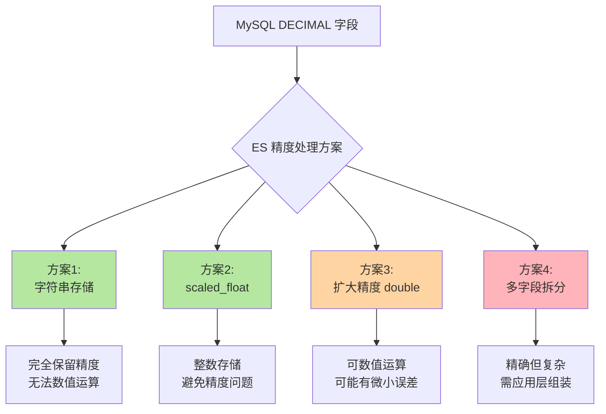
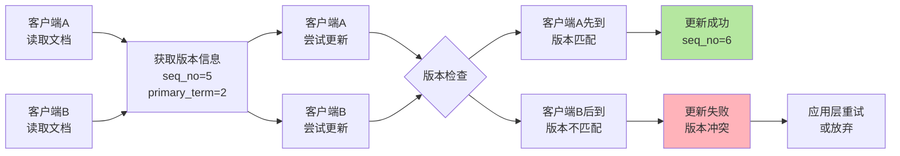
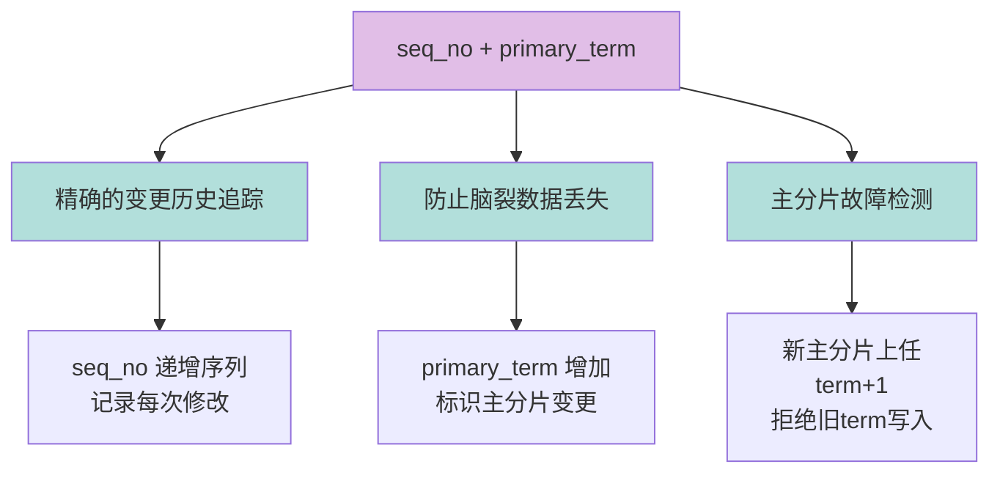

# 数据精度处理与并发控制

## 浮点数精度处理方案

在实际业务中，经常需要将 MySQL 中的 `DECIMAL` 类型数据同步到 Elasticsearch。然而，ES 并不支持 `DECIMAL` 类型，只提供 `double`、`float` 等浮点类型。这就带来了精度丢失的风险。

### 问题场景

假设 MySQL 中有如下字段定义：

```sql
CREATE TABLE products (
    id BIGINT PRIMARY KEY,
    name VARCHAR(100),
    price DECIMAL(10, 2),  -- 价格字段，精确到分
    discount DECIMAL(5, 4)  -- 折扣，如 0.8500
);
```

当需要将这些数据同步到 Elasticsearch 时，如何确保价格等关键字段不丢失精度呢？



### 方案一：使用字符串类型（推荐）

将 `DECIMAL` 数据作为字符串类型存储在 Elasticsearch 中，完全保留原始精度。

**映射定义**：
```json
{
  "mappings": {
    "properties": {
      "product_name": {
        "type": "text"
      },
      "price": {
        "type": "keyword"
      },
      "discount": {
        "type": "keyword"
      }
    }
  }
}
```

**示例数据**：
```json
{
  "product_name": "智能手环 Pro",
  "price": "299.99",
  "discount": "0.8500"
}
```

**优点**：
- ✅ 完全保留数字的精度，不会有任何丢失
- ✅ 实现简单，数据迁移时不需要特殊处理
- ✅ 适合需要精确显示的场景（如财务报表、商品价格展示）

**缺点**：
- ❌ 无法直接进行数值比较或数学运算
- ❌ 需要在应用层将字符串转换为数值后再计算
- ❌ 范围查询需要使用脚本，性能较差

**适用场景**：
- 商品价格展示（只需要精确显示，不需要 ES 层面的运算）
- 金额字段的精确存储
- 配合应用层进行数值计算的场景

### 方案二：使用 scaled_float（强烈推荐）

`scaled_float` 是 Elasticsearch 专门为解决浮点精度问题设计的类型。它通过缩放因子将浮点数转换为整数存储，从而在一定精度范围内完全避免浮点误差。

**核心原理**：
通过一个缩放因子（scaling_factor）将浮点数转换为整数存储。例如，缩放因子为 100 时，值 `299.99` 会存储为整数 `29999`。

**映射定义**：
```json
{
  "mappings": {
    "properties": {
      "product_name": {
        "type": "text"
      },
      "price": {
        "type": "scaled_float",
        "scaling_factor": 100
      },
      "discount": {
        "type": "scaled_float",
        "scaling_factor": 10000
      }
    }
  }
}
```

**示例数据**：
```json
{
  "product_name": "智能手环 Pro",
  "price": 299.99,      // 实际存储为整数 29999
  "discount": 0.8500    // 实际存储为整数 8500
}
```

**范围查询示例**：
```json
{
  "query": {
    "range": {
      "price": {
        "gte": 200,
        "lte": 500
      }
    }
  }
}
```

**优点**：
- ✅ 完全避免浮点数精度问题，存储为整数
- ✅ 支持数值比较和范围查询，性能优秀
- ✅ 支持聚合统计（求和、平均值等）
- ✅ 相比 `double` 占用更少的存储空间

**缺点**：
- ⚠️ 需要预先确定缩放因子，确定后不可更改
- ⚠️ 缩放因子选择不当可能导致精度不够或溢出

**缩放因子选择指南**：
- 价格字段（精确到分）：`scaling_factor: 100`
- 折扣率（精确到万分位）：`scaling_factor: 10000`
- 金额字段（精确到厘）：`scaling_factor: 1000`

**适用场景**：
- 商品价格存储与查询
- 金融交易金额
- 统计指标（如转化率、百分比等）

### 方案三：扩大 double 精度

虽然 `double` 理论上存在精度损失，但其提供的 15-17 位有效数字对大多数业务场景已经足够。

**映射定义**：
```json
{
  "mappings": {
    "properties": {
      "transaction_amount": {
        "type": "double"
      }
    }
  }
}
```

**优点**：
- ✅ 可以直接进行数值比较和数学运算
- ✅ 支持所有数值类型的聚合操作
- ✅ 存储和查询性能最优

**缺点**：
- ❌ 在非常高精度需求下可能存在微小误差
- ❌ 不适合金融等对精度要求极高的场景

**适用场景**：
- 统计分析场景（精度要求不极致）
- 科学计算数据
- 非关键业务的金额字段

### 方案四：多字段拆分存储

将 `DECIMAL` 数值拆分为整数部分和小数部分分别存储。

**映射定义**：
```json
{
  "mappings": {
    "properties": {
      "price_yuan": {
        "type": "integer"
      },
      "price_cents": {
        "type": "integer"
      }
    }
  }
}
```

**示例数据**：
```json
{
  "price_yuan": 299,
  "price_cents": 99
}
```

**优点**：
- ✅ 保持数值精确
- ✅ 可以对部分字段进行独立运算

**缺点**：
- ❌ 数据处理复杂性大幅增加
- ❌ 需要在应用层重建完整数值
- ❌ 查询和聚合逻辑复杂

**适用场景**：
- 特殊业务需求
- 不推荐作为通用方案

### 方案选择建议

| 场景 | 推荐方案 | 理由 |
|:---|:---|:---|
| 商品价格存储与查询 | scaled_float | 精度保证 + 查询性能 |
| 金融交易金额 | scaled_float 或 keyword | 绝对精度要求 |
| 统计分析（不极致精度） | double | 性能最优 |
| 仅用于展示（不运算） | keyword | 实现最简单 |

**最佳实践**：
```json
{
  "mappings": {
    "properties": {
      "price": {
        "type": "scaled_float",
        "scaling_factor": 100
      },
      "price_display": {
        "type": "keyword"
      }
    }
  }
}
```

同时存储 `scaled_float` 用于查询和计算，`keyword` 用于精确显示，兼顾性能和准确性。

## 乐观锁并发控制

Elasticsearch 支持通过版本控制机制实现乐观锁，确保在高并发场景下的数据一致性。

### 乐观锁原理

乐观锁（Optimistic Locking）是一种并发控制策略，核心思想是：假设并发冲突很少发生，不加锁，而是在更新时检查数据是否被其他操作修改过。如果被修改则拒绝当前操作，由应用层决定重试策略。



### 版本控制机制演进

#### 早期方案：_version（已废弃）

在 Elasticsearch 6.7 之前，使用 `_version` 字段进行版本控制：

```json
{
  "_index": "orders",
  "_type": "_doc",
  "_id": "12345",
  "_version": 10,
  "_source": {
    "order_no": "SO2024001",
    "total_amount": 1299.00
  }
}
```

更新时指定版本：
```bash
POST /orders/_doc/12345?version=10
{
  "order_no": "SO2024001",
  "total_amount": 1399.00
}
```

**为什么被废弃**：
- 单一递增整数版本号在复杂分布式环境中不够精确
- 发生网络分区或节点故障时，可能导致数据丢失或过时数据被写入
- 无法准确处理主分片变更导致的副本数据不一致问题
- 在高并发和高可用环境下，单一版本号无法应对多副本间的数据冲突

#### 现代方案：seq_no + primary_term（推荐）

从 Elasticsearch 6.7 开始，使用 `if_seq_no` 和 `if_primary_term` 组合实现更精确的版本控制。

**字段含义**：
- `_seq_no`（序列号）：递增的序列号，表示文档的每次修改操作，每次更新后 +1
- `_primary_term`（主分片任期）：主分片的当前任期号，每当主分片发生变化（如故障转移）时增加

**查询文档获取版本信息**：
```bash
GET /orders/_doc/12345
```

返回结果：
```json
{
  "_index": "orders",
  "_id": "12345",
  "_version": 15,
  "_seq_no": 312,
  "_primary_term": 2,
  "_source": {
    "order_no": "SO2024001",
    "customer": "王先生",
    "total_amount": 1299.00,
    "status": "pending"
  }
}
```

**基于版本的更新操作**：
```bash
POST /orders/_doc/12345?if_seq_no=312&if_primary_term=2
{
  "order_no": "SO2024001",
  "customer": "王先生",
  "total_amount": 1299.00,
  "status": "paid"
}
```

**工作机制**：
- 如果文档自上次读取以来没有被修改，`if_seq_no` 和 `if_primary_term` 会匹配，更新成功
- 如果不匹配，说明其他客户端已经修改了该文档，更新操作失败，返回版本冲突错误

**冲突响应**：
```json
{
  "error": {
    "type": "version_conflict_engine_exception",
    "reason": "[12345]: version conflict, current version [313] is different than the one provided [312]"
  },
  "status": 409
}
```

### seq_no + primary_term 的优势



**更精确的冲突检测**：
`seq_no` 和 `primary_term` 共同工作，能更精确地追踪文档变更历史，特别是在分布式和高并发环境中。

**防止脑裂问题**：
当主分片发生变化（如分片重新分配到新节点）时，`primary_term` 会增加。这确保即使在集群状态发生变化的情况下，也不会应用基于过时副本的更新，有效防止脑裂导致的数据不一致。

**更好的故障恢复**：
在节点故障或网络分区恢复后，通过 `primary_term` 可以识别哪些写操作是在故障期间发生的，从而正确处理数据同步。

### 实际应用示例

假设我们有一个库存扣减的场景，需要确保并发环境下库存不会超卖：

```javascript
// 读取商品库存
const product = await es.get({
  index: 'products',
  id: 'SKU001'
});

const currentStock = product._source.stock;
const seqNo = product._seq_no;
const primaryTerm = product._primary_term;

// 检查库存是否足够
if (currentStock >= quantity) {
  try {
    // 基于版本的库存扣减
    await es.update({
      index: 'products',
      id: 'SKU001',
      if_seq_no: seqNo,
      if_primary_term: primaryTerm,
      body: {
        doc: {
          stock: currentStock - quantity
        }
      }
    });
    console.log('库存扣减成功');
  } catch (error) {
    if (error.statusCode === 409) {
      // 版本冲突，库存已被其他请求修改
      console.log('库存并发冲突，请重试');
      // 重新读取最新数据并重试
    }
  }
} else {
  console.log('库存不足');
}
```

### ES 不支持悲观锁

Elasticsearch **不支持悲观锁**（Pessimistic Locking）。悲观锁需要在读取时就锁定数据，直到事务完成才释放，这与 ES 的分布式、高并发设计理念冲突。

在分布式系统中实现悲观锁成本极高，会严重影响性能和可用性。因此 ES 选择了乐观锁方案，适合高并发读写场景。

**如果确实需要强一致性和悲观锁**：
- 使用传统关系型数据库（MySQL、PostgreSQL）处理核心事务
- Elasticsearch 仅作为搜索层，通过数据同步保持最终一致性

### 最佳实践建议

1. **重试机制**：版本冲突时实现指数退避重试策略
2. **冲突处理**：根据业务场景决定冲突时的处理策略（重试、放弃、人工介入）
3. **监控告警**：监控版本冲突频率，高频冲突可能说明设计不合理
4. **减少冲突**：合理设计文档结构，避免多个字段频繁更新同一文档
5. **批量操作**：使用 bulk API 进行批量更新时，也要注意版本控制

通过合理使用乐观锁机制，可以在保证高性能的同时，确保并发环境下的数据一致性。
