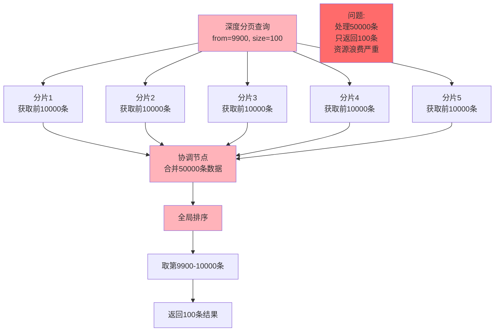
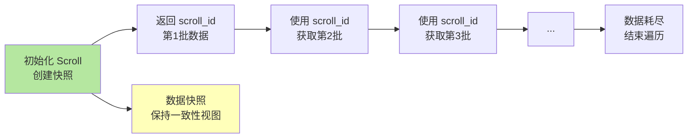
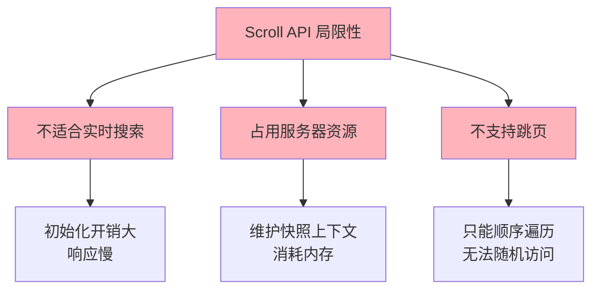
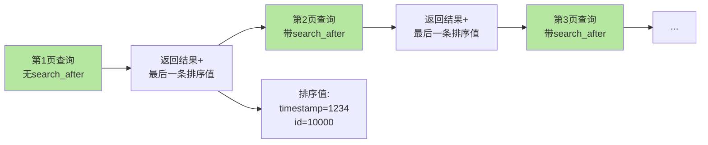
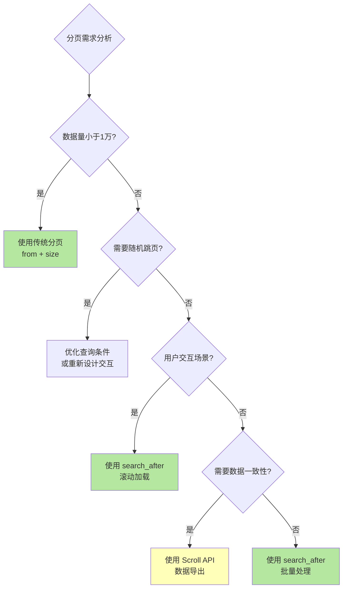

# 深度分页问题与解决方案

## 深度分页问题

在 Elasticsearch 中进行分页查询是常见需求,但当分页深度过大时会遇到严重的性能问题。理解深度分页的原理和解决方案对于优化 ES 查询至关重要。

### 传统分页方式

Elasticsearch 支持使用 `from` 和 `size` 参数进行分页查询：

```json
GET /user_logs/_search
{
  "from": 20,
  "size": 10,
  "query": {
    "match_all": {}
  }
}
```

**参数说明**：
- `from`：跳过的记录数量，表示从第几条记录开始（从 0 开始计数）
- `size`：返回的记录数量

上述查询会跳过前 20 条记录，返回第 21-30 条记录。

### 深度分页的性能陷阱



#### 问题根源

当进行深度分页时，Elasticsearch 需要：

1. **每个分片独立处理**：假设索引有 5 个分片，查询 `from=9900, size=100`，每个分片都需要找到并返回前 10000 条记录
2. **协调节点聚合**：协调节点需要从 5 个分片收集共 50000 条记录
3. **全局排序**：对这 50000 条记录进行全局排序
4. **截取结果**：从排序结果中取第 9900-10000 条记录
5. **丢弃数据**：前面 49900 条数据被丢弃

**性能影响**：
- CPU 消耗：大量数据的排序计算
- 内存消耗：需要在内存中维护大量待排序数据
- 网络消耗：大量数据在节点间传输
- 响应时间：随着 `from` 增大，响应时间指数级增长

#### 索引窗口限制

Elasticsearch 默认限制 `from + size` 不能超过 `index.max_result_window` 设置，默认值为 **10000**。

```json
{
  "error": {
    "type": "illegal_argument_exception",
    "reason": "Result window is too large, from + size must be less than or equal to: [10000] but was [10100]"
  }
}
```

这意味着：
- `from=9900, size=100` ✅ 可以执行（总计 10000）
- `from=9900, size=101` ❌ 会失败（总计 10001）

虽然可以通过调整 `max_result_window` 来突破限制，但这会带来更严重的性能问题，**不推荐**这样做。

### 解决方案一：Scroll API

Scroll API 是 Elasticsearch 提供的用于遍历大量数据的机制，特别适合数据导出和批量处理场景。

#### 工作原理



#### 使用步骤

**第一步：初始化 Scroll 请求**

```json
POST /user_logs/_search?scroll=1m
{
  "size": 1000,
  "query": {
    "match_all": {}
  }
}
```

参数说明：
- `scroll=1m`：指定 scroll 的有效期为 1 分钟，每次请求会刷新有效期
- `size`：每批返回的文档数量

响应示例：
```json
{
  "_scroll_id": "DXF1ZXJ5QW5kRmV0Y2gBAAAAAAA...",
  "hits": {
    "total": { "value": 50000 },
    "hits": [ /* 第1批1000条数据 */ ]
  }
}
```

**第二步：使用 scroll_id 获取后续批次**

```json
POST /_search/scroll
{
  "scroll": "1m",
  "scroll_id": "DXF1ZXJ5QW5kRmV0Y2gBAAAAAAA..."
}
```

**第三步：重复执行直到到达目标页**

假设要获取第 10 页（每页 1000 条），需要执行 9 次滚动操作，第 10 次请求返回目标数据。

**第四步：清理 scroll 上下文（可选但推荐）**

```json
DELETE /_search/scroll
{
  "scroll_id": "DXF1ZXJ5QW5kRmV0Y2gBAAAAAAA..."
}
```

#### Scroll 的优势

**避免重复排序**：
传统分页每次请求都需要对所有匹配数据重新排序。Scroll 保持一个游标，避免重复排序，大幅减少 CPU 消耗。

**数据一致性**：
Scroll 提供"稳定视图"，在开始 scroll 时 Elasticsearch 会保持数据快照。即使后续数据被修改，返回的结果仍然基于初始快照，保证数据一致性。

**减少资源消耗**：
由于不需要重复排序和维护大量临时数据，Scroll 显著降低对 CPU 和内存的消耗。

#### Scroll 的局限性



- **不支持随机页访问**：必须从第 1 页顺序遍历到目标页，无法直接跳转到第 100 页
- **不适合用户交互场景**：初始化 scroll 开销较大，不适合实时用户请求
- **占用服务器资源**：维护 scroll 上下文需要消耗内存，大量并发 scroll 会影响集群性能
- **数据非实时**：基于快照，无法看到 scroll 开始后的数据变更

#### 适用场景

- ✅ 数据导出和备份
- ✅ 大规模数据迁移
- ✅ 离线批量处理
- ❌ 用户界面分页（不推荐）
- ❌ 需要实时数据的场景

### 解决方案二：Search After（推荐）

`search_after` 是 Elasticsearch 推荐的深度分页解决方案，相比 Scroll API 更适合实时搜索场景。

#### 工作原理



`search_after` 基于上一次查询结果的排序值来获取下一批数据,而不是使用 `from` 跳过记录。这避免了深度分页时的性能问题。

#### 使用步骤

**第一步：首次查询（必须定义排序规则）**

```json
GET /user_logs/_search
{
  "size": 100,
  "query": {
    "match": {
      "level": "ERROR"
    }
  },
  "sort": [
    { "timestamp": "desc" },
    { "_id": "asc" }
  ]
}
```

**关键点**：
- 必须指定 `sort` 排序字段
- 建议包含一个唯一字段（如 `_id`）作为 tiebreaker，确保排序稳定

响应示例：
```json
{
  "hits": {
    "hits": [
      {
        "_id": "log_12345",
        "_source": { /* 文档内容 */ },
        "sort": [1735689600000, "log_12345"]
      },
      /* ... 更多文档 ... */
      {
        "_id": "log_12444",
        "_source": { /* 文档内容 */ },
        "sort": [1735603200000, "log_12444"]  // 最后一条的排序值
      }
    ]
  }
}
```

**第二步：使用 search_after 获取下一页**

```json
GET /user_logs/_search
{
  "size": 100,
  "query": {
    "match": {
      "level": "ERROR"
    }
  },
  "sort": [
    { "timestamp": "desc" },
    { "_id": "asc" }
  ],
  "search_after": [1735603200000, "log_12444"]
}
```

`search_after` 数组包含上一页最后一条记录的排序值（对应 `sort` 字段）。

#### Search After 的优势

**避免重复处理数据**：
与传统分页不同，`search_after` 不需要处理每个分页请求中的所有先前数据，直接从上次位置继续，大幅减少数据处理量。

**提高查询效率**：
由于不需要跳过大量先前页面的数据，`search_after` 的查询效率随分页深度增加仍保持稳定，不会出现传统分页的性能退化问题。

**支持实时数据**：
不像 Scroll 基于快照，`search_after` 每次查询都能获取最新数据，适合实时搜索场景。

**无状态设计**：
不需要在服务端维护上下文（如 scroll_id），更适合分布式和无状态应用。

#### Search After 的局限性

**需要全局唯一字段**：
排序字段必须保证全局唯一性（通常使用 `_id`）,否则可能出现数据遗漏或重复。

**依赖上一页结果**：
无法直接跳转到任意页，必须依次获取每一页的结果来获得下一页的 `search_after` 值。

**不适合跳页场景**：
如果用户界面需要支持"跳转到第 100 页"这样的功能，`search_after` 无法直接实现。

#### 适用场景

- ✅ 移动端滚动加载（下拉刷新）
- ✅ 实时数据流展示
- ✅ 日志查看界面
- ✅ 深度分页的数据遍历
- ❌ 需要随机页跳转的场景

#### 实战示例：日志查询系统

```javascript
// 前端点击"下一页"
async function fetchNextPage(lastSort) {
  const query = {
    size: 50,
    query: {
      bool: {
        must: [
          { match: { application: "order-service" }},
          { range: { timestamp: { gte: "2024-12-01" }}}
        ]
      }
    },
    sort: [
      { "timestamp": "desc" },
      { "_id": "asc" }
    ]
  };
  
  // 如果不是第一页，添加 search_after
  if (lastSort) {
    query.search_after = lastSort;
  }
  
  const response = await es.search({
    index: 'application-logs',
    body: query
  });
  
  // 保存最后一条的排序值，供下次查询使用
  const hits = response.hits.hits;
  const lastHit = hits[hits.length - 1];
  const nextSort = lastHit ? lastHit.sort : null;
  
  return {
    data: hits,
    nextSort: nextSort
  };
}
```

### 三种方案对比

| 方案 | 使用场景 | 实现方式 | 优点 | 缺点 |
|:---|:---|:---|:---|:---|
| **传统分页**<br/>(from + size) | 小数据集<br/>标准分页 | 指定 from 和 size | 简单易用<br/>支持随机跳页 | 深度分页性能差<br/>默认限制 10000 条 |
| **Scroll API** | 数据导出<br/>批量处理 | scroll_id 连续获取 | 处理大数据高效<br/>数据一致性保证 | 不适合实时搜索<br/>占用服务器资源<br/>不支持跳页 |
| **search_after** | 深度分页<br/>实时搜索 | 基于上次排序值 | 性能稳定<br/>支持实时数据<br/>无状态设计 | 不支持随机跳页<br/>需要唯一排序字段 |

### 方案选择建议



**小型数据集（< 10000 条）**：
使用传统 `from + size` 分页，简单直接。

**用户界面分页（需要实时数据）**：
优先使用 `search_after` 配合"滚动加载"或"下一页"交互设计。

**数据导出和备份**：
使用 Scroll API，可以获得数据一致性保证。

**大规模数据遍历（不需要快照）**：
使用 `search_after`，性能更好且不占用服务器资源。

### 性能优化建议

1. **合理设置 size**：不要一次性获取太多数据，建议 100-1000 条
2. **优化排序字段**：使用索引字段排序，避免脚本排序
3. **使用过滤条件**：通过 `query` 过滤减少候选文档数量
4. **监控性能**：使用慢查询日志监控深度分页查询
5. **用户体验优化**：用"加载更多"替代"跳转到第 N 页"

通过合理选择分页方案并结合性能优化手段，可以在保证用户体验的同时，确保 Elasticsearch 集群的稳定运行。
