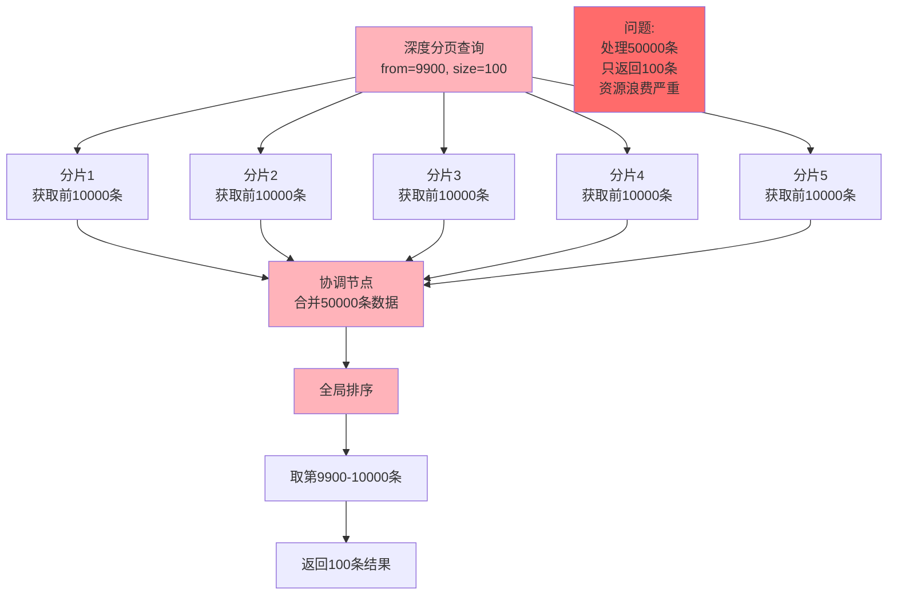
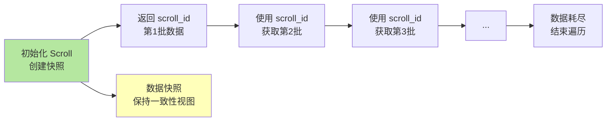

import PaidCTA from '@site/src/components/PaidCTA';

# 深度分页问题与解决方案

## 深度分页问题

在 Elasticsearch 中进行分页查询是常见需求,但当分页深度过大时会遇到严重的性能问题。理解深度分页的原理和解决方案对于优化 ES 查询至关重要。

### 传统分页方式

Elasticsearch 支持使用 `from` 和 `size` 参数进行分页查询：

```json
GET /user_logs/_search
{
  "from": 20,
  "size": 10,
  "query": {
    "match_all": {}
  }
}
```

**参数说明**：
- `from`：跳过的记录数量，表示从第几条记录开始（从 0 开始计数）
- `size`：返回的记录数量

上述查询会跳过前 20 条记录，返回第 21-30 条记录。

### 深度分页的性能陷阱



#### 问题根源

当进行深度分页时，Elasticsearch 需要：

1. **每个分片独立处理**：假设索引有 5 个分片，查询 `from=9900, size=100`，每个分片都需要找到并返回前 10000 条记录
2. **协调节点聚合**：协调节点需要从 5 个分片收集共 50000 条记录
3. **全局排序**：对这 50000 条记录进行全局排序
4. **截取结果**：从排序结果中取第 9900-10000 条记录
5. **丢弃数据**：前面 49900 条数据被丢弃

**性能影响**：
- CPU 消耗：大量数据的排序计算
- 内存消耗：需要在内存中维护大量待排序数据
- 网络消耗：大量数据在节点间传输
- 响应时间：随着 `from` 增大，响应时间指数级增长

#### 索引窗口限制

Elasticsearch 默认限制 `from + size` 不能超过 `index.max_result_window` 设置，默认值为 **10000**。

```json
{
  "error": {
    "type": "illegal_argument_exception",
    "reason": "Result window is too large, from + size must be less than or equal to: [10000] but was [10100]"
  }
}
```

这意味着：
- `from=9900, size=100` ✅ 可以执行（总计 10000）
- `from=9900, size=101` ❌ 会失败（总计 10001）

虽然可以通过调整 `max_result_window` 来突破限制，但这会带来更严重的性能问题，**不推荐**这样做。

### 解决方案一：Scroll API

Scroll API 是 Elasticsearch 提供的用于遍历大量数据的机制，特别适合数据导出和批量处理场景。

#### 工作原理



#### 使用步骤

**第一步：初始化 Scroll 请求**

<PaidCTA />