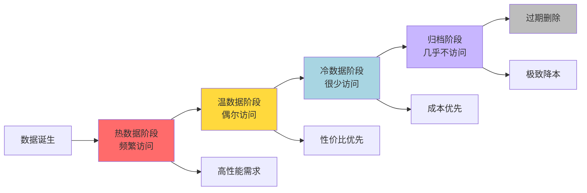
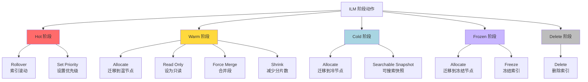
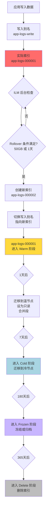
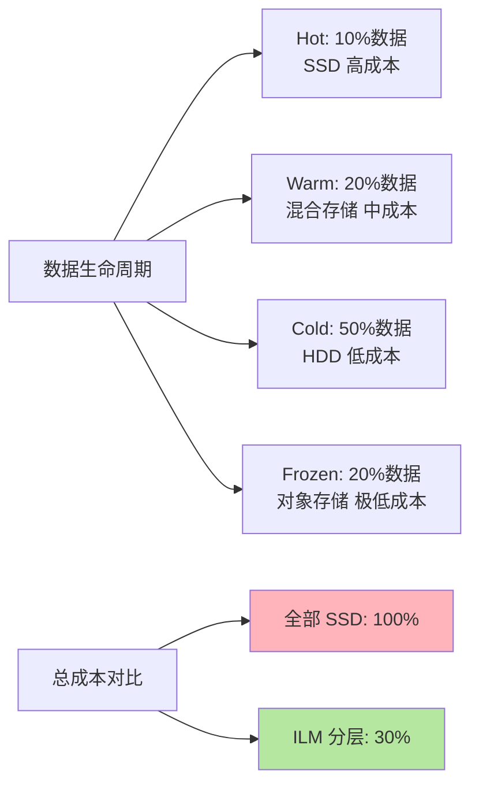

# 索引生命周期管理

## 什么是索引生命周期管理

ILM（Index Lifecycle Management，索引生命周期管理）是 Elasticsearch 从 7.0 版本开始内置的核心功能，用于**自动化管理索引在其生命周期中的各个阶段**，包括创建、滚动更新、数据迁移、性能优化、冷冻归档和删除等操作。

### 设计理念

在实际业务中，大部分时序数据（如日志、监控指标、订单记录）都遵循相同的生命周期规律：



- **新数据**：高频访问，需要低延迟响应
- **较旧数据**：访问频率下降，可以接受稍慢响应
- **历史数据**：很少访问，主要用于归档和合规
- **过期数据**：不再需要，应该删除以释放空间

ILM 的核心思想就是将索引生命周期划分为多个阶段，每个阶段定义一组自动化动作，系统根据时间或大小条件自动触发阶段流转，无需人工干预。

### ILM 的生命周期阶段

ILM 将索引生命周期划分为以下几个阶段（Phase）：

| 阶段 | 用途 | 典型停留时间 | 主要目标 |
|:---|:---|:---|:---|
| **Hot** | 活跃写入和高频查询 | 实时 - 7天 | 优化性能 |
| **Warm** | 只读，低频查询 | 7天 - 30天 | 平衡性能与成本 |
| **Cold** | 极少访问的历史数据 | 30天 - 180天 | 降低存储成本 |
| **Frozen** | 长期归档（7.10+） | 180天 - 数年 | 极致降本 |
| **Delete** | 过期数据清理 | 最终阶段 | 释放存储空间 |

### 各阶段可执行的动作



#### Hot 阶段动作

**Rollover（索引滚动）**：
当索引达到一定大小、文档数或存活时长时，自动创建新索引，并将写入别名指向新索引。这是处理时序数据的核心机制。

```json
{
  "rollover": {
    "max_size": "50gb",
    "max_age": "1d",
    "max_docs": 10000000
  }
}
```

**Set Priority（设置优先级）**：
设置索引恢复优先级，Hot 数据优先级最高，确保集群重启时优先恢复。

#### Warm 阶段动作

**Allocate（分配到特定节点）**：
将索引分片迁移到具有 `warm` 属性的节点。

```json
{
  "allocate": {
    "require": {
      "data": "warm"
    }
  }
}
```

**Read Only（设为只读）**：
将索引设置为只读状态，防止后续写入，减少开销。

**Force Merge（强制合并段）**：
将索引的多个小段合并为少数大段，减少段数量，提升查询效率并释放磁盘空间。

```json
{
  "forcemerge": {
    "max_num_segments": 1
  }
}
```

**Shrink（收缩分片）**：
减少索引的主分片数量，降低资源开销。

```json
{
  "shrink": {
    "number_of_shards": 1
  }
}
```

#### Cold 阶段动作

**Allocate（迁移到冷节点）**：
将索引迁移到 `cold` 节点，使用低成本硬件存储。

**Searchable Snapshot（可搜索快照）**：
创建可搜索快照并存储在对象存储（如 AWS S3、阿里云 OSS）中，极大降低本地存储成本。

```json
{
  "searchable_snapshot": {
    "snapshot_repository": "my-s3-repository"
  }
}
```

#### Frozen 阶段动作（7.10+）

**Allocate（迁移到冻结节点）**：
将索引迁移到 `frozen` 节点或对象存储。

**Freeze（冻结索引）**：
将索引冻结，释放内存资源，查询时需要先解冻（速度较慢）。

#### Delete 阶段动作

**Delete（删除索引）**：
永久删除索引及其所有数据，释放存储空间。

### ILM 策略配置示例

假设我们要管理应用日志，需求如下：

1. 日志索引达到 50GB 或创建满 1 天就滚动创建新索引
2. 滚动 1 天后，将旧索引移到温节点并设为只读
3. 滚动 7 天后，将索引移到冷节点
4. 滚动 180 天后，冻结索引
5. 滚动 365 天后，删除索引

#### 创建 ILM 策略

```json
PUT _ilm/policy/application_logs_policy
{
  "policy": {
    "phases": {
      "hot": {
        "min_age": "0ms",
        "actions": {
          "rollover": {
            "max_size": "50gb",
            "max_age": "1d"
          },
          "set_priority": {
            "priority": 100
          }
        }
      },
      "warm": {
        "min_age": "1d",
        "actions": {
          "allocate": {
            "require": {
              "data": "warm"
            }
          },
          "readonly": {},
          "forcemerge": {
            "max_num_segments": 1
          },
          "set_priority": {
            "priority": 50
          }
        }
      },
      "cold": {
        "min_age": "7d",
        "actions": {
          "allocate": {
            "require": {
              "data": "cold"
            }
          },
          "set_priority": {
            "priority": 0
          }
        }
      },
      "frozen": {
        "min_age": "180d",
        "actions": {
          "allocate": {
            "require": {
              "data": "frozen"
            }
          }
        }
      },
      "delete": {
        "min_age": "365d",
        "actions": {
          "delete": {}
        }
      }
    }
  }
}
```

**配置说明**：
- `min_age`：从索引创建（或上次 rollover）开始计算，满足条件后进入该阶段
- 所有时间相关的条件都是基于索引的创建时间或 rollover 时间

#### 创建索引模板并绑定策略

```json
PUT _index_template/application_logs_template
{
  "index_patterns": ["app-logs-*"],
  "template": {
    "settings": {
      "number_of_shards": 3,
      "number_of_replicas": 1,
      "index.lifecycle.name": "application_logs_policy",
      "index.lifecycle.rollover_alias": "app-logs-write"
    },
    "mappings": {
      "properties": {
        "timestamp": { "type": "date" },
        "level": { "type": "keyword" },
        "message": { "type": "text" },
        "application": { "type": "keyword" }
      }
    }
  }
}
```

**关键配置**：
- `index.lifecycle.name`：应用的 ILM 策略名称
- `index.lifecycle.rollover_alias`：用于写入的别名

#### 创建初始索引

```json
PUT app-logs-000001
{
  "aliases": {
    "app-logs-write": {
      "is_write_index": true
    }
  }
}
```

### ILM 工作流程



1. **数据写入**：应用程序持续向别名 `app-logs-write` 写入数据，实际写入 `app-logs-000001`
2. **ILM 监控**：ILM 服务（ES 内部后台进程）定期检查策略
3. **触发 Rollover**：当 `app-logs-000001` 达到 50GB 或存活 1 天时，触发 rollover
4. **创建新索引**：自动创建 `app-logs-000002`，将写入别名切换到新索引
5. **阶段流转**：`app-logs-000001` 开始计算生命周期，逐步经历 Warm → Cold → Frozen → Delete 阶段

### ILM 的优势

#### 自动化运维

无需人工干预，自动完成索引滚动、数据迁移、段合并、删除等操作，大幅降低运维成本。

#### 成本优化



通过将数据自动迁移到不同性能层级的硬件，可以**节省 60%-80% 的存储成本**。

#### 性能保障

热数据始终保持在高性能节点，保证查询响应速度；冷数据迁移到低成本存储，不影响热数据性能。

#### 合规要求

自动化的数据保留和删除策略，满足 GDPR、等保等合规要求。

### 监控和管理

#### 查看策略执行状态

```bash
GET app-logs-*/_ilm/explain
```

返回示例：
```json
{
  "indices": {
    "app-logs-000001": {
      "index": "app-logs-000001",
      "managed": true,
      "policy": "application_logs_policy",
      "lifecycle_date_millis": 1735689600000,
      "age": "5d",
      "phase": "warm",
      "phase_time_millis": 1735776000000,
      "action": "forcemerge",
      "step": "forcemerge",
      "step_time_millis": 1735776000000
    }
  }
}
```

#### 手动触发阶段流转（测试用）

```bash
POST app-logs-000001/_ilm/move/warm
```

#### 暂停和恢复 ILM

```bash
# 暂停
POST _ilm/stop

# 恢复
POST _ilm/start
```

### 最佳实践

#### 合理设置 Rollover 条件

- 日志类数据：`max_size: 30-50GB` 或 `max_age: 1d`
- 监控指标：`max_age: 12h` 或 `max_docs: 50000000`
- 避免索引过大或过小，一般控制在 30-50GB

#### 根据业务设置保留期

- 应用日志：通常保留 30-90 天
- 审计日志：根据合规要求，可能需要 1-7 年
- 监控指标：高精度保留 7-30 天，降采样后长期保留

#### 配置节点属性

确保集群中的节点正确配置了 `data: hot/warm/cold/frozen` 属性：

```yaml
# elasticsearch.yml
node.attr.data: hot
```

#### 测试策略

在生产环境应用前，使用测试索引验证 ILM 策略是否按预期工作。

#### 监控告警

设置监控告警，及时发现 ILM 执行异常（如磁盘不足导致无法迁移）。

### 实际应用场景

#### 场景一：电商订单系统

```json
{
  "phases": {
    "hot": {
      "actions": {
        "rollover": { "max_age": "7d", "max_size": "30gb" }
      }
    },
    "warm": {
      "min_age": "7d",
      "actions": {
        "allocate": { "require": { "data": "warm" }},
        "readonly": {}
      }
    },
    "cold": {
      "min_age": "90d",
      "actions": {
        "searchable_snapshot": {
          "snapshot_repository": "order-backup"
        }
      }
    },
    "delete": {
      "min_age": "1825d",
      "actions": { "delete": {} }
    }
  }
}
```

- 最近 7 天订单：热数据，高频查询
- 7-90 天订单：温数据，偶尔查询
- 90 天以上：冷数据，创建快照存储到对象存储
- 5 年后：自动删除

#### 场景二：应用监控指标

```json
{
  "phases": {
    "hot": {
      "actions": {
        "rollover": { "max_age": "1d" }
      }
    },
    "warm": {
      "min_age": "3d",
      "actions": {
        "forcemerge": { "max_num_segments": 1 },
        "shrink": { "number_of_shards": 1 }
      }
    },
    "delete": {
      "min_age": "30d",
      "actions": { "delete": {} }
    }
  }
}
```

- 实时指标：保留在 Hot 层 1 天
- 历史趋势：保留 30 天，合并段优化查询
- 30 天后自动删除

通过 ILM，Elasticsearch 实现了数据生命周期的全自动化管理，在保证性能的同时大幅降低存储成本，是大规模 ES 集群运维的必备功能。
