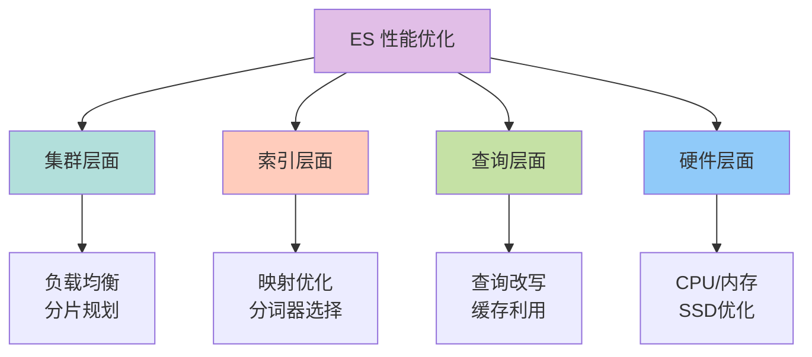
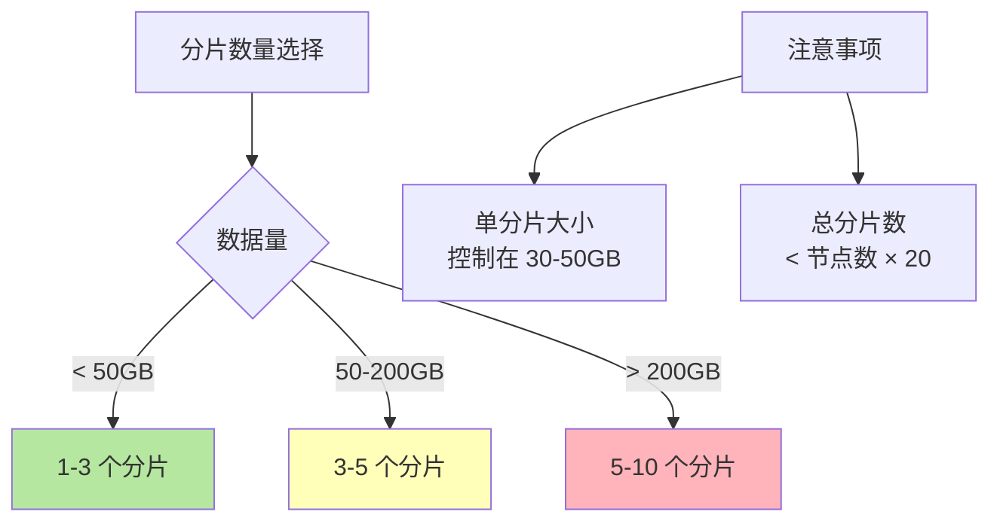
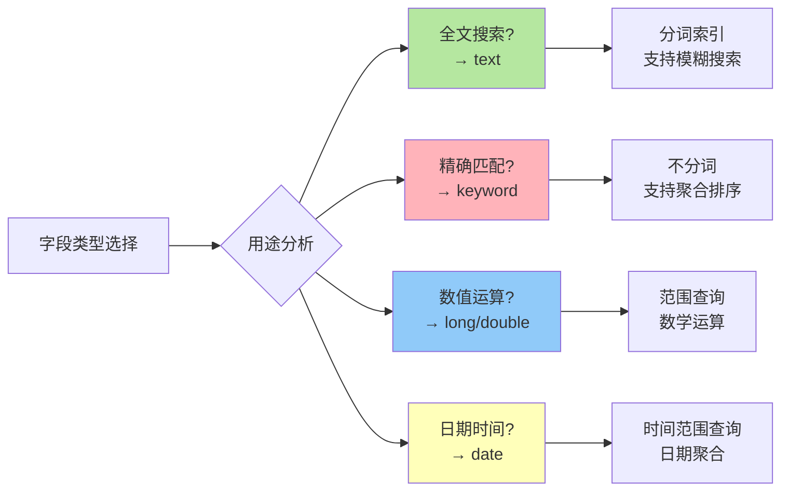
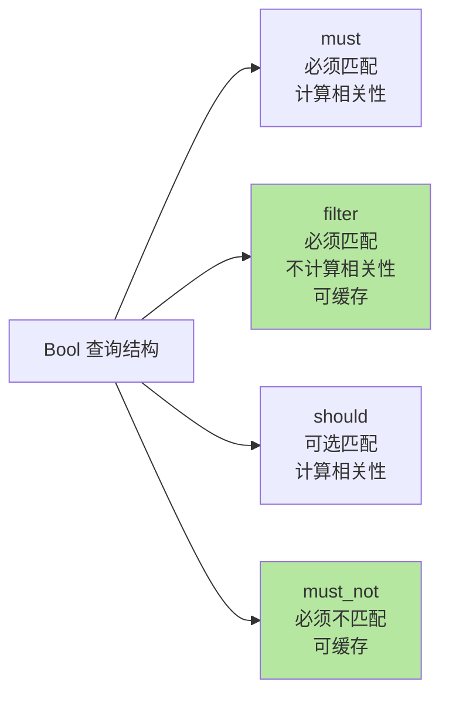
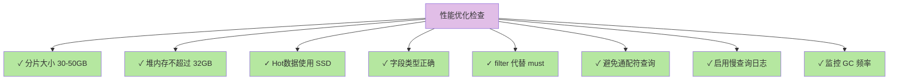

# 性能优化最佳实践

## 性能优化策略体系

优化 Elasticsearch 查询性能是一个系统工程,需要从集群架构、索引设计、查询优化、硬件资源等多个维度综合考虑。



## 集群和硬件优化

### 负载均衡策略

合理的负载均衡能确保查询请求在集群中均匀分配，避免单点热点问题。

**使用专用协调节点**：
在大型集群中，配置专用协调节点处理客户端请求，将请求分发和结果聚合的压力从数据节点分离出来。

```yaml
# 协调节点配置
node.name: coordinating-node-1
node.roles: []  # 不承担其他角色
```

**客户端负载均衡**：
在应用层配置多个 ES 节点地址，使用轮询或随机策略分散请求。

```javascript
const { Client } = require('@elastic/elasticsearch');
const client = new Client({
  nodes: [
    'http://es-node-1:9200',
    'http://es-node-2:9200',
    'http://es-node-3:9200'
  ],
  // 自动进行节点间的负载均衡
  sniffOnStart: true
});
```

### 硬件资源优化

**使用 SSD 存储**：
对于热数据节点，使用高性能 NVMe SSD 可以将查询响应时间降低 50%-80%。

**合理配置内存**：
- 堆内存（JVM Heap）：建议设置为物理内存的 50%，但不超过 32GB
- 文件系统缓存：剩余 50% 留给操作系统缓存，用于缓存索引文件

```yaml
# jvm.options
-Xms16g
-Xmx16g  # 堆内存设置为 16GB（假设服务器有 32GB 内存）
```

**CPU 配置**：
- 查询密集型：优先选择高主频 CPU
- 写入密集型：选择多核心 CPU（16 核以上）

### JVM 调优

**使用 G1 垃圾收集器**（ES 7.0+ 默认）：
```yaml
# jvm.options
-XX:+UseG1GC
-XX:MaxGCPauseMillis=200
```

**避免 GC 停顿**：
- 监控 GC 日志，如果 Full GC 频繁，考虑增加堆内存或优化查询
- 使用 `-XX:+UseStringDeduplication` 减少字符串重复占用内存

## 合理的分片和副本策略

### 分片数量规划

分片数量直接影响查询性能和集群管理开销。



**经验法则**：
- **单分片大小**：控制在 30-50GB，过大影响恢复速度，过小增加管理开销
- **节点分片数**：每个节点的分片数量应 < 堆内存GB数 × 20（如 16GB 堆内存，最多 320 个分片）

**示例**：500GB 数据的索引分片规划

```json
PUT /large_dataset
{
  "settings": {
    "number_of_shards": 10,
    "number_of_replicas": 1
  }
}
```

- 主分片：10 个，每个约 50GB
- 副本分片：10 个（每个主分片 1 个副本）
- 总分片：20 个

### 副本数量优化

**副本的作用**：
- 提高查询吞吐量（查询可以在副本上执行）
- 提供高可用性（主分片故障时副本接管）

**优化策略**：
- 查询密集型：增加副本数（2-3 个）提升查询并发能力
- 写入密集型：减少副本数（0-1 个）降低写入开销
- 生产环境：至少 1 个副本保证高可用

```json
PUT /product_catalog/_settings
{
  "number_of_replicas": 2
}
```

## 索引映射与设置优化

### 精确定义字段类型

正确的字段类型可以显著提升性能和节省存储空间。



**优化示例**：

```json
PUT /products
{
  "mappings": {
    "properties": {
      "product_name": {
        "type": "text",
        "fields": {
          "keyword": { "type": "keyword" }
        }
      },
      "sku": { "type": "keyword" },
      "price": { "type": "scaled_float", "scaling_factor": 100 },
      "category_id": { "type": "keyword" },
      "created_at": { "type": "date" },
      "stock": { "type": "integer" },
      "is_active": { "type": "boolean" }
    }
  }
}
```

**关键点**：
- `product_name` 使用 `text` 支持全文搜索，同时添加 `keyword` 子字段用于排序和聚合
- `sku`、`category_id` 使用 `keyword` 进行精确匹配
- `price` 使用 `scaled_float` 避免精度问题
- 避免使用 `text` 类型存储不需要搜索的字段（浪费存储和索引时间）

### 选择合适的分析器

不同语言和业务场景需要不同的分词器。

**中文分词器**：
```json
PUT /chinese_articles
{
  "settings": {
    "analysis": {
      "analyzer": {
        "ik_smart_analyzer": {
          "type": "ik_smart"
        }
      }
    }
  },
  "mappings": {
    "properties": {
      "title": {
        "type": "text",
        "analyzer": "ik_smart_analyzer"
      }
    }
  }
}
```

**自定义分析器**：
```json
{
  "settings": {
    "analysis": {
      "analyzer": {
        "email_analyzer": {
          "type": "custom",
          "tokenizer": "uax_url_email",
          "filter": ["lowercase"]
        }
      }
    }
  }
}
```

### 禁用不必要的功能

**禁用 _source**（不需要返回原始文档时）：
```json
{
  "mappings": {
    "_source": {
      "enabled": false
    }
  }
}
```

**禁用 _all 字段**（ES 6.0+ 已默认禁用）：
```json
{
  "mappings": {
    "_all": {
      "enabled": false
    }
  }
}
```

**禁用字段索引**（不需要搜索的字段）：
```json
{
  "mappings": {
    "properties": {
      "internal_id": {
        "type": "keyword",
        "index": false
      }
    }
  }
}
```

## 查询优化策略

### 使用过滤器而非查询

`filter` 子句会被缓存，比 `query` 更高效。



**优化前**：
```json
{
  "query": {
    "bool": {
      "must": [
        { "match": { "title": "智能手表" }},
        { "term": { "category": "electronics" }},
        { "range": { "price": { "gte": 500, "lte": 2000 }}}
      ]
    }
  }
}
```

**优化后**：
```json
{
  "query": {
    "bool": {
      "must": [
        { "match": { "title": "智能手表" }}
      ],
      "filter": [
        { "term": { "category": "electronics" }},
        { "range": { "price": { "gte": 500, "lte": 2000 }}}
      ]
    }
  }
}
```

将不需要相关性评分的条件（如精确匹配、范围查询）放到 `filter` 中，可以利用缓存加速查询。

### 避免高开销查询

某些查询类型开销巨大，应尽量避免或优化。

**通配符查询**（特别是前缀通配符）：
```json
// ❌ 避免：前缀通配符
{ "wildcard": { "email": "*@example.com" }}

// ✅ 优化：使用 suffix 分析器或 reverse 字段
{ "term": { "email.suffix": "example.com" }}
```

**正则表达式查询**：
```json
// ❌ 避免：复杂正则
{ "regexp": { "username": ".*admin.*" }}

// ✅ 优化：使用 wildcard 或 prefix
{ "wildcard": { "username": "*admin*" }}
```

**脚本查询**：
```json
// ❌ 避免：脚本过滤
{
  "script": {
    "script": "doc['price'].value * doc['quantity'].value > 1000"
  }
}

// ✅ 优化：在索引时预计算字段
{
  "range": {
    "total_amount": { "gt": 1000 }
  }
}
```

### 使用 term 而非 match 查询 keyword 字段

对于 `keyword` 类型字段，使用 `term` 查询比 `match` 更高效。

```json
// ✅ 正确：term 查询 keyword
{
  "term": {
    "user_id.keyword": "12345"
  }
}

// ❌ 低效：match 查询 keyword
{
  "match": {
    "user_id": "12345"
  }
}
```

### 限制返回字段

只返回需要的字段，减少网络传输和序列化开销。

```json
{
  "query": { "match_all": {} },
  "_source": ["product_id", "product_name", "price"]
}
```

或使用 `fields` 参数：
```json
{
  "query": { "match_all": {} },
  "fields": ["product_id", "product_name", "price"],
  "_source": false
}
```

### 合理使用聚合

**限制桶数量**：
```json
{
  "aggs": {
    "top_categories": {
      "terms": {
        "field": "category",
        "size": 10  // 限制返回前 10 个
      }
    }
  }
}
```

**避免嵌套过深的聚合**：
```json
// ❌ 避免：三层嵌套聚合
{
  "aggs": {
    "level1": {
      "terms": { "field": "field1" },
      "aggs": {
        "level2": {
          "terms": { "field": "field2" },
          "aggs": {
            "level3": {
              "terms": { "field": "field3" }
            }
          }
        }
      }
    }
  }
}
```

## 缓存优化

### 请求缓存

对于相同的查询请求，ES 会缓存结果（默认启用）。

```json
{
  "query": { "match_all": {} },
  "request_cache": true
}
```

**适用场景**：
- 查询参数相同的重复请求
- 聚合查询结果
- 不适合实时性要求极高的场景

### 字段数据缓存

用于排序和聚合的字段数据会缓存在内存中（doc values）。

**监控缓存使用**：
```bash
GET _nodes/stats/indices/fielddata
```

**清理缓存**（慎用）：
```bash
POST /my_index/_cache/clear?fielddata=true
```

## 监控和分析

### 慢查询日志

启用慢查询日志，识别性能瓶颈。

```json
PUT /my_index/_settings
{
  "index.search.slowlog.threshold.query.warn": "2s",
  "index.search.slowlog.threshold.query.info": "1s",
  "index.search.slowlog.threshold.fetch.warn": "1s"
}
```

### 使用 Profile API 分析查询

```json
GET /my_index/_search
{
  "profile": true,
  "query": {
    "match": { "title": "elasticsearch" }
  }
}
```

返回每个查询阶段的耗时，帮助定位性能瓶颈。

### 监控集群健康

```bash
# 集群健康
GET _cluster/health

# 节点统计
GET _nodes/stats

# 索引统计
GET /my_index/_stats
```

## 性能优化检查清单



### 硬件层面
- [ ] 热数据节点使用 SSD 存储
- [ ] 堆内存设置为物理内存的 50%，不超过 32GB
- [ ] 文件系统缓存充足（物理内存的 50%）
- [ ] 网络带宽充足（万兆网卡推荐）

### 集群层面
- [ ] 分片大小控制在 30-50GB
- [ ] 每节点分片数 < 堆内存GB × 20
- [ ] 查询密集型增加副本数
- [ ] 使用专用协调节点

### 索引层面
- [ ] 字段类型选择正确（text vs keyword）
- [ ] 禁用不需要的功能（_source、_all）
- [ ] 选择合适的分析器
- [ ] 不需要搜索的字段设置 `index: false`

### 查询层面
- [ ] 使用 filter 代替 must（可缓存）
- [ ] 避免通配符、正则、脚本查询
- [ ] keyword 字段使用 term 而非 match
- [ ] 限制返回字段和聚合桶数量
- [ ] 避免深度分页（使用 search_after）

### 监控层面
- [ ] 启用慢查询日志
- [ ] 监控 GC 频率和停顿时间
- [ ] 监控集群健康状态
- [ ] 定期检查索引和分片状态

通过系统化的性能优化，可以将 Elasticsearch 的查询响应时间降低 50%-90%，同时大幅提升系统吞吐量和稳定性。
