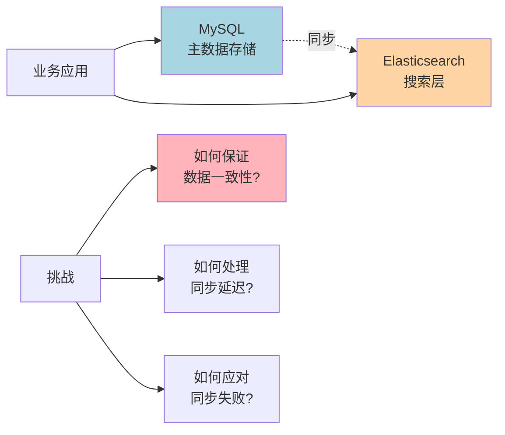
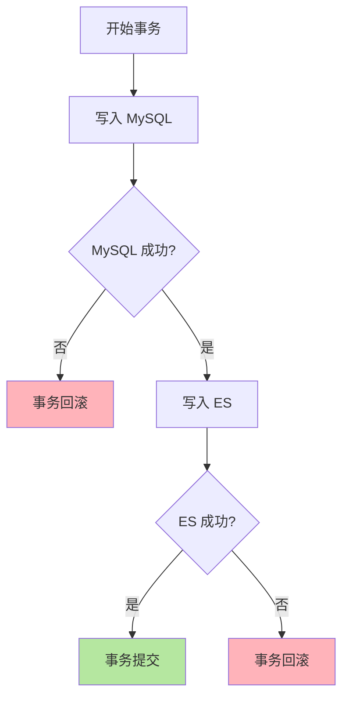
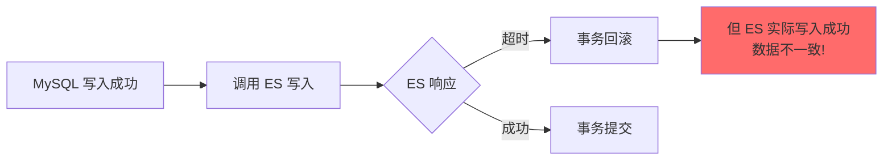
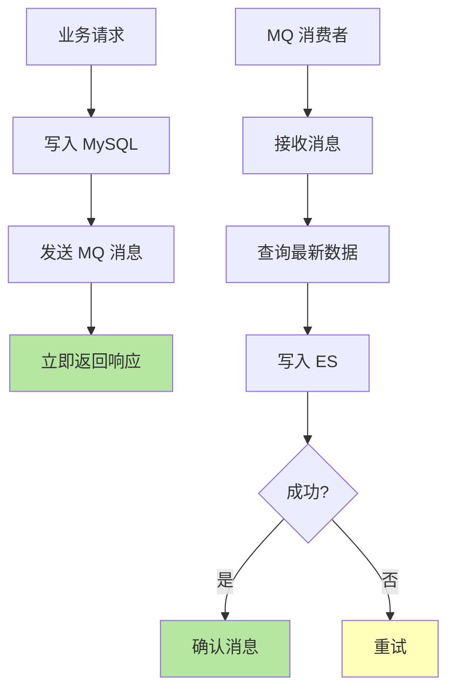
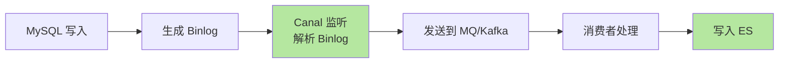
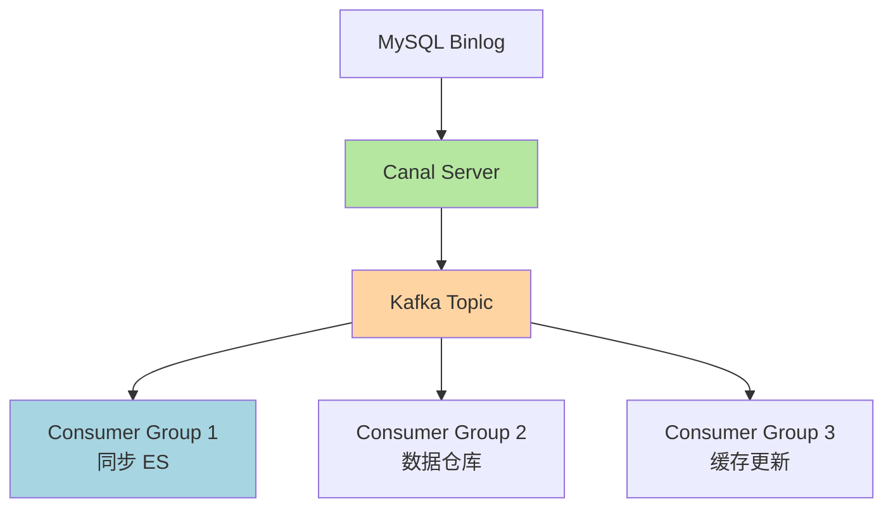
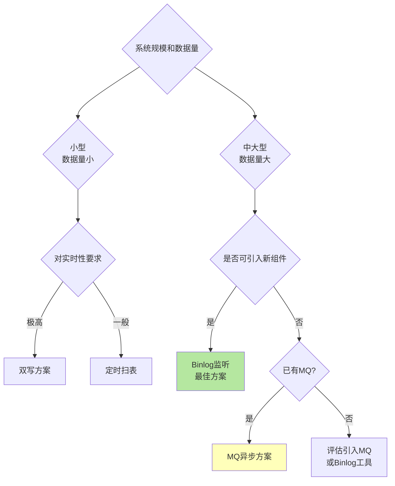

# 数据同步与一致性保障

## 数据同步的必要性

在实际业务中,通常采用"MySQL + Elasticsearch"的组合架构：MySQL 作为主数据存储保证事务和数据一致性，Elasticsearch 作为搜索层提供高性能检索能力。这就需要解决一个核心问题：**如何保证 ES 和数据库的数据一致性**？



## 方案一：双写策略

### 实现方式

在应用代码中同时操作数据库和 Elasticsearch，先写数据库，再写 ES，并将两个操作放在同一个事务中。

```java
@Service
public class OrderService {
    
    @Autowired
    private OrderMapper orderMapper;
    
    @Autowired
    private ElasticsearchClient esClient;
    
    @Transactional(rollbackFor = Exception.class)
    public void createOrder(OrderDTO orderDTO) {
        // 1. 写入 MySQL
        Order order = convertToEntity(orderDTO);
        orderMapper.insert(order);
        
        // 2. 写入 Elasticsearch
        IndexRequest request = new IndexRequest("orders")
            .id(order.getId().toString())
            .document(convertToDocument(order));
        esClient.index(request);
    }
}
```

### 工作流程



### 优缺点分析

**优点**：
- ✅ 实现简单，容易理解
- ✅ 实时性高，数据写入后立即可搜索
- ✅ 业务代码可以直接控制两端数据

**缺点**：
- ❌ 代码侵入性强，需要修改所有数据写入逻辑
- ❌ 存在一致性问题：ES 写入超时但实际成功，会导致数据库回滚而 ES 数据保留
- ❌ 事务中包含远程调用，大幅延长事务时间，占用数据库连接
- ❌ ES 不可用时会影响主业务流程

### 一致性问题场景



**解决方案**：
- 实现重试机制和幂等性保证
- 增加补偿机制，定期对账修复

### 适用场景

- 小型系统，数据量不大
- 对实时性要求极高的场景
- 可以接受一定的一致性风险

## 方案二：MQ 异步消费

### 实现方式

将数据库操作和 ES 操作解耦，通过消息队列异步通知 ES 进行数据更新。

```java
// 生产者：数据写入后发送消息
@Service
public class OrderService {
    
    @Autowired
    private OrderMapper orderMapper;
    
    @Autowired
    private RocketMQTemplate rocketMQTemplate;
    
    @Transactional
    public void createOrder(OrderDTO orderDTO) {
        // 1. 写入 MySQL
        Order order = convertToEntity(orderDTO);
        orderMapper.insert(order);
        
        // 2. 发送 MQ 消息
        OrderSyncMessage message = new OrderSyncMessage();
        message.setOrderId(order.getId());
        message.setOperation("CREATE");
        rocketMQTemplate.syncSend("order-sync-topic", message);
    }
}

// 消费者：监听消息并更新 ES
@Service
@RocketMQMessageListener(topic = "order-sync-topic", consumerGroup = "es-sync-group")
public class OrderSyncConsumer implements RocketMQListener<OrderSyncMessage> {
    
    @Autowired
    private ElasticsearchClient esClient;
    
    @Autowired
    private OrderMapper orderMapper;
    
    @Override
    public void onMessage(OrderSyncMessage message) {
        try {
            // 查询最新数据
            Order order = orderMapper.selectById(message.getOrderId());
            
            // 同步到 ES
            IndexRequest request = new IndexRequest("orders")
                .id(order.getId().toString())
                .document(convertToDocument(order));
            esClient.index(request);
        } catch (Exception e) {
            // 失败后重试（由 MQ 重试机制保证）
            throw new RuntimeException("ES sync failed", e);
        }
    }
}
```

### 工作流程



### 优缺点分析

**优点**：
- ✅ 解耦业务逻辑和数据同步，降低代码侵入性
- ✅ 异步处理，不阻塞主业务流程，提升系统吞吐量
- ✅ MQ 提供重试机制，保证最终一致性
- ✅ ES 不可用时不影响主业务

**缺点**：
- ❌ 引入 MQ 增加系统复杂度和运维成本
- ❌ 存在消息延迟，实时性不如双写
- ❌ 需要处理消息重复消费问题（幂等性）

### 进阶：本地消息表

为了保证消息一定发送成功，可以结合本地消息表实现事务消息。

```java
@Transactional
public void createOrder(OrderDTO orderDTO) {
    // 1. 写入订单
    Order order = convertToEntity(orderDTO);
    orderMapper.insert(order);
    
    // 2. 写入本地消息表
    LocalMessage message = new LocalMessage();
    message.setTopic("order-sync-topic");
    message.setContent(JSON.toJSONString(order));
    message.setStatus("PENDING");
    messageMapper.insert(message);
    
    // 3. 提交事务
}

// 定时任务扫描本地消息表并发送
@Scheduled(fixedRate = 1000)
public void sendPendingMessages() {
    List<LocalMessage> messages = messageMapper.selectPending();
    for (LocalMessage message : messages) {
        try {
            rocketMQTemplate.syncSend(message.getTopic(), message.getContent());
            messageMapper.updateStatus(message.getId(), "SENT");
        } catch (Exception e) {
            // 记录失败，下次重试
        }
    }
}
```

### 适用场景

- 中大型系统，已有 MQ 基础设施
- 对实时性要求不极致（毫秒级延迟可接受）
- 需要保证最终一致性

## 方案三：定时任务扫表

### 实现方式

通过定时任务定期扫描数据库表的变更记录，批量同步到 Elasticsearch。

```java
@Service
public class OrderSyncScheduler {
    
    @Autowired
    private OrderMapper orderMapper;
    
    @Autowired
    private ElasticsearchClient esClient;
    
    // 每 5 分钟执行一次
    @Scheduled(fixedRate = 300000)
    public void syncOrders() {
        // 查询最近更新的订单（基于 update_time 字段）
        Date lastSyncTime = getLastSyncTime();
        List<Order> orders = orderMapper.selectUpdatedAfter(lastSyncTime);
        
        // 批量写入 ES
        BulkRequest bulkRequest = new BulkRequest();
        for (Order order : orders) {
            IndexRequest request = new IndexRequest("orders")
                .id(order.getId().toString())
                .document(convertToDocument(order));
            bulkRequest.add(request);
        }
        
        if (bulkRequest.numberOfActions() > 0) {
            esClient.bulk(bulkRequest);
            updateLastSyncTime(new Date());
        }
    }
}
```

### 工作流程


### 优缺点分析

**优点**：
- ✅ 对业务代码零侵入，不需要修改写入逻辑
- ✅ 批量处理，效率较高
- ✅ 实现简单，无需引入额外中间件

**缺点**：
- ❌ 实时性很差（取决于扫表频率）
- ❌ 频繁扫表可能给数据库带来压力
- ❌ 无法感知硬删除操作
- ❌ 需要表有 `update_time` 等时间戳字段

### 优化策略

**使用增量 ID**：
如果表没有 `update_time` 字段，可以基于自增 ID 进行增量同步。

```java
Long lastSyncId = getLastSyncId();
List<Order> orders = orderMapper.selectByIdGreaterThan(lastSyncId, 1000);
```

**分页查询避免内存溢出**：
```java
int pageSize = 1000;
Long lastId = 0L;
while (true) {
    List<Order> orders = orderMapper.selectByIdGreaterThan(lastId, pageSize);
    if (orders.isEmpty()) break;
    
    // 同步到 ES
    syncToEs(orders);
    
    lastId = orders.get(orders.size() - 1).getId();
}
```

### 适用场景

- 对实时性要求不高的场景（如离线分析）
- 数据变更频率不高
- 无法修改业务代码的遗留系统

## 方案四：监听 Binlog（推荐）

### 实现方式

通过监听 MySQL 的 binlog 日志，实时捕获数据变更并同步到 Elasticsearch。常用工具包括 Canal、Debezium、Maxwell 等。



### Canal 集成示例

**Canal 配置**（监听指定数据库和表）：
```properties
canal.instance.master.address=127.0.0.1:3306
canal.instance.dbUsername=canal
canal.instance.dbPassword=canal
canal.instance.filter.regex=.*\\..*
canal.instance.filter.black.regex=test\\..*
```

**消费 Canal 消息**：
```java
@Service
public class CanalDataHandler {
    
    @Autowired
    private ElasticsearchClient esClient;
    
    public void handleCanalMessage(List<CanalEntry.Entry> entries) {
        for (CanalEntry.Entry entry : entries) {
            if (entry.getEntryType() != CanalEntry.EntryType.ROWDATA) {
                continue;
            }
            
            CanalEntry.RowChange rowChange = CanalEntry.RowChange.parseFrom(entry.getStoreValue());
            CanalEntry.EventType eventType = rowChange.getEventType();
            String tableName = entry.getHeader().getTableName();
            
            for (CanalEntry.RowData rowData : rowChange.getRowDatasList()) {
                switch (eventType) {
                    case INSERT:
                    case UPDATE:
                        syncInsertOrUpdate(tableName, rowData.getAfterColumnsList());
                        break;
                    case DELETE:
                        syncDelete(tableName, rowData.getBeforeColumnsList());
                        break;
                }
            }
        }
    }
    
    private void syncInsertOrUpdate(String tableName, List<CanalEntry.Column> columns) {
        if ("orders".equals(tableName)) {
            Map<String, Object> document = new HashMap<>();
            String id = null;
            
            for (CanalEntry.Column column : columns) {
                if ("id".equals(column.getName())) {
                    id = column.getValue();
                }
                document.put(column.getName(), column.getValue());
            }
            
            IndexRequest request = new IndexRequest("orders")
                .id(id)
                .document(document);
            esClient.index(request);
        }
    }
    
    private void syncDelete(String tableName, List<CanalEntry.Column> columns) {
        if ("orders".equals(tableName)) {
            for (CanalEntry.Column column : columns) {
                if ("id".equals(column.getName())) {
                    DeleteRequest request = new DeleteRequest("orders", column.getValue());
                    esClient.delete(request);
                    break;
                }
            }
        }
    }
}
```

### 优缺点分析

**优点**：
- ✅ 对业务代码完全无侵入，零代码改动
- ✅ 实时性高，毫秒级延迟
- ✅ 可以捕获所有数据变更（包括删除）
- ✅ 业务解耦，ES 故障不影响主业务

**缺点**：
- ❌ 需要引入 Canal 等第三方组件，增加系统复杂度
- ❌ 需要开启 MySQL binlog，有一定性能开销
- ❌ 需要维护 binlog 监听服务的高可用

### Canal + Kafka 架构

在大规模场景下，通常采用 Canal + Kafka 的架构提升可靠性和吞吐量。



### 适用场景

- ✅ 大中型系统，数据量大，变更频繁
- ✅ 需要高实时性（毫秒级同步）
- ✅ 需要同步多个目标系统（ES、Redis、数据仓库等）
- ✅ **业内最佳实践，强烈推荐**

## 方案对比与选择

| 方案 | 实时性 | 可靠性 | 复杂度 | 侵入性 | 适用规模 | 推荐指数 |
|:---|:---|:---|:---|:---|:---|:---|
| **双写** | 极高（毫秒级） | 中（存在一致性风险） | 低 | 高 | 小型 | ⭐⭐ |
| **MQ 异步** | 高（10-100ms） | 高（MQ保证） | 中 | 中 | 中大型 | ⭐⭐⭐⭐ |
| **定时扫表** | 低（分钟级） | 中 | 低 | 无 | 小型/离线 | ⭐⭐ |
| **Binlog监听** | 极高（毫秒级） | 高 | 高 | 无 | 大型 | ⭐⭐⭐⭐⭐ |

### 决策树



### 推荐方案

**小型系统**（日活 < 10万）：
- 优先选择：定时扫表（简单）
- 备选：双写 + 补偿机制

**中型系统**（日活 10-100万）：
- 优先选择：MQ 异步消费
- 备选：Binlog 监听（如果团队有运维能力）

**大型系统**（日活 > 100万）：
- **强烈推荐：Canal + Kafka + ES**
- 理由：零侵入、高性能、可扩展、业界最佳实践

## 一致性保障策略

### 幂等性设计

无论哪种方案，都需要确保 ES 更新操作的幂等性，避免重复消费导致的数据错误。

```java
// 使用文档 ID 作为 ES 文档 ID，确保重复写入覆盖而非重复
IndexRequest request = new IndexRequest("orders")
    .id(order.getId().toString())  // 使用业务 ID
    .document(document);
```

### 数据对账与修复

定期对账，发现并修复不一致数据。

```java
@Scheduled(cron = "0 0 2 * * ?")  // 每天凌晨2点执行
public void reconcileData() {
    // 1. 从 MySQL 查询最近更新的订单
    List<Order> mysqlOrders = orderMapper.selectUpdatedToday();
    
    // 2. 从 ES 批量查询对应文档
    for (Order order : mysqlOrders) {
        GetRequest getRequest = new GetRequest("orders", order.getId().toString());
        GetResponse response = esClient.get(getRequest);
        
        // 3. 对比数据，不一致则同步
        if (!response.isExists() || !isDataConsistent(order, response.getSourceAsMap())) {
            syncToEs(order);
        }
    }
}
```

### 延迟监控告警

监控 MySQL 和 ES 的数据延迟，超过阈值及时告警。

```java
// 在 ES 文档中记录同步时间
{
  "order_id": "12345",
  "sync_time": "2024-12-02T10:30:00Z",
  "db_update_time": "2024-12-02T10:29:58Z"
}

// 监控延迟
long delay = syncTime - dbUpdateTime;
if (delay > 5000) {  // 延迟超过5秒
    alertService.sendAlert("ES sync delay: " + delay + "ms");
}
```

## 总结与最佳实践

**核心原则**：
1. MySQL 是唯一数据源，ES 仅作为搜索层
2. 接受最终一致性，而非强一致性
3. 设计幂等性，允许重复同步
4. 定期对账，及时发现并修复不一致

**推荐架构**：
```
[业务应用] --> [MySQL] --> [Canal] --> [Kafka] --> [Sync Worker] --> [Elasticsearch]
                   ↓                                      ↓
              [定期对账任务] <-------------------------> [监控告警]
```

通过合理选择数据同步方案并配合监控告警，可以在保证业务性能的同时，实现 MySQL 和 Elasticsearch 的高效数据同步和最终一致性。
