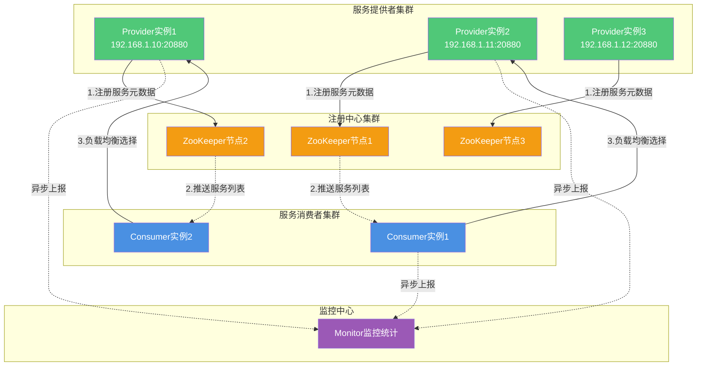
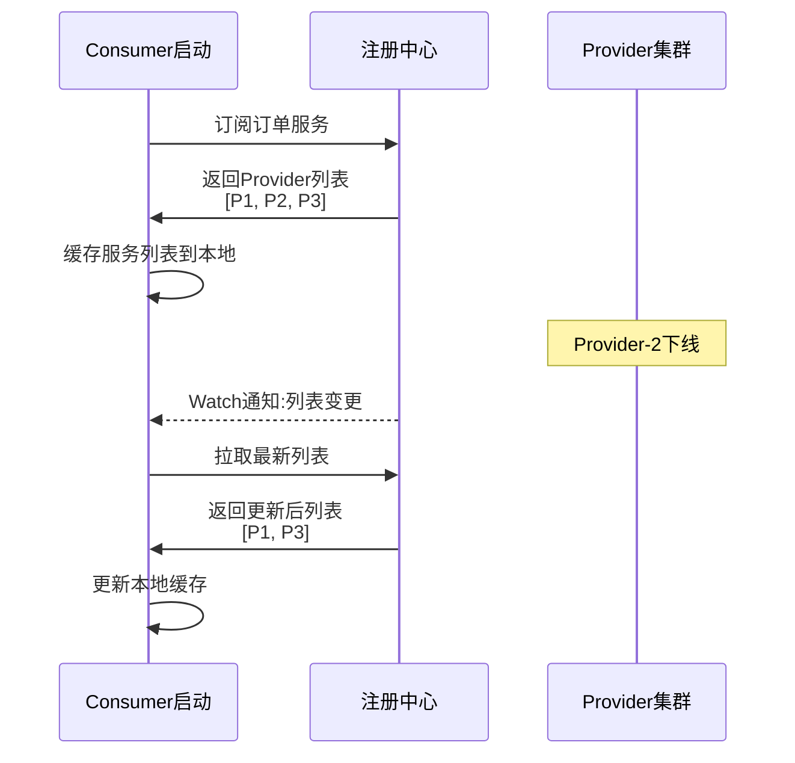
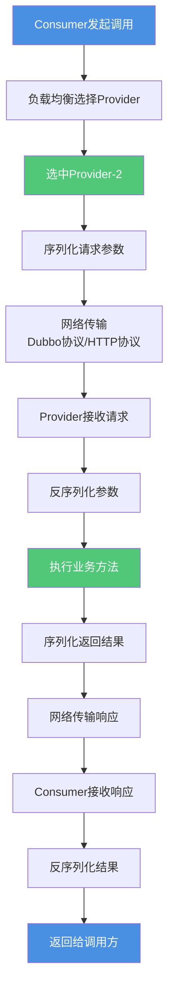
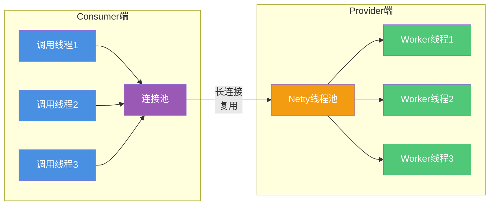
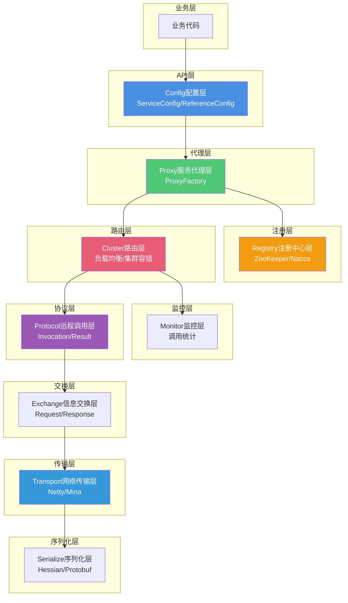
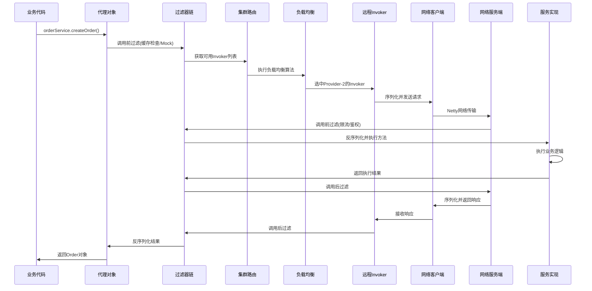

# Dubbo核心架构与调用流程

## Dubbo架构总览

Dubbo作为成熟的RPC框架,其架构设计包含了服务注册、服务发现、服务调用三个核心过程,涉及多个关键角色的协同工作。

### 服务角色与交互关系



### 服务注册流程

服务提供者(Provider)在启动时,会主动向注册中心注册自己提供的服务。注册信息包括:

- 服务接口名称和版本号
- 服务提供者的IP地址和端口
- 支持的通信协议(dubbo、http、hessian等)
- 服务权重、超时时间等配置参数

Dubbo支持多种注册中心实现:

- **ZooKeeper**: 最常用的注册中心,提供分布式协调服务
- **Nacos**: 阿里云推出的服务注册与配置中心
- **Redis**: 基于Redis的轻量级注册中心
- **Consul**: HashiCorp的服务网格解决方案
- **Multicast**: 基于组播的简单注册中心

服务注册成功后,Provider进入就绪状态,等待Consumer的调用请求。

### 服务发现流程

服务消费者(Consumer)在启动时,需要向注册中心订阅所需的服务。具体流程如下:



注册中心会将符合条件的Provider列表返回给Consumer。当Provider列表发生变化时(如服务上线、下线、权重调整),Dubbo会通过Watch机制主动通知Consumer进行更新,确保Consumer始终持有最新的服务提供者信息。

### 服务调用流程

Consumer获取到Provider列表后,就可以发起服务调用。Dubbo提供了完善的调用链路:



**负载均衡**: Consumer根据配置的负载均衡策略(随机、轮询、最少活跃调用等)选择一个Provider实例。

**序列化**: Dubbo支持多种序列化协议(Hessian2、Protobuf、JSON等),将调用参数序列化为二进制数据。

**网络通信**: Dubbo支持多种通信协议,可以使用Dubbo协议、HTTP、Hessian等,底层通常基于Netty实现高性能异步通信。

**服务执行**: Provider接收到请求后,反序列化参数,调用目标方法执行业务逻辑,将结果序列化后返回。

**监控上报**: 整个调用过程中,Dubbo会记录调用次数、调用时间、响应时间、异常信息等,异步上报给监控中心,用于故障排查和性能调优。

### 通信方式详解

**Provider与Consumer之间的通信**

Dubbo提供了灵活的通信模型:

- **长连接模式**: 默认使用TCP长连接,减少连接建立开销,适合高并发场景
- **短连接模式**: 每次调用建立新连接,适合调用频率低的场景
- **NIO/Netty**: 使用高性能的异步非阻塞IO框架,支持大规模并发连接
- **心跳机制**: 定期发送心跳包保持连接活跃,及时发现连接异常



**Provider与注册中心之间的通信**

针对不同的注册中心,Dubbo采用不同的通信协议:

- **ZooKeeper**: 使用ZooKeeper的长连接进行服务注册和订阅,通过Watch机制监听服务列表变化
- **Redis**: 使用Redis的发布-订阅(Pub/Sub)机制进行服务注册和发现
- **Nacos**: 使用Nacos SDK,支持HTTP长轮询和gRPC推送两种模式

## Dubbo分层架构设计

Dubbo采用了清晰的分层架构,每一层职责明确,便于理解和扩展:



### 核心分层说明

**Config配置层**: 对外配置接口,以ServiceConfig和ReferenceConfig为中心,可以直接初始化配置类,也可以通过Spring解析配置生成配置类。

**Proxy服务代理层**: 服务接口透明代理,生成服务的客户端Stub和服务器端Skeleton,让远程调用像本地调用一样简单。

**Registry注册中心层**: 封装服务地址的注册与发现,以服务URL为中心,支持多种注册中心实现。

**Cluster路由层**: 封装多个Provider的路由及负载均衡,并桥接注册中心,以Invoker为中心,提供集群容错能力。

**Monitor监控层**: RPC调用次数和调用时间监控,以Statistics为中心,异步上报调用统计信息。

**Protocol远程调用层**: 封装RPC调用,以Invocation和Result为中心,支持多种通信协议。

**Exchange信息交换层**: 封装请求响应模式,同步转异步,以Request和Response为中心。

**Transport网络传输层**: 抽象Mina和Netty为统一接口,以Message为中心,提供高性能网络通信能力。

**Serialize序列化层**: 提供可复用的序列化工具,支持多种序列化协议。

## Dubbo远程调用实现原理

### 动态代理机制

Dubbo实现像本地方法一样调用远程方法的核心技术是**动态代理**。Dubbo使用JDK动态代理或Javassist字节码增强技术,生成代理类实现服务接口。


**代理类生成**: Dubbo在启动时扫描配置文件或注解,根据服务接口生成代理类。这个代理类实现了服务接口的所有方法,在方法内部将参数封装成请求消息,通过网络传输给服务提供方。

例如,业务代码调用:
```java
// 看起来是本地调用
OrderService orderService = ...;
Order order = orderService.createOrder(userId, productId);
```

实际上orderService是一个代理对象,调用createOrder方法时会执行:
```java
// 代理对象内部的invoke方法
public Object invoke(Object proxy, Method method, Object[] args) {
    // 1. 封装请求参数
    RpcInvocation invocation = new RpcInvocation(method, args);
    
    // 2. 负载均衡选择Provider
    Invoker invoker = cluster.select(invocation);
    
    // 3. 发起远程调用
    Result result = invoker.invoke(invocation);
    
    // 4. 返回结果
    return result.getValue();
}
```

### 完整调用链路



### 关键步骤详解

**步骤1 - 代理拦截**: 业务代码调用服务接口方法,实际调用的是代理对象,代理对象的invoke方法被触发。

**步骤2 - 过滤器处理**: 请求经过Filter链,执行上下文处理、缓存检查、Mock降级等逻辑。

**步骤3 - 服务发现**: 通过Directory从注册中心获取所有可调用的Provider列表。

**步骤4 - 负载均衡**: 根据配置的负载均衡策略(随机、轮询、一致性哈希等)选择一个Provider。

**步骤5 - 过滤器处理**: 调用前再次过滤,执行限流、计数、上下文传递等操作。

**步骤6 - 协议封装**: 根据配置的协议(Dubbo协议、HTTP协议等)封装请求数据。

**步骤7 - 序列化**: 将Java对象序列化为二进制数据,支持Hessian2、Protobuf、JSON等多种格式。

**步骤8 - 网络传输**: 通过Netty等高性能网络框架发送请求到Provider。

**步骤9 - 服务端接收**: Provider端的Netty线程池接收请求,交给业务线程池处理。

**步骤10 - 反序列化**: 将二进制数据反序列化为Java对象。

**步骤11 - 查找Exporter**: 根据请求信息查找对应的服务导出器(Exporter)。

**步骤12 - 执行方法**: 调用真实的服务实现类方法,执行业务逻辑。

**步骤13 - 返回结果**: 将执行结果序列化后通过网络返回给Consumer。

**步骤14 - Consumer处理**: Consumer接收响应,反序列化后返回给业务代码。

### 核心技术组件

**服务注册与发现**: 使用注册中心(ZooKeeper、Nacos等)管理服务的提供者和消费者信息。Provider启动时注册服务,Consumer通过注册中心查找所需服务并获取Provider地址。

**序列化与反序列化**: 为了在网络上传输数据,Dubbo将方法调用的参数和返回值进行序列化和反序列化。支持Hessian、JSON、Protobuf等多种协议,满足不同的性能和兼容性需求。

**网络通信**: 支持Dubbo协议、HTTP协议、Hessian协议等多种通信协议。根据协议选择相应的序列化方式,将请求序列化成二进制流并发送给Provider。

**负载均衡**: 支持随机、轮询、加权随机、最少活跃数、一致性哈希等多种负载均衡算法。Consumer发起调用时,根据算法选择一台Provider进行调用。

通过动态代理、分层架构、灵活的扩展机制,Dubbo实现了高性能、高可用的远程服务调用,让开发者能够像调用本地方法一样轻松调用远程服务。
