# Dubbo负载均衡与服务治理

## Dubbo负载均衡策略

### 客户端负载均衡模式

Dubbo采用**客户端负载均衡**的设计模式,即由Consumer端通过负载均衡算法决定将请求提交到哪个Provider实例,而不是像Nginx那样由服务端统一调度。

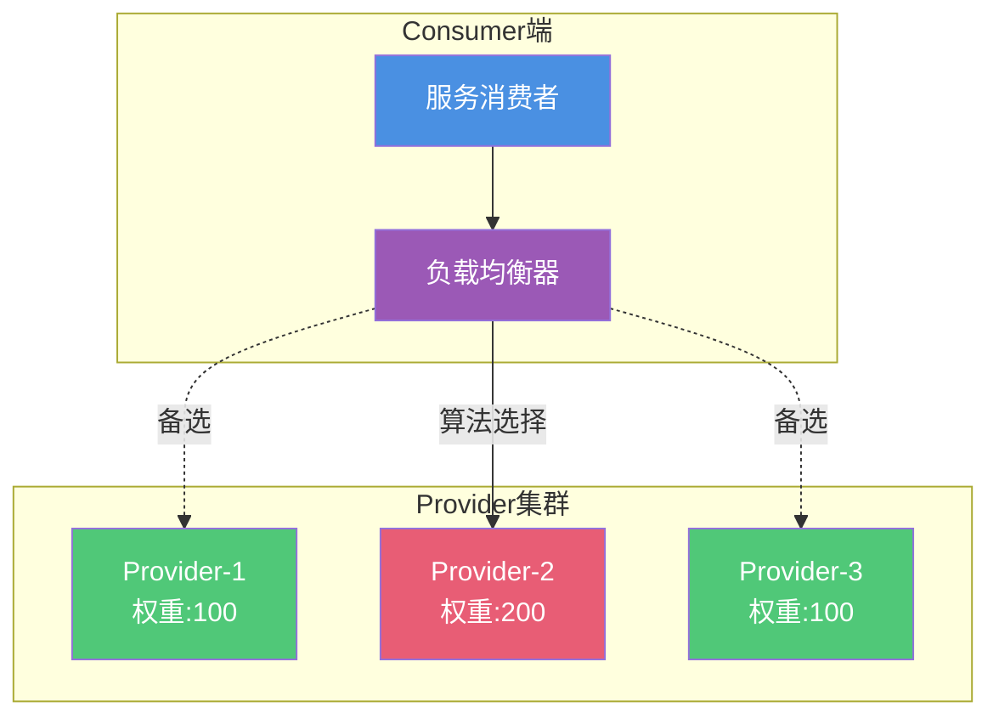

客户端负载均衡的优势:
- 减少中心节点压力,避免单点故障
- Consumer可根据自身情况选择最优Provider
- 降低网络延迟,无需额外跳转
- 支持更灵活的负载均衡策略

### 加权随机负载均衡

**RandomLoadBalance** 是Dubbo的默认负载均衡策略,从所有可用Provider中随机选择一个。

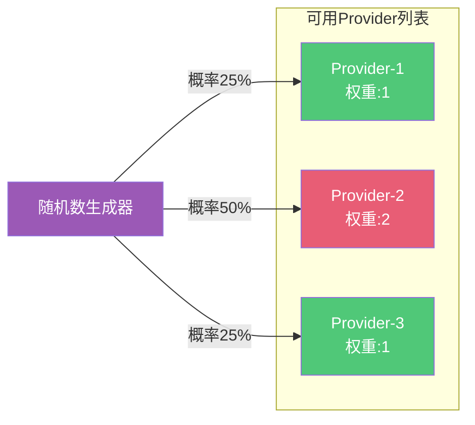

**核心原理**:
- 根据Provider的权重值计算总权重
- 生成随机数并根据权重区间选择Provider
- 权重越高的Provider被选中概率越大

**权重设置**: 可以根据Provider的硬件配置动态调整权重。例如:
- 高配服务器: 权重200
- 中配服务器: 权重100
- 低配服务器: 权重50

**配置示例**:
```java
// Provider端配置权重
@DubboService(weight = 200, loadbalance = "random")
public class OrderServiceImpl implements OrderService {
    // 业务实现
}

// Consumer端配置负载均衡策略
@DubboReference(loadbalance = "random")
private OrderService orderService;
```

**适用场景**: 
- 各Provider处理能力大致相等
- 需要简单快速的负载分配
- 对调用顺序没有特殊要求

### 轮询负载均衡

**RoundRobinLoadBalance** 按顺序逐一选择每个Provider,支持权重设置。

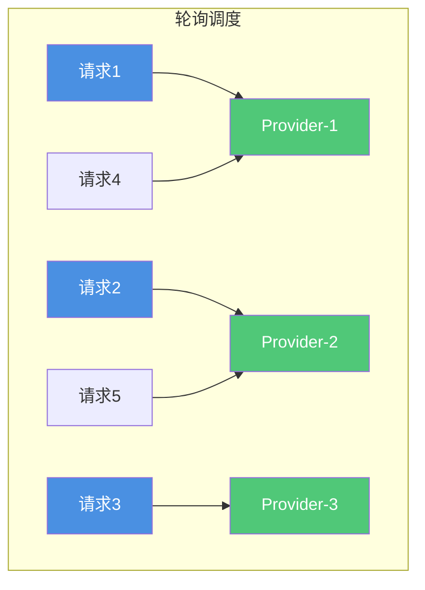

**加权轮询示例**:
假设有3个Provider,权重分别为 1:2:1
- Provider-1: 权重1
- Provider-2: 权重2
- Provider-3: 权重1

调度顺序: P1 → P2 → P2 → P3 → P1 → P2 → P2 → P3 ...

**配置示例**:
```java
// XML配置
<dubbo:service interface="com.example.OrderService" loadbalance="roundrobin"/>

// 注解配置
@Service(loadbalance = "roundrobin")
public class OrderServiceImpl implements OrderService {
    // 业务实现
}
```

**适用场景**:
- Provider处理能力均匀且稳定
- 希望请求均匀分配到各个节点
- 有状态服务需要会话保持(结合一致性哈希)

### 最少活跃调用负载均衡

**LeastActiveLoadBalance** 优先调用当前活跃调用数最少的Provider。

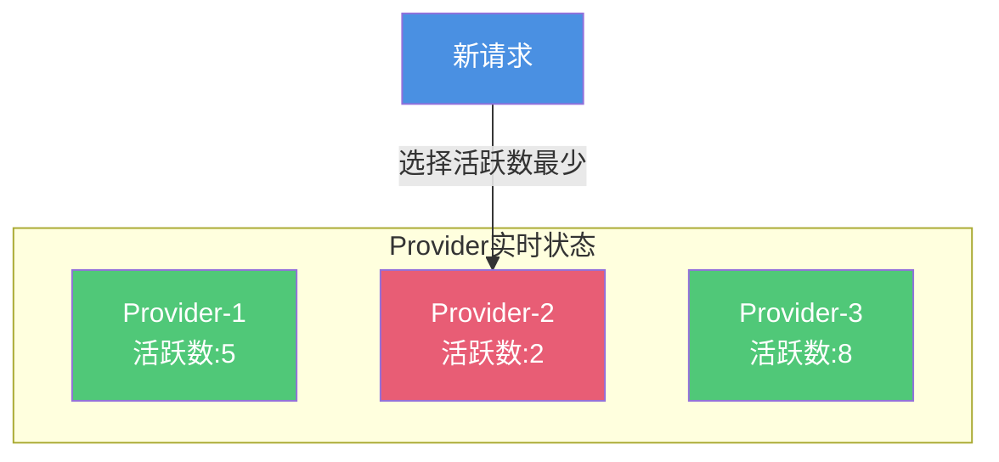

**核心原理**:
- 统计每个Provider当前正在处理的请求数(活跃数)
- 优先选择活跃数最少的Provider
- 如果多个Provider活跃数相同,则随机选择

**活跃数计算**:
- 调用开始: 活跃数 +1
- 调用结束: 活跃数 -1
- 活跃数越小,表示Provider越空闲

**配置示例**:
```java
@DubboReference(loadbalance = "leastactive")
private OrderService orderService;
```

**适用场景**:
- 各Provider处理时间差异较大
- 存在慢请求,避免慢节点积压
- 需要动态适应Provider负载变化
- 适合处理突发流量

### 最短响应优先负载均衡

**ShortestResponseLoadBalance** 跟踪每个Provider的平均响应时间,优先选择响应最快的Provider。

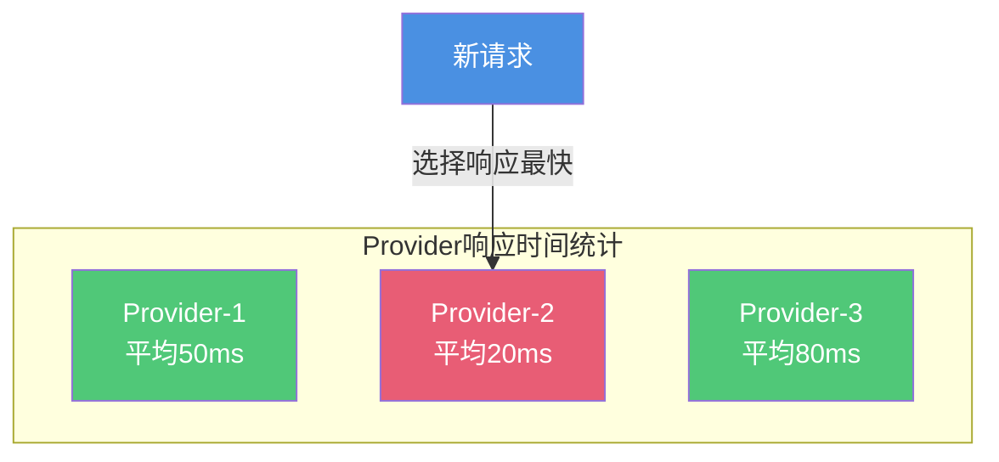

**核心原理**:
- 记录每个Provider最近若干次调用的响应时间
- 计算平均响应时间
- 优先选择平均响应时间最短的Provider

**配置示例**:
```java
@Service(loadbalance = "shortestresponse")
public class OrderServiceImpl implements OrderService {
    // 业务实现
}
```

**适用场景**:
- Provider资源需求差异大
- 网络环境复杂,延迟波动大
- 需要动态选择最优节点
- 对响应时间敏感的业务

### 一致性哈希负载均衡

**ConsistentHashLoadBalance** 使用一致性哈希算法,相同参数的请求总是路由到同一个Provider。

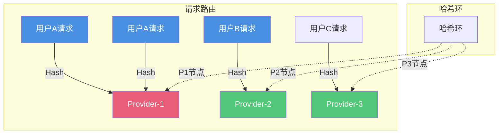

**核心原理**:
- 根据请求参数(如用户ID)计算哈希值
- 在哈希环上定位对应的Provider
- 相同参数总是映射到相同Provider

**配置示例**:
```java
// 根据第一个参数进行哈希
@DubboReference(loadbalance = "consistenthash")
private UserService userService;

// 调用示例
userService.getUserInfo(12345L); // 用户12345总是路由到同一Provider
```

**适用场景**:
- 有状态服务,需要会话保持
- 需要缓存预热的场景
- 相同用户的请求希望路由到同一节点
- 购物车、用户会话等场景

### 自定义负载均衡策略

Dubbo支持自定义负载均衡算法,只需实现LoadBalance接口即可。

**实现步骤**:

1. 实现LoadBalance接口:
```java
public class MyLoadBalance extends AbstractLoadBalance {
    
    @Override
    protected <T> Invoker<T> doSelect(List<Invoker<T>> invokers, 
                                      URL url, 
                                      Invocation invocation) {
        // 自定义选择逻辑
        // 例如:根据时间段选择不同Provider
        int hour = LocalTime.now().getHour();
        if (hour >= 9 && hour < 18) {
            // 工作时间选择高性能节点
            return selectHighPerformanceInvoker(invokers);
        } else {
            // 非工作时间随机选择
            return selectRandomInvoker(invokers);
        }
    }
}
```

2. 配置SPI扩展:
在`META-INF/dubbo/org.apache.dubbo.rpc.cluster.LoadBalance`文件中添加:
```
myloadbalance=com.example.MyLoadBalance
```

3. 使用自定义策略:
```java
@DubboReference(loadbalance = "myloadbalance")
private OrderService orderService;
```

## Dubbo服务治理体系

Dubbo提供了业界最完善的服务治理能力,涵盖服务生命周期的各个环节。

### 核心治理能力

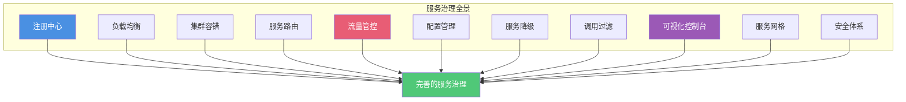

### 注册中心支持

Dubbo支持多种注册中心,满足不同场景需求:

**ZooKeeper**: 
- 最成熟的注册中心方案
- 提供分布式协调能力
- 支持Watch机制实时推送
- 高可用集群部署

**Nacos**:
- 阿里云推出的服务注册与配置中心
- 提供控制台界面
- 支持动态配置推送
- 内置服务健康检查

**Consul**:
- HashiCorp出品
- 服务网格解决方案
- 支持多数据中心
- 内置健康检查和KV存储

**Etcd**:
- 分布式配置中心
- 强一致性保证
- 适合Kubernetes环境

### 负载均衡策略

前面已详细介绍的5种负载均衡策略:
- 加权随机(Random)
- 加权轮询(RoundRobin)
- 最少活跃调用(LeastActive)
- 最短响应优先(ShortestResponse)
- 一致性哈希(ConsistentHash)

### 集群容错机制

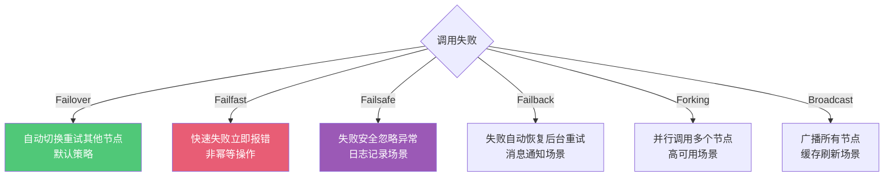

**Failover(失败自动切换)**: 
- 调用失败时自动切换到其他Provider重试
- 默认重试2次(总共调用3次)
- 适用于幂等操作,如查询、删除

**Failfast(快速失败)**:
- 调用失败立即报错,不重试
- 适用于非幂等操作,如新增记录

**Failsafe(失败安全)**:
- 调用失败时忽略异常,记录日志
- 适用于日志记录等对结果不敏感的场景

**Failback(失败自动恢复)**:
- 调用失败时返回空结果,后台定时重试
- 适用于消息通知等最终一致性场景

**Forking(并行调用)**:
- 同时调用多个Provider,只要一个成功即返回
- 适用于对可用性要求极高的场景

**Broadcast(广播调用)**:
- 调用所有Provider,任意一个失败则失败
- 适用于缓存刷新等需要通知所有节点的场景

### 服务路由规则

服务路由用于在运行时动态调整服务调用的目标。

**基于条件路由**:
```java
// 只有来自北京的Consumer才能调用北京的Provider
host = 10.20.* => host = 10.20.*

// VIP用户调用高性能集群
user.vip = true => region = high-performance
```

**基于标签路由**:
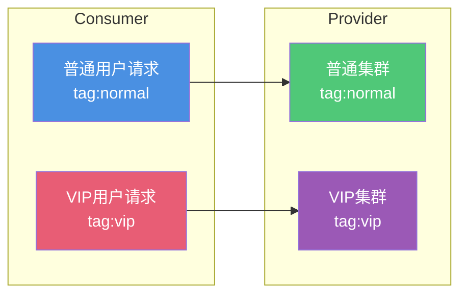

**基于版本路由**:
- 不同版本的服务可以同时部署
- Consumer可以指定调用特定版本的Provider
- 支持灰度发布和多版本共存

### 流量管控

Dubbo支持丰富的流量管控规则:

**动态配置**:
- 运行时调整超时时间
- 动态修改重试次数
- 实时更新限流参数

**A/B测试**:
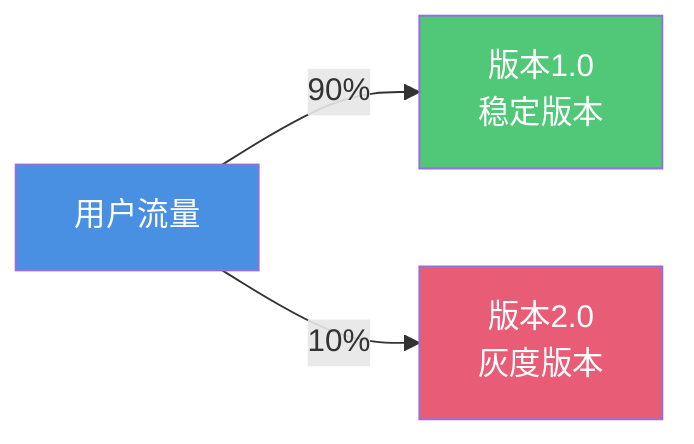

**金丝雀发布**:
- 小流量验证新版本
- 逐步扩大流量比例
- 发现问题快速回滚

**按比例流量分配**:
- 根据权重分配流量
- 支持动态调整比例

**条件匹配路由**:
- 根据参数值路由
- 支持复杂表达式

**黑白名单**:
- IP黑名单拦截恶意请求
- 白名单限制访问来源

### 服务降级

当系统负载过高或依赖服务不可用时,通过降级策略保证核心功能可用:

```java
// Mock降级
@DubboReference(mock = "return null")
private RecommendService recommendService;

// 自定义Mock实现
@DubboReference(mock = "com.example.RecommendServiceMock")
private RecommendService recommendService;
```

**降级场景**:
- 依赖服务不可用时返回默认值
- 非核心功能降级保证核心功能
- 高峰期降级部分功能

### 调用过滤器

Dubbo提供过滤器机制,在调用前后执行自定义逻辑:

```java
@Activate(group = {Constants.CONSUMER})
public class LogFilter implements Filter {
    
    @Override
    public Result invoke(Invoker<?> invoker, Invocation invocation) {
        // 调用前处理
        long start = System.currentTimeMillis();
        
        // 执行调用
        Result result = invoker.invoke(invocation);
        
        // 调用后处理
        long cost = System.currentTimeMillis() - start;
        logger.info("调用耗时: {}ms", cost);
        
        return result;
    }
}
```

**内置过滤器**:
- AccessLogFilter: 访问日志记录
- ActiveLimitFilter: 并发控制
- ExecuteLimitFilter: 限流控制
- TimeoutFilter: 超时控制
- TokenFilter: 令牌验证

### Dubbo Admin控制台

Dubbo Admin是官方提供的可视化管理控制台:

**核心功能**:
- 服务查询与管理
- 实时监控调用统计
- 动态配置下发
- 服务治理规则管理
- 路由规则配置
- 负载均衡策略调整

### 服务网格支持

Dubbo支持与Istio等服务网格体系集成:

- 基于Envoy的流量拦截
- Proxyless Mesh轻量模式
- 与Kubernetes深度集成
- 统一的服务治理能力

### 安全体系

**传输加密**:
- 支持TLS加密传输
- HTTP/2、TCP数据加密

**认证鉴权**:
- 服务级别的认证
- 方法级别的鉴权
- 细粒度的资源访问控制

### 服务发现与路由对比

**服务发现**:
- 从注册中心获取Provider地址列表
- 解决"去哪里调用"的问题
- Consumer启动时订阅服务
- 动态感知Provider上下线

**服务路由**:
- 根据规则将请求路由到特定Provider
- 解决"调用哪一个"的问题
- 支持条件路由、标签路由
- 运行时动态修改路由规则

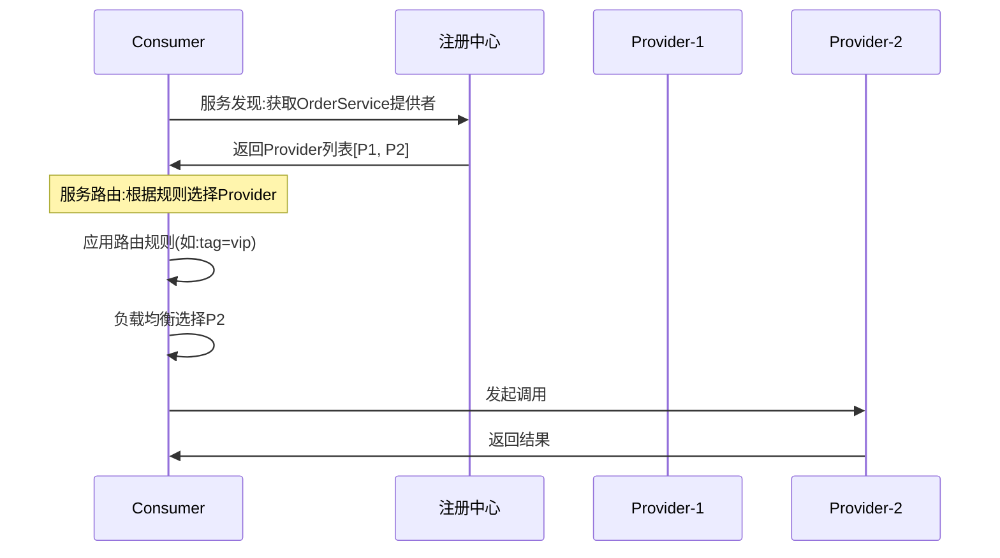

**区别总结**:
- 服务发现获取候选列表
- 服务路由筛选和选择目标
- 两者配合实现灵活的服务调用

通过完善的负载均衡和服务治理能力,Dubbo能够构建高可用、高性能、易维护的微服务架构。
