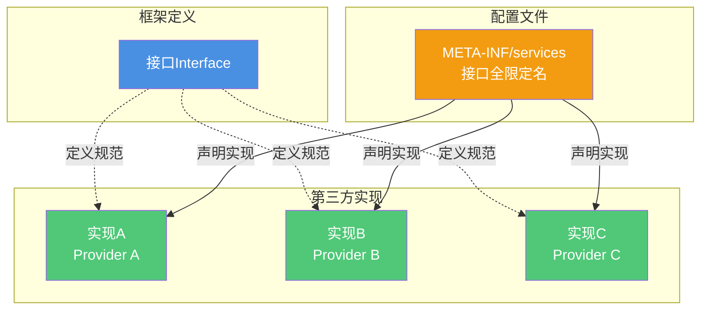
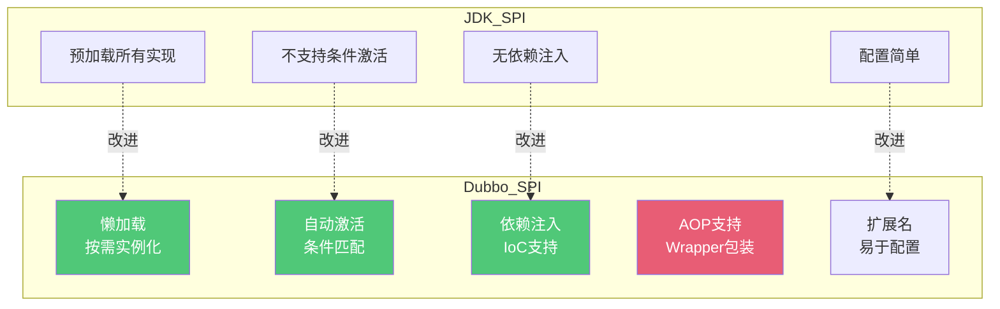
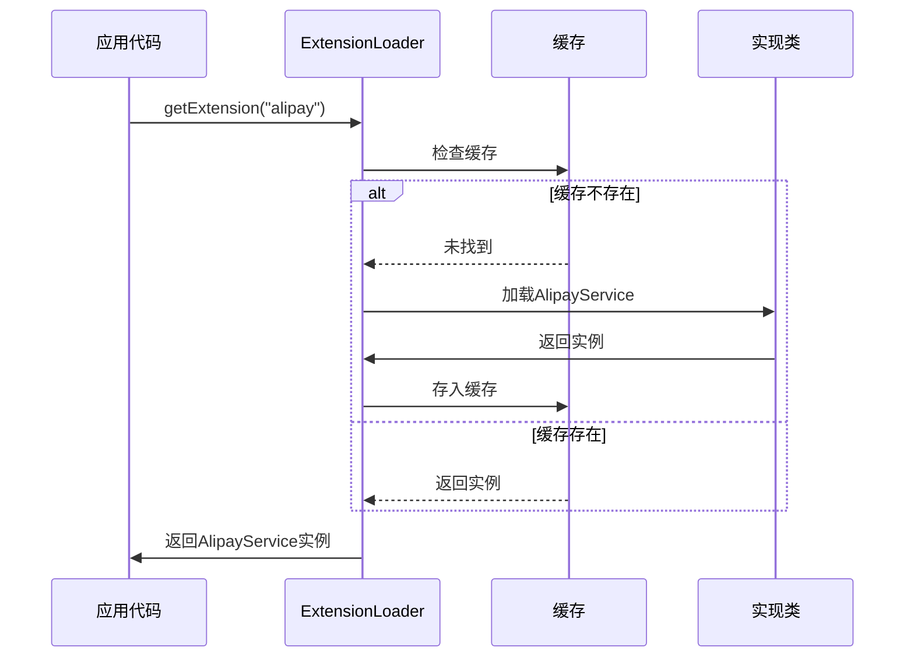
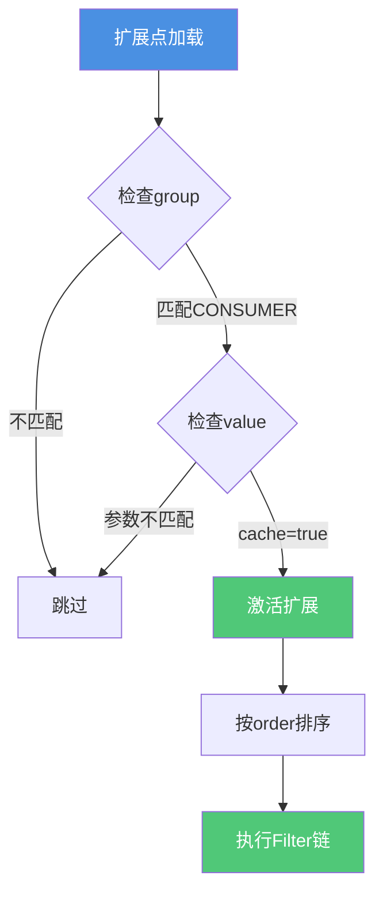
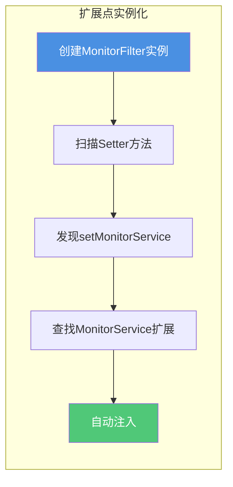
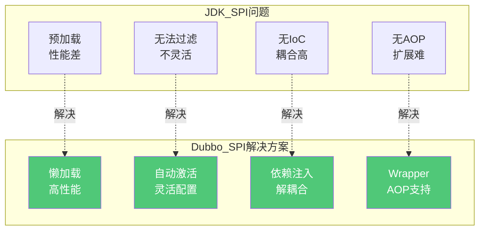

# Dubbo扩展机制SPI详解

## SPI机制概述

### 什么是SPI

SPI(Service Provider Interface)是一种服务发现机制,允许第三方为某些接口提供实现。通过SPI,框架可以在运行时动态加载接口的实现类,实现插件化扩展。



**SPI的核心价值**:
- 解耦框架与实现
- 支持插件化扩展
- 运行时动态加载
- 第三方灵活集成

### JDK SPI机制

JDK提供了基础的SPI机制,通过ServiceLoader类实现服务加载。

**实现步骤**:

1. 定义服务接口:
```java
public interface PaymentService {
    void pay(String orderId, BigDecimal amount);
}
```

2. 提供服务实现:
```java
public class AlipayService implements PaymentService {
    @Override
    public void pay(String orderId, BigDecimal amount) {
        System.out.println("支付宝支付: " + orderId);
    }
}

public class WechatPayService implements PaymentService {
    @Override
    public void pay(String orderId, BigDecimal amount) {
        System.out.println("微信支付: " + orderId);
    }
}
```

3. 配置服务提供者:
在`META-INF/services/com.example.PaymentService`文件中:
```
com.example.AlipayService
com.example.WechatPayService
```

4. 加载服务:
```java
ServiceLoader<PaymentService> services = 
    ServiceLoader.load(PaymentService.class);

for (PaymentService service : services) {
    service.pay("ORDER123", new BigDecimal("100.00"));
}
```

**JDK SPI的局限性**:
- 预加载所有实现,无法按需加载
- 不支持条件激活
- 缺少依赖注入能力
- 性能开销较大
- 配置不够灵活

## Dubbo SPI增强机制

Dubbo在JDK SPI的基础上进行了大量优化和增强,提供了更加强大和灵活的扩展能力。

### Dubbo SPI核心优势



### 懒加载机制

**JDK SPI的问题**:
```java
// JDK SPI会立即加载所有实现类
ServiceLoader<PaymentService> services = 
    ServiceLoader.load(PaymentService.class);
// 此时所有实现类已被实例化,即使不使用
```

**Dubbo SPI的优化**:
```java
// Dubbo SPI只在实际使用时才加载
ExtensionLoader<PaymentService> loader = 
    ExtensionLoader.getExtensionLoader(PaymentService.class);

// 只加载名为"alipay"的实现
PaymentService alipay = loader.getExtension("alipay");
```



**性能优势**:
- 应用启动更快
- 减少内存占用
- 仅加载实际需要的扩展

### 扩展点自动激活

Dubbo支持根据条件自动激活扩展点,无需手动配置。

**使用@Activate注解**:
```java
@Activate(group = {CommonConstants.CONSUMER}, 
          value = "cache",
          order = -10000)
public class CacheFilter implements Filter {
    @Override
    public Result invoke(Invoker<?> invoker, Invocation invocation) {
        // 缓存逻辑
        return invoker.invoke(invocation);
    }
}
```

**激活条件**:
- **group**: 指定生效范围(CONSUMER/PROVIDER)
- **value**: URL参数匹配
- **order**: 执行顺序



**配置示例**:
```java
// Consumer端配置
@DubboReference(cache = "lru")
private UserService userService;

// 自动激活CacheFilter,无需手动配置
```

### 扩展点依赖注入

Dubbo SPI支持IoC依赖注入,扩展点可以自动注入其他扩展点。

**Setter注入示例**:
```java
public class MonitorFilter implements Filter {
    
    private MonitorService monitorService;
    
    // Dubbo会自动注入MonitorService的实现
    public void setMonitorService(MonitorService monitorService) {
        this.monitorService = monitorService;
    }
    
    @Override
    public Result invoke(Invoker<?> invoker, Invocation invocation) {
        // 使用注入的MonitorService
        monitorService.collect(invocation);
        return invoker.invoke(invocation);
    }
}
```



**自动装配原理**:
1. Dubbo创建扩展实例
2. 扫描所有setter方法
3. 根据setter参数类型查找对应扩展
4. 自动调用setter完成注入

### 配置文件位置与格式

**JDK SPI配置**:
- 位置: `META-INF/services/`
- 文件名: 接口全限定名
- 内容: 实现类全限定名列表

```
# META-INF/services/com.example.PaymentService
com.example.AlipayService
com.example.WechatPayService
```

**Dubbo SPI配置**:
- 位置: `META-INF/dubbo/`, `META-INF/dubbo/internal/`
- 文件名: 接口全限定名
- 内容: 键值对格式

```
# META-INF/dubbo/com.example.PaymentService
alipay=com.example.AlipayService
wechat=com.example.WechatPayService
unionpay=com.example.UnionPayService
```

**键值对的优势**:
- 扩展点有易记的名称
- 支持按名称加载扩展
- 配置更加直观清晰

### AOP支持 - Wrapper机制

Dubbo通过Wrapper类实现AOP功能,可以在不修改原有代码的情况下增强扩展点功能。

**Wrapper类定义**:
```java
public class ProtocolFilterWrapper implements Protocol {
    
    private Protocol protocol;
    
    // Wrapper类必须有接受接口类型的构造函数
    public ProtocolFilterWrapper(Protocol protocol) {
        this.protocol = protocol;
    }
    
    @Override
    public <T> Exporter<T> export(Invoker<T> invoker) {
        // 前置处理
        System.out.println("导出服务前");
        
        // 调用被包装的Protocol
        Exporter<T> exporter = protocol.export(invoker);
        
        // 后置处理
        System.out.println("导出服务后");
        
        return exporter;
    }
}
```


**Wrapper自动包装**:
- Dubbo自动识别Wrapper类
- 按顺序自动包装扩展点
- 形成调用链
- 实现AOP效果

**应用场景**:
- 日志记录
- 性能监控
- 事务管理
- 异常处理
- 权限校验

### 扩展名机制

Dubbo为每个扩展点实现指定了简洁易记的名称。

**命名规范**:
```
# 扩展名 = 实现类全限定名
random=org.apache.dubbo.rpc.cluster.loadbalance.RandomLoadBalance
roundrobin=org.apache.dubbo.rpc.cluster.loadbalance.RoundRobinLoadBalance
leastactive=org.apache.dubbo.rpc.cluster.loadbalance.LeastActiveLoadBalance
```

**使用扩展名**:
```java
// 通过扩展名加载
ExtensionLoader<LoadBalance> loader = 
    ExtensionLoader.getExtensionLoader(LoadBalance.class);

LoadBalance loadBalance = loader.getExtension("random");
```

**配置中使用**:
```java
@DubboReference(loadbalance = "random")
private OrderService orderService;
```

## 为什么Dubbo不用JDK SPI

### JDK SPI的缺陷

**性能问题**:
```java
// JDK SPI加载所有实现类
ServiceLoader<LoadBalance> services = 
    ServiceLoader.load(LoadBalance.class);

// 即使只需要一个实现,也会实例化所有实现类
// 浪费内存和CPU资源
for (LoadBalance lb : services) {
    // 遍历所有实现
}
```

**灵活性不足**:
- 只能加载所有实现,无法选择性加载
- 不支持过滤和排序
- 缺少加载顺序控制
- 没有优先级机制

**扩展性受限**:
- 不支持条件激活
- 无法根据配置动态选择实现
- 缺少自动装配能力

**依赖注入缺失**:
- 扩展点之间无法自动注入
- 需要手动管理依赖关系
- 代码耦合度高

### Dubbo SPI的优势



**性能优化**:
- 懒加载机制,按需实例化
- 缓存已加载的扩展实例
- 避免不必要的资源消耗

**灵活性增强**:
- 支持扩展点自动激活
- 可以根据条件选择实现
- 运行时动态配置

**依赖注入**:
- 自动装配扩展点依赖
- 减少代码耦合
- 便于单元测试

**AOP支持**:
- Wrapper机制实现切面功能
- 日志、监控、事务等横切关注点
- 不侵入业务代码

## Dubbo SPI实战示例

### 定义扩展接口

```java
@SPI("default")
public interface PaymentService {
    void pay(String orderId, BigDecimal amount);
}
```

**@SPI注解**:
- 标记接口为扩展点
- `value`指定默认实现的扩展名

### 实现扩展类

```java
public class AlipayService implements PaymentService {
    @Override
    public void pay(String orderId, BigDecimal amount) {
        System.out.println("支付宝支付订单: " + orderId 
                         + ", 金额: " + amount);
    }
}

public class WechatPayService implements PaymentService {
    @Override
    public void pay(String orderId, BigDecimal amount) {
        System.out.println("微信支付订单: " + orderId 
                         + ", 金额: " + amount);
    }
}

public class DefaultPaymentService implements PaymentService {
    @Override
    public void pay(String orderId, BigDecimal amount) {
        System.out.println("默认支付订单: " + orderId);
    }
}
```

### 配置扩展点

在`META-INF/dubbo/com.example.PaymentService`文件中:
```
alipay=com.example.AlipayService
wechat=com.example.WechatPayService
default=com.example.DefaultPaymentService
```

### 使用扩展点

```java
public class PaymentTest {
    public static void main(String[] args) {
        ExtensionLoader<PaymentService> loader = 
            ExtensionLoader.getExtensionLoader(PaymentService.class);
        
        // 加载支付宝实现
        PaymentService alipay = loader.getExtension("alipay");
        alipay.pay("ORDER001", new BigDecimal("99.99"));
        
        // 加载微信支付实现
        PaymentService wechat = loader.getExtension("wechat");
        wechat.pay("ORDER002", new BigDecimal("199.99"));
        
        // 加载默认实现
        PaymentService defaultPay = loader.getDefaultExtension();
        defaultPay.pay("ORDER003", new BigDecimal("299.99"));
    }
}
```

### 自适应扩展

Dubbo支持自适应扩展,根据运行时参数动态选择实现:

```java
@SPI("default")
public interface PaymentService {
    
    @Adaptive({"payment.type"})
    void pay(URL url, String orderId, BigDecimal amount);
}
```

```java
// 运行时根据URL参数选择实现
URL url = URL.valueOf("dubbo://localhost:20880")
             .addParameter("payment.type", "alipay");

PaymentService payment = 
    loader.getAdaptiveExtension();

// 自动选择AlipayService
payment.pay(url, "ORDER001", new BigDecimal("99.99"));
```

通过Dubbo强大的SPI机制,开发者可以轻松扩展框架功能,实现高度可插拔的架构设计。相比JDK SPI,Dubbo SPI提供了更优的性能、更强的灵活性和更完善的功能,是Dubbo框架设计的核心基础。
