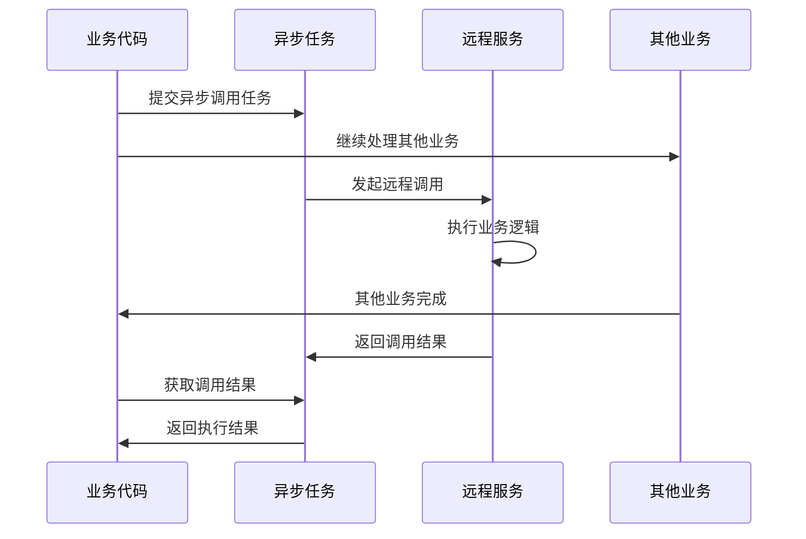

import PaidCTA from '@site/src/components/PaidCTA';

# Dubbo高级特性与应用

## Dubbo异步调用

### Consumer端异步调用

Consumer端异步调用是指消费者在调用远程服务时不同步等待结果,可以先去处理其他业务逻辑,在需要结果时再获取。

**实现方式 - CompletableFuture**:

服务接口保持同步定义:

<PaidCTA />