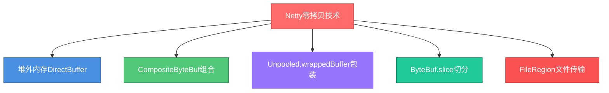
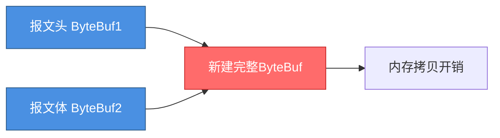
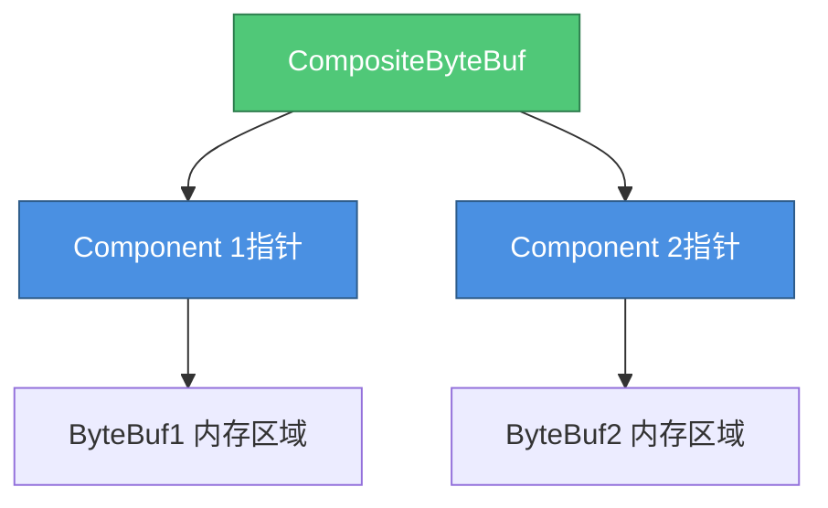
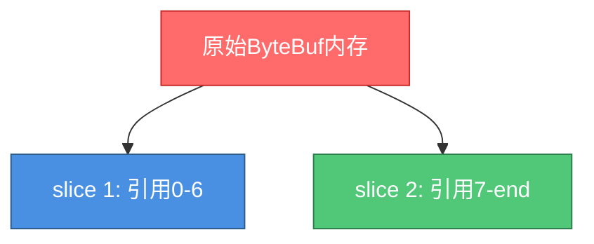

# Netty零拷贝技术详解

## 零拷贝概念辨析

在操作系统层面,零拷贝(Zero-Copy)指的是避免在用户态(User-space)和内核态(Kernel-space)之间反复拷贝数据,从而减少CPU开销和内存带宽消耗。

而Netty中的零拷贝概念更加广泛,主要指在数据操作过程中,避免将数据从一个内存区域拷贝到另一个内存区域。通过减少内存拷贝次数,直接提升CPU利用效率和系统吞吐量。

Netty的零拷贝技术主要体现在以下五个核心方面:



## 堆外内存避免拷贝

Java在通过Socket发送数据时,需要经历以下数据拷贝过程:

1. 将堆内存(Heap)中的数据拷贝到堆外内存(Direct Memory)
2. 再将堆外内存的数据拷贝到内核缓冲区
3. 最终由内核将数据发送到网络


### IOUtil写入逻辑源码

Java NIO的IOUtil在执行write操作时会检查缓冲区类型:

```java
static int write(FileDescriptor fd, ByteBuffer src, long position, 
                 NativeDispatcher dispatcher) throws IOException {
    
    // 如果已经是DirectBuffer,直接写入
    if (src instanceof DirectBuffer) {
        return writeFromNativeBuffer(fd, src, position, dispatcher);
    }
    
    // 否则,先拷贝到临时DirectBuffer
    int pos = src.position();
    int lim = src.limit();
    int rem = (pos <= lim ? lim - pos : 0);
    
    ByteBuffer tempBuf = Util.getTemporaryDirectBuffer(rem);
    try {
        // 数据拷贝到DirectBuffer
        tempBuf.put(src);
        tempBuf.flip();
        
        // 恢复原buffer位置
        src.position(pos);
        
        // 从DirectBuffer写入
        int written = writeFromNativeBuffer(fd, tempBuf, position, dispatcher);
        if (written > 0) {
            src.position(pos + written);
        }
        return written;
    } finally {
        Util.releaseTemporaryDirectBuffer(tempBuf);
    }
}
```

### Netty的DirectBuffer策略

Netty在通信层接收和发送字节流时,优先使用DirectByteBuf(堆外内存),从而省去堆内存到堆外内存的拷贝:

```java
public ByteBuf ioBuffer(int initialCapacity) {
    // 如果支持Unsafe或配置了DirectBuffer池化,使用DirectBuffer
    if (PlatformDependent.hasUnsafe() || isDirectBufferPooled()) {
        return directBuffer(initialCapacity);
    }
    return heapBuffer(initialCapacity);
}
```

**性能对比**:

使用HeapBuffer需要2次拷贝,使用DirectBuffer只需1次拷贝,理论性能提升50%。

## CompositeByteBuf组合缓冲区

### 传统拼接的性能问题

假设通过TCP接收到一个被拆分的数据包,需要将两个ByteBuf重组:



传统做法需要创建新的ByteBuf并将两个buffer的数据拷贝进去,浪费时间和空间。

### CompositeByteBuf零拷贝方案

Netty提供的CompositeByteBuf通过指针组合的方式,在逻辑上将多个ByteBuf合并为一个:



**使用示例**:

```java
// 接收到的消息头
ByteBuf header = Unpooled.buffer(128);
header.writeBytes("REQUEST_ID:12345|".getBytes());

// 接收到的消息体
ByteBuf body = Unpooled.buffer(512);
body.writeBytes("{\"orderId\":\"ORD98765\",\"amount\":299.00}".getBytes());

// 使用CompositeByteBuf组合,无内存拷贝
CompositeByteBuf composite = Unpooled.compositeBuffer();
composite.addComponents(true, header, body);

// 可以像操作单一ByteBuf一样使用
int totalLength = composite.readableBytes();
```

底层的header和body内存区域保持不变,CompositeByteBuf只是维护了指向它们的引用,实现了零拷贝组合。

## Unpooled.wrappedBuffer包装

Unpooled.wrappedBuffer可以将各种数据源包装成ByteBuf,支持byte[]、ByteBuf、ByteBuffer等类型,包装过程不发生数据拷贝。

```java
// 包装字节数组
byte[] messageBytes = "PAYMENT_NOTIFICATION".getBytes();
ByteBuf wrapped = Unpooled.wrappedBuffer(messageBytes);

// 包装多个数据源
byte[] part1 = "Header:".getBytes();
byte[] part2 = "Transaction".getBytes();
ByteBuf multi = Unpooled.wrappedBuffer(part1, part2);

// 底层共享同一个byte数组,修改wrapped会影响原数组
wrapped.setByte(0, 'p');
System.out.println(messageBytes[0]); // 输出: p
```

包装后的ByteBuf和原始数据共享底层存储,避免了额外的内存分配和拷贝。

## ByteBuf.slice切分操作

slice操作与wrappedBuffer功能相反,它将一个ByteBuf切分成多个ByteBuf,切分过程同样不发生内存拷贝。

```java
// 原始消息: "HEADER|BODY_CONTENT"
ByteBuf original = Unpooled.buffer();
original.writeBytes("HEADER|BODY_CONTENT".getBytes());

// 切分出消息头部分 (0-5)
ByteBuf headerSlice = original.slice(0, 6);

// 切分出消息体部分 (7-end)
ByteBuf bodySlice = original.slice(7, original.readableBytes() - 7);

System.out.println(headerSlice.toString(StandardCharsets.UTF_8));  // HEADER
System.out.println(bodySlice.toString(StandardCharsets.UTF_8));    // BODY_CONTENT
```



所有slice共享底层byte数组,只是维护了不同的读写索引,实现了高效的缓冲区切分。

## FileRegion文件传输

FileRegion实现了操作系统级别的零拷贝,底层基于Java的FileChannel#transferTo()方法,该方法封装了Linux的sendFile系统调用。

### 传统文件传输流程


传统方式需要4次数据拷贝和多次用户态/内核态切换。

### sendFile零拷贝流程


使用sendFile后,数据直接在内核空间传输,无需经过用户空间,拷贝次数减少至2次。

### FileChannel官方说明

Java官方文档明确指出:

> This method is potentially much more efficient than a simple loop that reads from this channel and writes to the target channel. **Many operating systems can transfer bytes directly from the filesystem cache to the target channel without actually copying them.**

### Netty中的使用

```java
// 使用FileRegion发送大文件
FileChannel fileChannel = new RandomAccessFile("report.pdf", "r").getChannel();
FileRegion region = new DefaultFileRegion(fileChannel, 0, fileChannel.size());

// Netty会自动使用零拷贝传输
channel.writeAndFlush(region).addListener(new ChannelFutureListener() {
    @Override
    public void operationComplete(ChannelFuture future) {
        if (future.isSuccess()) {
            System.out.println("文件传输完成");
        }
        fileChannel.close();
    }
});
```

对于大文件传输场景,FileRegion能带来数倍的性能提升。

## 零拷贝技术总结

| 技术方案 | 适用场景 | 优化效果 |
|---------|---------|---------|
| DirectBuffer | 网络IO读写 | 减少1次内存拷贝 |
| CompositeByteBuf | 多个Buffer合并 | 避免内存分配和拷贝 |
| wrappedBuffer | 数组包装为ByteBuf | 共享底层存储 |
| slice | Buffer切分 | 共享底层存储 |
| FileRegion | 大文件传输 | 减少2次拷贝+上下文切换 |

通过在不同场景下合理运用这些零拷贝技术,Netty实现了对内存和CPU资源的极致优化,这也是其性能远超传统IO框架的核心原因之一。
