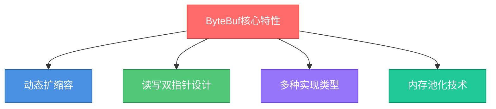
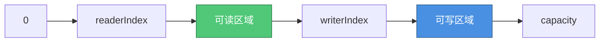
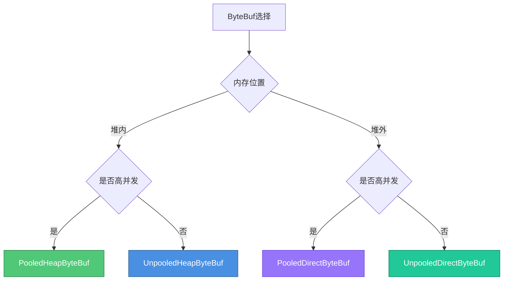

# ByteBuf核心机制与内存管理

## ByteBuf设计背景

在网络编程中,所有的TCP通信都基于字节流进行。Java NIO虽然提供了ByteBuffer,但其设计存在诸多缺陷:容量固定无法扩展、API复杂易出错、操作繁琐。

因此Netty重新设计实现了ByteBuf,不仅在性能上进行了深度优化,在易用性方面也有了质的提升。

## ByteBuf的核心优势

相比Java原生的ByteBuffer,Netty的ByteBuf具有以下显著特点:



## 动态扩缩容机制

ByteBuf能够像ArrayList一样根据写入的数据量自动扩展容量,开发者无需手动管理缓冲区大小。

### 扩容实现源码

```java
final void ensureWritable0(int minWritableBytes) {
    final int writerIndex = writerIndex();
    final int targetCapacity = writerIndex + minWritableBytes;
    
    // 检查是否需要扩容
    if (targetCapacity >= 0 & targetCapacity <= capacity()) {
        ensureAccessible();
        return;
    }
    
    // 边界检查
    if (checkBounds && (targetCapacity < 0 || targetCapacity > maxCapacity)) {
        ensureAccessible();
        throw new IndexOutOfBoundsException(String.format(
            "writerIndex(%d) + minWritableBytes(%d) exceeds maxCapacity(%d): %s",
            writerIndex, minWritableBytes, maxCapacity, this));
    }
    
    // 计算新容量(优化为2的幂)
    final int fastWritable = maxFastWritableBytes();
    int newCapacity = fastWritable >= minWritableBytes 
        ? writerIndex + fastWritable
        : alloc().calculateNewCapacity(targetCapacity, maxCapacity);
    
    // 执行扩容操作
    capacity(newCapacity);
}
```

**使用体验**:

```java
ByteBuf buffer = Unpooled.buffer(128);

// 无需关心容量,直接写入
buffer.writeBytes("用户ID:USER_8934723".getBytes());
buffer.writeInt(29900);  // 订单金额(分)
buffer.writeLong(System.currentTimeMillis());
buffer.writeBytes("MacBook Pro 16".getBytes());

// ByteBuf自动扩容,无需手动检查容量
```

在满足最大容量限制的前提下,开发者可以自由调用write方法,ByteBuf会自动处理扩容,极大简化了代码逻辑。

## 读写双指针设计

这是ByteBuf相比ByteBuffer最大的改进之一,彻底解决了flip()调用问题。

### ByteBuffer的操作困境

Java原生ByteBuffer使用position和limit两个指针:


**ByteBuffer写入"Payment"后的状态**:

```
+---+---+---+---+---+---+---+---+---+---+
| P | a | y | m | e | n | t |   |   |   |
+---+---+---+---+---+---+---+---+---+---+
                          ↑           ↑
                      position    capacity
```

此时直接读取会失败,必须先调用flip():

```
+---+---+---+---+---+---+---+---+---+---+
| P | a | y | m | e | n | t |   |   |   |
+---+---+---+---+---+---+---+---+---+---+
  ↑                       ↑           ↑
position               limit      capacity
```

**问题**: 忘记调用flip()会导致读取不到数据,且编译期无法发现,极易引发线上bug。

### ByteBuf的优雅方案

ByteBuf使用readerIndex和writerIndex两个独立指针:



**写入"Payment"后的状态**:

```
+---+---+---+---+---+---+---+---+---+---+
| P | a | y | m | e | n | t |   |   |   |
+---+---+---+---+---+---+---+---+---+---+
  ↑                       ↑           ↑
readerIndex          writerIndex  capacity
```

**无需flip,直接读取**:

```java
ByteBuf buf = Unpooled.buffer();

// 写入数据
buf.writeBytes("Payment".getBytes());

// 直接读取,无需flip()
byte[] data = new byte[7];
buf.readBytes(data);
```

读取过程中readerIndex自动移动:

```
+---+---+---+---+---+---+---+---+---+---+
| P | a | y | m | e | n | t |   |   |   |
+---+---+---+---+---+---+---+---+---+---+
                          ↑           ↑
                   readerIndex    capacity
                   writerIndex
```

### discardReadBytes优化

当读取了部分数据后,可以调用discardReadBytes()回收已读区域,为可写区域腾出空间:

**读取"Pay"后剩余"ment"**:

```
+---+---+---+---+---+---+---+---+---+---+
| P | a | y | m | e | n | t |   |   |   |
+---+---+---+---+---+---+---+---+---+---+
              ↑                   ↑
        readerIndex          writerIndex
```

**调用discardReadBytes()后**:

```
+---+---+---+---+---+---+---+---+---+---+
| m | e | n | t |   |   |   |   |   |   |
+---+---+---+---+---+---+---+---+---+---+
  ↑           ↑                       ↑
readerIndex  writerIndex          capacity
```

已读的"Pay"被丢弃,未读的"ment"前移,可写空间从3字节增加到6字节。

## 多种ByteBuf实现

Netty根据不同的使用场景提供了多种ByteBuf实现,主要按两个维度分类:

### 内存位置维度

**HeapByteBuf(堆内存)**:
- 底层使用byte[]数组
- 分配和回收速度快
- 适合业务逻辑处理

**DirectByteBuf(堆外内存)**:
- 使用直接内存
- 避免堆内存到堆外内存拷贝
- 适合Socket读写操作

### 池化维度

**PooledByteBuf(池化)**:
- 从对象池分配,可重复使用
- 减少GC压力
- 适合高并发场景

**UnpooledByteBuf(非池化)**:
- 每次新建对象
- 使用完后由GC回收
- 适合正常流量场景

### 实现类型组合

| 内存类型 | 池化 | 非池化 |
|---------|------|-------|
| 堆内存 | PooledHeapByteBuf<br/>适用:业务处理+高并发 | UnpooledHeapByteBuf<br/>适用:业务处理+常规流量 |
| 堆外内存 | PooledDirectByteBuf<br/>适用:Socket操作+高并发 | UnpooledDirectByteBuf<br/>适用:Socket操作+常规流量 |



## 对象池技术

Netty内置了对象池机制,用于重复利用ByteBuf对象,避免频繁创建和销毁带来的性能损耗。

### 对象池的必要性

在高并发网络应用中,每秒可能需要处理数万次请求,如果每次都创建新的ByteBuf:

- 频繁触发GC,影响系统吞吐量
- 增加Young GC和Full GC次数
- 导致Stop-The-World暂停

对象池技术通过复用对象,显著降低了GC压力。

### 对象池使用示例

```java
// 创建ByteBuf对象池
ObjectPool<ByteBuf> pool = new DefaultObjectPool<>(new ByteBufAllocator() {
    @Override
    public ByteBuf buffer(int initialCapacity, int maxCapacity) {
        return Unpooled.buffer(initialCapacity, maxCapacity);
    }
});

// 从对象池获取ByteBuf
ByteBuf buffer = pool.borrowObject();

try {
    // 处理请求消息
    buffer.writeBytes("ORDER_ID:ORD789456".getBytes());
    buffer.writeInt(15999);  // 商品价格
    
    // 业务处理逻辑
    processOrder(buffer);
    
} finally {
    // 清空并归还到对象池
    buffer.clear();
    pool.returnObject(buffer);
}
```

### 对象池核心优势

**提升性能**: 避免重复创建销毁对象,减少系统开销,在高并发场景下性能提升明显。

**增强可靠性**: 减少内存分配和回收操作,降低内存泄漏风险,提高系统稳定性。

**简化开发**: 开发者只需关注业务逻辑,无需过度关注对象的生命周期管理。

### Netty的默认池化策略

在Netty 4.1版本后,默认启用了ByteBuf池化:

```java
public ByteBuf ioBuffer(int initialCapacity) {
    if (PlatformDependent.hasUnsafe() || isDirectBufferPooled()) {
        // 默认返回池化的DirectByteBuf
        return directBuffer(initialCapacity);
    }
    return heapBuffer(initialCapacity);
}
```

这也是Netty性能优越的重要原因之一。

## ByteBuf最佳实践

### 选择合适的类型

```java
// 业务处理场景 - 使用HeapByteBuf
ByteBuf businessBuf = Unpooled.buffer();
businessBuf.writeBytes(processData());

// Socket通信场景 - 使用DirectByteBuf
ByteBuf ioBuf = Unpooled.directBuffer();
channel.writeAndFlush(ioBuf);
```

### 及时释放资源

```java
ByteBuf buffer = ctx.alloc().buffer();
try {
    buffer.writeBytes(data);
    channel.write(buffer);
} finally {
    // 引用计数减1,避免内存泄漏
    ReferenceCountUtil.release(buffer);
}
```

### 避免重复拷贝

```java
// 不推荐:创建新ByteBuf拷贝数据
ByteBuf copy = Unpooled.buffer(original.readableBytes());
original.readBytes(copy);

// 推荐:使用slice共享底层数据
ByteBuf slice = original.slice();
```

通过深入理解ByteBuf的设计理念和实现细节,能够写出更高效、更健壮的Netty应用程序。
