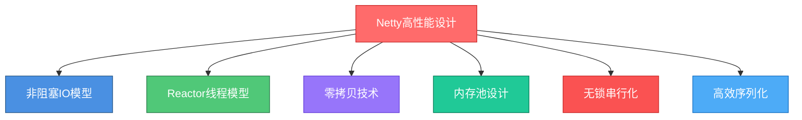
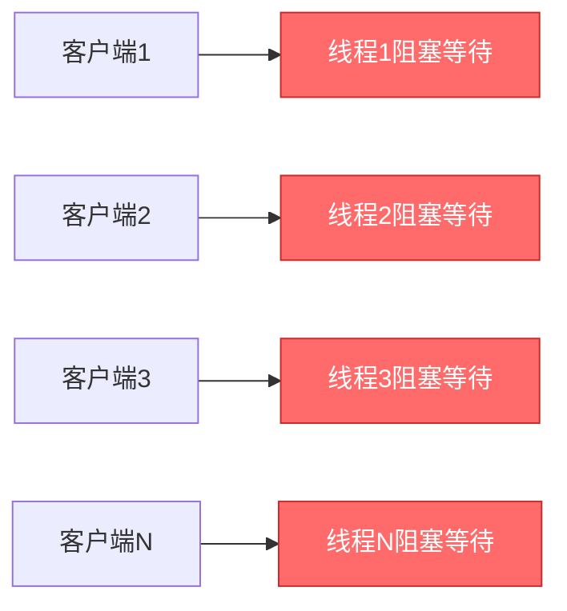
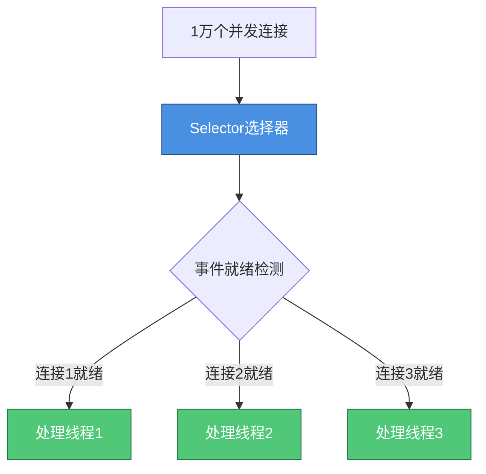
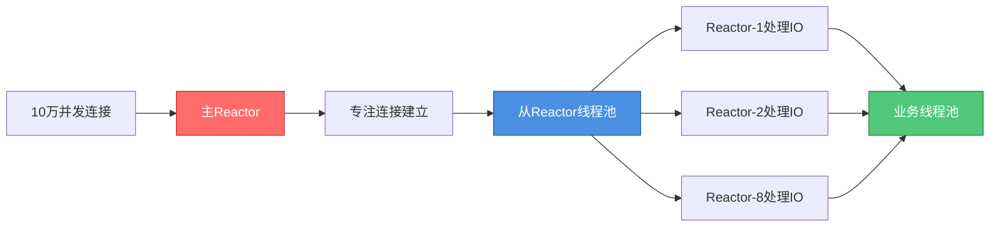
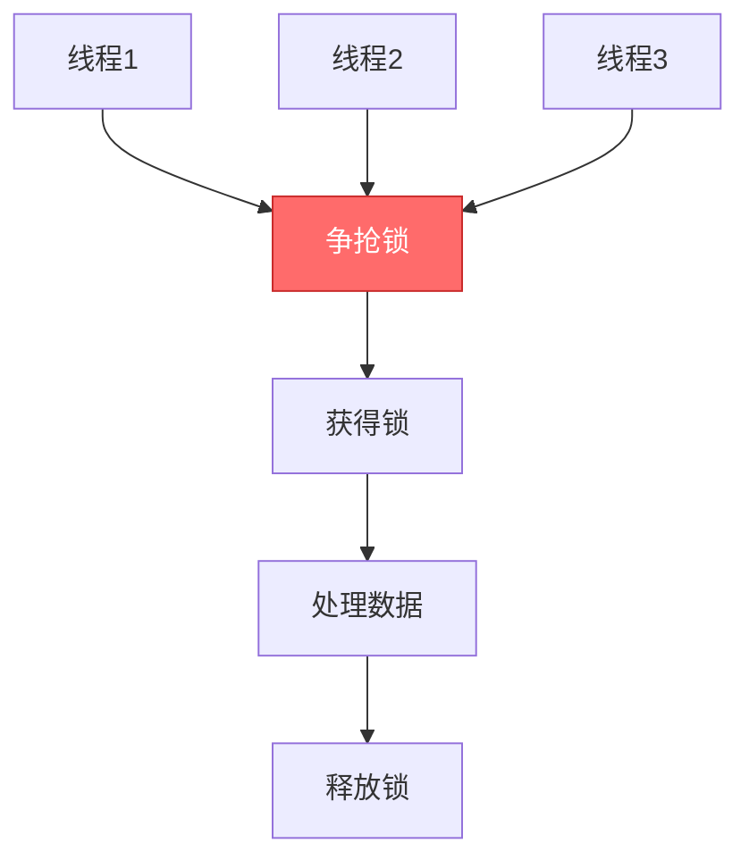
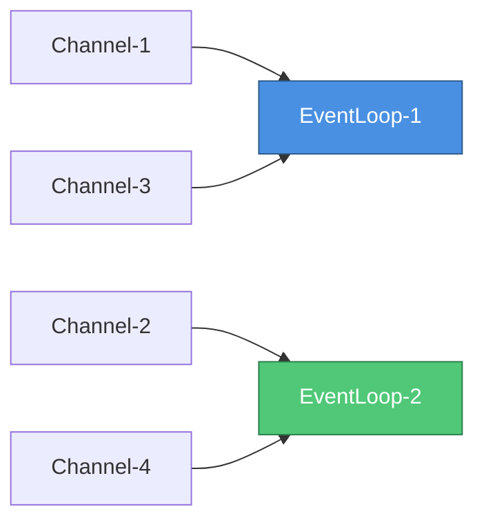
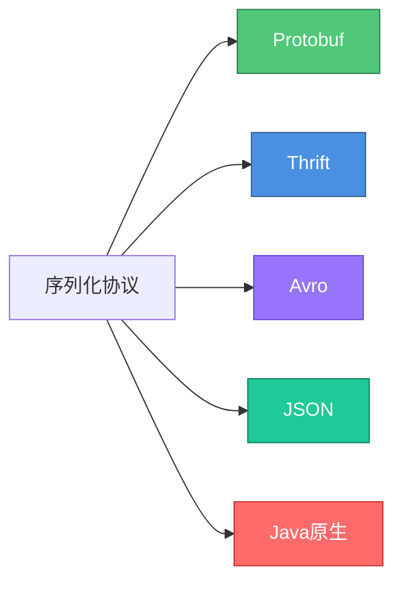

# Netty性能优化技术全解析

## Netty高性能设计概述

Netty作为业界公认的高性能网络通信框架,其性能优势并非来自某一项技术,而是从架构设计到底层实现的全方位优化。



这些技术相互配合,共同构建了Netty的高性能基石。下面将深入解析每项技术的实现原理和应用场景。

## 非阻塞IO多路复用

传统的阻塞IO模型中,每个连接都需要独立的线程处理,大量线程带来巨大的上下文切换开销和内存消耗。

### 阻塞IO的性能瓶颈



当并发连接达到10000时,需要创建10000个线程,系统资源消耗巨大。

### IO多路复用的优势

Netty采用IO多路复用技术,单个select线程可同时监听多个连接的IO事件:



**核心流程**:
1. 所有连接注册到Selector
2. Selector以非阻塞方式查询内核,检测哪些连接数据就绪
3. 只对就绪的连接分配线程处理
4. 处理完成后线程立即释放,处理下一个就绪连接

通过复用少量线程处理海量连接,大幅降低了系统开销。

## 灵活的Reactor线程模型

Netty支持单Reactor单线程、单Reactor多线程、主从Reactor多线程三种模型,可根据业务场景灵活选择。

### 主从Reactor模型的性能优势



**性能提升点**:
- 主Reactor专注连接建立,不阻塞
- 从Reactor池并行处理IO,充分利用多核CPU
- 业务线程池隔离,防止业务逻辑阻塞IO处理

### 配置最优线程数

```java
// 根据CPU核心数配置从Reactor线程数
int cpuCores = Runtime.getRuntime().availableProcessors();

EventLoopGroup bossGroup = new NioEventLoopGroup(1);
// 从Reactor线程数 = CPU核心数 * 2
EventLoopGroup workerGroup = new NioEventLoopGroup(cpuCores * 2);

ServerBootstrap bootstrap = new ServerBootstrap();
bootstrap.group(bossGroup, workerGroup)
    .channel(NioServerSocketChannel.class)
    .childHandler(new ServerChannelInitializer());
```

## 零拷贝技术应用

Netty在多个层面实现了零拷贝,最大限度减少数据在内存中的拷贝次数。

### 应用层零拷贝

通过DirectBuffer、CompositeByteBuf、slice等技术避免JVM内部的内存拷贝:

```java
// 使用DirectBuffer避免堆内到堆外拷贝
ByteBuf directBuf = PooledByteBufAllocator.DEFAULT.directBuffer(1024);

// 使用CompositeByteBuf避免合并拷贝
CompositeByteBuf composite = Unpooled.compositeBuffer();
composite.addComponents(true, header, body);

// 使用slice避免切分拷贝
ByteBuf slice = originalBuf.slice(0, 100);
```

### 操作系统级零拷贝

FileRegion基于sendFile实现操作系统级零拷贝,适合大文件传输:

```java
// 传输100MB日志文件
File logFile = new File("transaction_20231215.log");
FileChannel channel = new RandomAccessFile(logFile, "r").getChannel();
FileRegion region = new DefaultFileRegion(channel, 0, logFile.length());

ctx.writeAndFlush(region).addListener(future -> {
    if (future.isSuccess()) {
        System.out.println("日志文件传输完成");
    }
    channel.close();
});
```

**性能对比**:
- 传统方式:4次拷贝(磁盘→内核→用户→内核→网络)
- sendFile方式:2次拷贝(磁盘→内核→网络)

传输效率提升100%以上。

## 内存池设计

频繁创建销毁ByteBuf会带来严重的GC压力,Netty通过对象池技术实现对象复用。

### 池化带来的性能提升


**未使用对象池**:
```java
// 每次请求都新建对象
for (int i = 0; i < 100000; i++) {
    ByteBuf buf = Unpooled.buffer(1024);
    buf.writeBytes(requestData);
    process(buf);
    // GC需要回收100000个对象
}
```

**使用对象池**:
```java
PooledByteBufAllocator allocator = PooledByteBufAllocator.DEFAULT;

for (int i = 0; i < 100000; i++) {
    ByteBuf buf = allocator.buffer(1024);
    buf.writeBytes(requestData);
    process(buf);
    buf.release();  // 归还到池,而非等待GC
}
```

**性能对比测试**:
- 吞吐量提升:约40%
- GC次数:减少80%以上
- 平均延迟:降低30%

## 无锁串行化设计

锁是解决并发问题的常用方案,但也是性能杀手。Netty通过精巧的架构设计,在大多数场景下避免了锁的使用。

### 传统多线程的锁竞争



大量线程竞争锁会导致:
- 上下文切换开销
- 线程阻塞等待
- 可能的死锁风险

### Netty的无锁化策略

**1. Reactor线程模型天然无锁**

每个Channel绑定唯一的EventLoop,所有事件由同一线程串行处理:

```java
// Channel与EventLoop绑定
public abstract class AbstractChannel {
    private volatile EventLoop eventLoop;
    
    // 所有IO事件由绑定的EventLoop串行处理
    protected void doRegister() throws Exception {
        eventLoop = eventLoop();
        // 无需加锁,单线程处理
    }
}
```



每个EventLoop内部是单线程串行执行,天然避免了锁竞争。

**2. 对象池减少锁竞争**

Netty的内存池采用线程本地缓存(Thread Local Cache)设计:

```java
// 每个线程拥有独立的内存缓存
final class PoolThreadCache {
    private final MemoryRegionCache<ByteBuffer>[] tinySubPageDirectCaches;
    private final MemoryRegionCache<ByteBuffer>[] smallSubPageDirectCaches;
    
    // 从线程本地缓存分配,无需加锁
    ByteBuffer allocate(int size) {
        return allocateFromThreadLocalCache(size);
    }
}
```

**3. 无锁队列支持异步通信**

EventLoop内部使用无锁队列(MPSC Queue)处理异步任务:

```java
// 多生产者单消费者队列,无需锁
private final Queue<Runnable> taskQueue;

public void execute(Runnable task) {
    taskQueue.offer(task);  // 无锁添加
    wakeup(inEventLoop);
}
```

## 高性能序列化协议

序列化性能直接影响网络传输效率,Netty支持多种高效序列化协议。

### 主流序列化协议对比



| 协议 | 序列化速度 | 字节大小 | 跨语言 | 推荐场景 |
|-----|----------|---------|--------|---------|
| Protobuf | 极快 | 极小 | 支持 | 高性能RPC |
| Thrift | 快 | 小 | 支持 | 微服务通信 |
| JSON | 中等 | 较大 | 支持 | HTTP API |
| Java原生 | 慢 | 大 | 不支持 | 不推荐 |

### Protobuf集成示例

```java
// 定义消息格式
message OrderRequest {
    string orderId = 1;
    int64 userId = 2;
    int32 amount = 3;
    string productName = 4;
}

// Netty Pipeline配置
pipeline.addLast(new ProtobufVarint32FrameDecoder());
pipeline.addLast(new ProtobufDecoder(OrderRequest.getDefaultInstance()));
pipeline.addLast(new ProtobufVarint32LengthFieldPrepender());
pipeline.addLast(new ProtobufEncoder());
pipeline.addLast(new OrderServiceHandler());
```

**性能提升**:
- 序列化速度比JSON快5-10倍
- 数据大小减少60%-80%
- 显著降低网络传输时间

## 性能优化实战建议

### 1. 合理配置线程池

```java
// CPU密集型:线程数 = CPU核心数 + 1
int cpuThreads = Runtime.getRuntime().availableProcessors() + 1;

// IO密集型:线程数 = CPU核心数 * 2
int ioThreads = Runtime.getRuntime().availableProcessors() * 2;

EventLoopGroup workerGroup = new NioEventLoopGroup(ioThreads);
```

### 2. 启用对象池化

```java
// 全局启用ByteBuf池化
ServerBootstrap bootstrap = new ServerBootstrap();
bootstrap.option(ChannelOption.ALLOCATOR, PooledByteBufAllocator.DEFAULT);
bootstrap.childOption(ChannelOption.ALLOCATOR, PooledByteBufAllocator.DEFAULT);
```

### 3. 选择高效序列化

```java
// 优先选择Protobuf或Thrift
pipeline.addLast(new ProtobufDecoder(Message.getDefaultInstance()));
pipeline.addLast(new ProtobufEncoder());

// 避免使用Java原生序列化
// pipeline.addLast(new ObjectDecoder());  // 不推荐
```

### 4. 合理使用零拷贝

```java
// 文件传输场景使用FileRegion
if (data instanceof File) {
    FileRegion region = new DefaultFileRegion(
        new FileInputStream(data).getChannel(), 0, file.length());
    ctx.writeAndFlush(region);
} else {
    // 普通数据使用DirectBuffer
    ByteBuf buf = ctx.alloc().directBuffer();
    buf.writeBytes(data);
    ctx.writeAndFlush(buf);
}
```

通过综合运用这些性能优化技术,Netty能够在高并发场景下提供卓越的性能表现,这也是其成为业界主流网络框架的核心原因。
