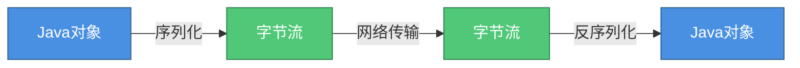
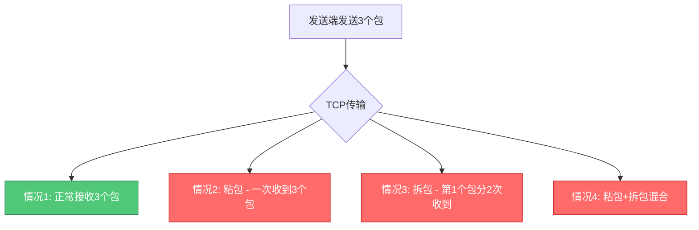
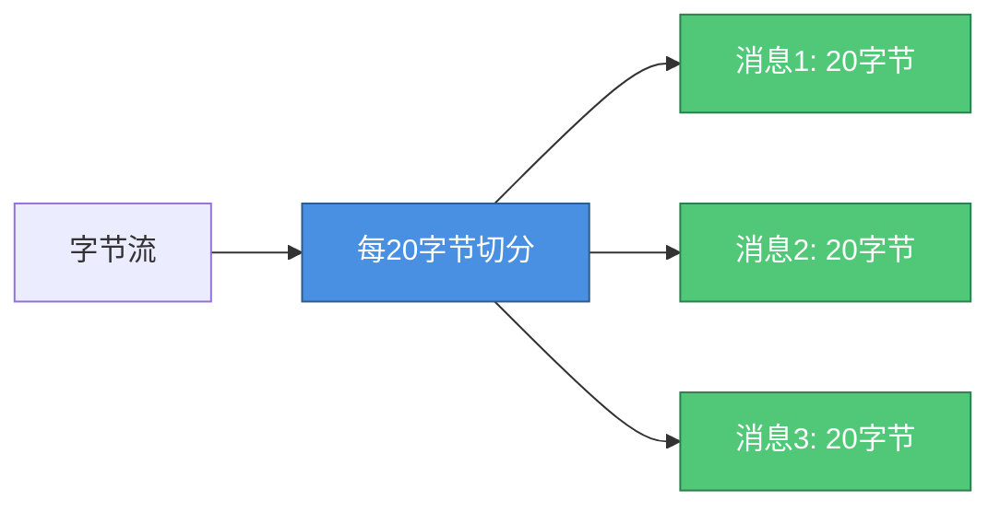
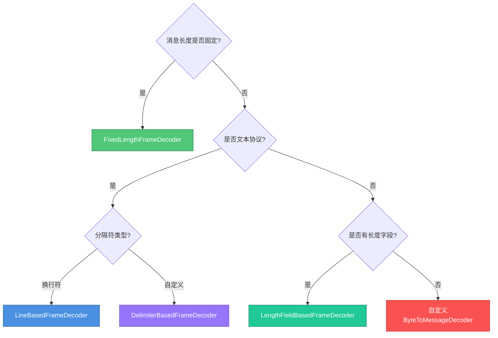

# Netty序列化与粘包拆包处理

## 序列化在网络通信中的作用

在分布式系统中,数据需要通过网络在不同节点间传输。由于网络只能传输字节流,因此必须将对象序列化为字节序列,接收端再反序列化还原为对象。

序列化协议的选择直接影响系统的性能、可维护性和扩展性。



## Netty支持的序列化协议

Netty作为通用网络框架,内置了对多种主流序列化协议的支持,开发者可根据业务需求灵活选择。

### Java原生序列化

Java原生序列化通过实现Serializable接口实现,使用简单但存在明显缺陷。

**优点**:
- 使用简单,只需实现Serializable接口
- 无需引入第三方依赖

**缺点**:
- 序列化后字节数较大,网络传输效率低
- 序列化和反序列化性能差
- 不支持跨语言调用
- 安全性问题(可能触发任意代码执行)

**应用场景**: 仅适合Java内部简单对象传输,生产环境不推荐使用。

### JSON序列化

JSON是轻量级的文本格式数据交换协议,具有良好的可读性和跨语言特性。

**优点**:
- 文本格式,易于阅读和调试
- 跨语言支持好,前后端通用
- 社区活跃,工具库丰富(Jackson、Fastjson、Gson等)

**缺点**:
- 文本格式导致数据体积较大
- 序列化性能不如二进制协议
- 不支持复杂数据类型(如循环引用)

**Netty集成示例**:

```java
// 使用Jackson进行JSON序列化
pipeline.addLast(new StringDecoder(CharsetUtil.UTF_8));
pipeline.addLast(new StringEncoder(CharsetUtil.UTF_8));
pipeline.addLast(new JsonObjectDecoder());
pipeline.addLast(new OrderJsonHandler());
```

**应用场景**: HTTP API、前后端分离项目、对可读性要求高的场景。

### XML序列化

XML是早期流行的数据交换格式,现已逐渐被JSON取代。

**优点**:
- 支持复杂数据结构
- 可读性好,支持schema验证
- 跨语言支持

**缺点**:
- 数据冗余严重,体积极大
- 解析性能低
- 配置复杂

**Netty支持库**: JAXB、XStream等

**应用场景**: 遗留系统集成、配置文件、SOAP协议等特定场景。

### Protobuf序列化

Protobuf(Protocol Buffers)是Google开源的高效二进制序列化协议,是Netty推荐的首选方案。

**优点**:
- 序列化后体积极小(比JSON小60%-80%)
- 序列化速度极快(比JSON快5-10倍)
- 支持向前向后兼容
- 跨语言支持广泛
- 强类型校验,避免类型错误

**缺点**:
- 需要预定义.proto文件
- 二进制格式不可读
- 学习成本较高

**定义消息格式**:

```protobuf
syntax = "proto3";

package com.example;

message PaymentRequest {
    string transactionId = 1;
    int64 userId = 2;
    int32 amount = 3;
    string currency = 4;
    int64 timestamp = 5;
}

message PaymentResponse {
    string transactionId = 1;
    bool success = 2;
    string message = 3;
}
```

**Netty Pipeline配置**:

```java
ChannelPipeline pipeline = channel.pipeline();

// 添加Protobuf解码器
pipeline.addLast(new ProtobufVarint32FrameDecoder());
pipeline.addLast(new ProtobufDecoder(PaymentRequest.getDefaultInstance()));

// 添加Protobuf编码器
pipeline.addLast(new ProtobufVarint32LengthFieldPrepender());
pipeline.addLast(new ProtobufEncoder());

// 业务处理器
pipeline.addLast(new PaymentServiceHandler());
```

**应用场景**: 高性能RPC框架(如gRPC)、微服务间通信、实时数据传输。

### Thrift序列化

Apache Thrift也是高效的跨语言序列化协议,由Facebook开源。

**优点**:
- 序列化性能接近Protobuf
- 同时提供序列化和RPC框架
- 支持多种编程语言
- 数据体积小

**缺点**:
- 学习曲线陡峭
- 生成代码较复杂
- 社区活跃度不如Protobuf

**应用场景**: 大型分布式系统、跨语言微服务架构。

### 序列化协议性能对比

| 协议 | 序列化速度 | 反序列化速度 | 数据大小 | 可读性 | 跨语言 | 推荐指数 |
|------|----------|------------|---------|--------|--------|---------|
| Protobuf | ⭐⭐⭐⭐⭐ | ⭐⭐⭐⭐⭐ | ⭐⭐⭐⭐⭐ | ⭐ | ⭐⭐⭐⭐⭐ | ⭐⭐⭐⭐⭐ |
| Thrift | ⭐⭐⭐⭐⭐ | ⭐⭐⭐⭐⭐ | ⭐⭐⭐⭐⭐ | ⭐ | ⭐⭐⭐⭐⭐ | ⭐⭐⭐⭐ |
| JSON | ⭐⭐⭐ | ⭐⭐⭐ | ⭐⭐ | ⭐⭐⭐⭐⭐ | ⭐⭐⭐⭐⭐ | ⭐⭐⭐⭐ |
| XML | ⭐⭐ | ⭐ | ⭐ | ⭐⭐⭐⭐ | ⭐⭐⭐⭐⭐ | ⭐⭐ |
| Java原生 | ⭐ | ⭐ | ⭐ | ⭐ | ⭐ | ⭐ |

## TCP粘包拆包问题

TCP是面向字节流的协议,不会保持消息边界。发送端连续发送多个数据包时,接收端可能一次性接收到多个包(粘包),或者一个包被分多次接收(拆包)。

### 粘包拆包产生原因



**主要原因**:
1. 应用层写入速度快于TCP发送速度,多个包合并发送
2. TCP的Nagle算法会合并小包提高效率
3. 接收端读取速度慢于网络到达速度
4. MSS/MTU限制导致包被拆分

### Netty的解决方案

Netty通过预定义的编解码器,按照约定的规则解析数据流,从根本上解决粘包拆包问题。

## 定长解码器

FixedLengthFrameDecoder按照固定长度切分数据流,适合消息长度固定的场景。

**工作原理**:



**使用示例**:

```java
// 每条指令固定32字节
pipeline.addLast(new FixedLengthFrameDecoder(32));
pipeline.addLast(new CommandDecoder());
pipeline.addLast(new CommandHandler());
```

**应用场景**: 固定格式的指令协议、硬件设备通信。

## 行分隔符解码器

LineBasedFrameDecoder根据换行符(\n或\r\n)分割消息,适合文本协议。

**工作原理**:

```
消息1\n消息2\r\n消息3\n
  ↓
[消息1] [消息2] [消息3]
```

**使用示例**:

```java
// 单行最大长度1024字节
pipeline.addLast(new LineBasedFrameDecoder(1024));
pipeline.addLast(new StringDecoder(CharsetUtil.UTF_8));
pipeline.addLast(new TextMessageHandler());
```

**应用场景**: 日志传输、简单文本协议、Telnet命令。

## 自定义分隔符解码器

DelimiterBasedFrameDecoder支持自定义分隔符,提供更灵活的解析能力。

**使用示例**:

```java
// 使用 | 作为消息分隔符
ByteBuf delimiter = Unpooled.copiedBuffer("|".getBytes());
pipeline.addLast(new DelimiterBasedFrameDecoder(8192, delimiter));
pipeline.addLast(new StringDecoder(CharsetUtil.UTF_8));
pipeline.addLast(new CustomProtocolHandler());
```

**应用场景**: 自定义文本协议、CSV数据传输。

## 长度字段解码器

LengthFieldBasedFrameDecoder是最强大和灵活的解码器,通过消息头部的长度字段确定消息边界。

### 协议格式设计

```
+--------+----------+-----------+
| Length |  Header  |   Body    |
| 4字节  |  N字节   |  M字节    |
+--------+----------+-----------+
```

**参数说明**:

- **maxFrameLength**: 最大帧长度
- **lengthFieldOffset**: 长度字段起始位置
- **lengthFieldLength**: 长度字段占用字节数
- **lengthAdjustment**: 长度调整值
- **initialBytesToStrip**: 跳过的字节数

### 典型应用示例

**场景1: 长度字段在消息开头**

```
+--------+-----------+
| Length |   Body    |
| 4字节  |  N字节    |
+--------+-----------+
```

```java
pipeline.addLast(new LengthFieldBasedFrameDecoder(
    65536,  // 最大帧长度64KB
    0,      // 长度字段从第0字节开始
    4,      // 长度字段占4字节
    0,      // 长度值不包含其他字段
    4));    // 解码后跳过长度字段
```

**场景2: 长度字段前有协议头**

```
+--------+--------+-----------+
| Magic  | Length |   Body    |
| 2字节  | 4字节  |  N字节    |
+--------+--------+-----------+
```

```java
pipeline.addLast(new LengthFieldBasedFrameDecoder(
    65536,  // 最大帧长度
    2,      // 长度字段从第2字节开始
    4,      // 长度字段占4字节
    0,      // 长度值仅表示Body长度
    6));    // 跳过Magic+Length共6字节
```

**场景3: 长度值包含整个消息**

```java
pipeline.addLast(new LengthFieldBasedFrameDecoder(
    65536,
    0,
    4,
    -4,     // 长度值包含了自身4字节,需要减去
    0));
```

### 完整使用示例

```java
public class ProtocolServerInitializer extends ChannelInitializer<SocketChannel> {
    @Override
    protected void initChannel(SocketChannel ch) {
        ChannelPipeline pipeline = ch.pipeline();
        
        // 解码器:根据长度字段解析
        pipeline.addLast(new LengthFieldBasedFrameDecoder(
            1024 * 1024,  // 最大1MB
            0, 4, 0, 4));
        
        // 编码器:发送前添加长度字段
        pipeline.addLast(new LengthFieldPrepender(4));
        
        // 业务处理
        pipeline.addLast(new MessageDecoder());
        pipeline.addLast(new MessageEncoder());
        pipeline.addLast(new BusinessHandler());
    }
}
```

## 自定义解码器

对于复杂协议,可以继承ByteToMessageDecoder实现自定义解码逻辑。

**自定义协议格式**:

```
+------+------+--------+------+
| 0xAB | Type | Length | Data |
| 魔数 | 类型 | 长度   | 数据 |
| 1字节| 1字节| 2字节  | N字节|
+------+------+--------+------+
```

**解码器实现**:

```java
public class CustomProtocolDecoder extends ByteToMessageDecoder {
    
    private static final byte MAGIC_NUMBER = (byte) 0xAB;
    private static final int HEADER_LENGTH = 4;
    
    @Override
    protected void decode(ChannelHandlerContext ctx, ByteBuf in, List<Object> out) {
        // 可读字节数不足,等待更多数据
        if (in.readableBytes() < HEADER_LENGTH) {
            return;
        }
        
        // 标记当前读位置
        in.markReaderIndex();
        
        // 检查魔数
        byte magic = in.readByte();
        if (magic != MAGIC_NUMBER) {
            ctx.close();  // 非法协议,关闭连接
            return;
        }
        
        // 读取类型和长度
        byte type = in.readByte();
        short length = in.readShort();
        
        // 数据不完整,等待更多数据
        if (in.readableBytes() < length) {
            in.resetReaderIndex();  // 重置读位置
            return;
        }
        
        // 读取实际数据
        byte[] data = new byte[length];
        in.readBytes(data);
        
        // 构造消息对象
        Message message = new Message(type, data);
        out.add(message);
    }
}
```

**Pipeline配置**:

```java
pipeline.addLast(new CustomProtocolDecoder());
pipeline.addLast(new CustomProtocolEncoder());
pipeline.addLast(new CustomBusinessHandler());
```

## 编解码器选择建议



通过合理选择序列化协议和解码器,Netty能够高效处理各种网络协议,为构建高性能分布式系统提供坚实基础。
