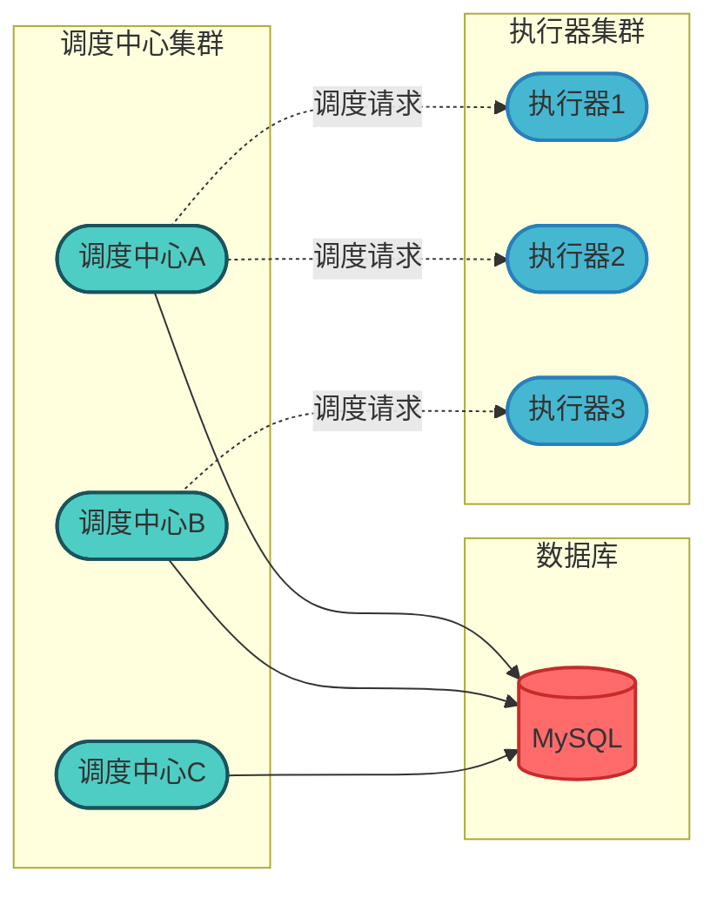
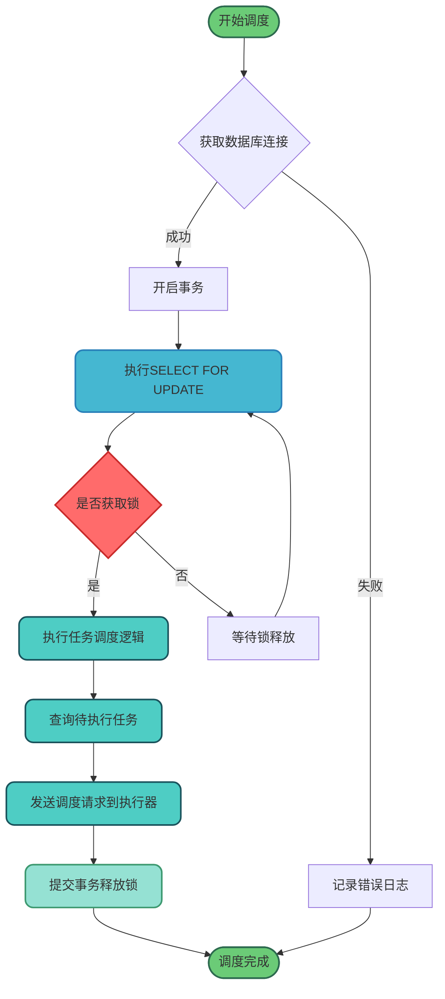
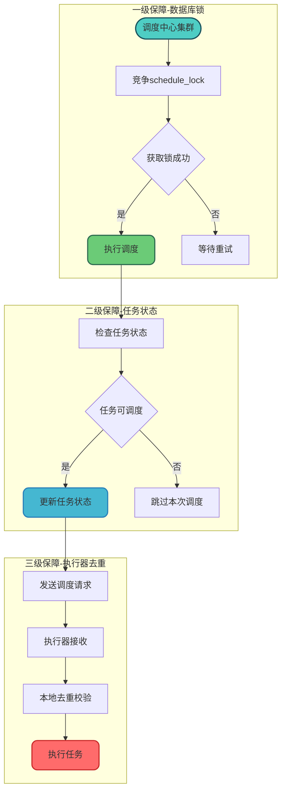
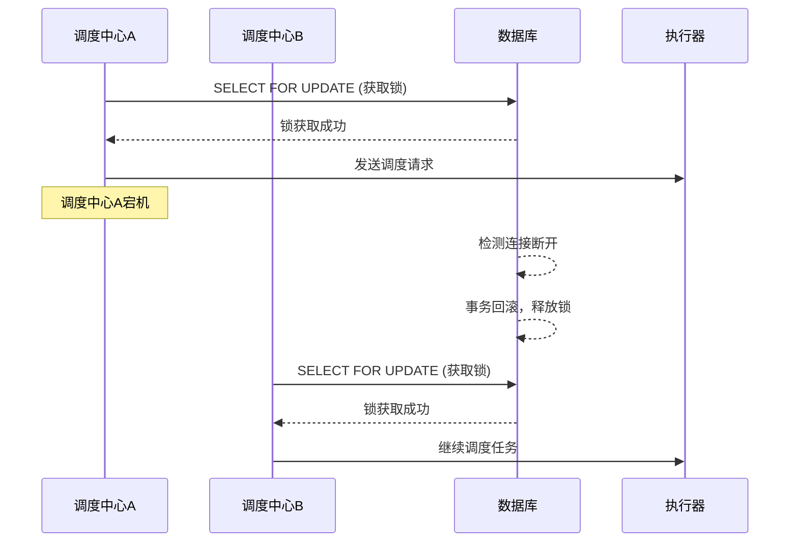

# XXL-JOB调度机制与一致性保障

## 分布式调度的核心挑战

在分布式任务调度场景中，确保同一任务在同一时刻仅被一个执行器执行是至关重要的。特别是在电商订单处理、金融交易结算、库存同步等业务场景中，任务的重复执行可能导致严重的数据不一致问题。

XXL-JOB作为一款轻量级分布式任务调度平台，通过独特的架构设计和锁机制，有效解决了这一难题。

## 调度中心架构设计

### 核心组件职责

XXL-JOB采用调度中心与执行器分离的架构模式，调度中心负责任务的管理和触发调度，执行器负责接收调度请求并执行具体的业务逻辑。



### 调度一致性的实现原理

调度中心通过数据库锁机制来保证集群环境下的调度一致性。当多个调度中心实例同时运行时，只有获取到锁的实例才能执行任务调度操作。

## 数据库锁机制详解

### JobScheduleHelper核心组件

`JobScheduleHelper`是XXL-JOB中负责任务调度的核心组件，它通过数据库悲观锁来确保调度的唯一性和一致性。

### 锁表结构设计

XXL-JOB使用专门的锁表`xxl_job_lock`来实现分布式锁：

```sql
-- 锁表结构
CREATE TABLE `xxl_job_lock` (
  `lock_name` varchar(50) NOT NULL COMMENT '锁名称',
  PRIMARY KEY (`lock_name`)
) ENGINE=InnoDB DEFAULT CHARSET=utf8mb4;

-- 初始化锁记录
INSERT INTO `xxl_job_lock` (`lock_name`) VALUES ('schedule_lock');
```

### 悲观锁加锁流程

调度线程在执行任务调度前，会通过`SELECT ... FOR UPDATE`语句获取排他锁：

```java
/**
 * 商品价格同步任务调度示例
 * 演示调度中心如何通过数据库锁确保任务唯一执行
 */
public class ProductPriceScheduler {
    
    private Connection connection;
    
    public void executeSchedule() {
        PreparedStatement preparedStatement = null;
        try {
            // 开启事务
            connection.setAutoCommit(false);
            
            // 通过FOR UPDATE获取排他锁
            preparedStatement = connection.prepareStatement(
                "SELECT * FROM xxl_job_lock WHERE lock_name = 'schedule_lock' FOR UPDATE"
            );
            preparedStatement.execute();
            
            // 获取锁成功，执行调度逻辑
            doSchedule();
            
        } catch (Exception e) {
            // 异常处理
            rollback();
        } finally {
            // 提交事务释放锁
            commit();
            close(preparedStatement);
        }
    }
    
    private void doSchedule() {
        // 查询待调度的商品价格同步任务
        // 根据CRON表达式计算下次执行时间
        // 选择执行器发送调度请求
    }
}
```

### 锁机制工作流程



## 锁机制的技术细节

### FOR UPDATE的工作原理

`SELECT ... FOR UPDATE`是MySQL中实现行级锁的重要语句，其工作机制如下：

1. **排他性**：当一个事务执行该语句时，会对查询到的记录加排他锁
2. **阻塞等待**：其他事务尝试获取同一记录的锁时会被阻塞
3. **事务绑定**：锁的生命周期与事务绑定，事务提交或回滚后锁自动释放

### 锁的释放时机

在XXL-JOB的实现中，锁的释放发生在调度逻辑执行完成后的finally块中：

```java
/**
 * 库存盘点任务调度器
 * 展示锁释放的完整流程
 */
public class InventoryCheckScheduler {
    
    public void scheduleWithLock() {
        Connection conn = null;
        boolean lockAcquired = false;
        
        try {
            conn = dataSource.getConnection();
            conn.setAutoCommit(false);
            
            // 尝试获取调度锁
            lockAcquired = tryAcquireLock(conn);
            
            if (lockAcquired) {
                // 执行库存盘点任务的调度
                scheduleInventoryTasks();
            }
            
        } catch (Exception e) {
            if (conn != null) {
                conn.rollback();
            }
            throw new ScheduleException("调度失败", e);
        } finally {
            // 无论成功与否，都要提交事务释放锁
            if (conn != null && lockAcquired) {
                conn.commit();
                conn.close();
            }
        }
    }
}
```

## 调度一致性的保障机制

### 多级保障策略

XXL-JOB通过以下多级策略确保调度一致性：



### 调度线程的工作模式

调度中心启动后，会开启专门的调度线程持续扫描待执行的任务：

```java
/**
 * 会员积分结算调度线程
 * 演示调度线程的工作模式
 */
public class PointsSettlementScheduleThread implements Runnable {
    
    private volatile boolean running = true;
    
    @Override
    public void run() {
        while (running) {
            try {
                // 获取分布式锁
                if (acquireScheduleLock()) {
                    // 查询5秒内需要执行的积分结算任务
                    List<SettlementTask> tasks = queryPendingTasks(5000);
                    
                    for (SettlementTask task : tasks) {
                        // 计算触发时间
                        long triggerTime = calculateNextTriggerTime(task);
                        
                        if (triggerTime <= System.currentTimeMillis()) {
                            // 立即触发
                            triggerTask(task);
                        } else {
                            // 放入时间轮等待触发
                            pushToTimeRing(task, triggerTime);
                        }
                    }
                }
            } finally {
                // 释放锁
                releaseScheduleLock();
            }
            
            // 短暂休眠，降低数据库压力
            TimeUnit.MILLISECONDS.sleep(1000);
        }
    }
}
```

## 高可用与容错设计

### 调度中心故障转移

当持有锁的调度中心发生故障时，数据库连接断开会导致事务回滚，锁自动释放，其他调度中心可以立即接管调度工作：



### 锁超时处理

为防止死锁情况，XXL-JOB通过合理的事务超时配置和心跳检测机制来确保锁不会被无限期持有。

## 最佳实践建议

### 调度中心部署建议

1. **集群部署**：建议部署2-3个调度中心实例，确保高可用
2. **数据库优化**：为`xxl_job_lock`表配置适当的连接池参数
3. **网络隔离**：调度中心与数据库之间网络要稳定

### 任务设计原则

1. **幂等性设计**：任务执行逻辑应具备幂等性，即使重复执行也不会产生副作用
2. **超时控制**：合理设置任务执行超时时间
3. **失败重试**：配置合适的重试策略

```java
/**
 * 幂等性任务设计示例
 * 物流状态同步任务
 */
@XxlJob("logisticsSyncHandler")
public void syncLogisticsStatus() {
    // 获取待同步的物流单号
    List<String> trackingNumbers = getUnSyncedTrackingNumbers();
    
    for (String trackingNo : trackingNumbers) {
        try {
            // 查询最新物流状态
            LogisticsInfo info = queryLogisticsApi(trackingNo);
            
            // 幂等更新：只有状态发生变化才更新
            updateIfChanged(trackingNo, info);
            
        } catch (Exception e) {
            // 记录失败，等待下次重试
            logSyncError(trackingNo, e);
        }
    }
}
```

## 总结

XXL-JOB通过数据库悲观锁机制实现了分布式环境下的调度一致性保障：

- **核心原理**：利用`SELECT ... FOR UPDATE`获取排他锁，确保同一时刻只有一个调度中心执行调度
- **锁表设计**：专用的`xxl_job_lock`表存储锁记录，简洁高效
- **容错机制**：事务超时和连接断开后锁自动释放，保证系统可用性
- **多级保障**：数据库锁、任务状态校验、执行器去重形成完整的一致性保障链

这种设计方案在保证调度准确性的同时，也兼顾了系统的简洁性和可维护性，是分布式任务调度领域的经典实践。
