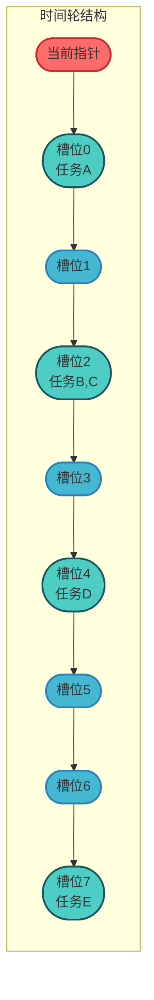
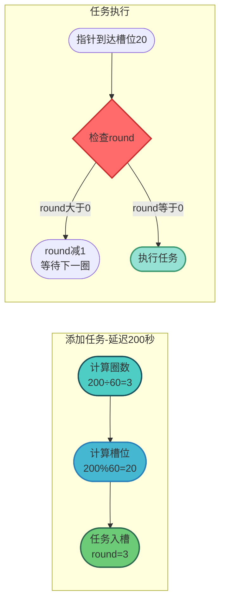
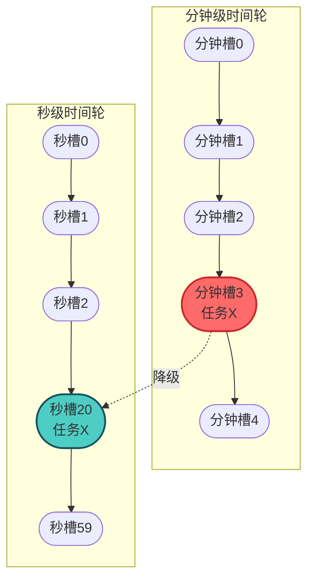
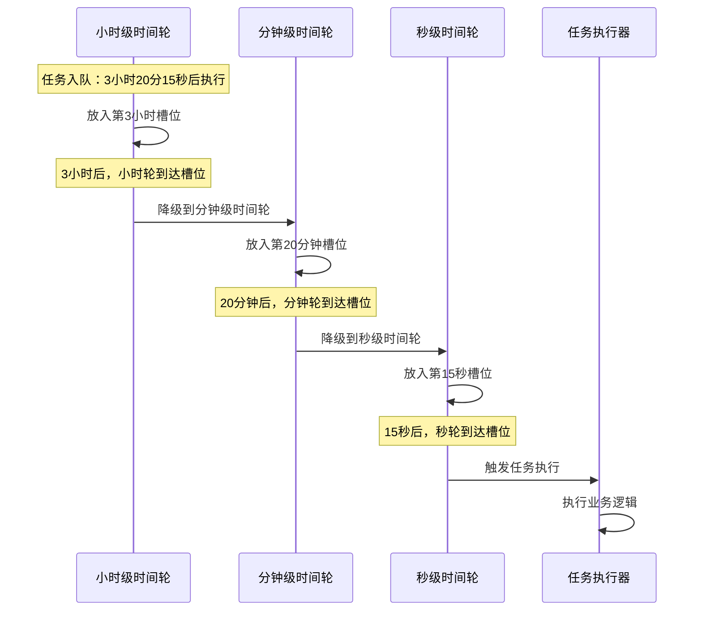
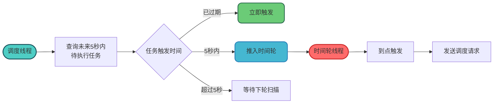

# XXL-JOB时间轮算法详解

## 时间轮算法概述

时间轮算法（Time Wheel Algorithm）是一种高效的定时任务调度算法，广泛应用于各类需要处理大量定时任务的系统中。XXL-JOB从7.28版本开始，将底层调度引擎从Quartz替换为基于时间轮的自研调度器，大幅提升了调度性能。

### 为什么选择时间轮

传统的定时任务实现方式（如优先级队列）在任务量大时存在性能瓶颈，而时间轮算法通过空间换时间的策略，将任务的插入和删除操作的时间复杂度降低到O(1)。

## 时间轮的基本原理

### 轮盘结构设计

时间轮的核心思想是将时间划分为固定数量的时间槽（slot），每个槽位代表一个固定的时间间隔。如同钟表的表盘一样，指针随时间推进，依次扫描各个槽位。



### 任务调度流程

当需要调度一个延迟任务时，系统会根据延迟时间计算出该任务应该放置在哪个槽位：

```java
/**
 * 航班延误通知任务调度器
 * 演示时间轮的基本工作原理
 */
public class FlightDelayNotificationScheduler {
    
    // 时间轮槽位数量，60个槽位代表60秒
    private static final int SLOT_COUNT = 60;
    
    // 时间轮数组，每个槽位存储一个任务链表
    private List<List<NotificationTask>> timeWheel;
    
    // 当前指针位置
    private volatile int currentSlot = 0;
    
    public FlightDelayNotificationScheduler() {
        timeWheel = new ArrayList<>(SLOT_COUNT);
        for (int i = 0; i < SLOT_COUNT; i++) {
            timeWheel.add(new CopyOnWriteArrayList<>());
        }
    }
    
    /**
     * 添加延迟通知任务
     * @param task 通知任务
     * @param delaySeconds 延迟秒数
     */
    public void addTask(NotificationTask task, int delaySeconds) {
        // 计算目标槽位
        int targetSlot = (currentSlot + delaySeconds) % SLOT_COUNT;
        
        // 将任务添加到对应槽位
        timeWheel.get(targetSlot).add(task);
        
        System.out.println("航班通知任务已加入槽位: " + targetSlot);
    }
}
```

### 指针推进与任务触发

时间轮需要一个独立的线程负责推进指针，并在到达每个槽位时触发该槽位上的所有任务：

```java
/**
 * 时间轮指针推进线程
 */
public class TimeWheelTicker implements Runnable {
    
    private final FlightDelayNotificationScheduler scheduler;
    private final ExecutorService taskExecutor;
    private volatile boolean running = true;
    
    @Override
    public void run() {
        while (running) {
            try {
                // 每秒推进一次
                TimeUnit.SECONDS.sleep(1);
                
                // 推进指针
                scheduler.advanceSlot();
                
                // 获取当前槽位的任务列表
                List<NotificationTask> tasks = scheduler.getCurrentSlotTasks();
                
                // 异步执行任务
                for (NotificationTask task : tasks) {
                    taskExecutor.submit(() -> {
                        task.sendNotification();
                    });
                }
                
                // 清空已执行的任务
                scheduler.clearCurrentSlot();
                
            } catch (InterruptedException e) {
                Thread.currentThread().interrupt();
                break;
            }
        }
    }
}
```

## 时间轮的扩展方案

### 基础时间轮的局限性

简单的单层时间轮存在一个明显的问题：能够支持的最大延迟时间受限于槽位数量。例如60个槽位、每槽1秒的时间轮，最多只能支持60秒内的延迟任务。

### 方案一：Round计数法

通过在任务上增加一个round字段来记录需要轮转的圈数，可以突破槽位数量的限制：



```java
/**
 * 带Round计数的订阅续费提醒任务
 */
public class SubscriptionReminderTask {
    
    private String userId;
    private String subscriptionType;
    private int round;  // 剩余圈数
    private Runnable action;
    
    /**
     * 添加延迟提醒任务
     * @param delaySeconds 延迟秒数
     */
    public int calculateSlotAndRound(int delaySeconds, int slotCount) {
        // 计算需要的圈数
        this.round = delaySeconds / slotCount;
        
        // 计算目标槽位
        int currentSlot = getCurrentSlot();
        return (currentSlot + delaySeconds % slotCount) % slotCount;
    }
    
    /**
     * 检查是否可以执行
     */
    public boolean canExecute() {
        if (round > 0) {
            round--;
            return false;
        }
        return true;
    }
}
```

**Round计数法的缺点**：每次指针推进时，需要遍历当前槽位的所有任务来检查round值，当任务量大时效率较低。

### 方案二：分层时间轮

分层时间轮是解决上述问题的优雅方案，通过构建多层不同粒度的时间轮，实现高效的大跨度延迟调度。



### 分层时间轮工作机制

```java
/**
 * 分层时间轮调度器
 * 优惠券过期提醒场景
 */
public class HierarchicalTimeWheel {
    
    // 秒级时间轮：60个槽位，每槽1秒
    private TimeWheel secondWheel;
    
    // 分钟级时间轮：60个槽位，每槽1分钟
    private TimeWheel minuteWheel;
    
    // 小时级时间轮：24个槽位，每槽1小时
    private TimeWheel hourWheel;
    
    public HierarchicalTimeWheel() {
        secondWheel = new TimeWheel(60, 1000);      // 1秒/槽
        minuteWheel = new TimeWheel(60, 60000);     // 1分钟/槽
        hourWheel = new TimeWheel(24, 3600000);     // 1小时/槽
    }
    
    /**
     * 添加优惠券过期提醒任务
     * @param couponId 优惠券ID
     * @param expireTime 过期时间
     */
    public void addCouponExpireReminder(String couponId, long expireTime) {
        long delay = expireTime - System.currentTimeMillis();
        CouponTask task = new CouponTask(couponId);
        
        if (delay < 60000) {
            // 1分钟内，放入秒级时间轮
            int slot = (int) (delay / 1000);
            secondWheel.addTask(task, slot);
            
        } else if (delay < 3600000) {
            // 1小时内，放入分钟级时间轮
            int slot = (int) (delay / 60000);
            minuteWheel.addTask(task, slot);
            
        } else {
            // 超过1小时，放入小时级时间轮
            int slot = (int) (delay / 3600000);
            hourWheel.addTask(task, slot);
        }
    }
    
    /**
     * 分钟级时间轮到期时，将任务降级到秒级时间轮
     */
    public void cascadeMinuteToSecond() {
        List<CouponTask> tasks = minuteWheel.getCurrentSlotTasks();
        for (CouponTask task : tasks) {
            // 重新计算在秒级时间轮中的位置
            long remainingMs = task.getExpireTime() - System.currentTimeMillis();
            int slot = (int) (remainingMs / 1000) % 60;
            secondWheel.addTask(task, slot);
        }
    }
}
```

### 任务降级流程



## XXL-JOB中的时间轮实现

### 调度核心组件

XXL-JOB使用时间轮来管理即将触发的任务，主要实现在`JobScheduleHelper`中：

```java
/**
 * XXL-JOB时间轮实现示例
 * 基于短信营销任务场景
 */
public class MarketingTimeRingHelper {
    
    // 时间轮：key为秒数(0-59)，value为该秒需要触发的任务ID列表
    private volatile Map<Integer, List<Long>> timeRing = 
        new ConcurrentHashMap<>();
    
    /**
     * 将任务推入时间轮
     * @param ringSecond 目标秒数
     * @param taskId 任务ID
     */
    public void pushTimeRing(int ringSecond, long taskId) {
        List<Long> taskList = timeRing.computeIfAbsent(
            ringSecond, 
            k -> new CopyOnWriteArrayList<>()
        );
        taskList.add(taskId);
    }
    
    /**
     * 时间轮触发线程
     */
    public void startRingThread() {
        Thread ringThread = new Thread(() -> {
            while (running) {
                try {
                    // 对齐到整秒
                    TimeUnit.MILLISECONDS.sleep(
                        1000 - System.currentTimeMillis() % 1000
                    );
                    
                    // 获取当前秒数
                    int nowSecond = Calendar.getInstance().get(Calendar.SECOND);
                    
                    // 处理前一秒可能遗漏的任务
                    int prevSecond = (nowSecond + 59) % 60;
                    
                    // 触发任务
                    triggerTasks(prevSecond);
                    triggerTasks(nowSecond);
                    
                } catch (Exception e) {
                    log.error("时间轮触发异常", e);
                }
            }
        });
        ringThread.setName("marketing-time-ring");
        ringThread.setDaemon(true);
        ringThread.start();
    }
    
    private void triggerTasks(int second) {
        List<Long> taskIds = timeRing.remove(second);
        if (taskIds != null && !taskIds.isEmpty()) {
            for (Long taskId : taskIds) {
                // 异步触发任务执行
                triggerExecutor.execute(() -> executeTask(taskId));
            }
        }
    }
}
```

### 预读机制

XXL-JOB会提前从数据库读取即将执行的任务，并推入时间轮等待触发：



## 时间轮的典型应用场景

### 框架层面的应用

时间轮算法在众多知名框架中都有应用：

| 框架/组件 | 应用场景 | 说明 |
|-----------|----------|------|
| Netty | 连接超时检测 | HashedWheelTimer实现 |
| Kafka | 延迟消息处理 | 分层时间轮 |
| Akka | Actor消息调度 | 高性能定时器 |
| Dubbo | 心跳检测 | 连接状态管理 |
| XXL-JOB | 任务调度 | 替代Quartz |

### 业务场景应用

```java
/**
 * 直播间礼物特效消失调度
 * 基于时间轮实现的场景示例
 */
@Component
public class LiveGiftEffectScheduler {
    
    private final TimeWheel effectTimeWheel;
    
    /**
     * 用户发送礼物时调用
     * @param roomId 直播间ID
     * @param giftId 礼物ID
     * @param duration 特效持续时间（毫秒）
     */
    public void scheduleEffectDisappear(String roomId, String giftId, long duration) {
        GiftEffectTask task = new GiftEffectTask(roomId, giftId);
        
        // 计算消失时间
        long disappearTime = System.currentTimeMillis() + duration;
        
        // 加入时间轮
        effectTimeWheel.schedule(task, disappearTime);
    }
    
    /**
     * 特效消失任务
     */
    private class GiftEffectTask implements Runnable {
        private String roomId;
        private String giftId;
        
        @Override
        public void run() {
            // 通知前端移除礼物特效
            webSocketService.sendMessage(roomId, 
                new GiftEffectRemoveEvent(giftId));
        }
    }
}
```

## 时间轮的优缺点分析

### 优点

1. **高效的时间复杂度**：任务的添加和删除都是O(1)
2. **内存友好**：相比优先级队列，不需要频繁的堆调整
3. **批量处理能力**：同一槽位的任务可以批量触发
4. **可扩展性强**：通过分层设计可以支持任意长度的延迟

### 缺点

1. **精度限制**：精度取决于槽位的时间间隔
2. **空间占用**：需要预先分配槽位数组
3. **实现复杂度**：分层时间轮的实现相对复杂

## 总结

时间轮算法通过巧妙的数据结构设计，将定时任务调度的时间复杂度降至O(1)，是处理大规模定时任务的理想选择。XXL-JOB采用时间轮替代Quartz后，调度性能得到显著提升，能够更好地支撑高并发的任务调度场景。

核心要点：
- **基础原理**：环形数组 + 指针推进 + 任务链表
- **扩展方案**：Round计数法适合简单场景，分层时间轮适合大跨度延迟
- **实现关键**：预读机制、对齐整秒触发、异步任务执行
