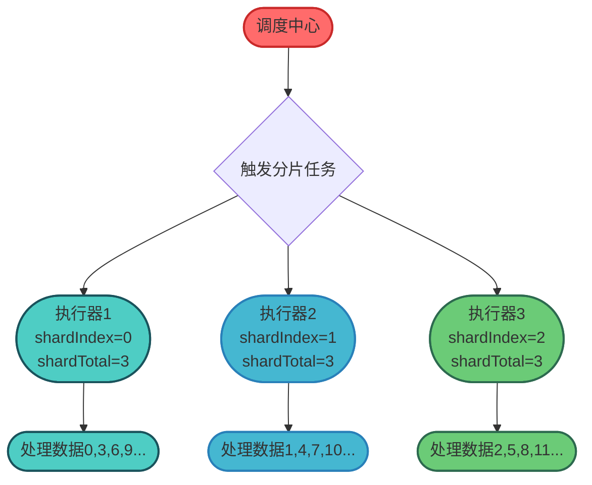
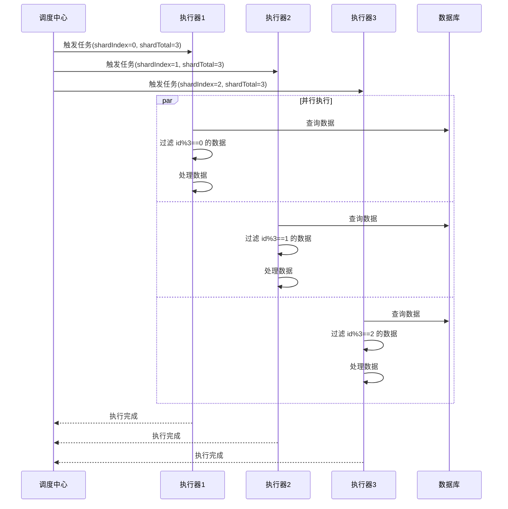
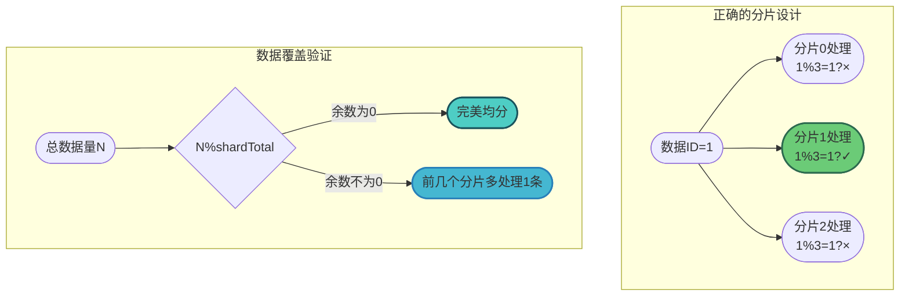
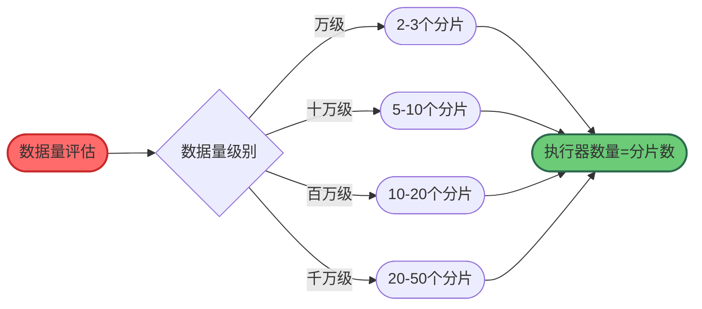

# XXL-JOB分片任务与并行调度

## 分片任务的背景与价值

在实际业务场景中，经常会遇到需要处理大量数据的定时任务，例如：每日对账、批量发送通知、数据清洗等。如果这些任务只在单个执行器上运行，可能需要很长时间才能完成，无法满足业务的时效性要求。

XXL-JOB的分片任务功能允许将一个大任务拆分成多个子任务，分配给不同的执行器并行处理，从而大幅提升任务执行效率。

## 分片任务的核心原理

### 分片参数传递机制

当调度中心触发分片任务时，会向每个执行器实例传递两个关键参数：

- **分片索引（shardIndex）**：当前执行器的编号，从0开始
- **分片总数（shardTotal）**：参与执行的执行器总数



### 路由策略配置

在XXL-JOB管理后台配置任务时，需要将路由策略设置为"分片广播"，这样调度中心会将任务广播到所有在线的执行器实例。

## 分片任务实现详解

### 基于取模的数据分片

最常用的分片策略是对数据的唯一标识（如ID）进行取模运算，确保数据被均匀分配到各个执行器：

```java
/**
 * 商品库存同步任务
 * 演示基于商品ID取模的分片处理
 */
@Component
public class ProductStockSyncHandler {
    
    @Autowired
    private ProductService productService;
    
    @Autowired
    private InventoryService inventoryService;
    
    @XxlJob("productStockSyncHandler")
    public void syncProductStock() {
        // 获取分片参数
        int shardIndex = XxlJobHelper.getShardIndex();
        int shardTotal = XxlJobHelper.getShardTotal();
        
        XxlJobHelper.log("分片参数: 当前分片={}, 总分片数={}", 
            shardIndex, shardTotal);
        
        // 分页查询待同步的商品
        int pageSize = 500;
        int pageNum = 0;
        
        while (true) {
            List<Product> products = productService.queryProducts(pageNum, pageSize);
            
            if (products.isEmpty()) {
                break;
            }
            
            for (Product product : products) {
                // 通过商品ID取模判断是否由当前分片处理
                if (product.getId() % shardTotal == shardIndex) {
                    try {
                        // 同步商品库存到缓存
                        syncToCache(product);
                        XxlJobHelper.log("同步成功: 商品ID={}", product.getId());
                    } catch (Exception e) {
                        XxlJobHelper.log("同步失败: 商品ID={}, 错误={}", 
                            product.getId(), e.getMessage());
                    }
                }
            }
            
            pageNum++;
        }
        
        XxlJobHelper.log("分片{}处理完成", shardIndex);
    }
    
    private void syncToCache(Product product) {
        // 查询实时库存
        Integer stock = inventoryService.getStock(product.getId());
        // 更新缓存
        redisTemplate.opsForValue().set(
            "stock:" + product.getId(), 
            stock, 
            Duration.ofMinutes(30)
        );
    }
}
```

### 分片执行流程



## 高级分片策略

### 基于数据库分片查询

直接在数据库查询时进行分片过滤，避免查询全量数据：

```java
/**
 * 会员积分过期清理任务
 * 基于数据库分片查询的高效实现
 */
@Component
public class MemberPointsExpireHandler {
    
    @Autowired
    private MemberPointsMapper memberPointsMapper;
    
    @XxlJob("memberPointsExpireHandler")
    public void clearExpiredPoints() {
        int shardIndex = XxlJobHelper.getShardIndex();
        int shardTotal = XxlJobHelper.getShardTotal();
        
        // 查询当前分片负责的过期积分记录
        // SQL: WHERE member_id % #{shardTotal} = #{shardIndex} 
        //      AND expire_time < NOW()
        List<MemberPoints> expiredPoints = memberPointsMapper.queryExpiredBySharding(
            shardIndex, 
            shardTotal,
            LocalDateTime.now()
        );
        
        XxlJobHelper.log("当前分片查询到{}条过期积分记录", expiredPoints.size());
        
        for (MemberPoints points : expiredPoints) {
            try {
                // 记录积分变动日志
                logPointsChange(points);
                
                // 清零过期积分
                memberPointsMapper.clearExpiredPoints(points.getId());
                
                // 发送过期通知
                sendExpireNotification(points.getMemberId());
                
            } catch (Exception e) {
                XxlJobHelper.log("处理失败: 记录ID={}, 错误={}", 
                    points.getId(), e.getMessage());
            }
        }
    }
}
```

对应的Mapper查询：

```java
/**
 * 会员积分Mapper
 */
@Mapper
public interface MemberPointsMapper {
    
    /**
     * 按分片查询过期积分
     */
    @Select("SELECT * FROM member_points " +
            "WHERE member_id % #{shardTotal} = #{shardIndex} " +
            "AND expire_time < #{expireTime} " +
            "AND status = 'ACTIVE'")
    List<MemberPoints> queryExpiredBySharding(
        @Param("shardIndex") int shardIndex,
        @Param("shardTotal") int shardTotal,
        @Param("expireTime") LocalDateTime expireTime
    );
}
```

### 基于业务规则的分片

根据业务特性设计分片规则，实现更灵活的任务分配：

```java
/**
 * 多地区物流状态同步任务
 * 基于地区编码的业务分片
 */
@Component
public class RegionalLogisticsSyncHandler {
    
    // 地区编码与分片的映射
    private static final Map<String, Integer> REGION_SHARD_MAP = new HashMap<>();
    
    static {
        // 华东地区 -> 分片0
        REGION_SHARD_MAP.put("SH", 0);
        REGION_SHARD_MAP.put("JS", 0);
        REGION_SHARD_MAP.put("ZJ", 0);
        
        // 华北地区 -> 分片1
        REGION_SHARD_MAP.put("BJ", 1);
        REGION_SHARD_MAP.put("TJ", 1);
        REGION_SHARD_MAP.put("HB", 1);
        
        // 华南地区 -> 分片2
        REGION_SHARD_MAP.put("GD", 2);
        REGION_SHARD_MAP.put("GX", 2);
        REGION_SHARD_MAP.put("HN", 2);
    }
    
    @XxlJob("regionalLogisticsSyncHandler")
    public void syncLogisticsStatus() {
        int shardIndex = XxlJobHelper.getShardIndex();
        int shardTotal = XxlJobHelper.getShardTotal();
        
        // 获取当前分片负责的地区
        List<String> myRegions = REGION_SHARD_MAP.entrySet().stream()
            .filter(entry -> entry.getValue() == shardIndex)
            .map(Map.Entry::getKey)
            .collect(Collectors.toList());
        
        XxlJobHelper.log("分片{}负责的地区: {}", shardIndex, myRegions);
        
        for (String regionCode : myRegions) {
            syncRegionLogistics(regionCode);
        }
    }
    
    private void syncRegionLogistics(String regionCode) {
        // 查询该地区的待更新物流单
        List<LogisticsOrder> orders = logisticsService.queryByRegion(regionCode);
        
        for (LogisticsOrder order : orders) {
            // 调用物流API查询最新状态
            LogisticsStatus status = logisticsApi.queryStatus(order.getTrackingNo());
            
            // 更新物流状态
            logisticsService.updateStatus(order.getId(), status);
        }
    }
}
```

## 分片任务的数据一致性保障

### 避免数据遗漏与重复

在分片任务中，必须确保每条数据恰好被一个执行器处理：



### 处理执行器动态扩缩容

当执行器数量发生变化时，需要注意分片参数的变化：

```java
/**
 * 消息推送任务
 * 处理执行器扩缩容场景
 */
@Component
public class MessagePushHandler {
    
    @XxlJob("messagePushHandler")
    public void pushMessages() {
        int shardIndex = XxlJobHelper.getShardIndex();
        int shardTotal = XxlJobHelper.getShardTotal();
        
        // 记录本次执行的分片配置
        XxlJobHelper.log("本次执行分片配置: index={}, total={}", 
            shardIndex, shardTotal);
        
        // 使用数据库记录处理进度，支持断点续传
        String progressKey = "message_push_progress_" + shardIndex + "_" + shardTotal;
        Long lastProcessedId = getProgress(progressKey);
        
        while (true) {
            // 查询待推送消息（增量查询）
            List<PushMessage> messages = messageMapper.queryUnpushed(
                shardIndex, 
                shardTotal,
                lastProcessedId,
                1000  // 每批处理1000条
            );
            
            if (messages.isEmpty()) {
                break;
            }
            
            for (PushMessage message : messages) {
                // 推送消息
                pushService.push(message);
                lastProcessedId = message.getId();
            }
            
            // 更新处理进度
            saveProgress(progressKey, lastProcessedId);
        }
    }
}
```

## 分片任务最佳实践

### 分片数量规划



### 任务幂等性设计

分片任务应当设计为幂等操作，即使同一数据被重复处理也不会产生副作用：

```java
/**
 * 账户余额对账任务
 * 幂等性设计示例
 */
@Component
public class AccountReconciliationHandler {
    
    @Autowired
    private ReconciliationService reconciliationService;
    
    @XxlJob("accountReconciliationHandler")
    public void reconcile() {
        int shardIndex = XxlJobHelper.getShardIndex();
        int shardTotal = XxlJobHelper.getShardTotal();
        
        // 获取今日对账批次号
        String batchNo = generateDailyBatchNo();
        
        List<Account> accounts = accountMapper.queryBySharding(shardIndex, shardTotal);
        
        for (Account account : accounts) {
            // 幂等检查：判断该账户今日是否已对账
            if (reconciliationService.isReconciled(account.getId(), batchNo)) {
                XxlJobHelper.log("账户{}今日已对账，跳过", account.getId());
                continue;
            }
            
            try {
                // 执行对账逻辑
                ReconciliationResult result = doReconcile(account);
                
                // 记录对账结果（包含批次号，保证幂等）
                reconciliationService.saveResult(account.getId(), batchNo, result);
                
            } catch (Exception e) {
                XxlJobHelper.log("账户{}对账失败: {}", account.getId(), e.getMessage());
            }
        }
    }
    
    private String generateDailyBatchNo() {
        return "RECON_" + LocalDate.now().format(DateTimeFormatter.BASIC_ISO_DATE);
    }
}
```

### 异常处理与告警

```java
/**
 * 分片任务异常处理模板
 */
@Component
public class ShardingTaskTemplate {
    
    @Autowired
    private AlertService alertService;
    
    public void executeWithMonitoring(ShardingTask task) {
        int shardIndex = XxlJobHelper.getShardIndex();
        int shardTotal = XxlJobHelper.getShardTotal();
        
        long startTime = System.currentTimeMillis();
        int successCount = 0;
        int failCount = 0;
        List<String> errors = new ArrayList<>();
        
        try {
            // 执行分片任务
            ShardingResult result = task.execute(shardIndex, shardTotal);
            successCount = result.getSuccessCount();
            failCount = result.getFailCount();
            errors = result.getErrors();
            
        } catch (Exception e) {
            // 任务整体异常
            alertService.sendAlert(
                "分片任务执行异常",
                String.format("分片%d/%d执行失败: %s", shardIndex, shardTotal, e.getMessage())
            );
            throw e;
            
        } finally {
            long duration = System.currentTimeMillis() - startTime;
            
            // 记录执行统计
            XxlJobHelper.log("分片{}/{} 执行完成: 耗时={}ms, 成功={}, 失败={}",
                shardIndex, shardTotal, duration, successCount, failCount);
            
            // 失败率告警
            if (failCount > 0 && failCount * 1.0 / (successCount + failCount) > 0.1) {
                alertService.sendAlert(
                    "分片任务失败率过高",
                    String.format("分片%d失败率超过10%%，失败数: %d", shardIndex, failCount)
                );
            }
        }
    }
}
```

## 分片任务与普通任务对比

| 特性 | 普通任务 | 分片任务 |
|------|----------|----------|
| 执行器选择 | 单个执行器 | 所有在线执行器 |
| 处理能力 | 受限于单机性能 | 可水平扩展 |
| 适用场景 | 小数据量任务 | 大数据量批处理 |
| 实现复杂度 | 简单 | 需要设计分片逻辑 |
| 容错能力 | 单点故障影响大 | 局部故障影响小 |

## 总结

XXL-JOB的分片任务功能为大数据量的定时任务处理提供了高效的解决方案：

- **核心机制**：调度中心广播任务到所有执行器，每个执行器根据分片参数处理对应的数据切片
- **分片策略**：支持ID取模、数据库分片查询、业务规则分片等多种实现方式
- **最佳实践**：合理规划分片数量、设计幂等性逻辑、完善异常处理机制

通过分片任务，原本需要数小时才能完成的大批量数据处理，可以在多个执行器的并行协作下大幅缩短执行时间，有效提升系统的数据处理能力。
