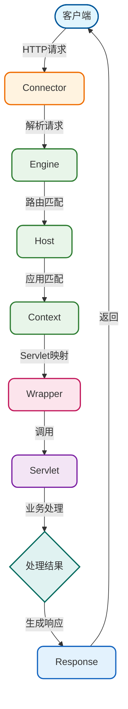
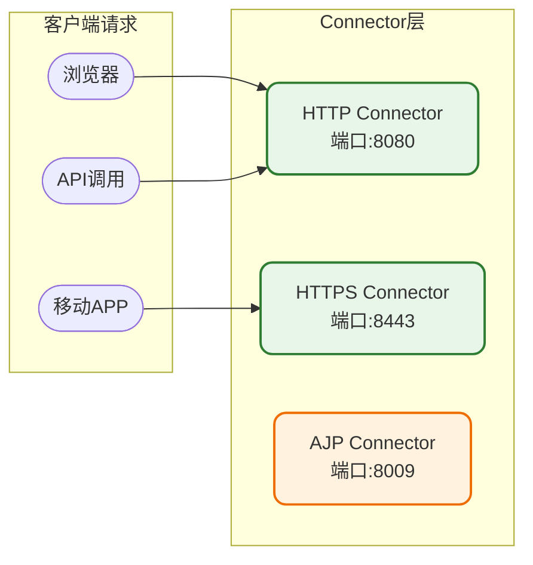
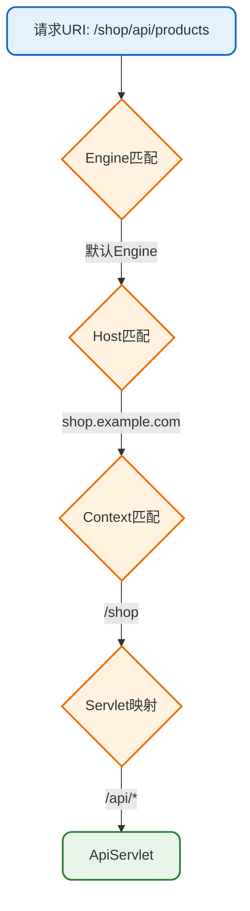
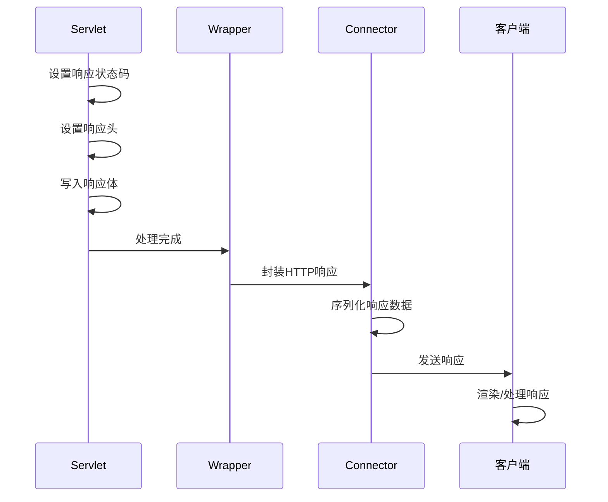
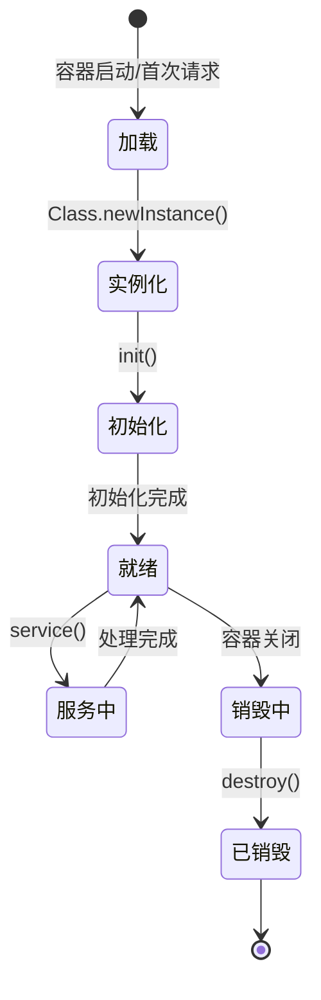
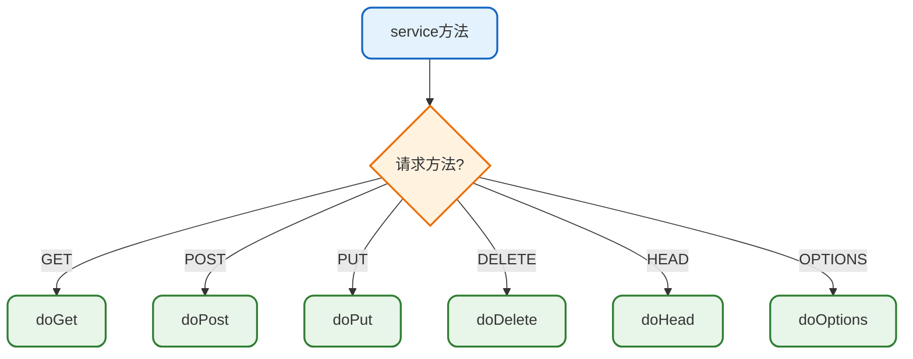
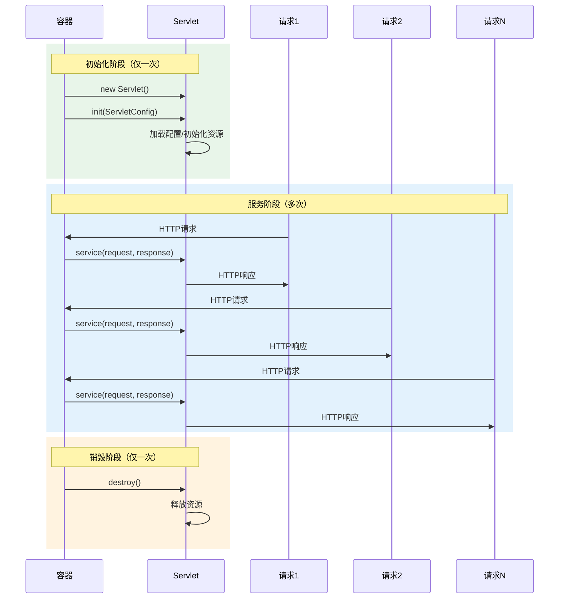
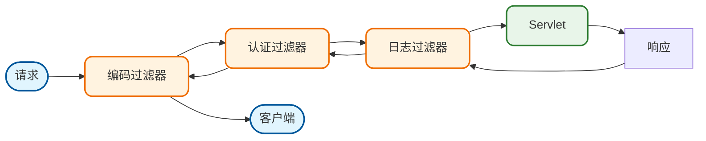
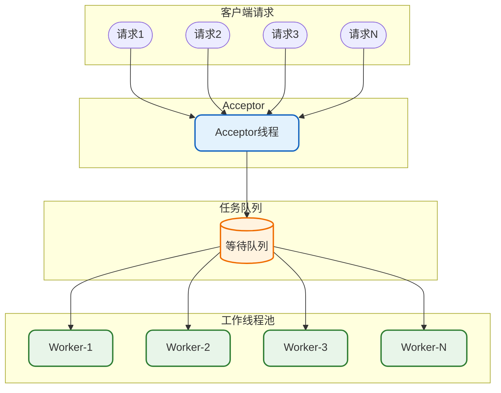

# Tomcat请求处理机制详解

## 概述

Tomcat作为一个遵循Servlet规范的Web容器，其核心职责就是接收HTTP请求并将其转发给对应的Servlet进行处理。理解Tomcat的请求处理机制，对于Web应用开发、性能调优和问题排查都有重要意义。

## 请求处理全流程

从客户端发起请求到获得响应，整个过程经历多个组件的协作处理。

### 请求处理流程图



### 处理流程详解

整个请求处理可以分为五个核心阶段：

#### 第一阶段：请求接收

Connector组件通过监听指定端口接收来自客户端的网络连接。不同的Connector支持不同的协议：



#### 第二阶段：请求解析

接收到原始的网络数据后，Tomcat需要对其进行解析，提取出有意义的请求信息：

| 解析内容 | 示例 | 用途 |
|----------|------|------|
| 请求方法 | GET、POST、PUT | 确定操作类型 |
| 请求URI | /api/orders/123 | 路由匹配 |
| 协议版本 | HTTP/1.1 | 协议处理 |
| 请求头 | Content-Type、Cookie | 元数据获取 |
| 请求体 | JSON数据、表单数据 | 业务数据 |

```java
// 模拟请求解析过程
public class HttpRequestParser {
    
    public ParsedRequest parse(InputStream inputStream) throws IOException {
        ParsedRequest request = new ParsedRequest();
        
        // 解析请求行
        String requestLine = readLine(inputStream);
        String[] parts = requestLine.split(" ");
        request.setMethod(parts[0]);      // GET
        request.setUri(parts[1]);         // /products/list
        request.setProtocol(parts[2]);    // HTTP/1.1
        
        // 解析请求头
        Map<String, String> headers = new HashMap<>();
        String headerLine;
        while (!(headerLine = readLine(inputStream)).isEmpty()) {
            int colonIndex = headerLine.indexOf(":");
            String name = headerLine.substring(0, colonIndex).trim();
            String value = headerLine.substring(colonIndex + 1).trim();
            headers.put(name.toLowerCase(), value);
        }
        request.setHeaders(headers);
        
        // 解析请求体（如果有）
        String contentLength = headers.get("content-length");
        if (contentLength != null) {
            int length = Integer.parseInt(contentLength);
            byte[] body = inputStream.readNBytes(length);
            request.setBody(body);
        }
        
        return request;
    }
}
```

#### 第三阶段：Servlet查找

根据解析出的URI，Tomcat需要在容器层次中逐级匹配，找到对应的Servlet：



**Servlet映射规则优先级：**

1. **精确匹配**：`/api/products/detail` 精确匹配
2. **路径匹配**：`/api/*` 匹配以/api/开头的请求
3. **扩展名匹配**：`*.do` 匹配特定扩展名
4. **默认匹配**：`/` 默认Servlet，处理未匹配的请求

#### 第四阶段：Servlet处理

找到对应的Servlet后，请求被交给Servlet的service方法处理：

```java
// 订单处理Servlet示例
public class OrderProcessingServlet extends HttpServlet {
    
    @Override
    protected void doGet(HttpServletRequest request, 
                        HttpServletResponse response) 
            throws ServletException, IOException {
        
        // 获取请求参数
        String orderId = request.getParameter("orderId");
        
        // 业务处理
        OrderService orderService = getOrderService();
        Order order = orderService.findById(orderId);
        
        // 设置响应
        response.setContentType("application/json;charset=UTF-8");
        PrintWriter writer = response.getWriter();
        writer.write(toJson(order));
    }
    
    @Override
    protected void doPost(HttpServletRequest request,
                         HttpServletResponse response)
            throws ServletException, IOException {
        
        // 读取请求体
        BufferedReader reader = request.getReader();
        StringBuilder body = new StringBuilder();
        String line;
        while ((line = reader.readLine()) != null) {
            body.append(line);
        }
        
        // 解析并处理订单
        Order newOrder = parseOrder(body.toString());
        OrderService orderService = getOrderService();
        orderService.create(newOrder);
        
        // 返回创建结果
        response.setStatus(HttpServletResponse.SC_CREATED);
        response.getWriter().write("{\"status\":\"success\"}");
    }
}
```

#### 第五阶段：响应返回

Servlet处理完成后，响应通过相同的路径返回给客户端：



## Servlet生命周期

Servlet作为请求处理的核心组件，有着明确的生命周期管理机制。

### 生命周期状态图



### 生命周期三阶段

#### 初始化阶段（init）

当Servlet首次被请求或容器启动时（配置了load-on-startup），容器会创建Servlet实例并调用init方法：

```java
public class DatabaseConnectionServlet extends HttpServlet {
    
    private DataSource dataSource;
    private ExecutorService executorService;
    
    @Override
    public void init(ServletConfig config) throws ServletException {
        super.init(config);
        
        // 读取配置参数
        String poolSize = config.getInitParameter("poolSize");
        String dbUrl = config.getInitParameter("dbUrl");
        
        // 初始化数据源
        this.dataSource = createDataSource(dbUrl, Integer.parseInt(poolSize));
        
        // 初始化线程池
        this.executorService = Executors.newFixedThreadPool(10);
        
        log("DatabaseConnectionServlet initialized successfully");
    }
    
    private DataSource createDataSource(String url, int poolSize) {
        HikariConfig config = new HikariConfig();
        config.setJdbcUrl(url);
        config.setMaximumPoolSize(poolSize);
        return new HikariDataSource(config);
    }
}
```

**init方法特点：**

- 只在Servlet生命周期中调用一次
- 适合执行耗时的初始化操作（数据库连接、配置加载等）
- 初始化失败会抛出ServletException，Servlet不可用

#### 服务阶段（service）

每次请求到达时，容器都会调用service方法。HttpServlet的service方法会根据请求方法分发到对应的doXxx方法：



```java
// HttpServlet中的service方法实现
protected void service(HttpServletRequest req, HttpServletResponse resp)
        throws ServletException, IOException {
    
    String method = req.getMethod();
    
    if (method.equals(METHOD_GET)) {
        // GET请求处理
        long lastModified = getLastModified(req);
        if (lastModified == -1) {
            doGet(req, resp);
        } else {
            // 处理条件GET
            long ifModifiedSince = req.getDateHeader(HEADER_IFMODSINCE);
            if (ifModifiedSince < lastModified) {
                doGet(req, resp);
            } else {
                resp.setStatus(HttpServletResponse.SC_NOT_MODIFIED);
            }
        }
    } else if (method.equals(METHOD_POST)) {
        doPost(req, resp);
    } else if (method.equals(METHOD_PUT)) {
        doPut(req, resp);
    } else if (method.equals(METHOD_DELETE)) {
        doDelete(req, resp);
    } else {
        // 不支持的方法
        resp.sendError(HttpServletResponse.SC_NOT_IMPLEMENTED);
    }
}
```

**service方法特点：**

- 每次请求都会调用
- 在多线程环境下执行，需注意线程安全
- 通过Request获取输入，通过Response输出结果

#### 销毁阶段（destroy）

当容器关闭或Web应用被卸载时，容器会调用destroy方法：

```java
public class DatabaseConnectionServlet extends HttpServlet {
    
    private DataSource dataSource;
    private ExecutorService executorService;
    
    @Override
    public void destroy() {
        // 关闭线程池
        if (executorService != null) {
            executorService.shutdown();
            try {
                if (!executorService.awaitTermination(30, TimeUnit.SECONDS)) {
                    executorService.shutdownNow();
                }
            } catch (InterruptedException e) {
                executorService.shutdownNow();
            }
        }
        
        // 关闭数据源
        if (dataSource instanceof HikariDataSource) {
            ((HikariDataSource) dataSource).close();
        }
        
        log("DatabaseConnectionServlet destroyed, resources released");
    }
}
```

**destroy方法特点：**

- 只调用一次，用于资源清理
- 应该释放所有占用的资源（连接池、文件句柄等）
- 调用后Servlet实例将被GC回收

### 生命周期完整时序



## 过滤器与请求处理链

在实际的请求处理中，请求通常需要经过一系列过滤器（Filter）的处理。

### 过滤器链执行流程



### 过滤器实现示例

```java
// 请求日志过滤器
public class RequestLoggingFilter implements Filter {
    
    private static final Logger logger = LoggerFactory.getLogger(RequestLoggingFilter.class);
    
    @Override
    public void init(FilterConfig filterConfig) {
        logger.info("RequestLoggingFilter initialized");
    }
    
    @Override
    public void doFilter(ServletRequest request, ServletResponse response,
                        FilterChain chain) throws IOException, ServletException {
        
        HttpServletRequest httpRequest = (HttpServletRequest) request;
        
        // 记录请求开始
        long startTime = System.currentTimeMillis();
        String requestId = UUID.randomUUID().toString().substring(0, 8);
        
        logger.info("[{}] Request started: {} {}", 
                   requestId, httpRequest.getMethod(), httpRequest.getRequestURI());
        
        try {
            // 继续执行过滤器链
            chain.doFilter(request, response);
        } finally {
            // 记录请求结束
            long duration = System.currentTimeMillis() - startTime;
            HttpServletResponse httpResponse = (HttpServletResponse) response;
            
            logger.info("[{}] Request completed: status={}, duration={}ms",
                       requestId, httpResponse.getStatus(), duration);
        }
    }
    
    @Override
    public void destroy() {
        logger.info("RequestLoggingFilter destroyed");
    }
}
```

## 请求处理中的线程模型

Tomcat使用线程池来处理并发请求，理解线程模型对于性能调优至关重要。

### 线程池工作模式



### 线程池配置参数

在server.xml中可以配置Connector的线程池参数：

```xml
<Connector port="8080" protocol="HTTP/1.1"
           maxThreads="200"
           minSpareThreads="10"
           acceptCount="100"
           connectionTimeout="20000"
           redirectPort="8443" />
```

| 参数 | 默认值 | 说明 |
|------|--------|------|
| maxThreads | 200 | 最大工作线程数 |
| minSpareThreads | 10 | 最小空闲线程数 |
| acceptCount | 100 | 等待队列最大长度 |
| connectionTimeout | 20000 | 连接超时时间(ms) |

## 小结

本文详细介绍了Tomcat的请求处理机制：

1. **请求处理五阶段**：接收 → 解析 → Servlet查找 → 处理 → 响应返回
2. **Servlet生命周期**：init（一次）→ service（多次）→ destroy（一次）
3. **过滤器链**：请求和响应都会经过配置的过滤器处理
4. **线程模型**：基于线程池的并发处理机制

掌握这些知识，有助于编写高效的Servlet程序和进行Tomcat性能调优。
