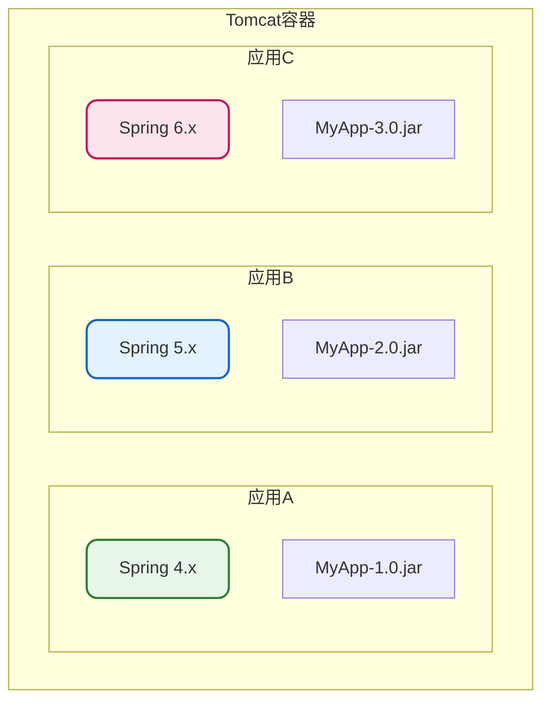
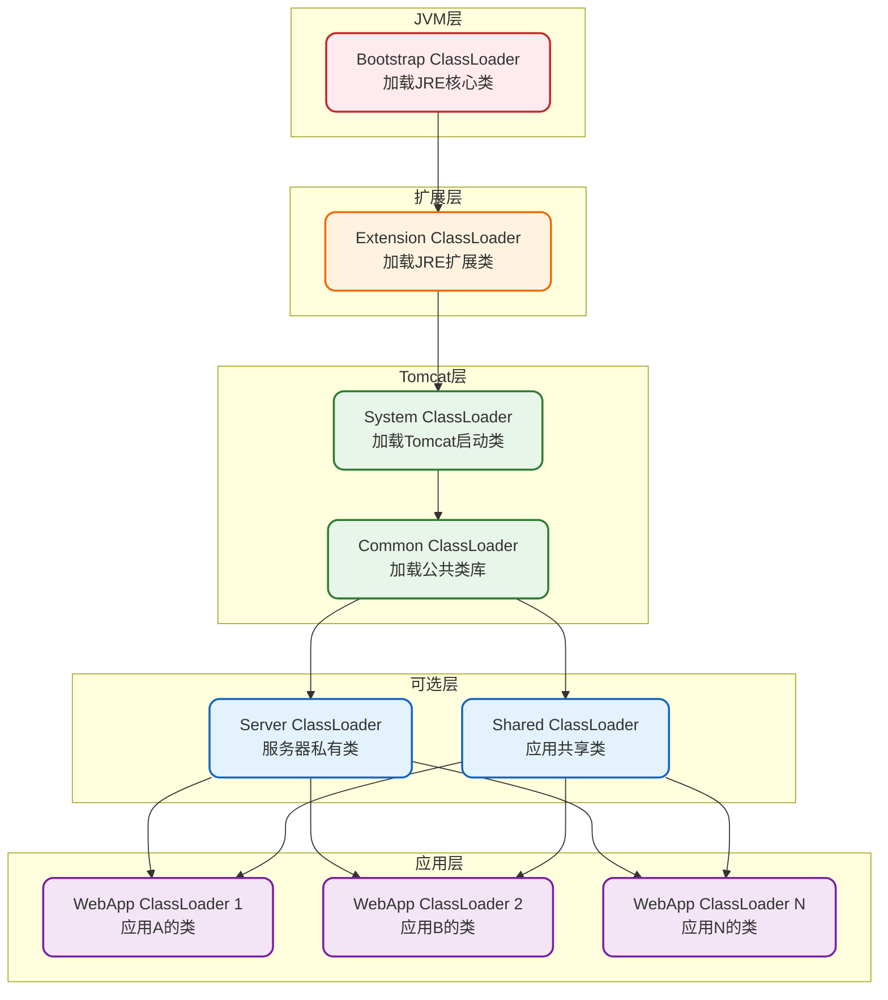
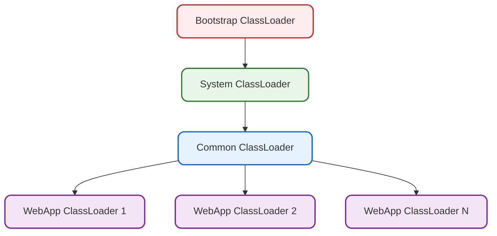

import PaidCTA from '@site/src/components/PaidCTA';

# Tomcat类加载器与类加载机制

## 概述

Tomcat作为一个支持多Web应用同时运行的Servlet容器，需要解决一个核心问题：**如何实现不同Web应用之间的类隔离**。为此，Tomcat设计了一套独特的类加载器层次结构，并对传统的双亲委派机制进行了改造。

## 为什么需要特殊的类加载机制

在深入了解Tomcat类加载机制之前，先理解其设计背景：

### 多应用隔离需求

**面临的问题：**

| 问题 | 描述 | 传统方式的困境 |
|------|------|----------------|
| 版本冲突 | 不同应用依赖同一类库的不同版本 | 双亲委派只会加载一个版本 |
| 类污染 | 一个应用的类影响其他应用 | 共享类加载器导致相互影响 |
| 热部署 | 更新某个应用不影响其他应用 | 类加载器不支持卸载类 |

## Tomcat类加载器层次结构

### 完整层次结构图

### 核心类加载器说明

#### Bootstrap ClassLoader（启动类加载器）

由JVM实现，负责加载Java核心类库：

- **加载路径**：`$JAVA_HOME/lib` 及 `lib/ext`
- **加载内容**：`java.lang.*`、`java.util.*` 等核心类
- **特点**：由C++实现，在Java中表现为null

#### System ClassLoader（系统类加载器）

负责加载Tomcat启动所需的类：

- **加载路径**：`$CATALINA_HOME/bin`
- **加载内容**：
  - `bootstrap.jar` - 启动入口类
  - `tomcat-juli.jar` - 日志组件
  - `commons-daemon.jar` - 守护进程支持

#### Common ClassLoader（公共类加载器）

加载Tomcat和所有Web应用都可以访问的公共类：

- **加载路径**：`$CATALINA_HOME/lib`
- **加载内容**：
  - `servlet-api.jar` - Servlet规范API
  - `jsp-api.jar` - JSP规范API
  - `catalina.jar` - Tomcat核心
  - 其他公共库

#### WebApp ClassLoader（Web应用类加载器）

每个Web应用独立拥有的类加载器：

- **加载路径**：
  - `WEB-INF/classes` - 应用编译的类
  - `WEB-INF/lib` - 应用依赖的jar包
- **特点**：应用间完全隔离

### 简化的实际层次

在默认配置下，Server ClassLoader和Shared ClassLoader是未启用的，实际的类加载器层次更加简洁：

## 类加载机制详解

Tomcat的类加载机制并非简单地遵循或违反双亲委派，而是采用了一种灵活的策略。

<PaidCTA />