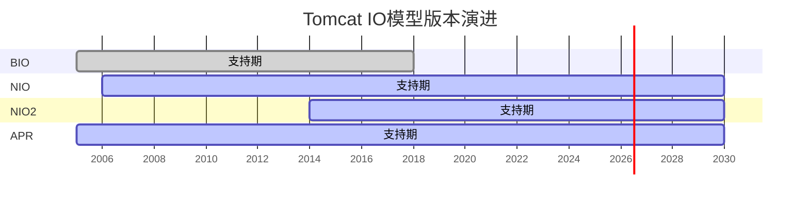
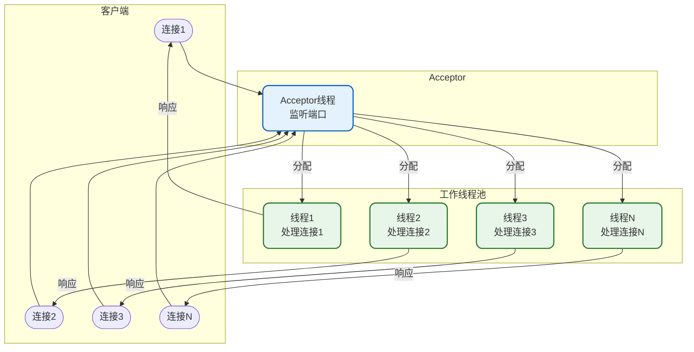

import PaidCTA from '@site/src/components/PaidCTA';

# Tomcat IO模型详解

## 概述

Tomcat作为一个Web服务器，需要处理大量的网络I/O操作。不同的I/O模型直接影响着Tomcat的并发处理能力和性能表现。本文将深入分析Tomcat支持的各种I/O模型，帮助你根据实际场景做出最佳选择。

## Tomcat支持的IO模型

Tomcat从早期版本发展至今，陆续支持了多种I/O模型：

### 各版本IO模型支持情况



| 版本 | BIO | NIO | NIO2 | APR |
|------|-----|-----|------|-----|
| Tomcat 6.x | 默认 | 支持 | 不支持 | 支持 |
| Tomcat 7.x | 默认 | 支持 | 不支持 | 支持 |
| Tomcat 8.0 | 支持 | 默认 | 支持 | 支持 |
| Tomcat 8.5+ | 移除 | 默认 | 支持 | 支持 |
| Tomcat 9.x | 移除 | 默认 | 支持 | 支持 |
| Tomcat 10.x | 移除 | 默认 | 支持 | 支持 |

## BIO模型（阻塞I/O）

### 工作原理

BIO（Blocking I/O）是最传统的I/O模型，采用"一请求一线程"的方式处理连接。



### BIO处理流程

```java
/**
 * BIO服务器模拟实现
 * 演示传统阻塞IO的工作方式
 */
public class BioHttpServer {
    
    private final int port;
    private final ExecutorService threadPool;
    private volatile boolean running = true;
    
    public BioHttpServer(int port, int maxThreads) {
        this.port = port;
        this.threadPool = Executors.newFixedThreadPool(maxThreads);
    }
    
    public void start() throws IOException {
        ServerSocket serverSocket = new ServerSocket(port);
        System.out.println("BIO服务器启动，监听端口: " + port);
        
        while (running) {
            // 阻塞等待连接
            Socket clientSocket = serverSocket.accept();
            
            // 为每个连接分配一个线程
            threadPool.submit(new ConnectionHandler(clientSocket));
        }
    }
    
    private class ConnectionHandler implements Runnable {
        private final Socket socket;
        
        public ConnectionHandler(Socket socket) {
            this.socket = socket;
        }
        
        @Override
        public void run() {
            try (BufferedReader reader = new BufferedReader(
                    new InputStreamReader(socket.getInputStream()));
                 PrintWriter writer = new PrintWriter(
                    socket.getOutputStream(), true)) {
                
                // 阻塞读取请求
                String requestLine = reader.readLine();
                System.out.println("收到请求: " + requestLine);
                
                // 处理业务逻辑（模拟耗时操作）
                processRequest(requestLine);
                
                // 发送响应
                writer.println("HTTP/1.1 200 OK");
                writer.println("Content-Type: text/html");
                writer.println();
                writer.println("<h1>Welcome to BIO Server</h1>");
                
            } catch (IOException e) {
                e.printStackTrace();
            }
        }
        
        private void processRequest(String request) {
            // 模拟业务处理
            try {
                Thread.sleep(100);
            } catch (InterruptedException e) {
                Thread.currentThread().interrupt();
            }
        }
    }
}
```

### BIO的特点

| 优点 | 缺点 |
|------|------|
| 编程模型简单直观 | 线程资源消耗大 |
| 每个连接独立处理 | 无法支持高并发 |
| 调试和排查容易 | 线程切换开销大 |

**适用场景**：连接数较少、短连接、对性能要求不高的场景。

## NIO模型（非阻塞I/O）

<PaidCTA />