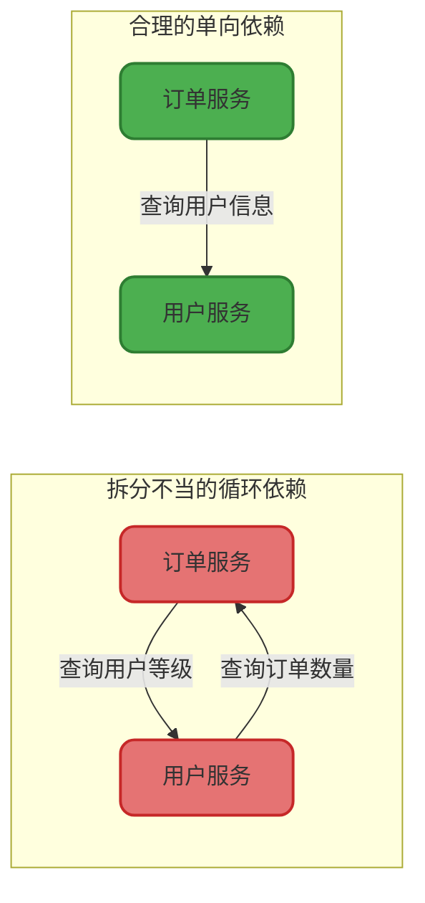
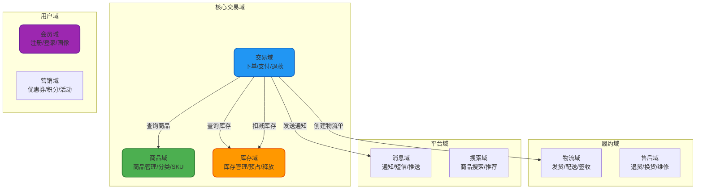
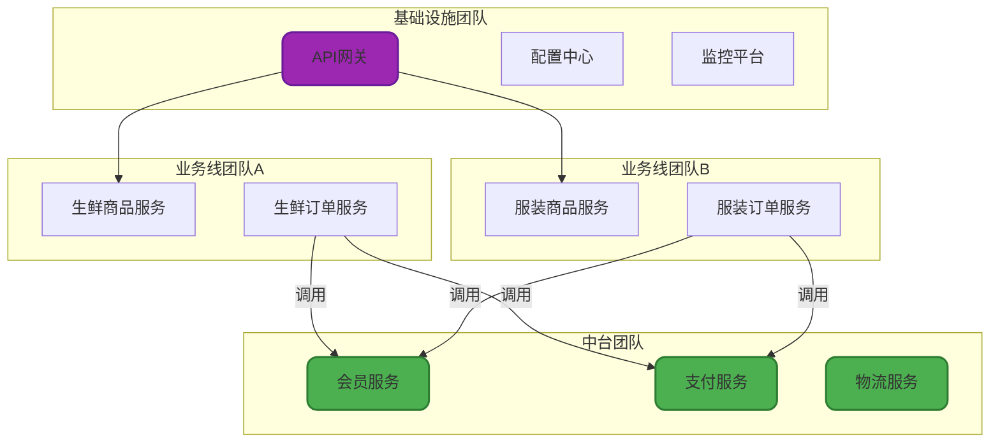
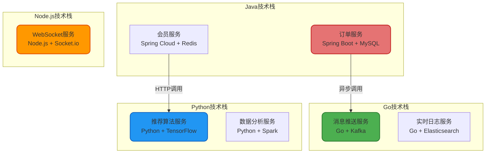
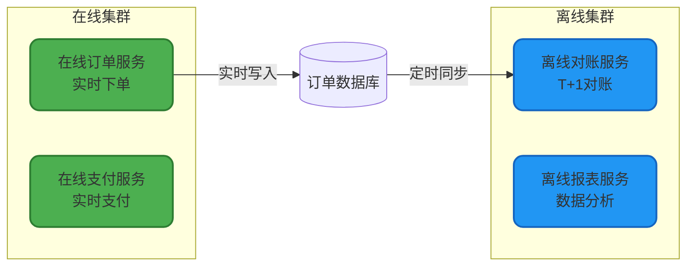
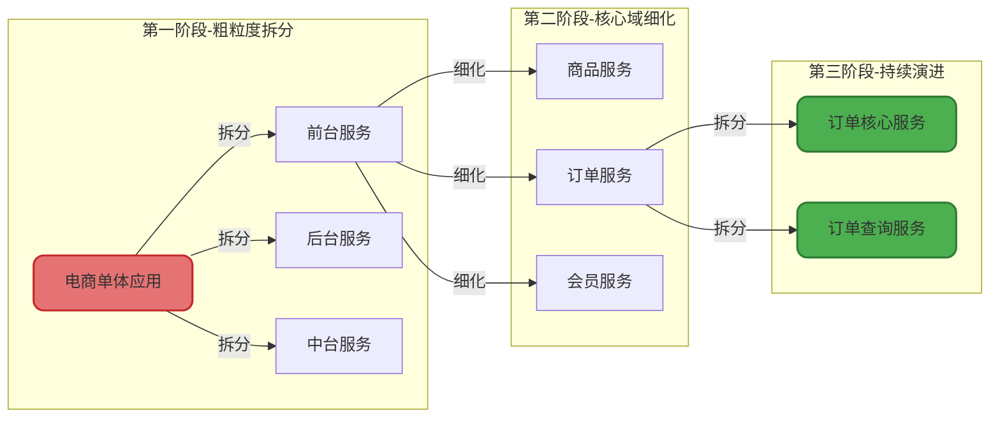

# 微服务拆分策略与实践

## 微服务拆分的本质

微服务拆分不是简单的代码物理分离,而是对业务领域的深度理解和系统边界的精准划分。拆分的核心目标是实现**高内聚、低耦合**,让每个服务专注于完成特定的业务能力,同时最小化服务间的依赖关系。

### 拆分不当的后果

如果拆分策略不合理,会导致:
- **分布式事务泛滥**: 一个业务操作需要协调多个服务完成
- **循环依赖**: 服务A调用服务B,服务B又调用服务A
- **频繁的跨服务通信**: 网络开销远大于业务处理时间
- **数据一致性难以保障**: 服务间数据同步复杂度激增



## 核心拆分维度

### 按业务领域拆分(DDD方法)

这是最常用也是最推荐的拆分方式,基于领域驱动设计(Domain-Driven Design)的思想,将系统按照业务领域进行垂直切分。每个领域对应一个或多个微服务,负责该领域的所有业务逻辑。

**电商系统领域划分示例**:



**拆分实践要点**:

1. **识别限界上下文(Bounded Context)**: 商品域的"价格"和营销域的"促销价"虽然都是价格,但属于不同的上下文,应该分别管理
2. **避免贫血模型**: 每个服务应该包含完整的业务逻辑,而不是只做CRUD操作
3. **服务粒度适中**: 太粗导致内聚性差,太细导致通信开销大

**代码示例** - 商品域的领域服务:

```java
@Service
public class ProductDomainService {
    
    @Autowired
    private ProductRepository productRepository;
    
    @Autowired
    private SkuRepository skuRepository;
    
    /**
     * 创建新商品(聚合根操作)
     * @param command 创建商品命令
     * @return 商品ID
     */
    @Transactional
    public Long createProduct(CreateProductCommand command) {
        // 1. 领域对象创建
        Product product = Product.builder()
            .name(command.getProductName())
            .categoryId(command.getCategoryId())
            .brandId(command.getBrandId())
            .status(ProductStatus.DRAFT)
            .build();
        
        // 2. 业务规则校验
        product.validateProductName(); // 领域对象自己的校验逻辑
        
        // 3. 持久化聚合根
        productRepository.save(product);
        
        // 4. 创建SKU(值对象)
        List<Sku> skuList = command.getSkuList().stream()
            .map(skuCmd -> Sku.builder()
                .productId(product.getId())
                .attributes(skuCmd.getAttributes())
                .price(skuCmd.getPrice())
                .stock(skuCmd.getInitStock())
                .build())
            .collect(Collectors.toList());
        
        skuRepository.batchSave(skuList);
        
        // 5. 发布领域事件
        DomainEventPublisher.publish(
            new ProductCreatedEvent(product.getId(), product.getName())
        );
        
        return product.getId();
    }
    
    /**
     * 商品上架(状态流转)
     */
    @Transactional
    public void publishProduct(Long productId) {
        Product product = productRepository.findById(productId)
            .orElseThrow(() -> new ProductNotFoundException(productId));
        
        // 领域逻辑:只有草稿和下架状态的商品可以上架
        product.publish();
        
        productRepository.save(product);
        
        DomainEventPublisher.publish(
            new ProductPublishedEvent(productId)
        );
    }
}
```

### 按团队组织结构拆分(康威定律)

康威定律指出:"系统架构受限于组织的沟通结构"。实际项目中,微服务的边界往往需要与团队边界对齐,这样才能最大化团队的自主性和开发效率。

**典型场景**:
- 公司成立了专门的**中台团队**,负责提供通用的会员服务、支付服务、消息服务
- 业务线团队各自负责自己的业务服务,如生鲜业务团队、服装业务团队
- 基础架构团队提供统一的网关、监控、日志等基础设施



**实践建议**:
- 每个微服务由一个固定的小团队(5-9人)负责,实行全栈ownership
- 避免一个服务由多个团队共同维护,容易出现责任不清
- 团队重组时,考虑同步调整服务边界

### 按技术架构拆分

根据技术栈的差异进行拆分,适用于需要技术异构的场景。

**典型拆分案例**:



**适用场景**:
- **高性能场景**: 使用Go或C++实现网关、代理等高并发组件
- **AI算法服务**: 使用Python + TensorFlow构建推荐、图像识别服务
- **实时通信**: 使用Node.js构建WebSocket长连接服务

### 按应用类型拆分(在线/离线隔离)

将在线业务和离线业务分离,避免资源竞争和相互影响。

**在线服务**: 面向C端用户,要求低延迟、高可用
- 商品详情页查询服务
- 订单支付服务
- 用户登录认证服务

**离线服务**: 批处理任务,允许较长的处理时间
- 每日订单对账服务
- 数据仓库ETL任务
- 用户行为分析任务



### 按部署架构拆分

根据部署环境的特殊需求进行拆分:

**多机房部署**: 按地域拆分服务,如华东机房服务、华北机房服务
**云原生改造**: 将核心服务迁移到容器化平台(K8s),老旧服务保留在虚拟机
**边缘计算**: 将部分计算能力下沉到边缘节点,如CDN节点上的图片裁剪服务

## 服务拆分的实践原则

### 单一职责原则

每个微服务应该只负责一个业务领域或业务能力。例如:
- ❌ **错误**: 用户服务同时负责用户管理、订单管理、支付管理
- ✅ **正确**: 用户服务只负责用户注册、登录、资料管理

### 数据自治原则

每个微服务拥有独立的数据库,避免通过数据库层面的表关联来实现业务逻辑。

**反例** - 通过JOIN跨服务查询:
```sql
-- 订单服务直接JOIN用户服务的数据库表(严重违反微服务原则)
SELECT o.*, u.username, u.phone 
FROM order_db.orders o
JOIN user_db.users u ON o.user_id = u.id
WHERE o.order_no = 'ORD123456';
```

**正例** - 通过RPC调用获取数据:
```java
@Service
public class OrderQueryService {
    
    @Autowired
    private OrderRepository orderRepository;
    
    @Autowired
    private UserRpcClient userClient;
    
    /**
     * 查询订单详情(聚合多个服务的数据)
     */
    public OrderDetailVO queryOrderDetail(String orderNo) {
        // 1. 查询订单服务自己的数据
        Order order = orderRepository.findByOrderNo(orderNo);
        
        // 2. 通过RPC调用用户服务获取用户信息
        UserInfoDTO userInfo = userClient.getUserInfo(order.getUserId());
        
        // 3. 组装返回对象
        return OrderDetailVO.builder()
            .orderNo(order.getOrderNo())
            .totalAmount(order.getTotalAmount())
            .username(userInfo.getUsername())
            .phone(userInfo.getPhone())
            .build();
    }
}
```

### 避免过度拆分

并非拆分粒度越细越好。服务数量过多会带来:
- 部署和运维成本激增
- 分布式事务处理复杂
- 网络通信开销增加
- 问题排查困难

**判断标准**: 一个服务的代码量通常在5000-20000行之间比较合理,团队规模在5-9人能够完全掌控。

## 拆分实施路径

### 由粗到细,逐步迭代

不要试图一次性设计出完美的微服务架构,而是采用演进式架构:

**第一阶段**: 按照核心业务域做粗粒度拆分(3-5个服务)
**第二阶段**: 根据实际运行情况,将负载高的服务进一步拆分
**第三阶段**: 根据团队组织调整,动态调整服务边界



### 业务价值优先

优先拆分变化频繁、业务价值高的模块,稳定的基础模块可以暂时保留在单体应用中。

**拆分优先级**:
1. 核心交易链路(订单、支付)
2. 高并发模块(商品详情、秒杀)
3. 频繁变更的营销活动模块
4. 稳定的基础数据模块(最后拆分)

微服务拆分是一门平衡的艺术,需要在业务需求、团队能力、技术成本之间找到最优解。切忌为了拆分而拆分,一切要以解决实际问题为出发点。
