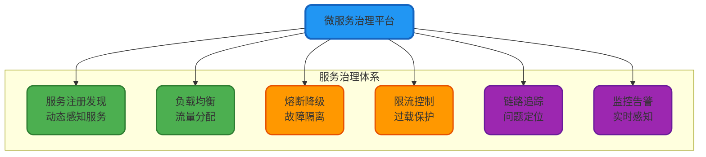
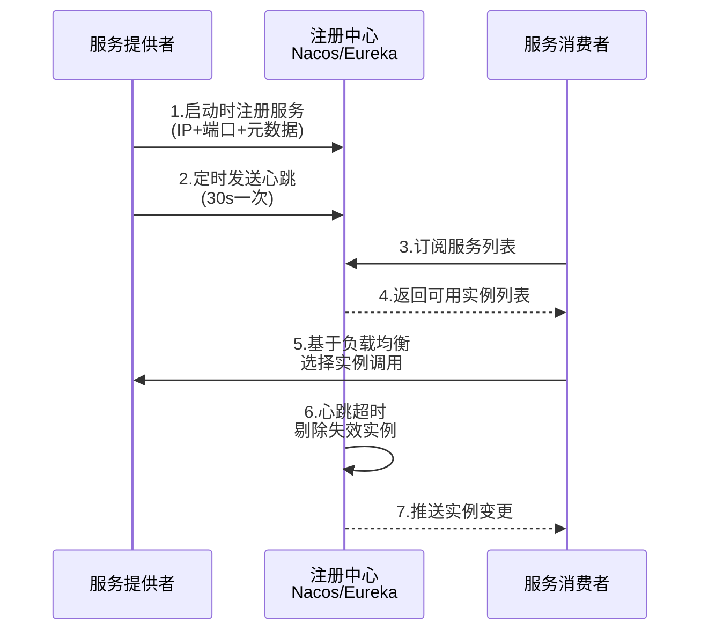
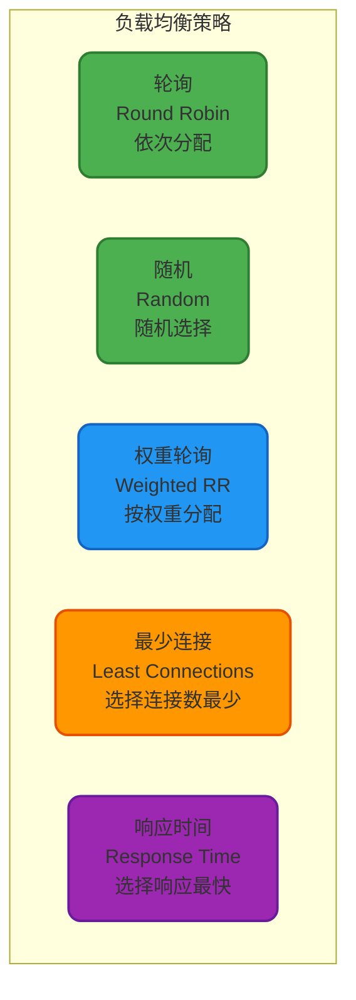
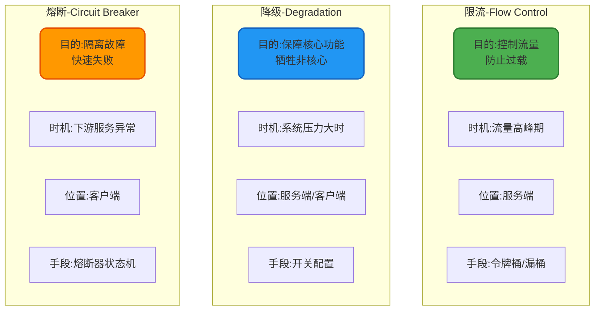
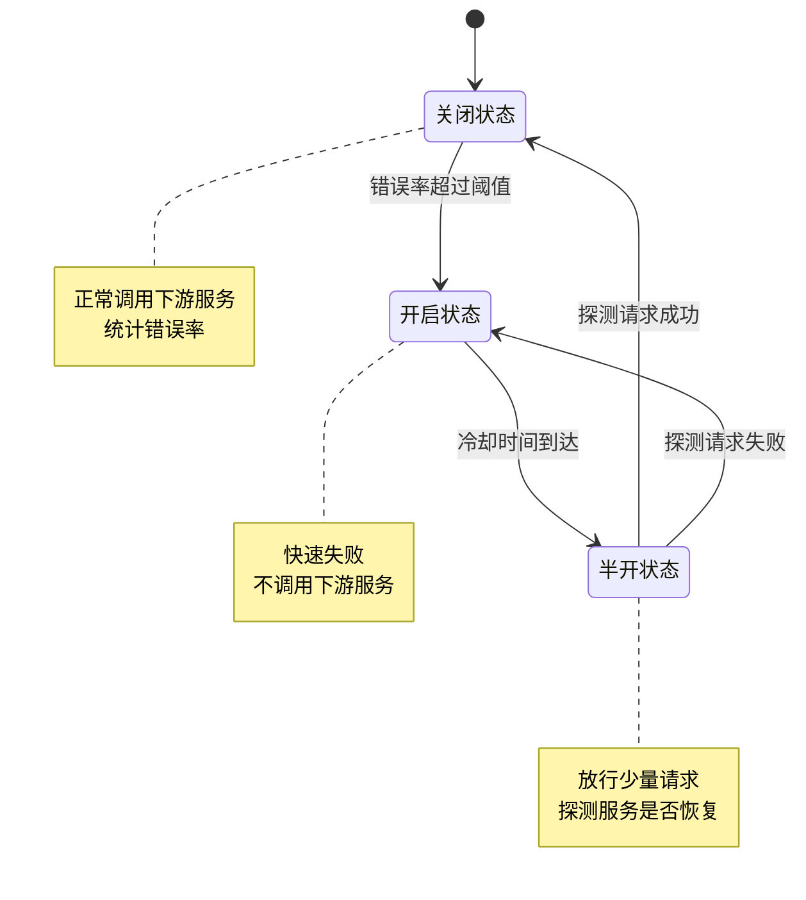
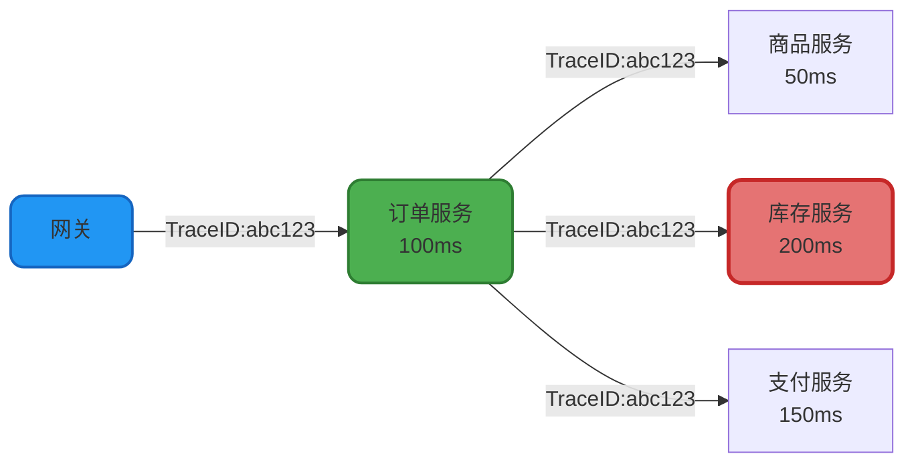

# 微服务治理与稳定性保障

## 服务治理的核心诉求

当系统从单体应用演进为由数十甚至数百个微服务组成的分布式系统后,服务治理成为保障系统稳定运行的关键。服务治理涵盖了服务注册发现、负载均衡、容错降级、流量控制、链路追踪等多个维度,旨在解决分布式环境下的服务协调和稳定性问题。



## 服务注册与发现

### 核心机制

服务注册与发现是微服务架构的基石,解决了"服务消费者如何找到服务提供者"的问题。在动态伸缩的云环境中,服务实例的IP和端口随时可能变化,硬编码地址的方式显然不可行。

**工作流程**:



### 主流注册中心对比

| 注册中心 | 一致性协议 | 健康检查 | 配置中心 | 推荐场景 |
|---------|----------|---------|---------|---------|
| **Nacos** | Raft/Distro | 支持 | 内置 | 国内企业首选,功能全面 |
| **Eureka** | AP模型 | 支持 | 不支持 | Spring Cloud经典方案 |
| **Consul** | Raft | 支持 | 支持 | 多数据中心场景 |
| **ZooKeeper** | ZAB | 需自实现 | 可扩展 | 强一致性要求场景 |

### Nacos集成示例

**服务提供者注册**:

```java
@SpringBootApplication
@EnableDiscoveryClient
public class ProductServiceApplication {
    public static void main(String[] args) {
        SpringApplication.run(ProductServiceApplication.class, args);
    }
}
```

```yaml
# application.yml
spring:
  application:
    name: product-service
  cloud:
    nacos:
      discovery:
        server-addr: 127.0.0.1:8848
        namespace: prod
        group: E-COMMERCE
        metadata:
          version: 1.0.0
          region: cn-hangzhou
```

**服务消费者发现**:

```java
@Service
public class ProductQueryService {
    
    @Autowired
    private DiscoveryClient discoveryClient;
    
    @Autowired
    private RestTemplate restTemplate;
    
    /**
     * 动态获取商品服务实例并调用
     */
    public ProductDTO queryProduct(Long productId) {
        // 1. 从注册中心获取服务实例列表
        List<ServiceInstance> instances = discoveryClient.getInstances("product-service");
        
        if (CollectionUtils.isEmpty(instances)) {
            throw new ServiceUnavailableException("商品服务暂时不可用");
        }
        
        // 2. 简单的随机负载均衡
        ServiceInstance instance = instances.get(
            ThreadLocalRandom.current().nextInt(instances.size())
        );
        
        // 3. 构造请求URL并调用
        String url = String.format("http://%s:%d/api/product/query?id=%d",
            instance.getHost(),
            instance.getPort(),
            productId
        );
        
        return restTemplate.getForObject(url, ProductDTO.class);
    }
}
```

## 负载均衡

### 客户端负载均衡

在微服务架构中,负载均衡通常在客户端实现。服务消费者从注册中心获取服务提供者列表后,根据负载均衡策略选择目标实例。

**常见负载均衡算法**:



### Spring Cloud LoadBalancer实现

```java
@Configuration
public class LoadBalancerConfig {
    
    /**
     * 自定义负载均衡策略 - 基于响应时间的加权轮询
     */
    @Bean
    public ReactorServiceInstanceLoadBalancer customLoadBalancer(
            Environment environment,
            LoadBalancerClientFactory loadBalancerClientFactory) {
        
        String name = environment.getProperty(LoadBalancerClientFactory.PROPERTY_NAME);
        
        return new ResponseTimeWeightedLoadBalancer(
            loadBalancerClientFactory.getLazyProvider(name, ServiceInstanceListSupplier.class),
            name
        );
    }
}

/**
 * 响应时间加权负载均衡器
 */
public class ResponseTimeWeightedLoadBalancer implements ReactorServiceInstanceLoadBalancer {
    
    private final ObjectProvider<ServiceInstanceListSupplier> serviceInstanceListSupplierProvider;
    private final String serviceId;
    
    // 记录每个实例的平均响应时间
    private final Map<String, AtomicLong> responseTimeStats = new ConcurrentHashMap<>();
    
    @Override
    public Mono<Response<ServiceInstance>> choose(Request request) {
        ServiceInstanceListSupplier supplier = serviceInstanceListSupplierProvider
            .getIfAvailable(NoopServiceInstanceListSupplier::new);
        
        return supplier.get(request).next()
            .map(serviceInstances -> processInstanceResponse(serviceInstances));
    }
    
    private Response<ServiceInstance> processInstanceResponse(
            List<ServiceInstance> instances) {
        
        if (instances.isEmpty()) {
            return new EmptyResponse();
        }
        
        // 计算每个实例的权重(响应时间越短,权重越高)
        int totalWeight = 0;
        List<WeightedInstance> weightedInstances = new ArrayList<>();
        
        for (ServiceInstance instance : instances) {
            String instanceId = instance.getInstanceId();
            long avgResponseTime = responseTimeStats
                .getOrDefault(instanceId, new AtomicLong(100))
                .get();
            
            // 权重 = 10000 / 平均响应时间
            int weight = (int) (10000 / Math.max(avgResponseTime, 1));
            totalWeight += weight;
            
            weightedInstances.add(new WeightedInstance(instance, weight));
        }
        
        // 基于权重随机选择
        int randomWeight = ThreadLocalRandom.current().nextInt(totalWeight);
        int currentWeight = 0;
        
        for (WeightedInstance weighted : weightedInstances) {
            currentWeight += weighted.weight;
            if (randomWeight < currentWeight) {
                return new DefaultResponse(weighted.instance);
            }
        }
        
        return new DefaultResponse(instances.get(0));
    }
    
    /**
     * 记录实例响应时间(供拦截器调用)
     */
    public void recordResponseTime(String instanceId, long responseTime) {
        responseTimeStats.computeIfAbsent(instanceId, k -> new AtomicLong(100))
            .set((responseTimeStats.get(instanceId).get() + responseTime) / 2);
    }
}
```

## 限流、降级、熔断三剑客

### 概念辨析

这三个概念常被混淆,实际上它们的触发时机、作用对象、实施位置都有所不同:



### 限流实战

**Sentinel限流规则配置**:

```java
@Service
public class OrderSubmitService {
    
    @PostConstruct
    public void initFlowRules() {
        List<FlowRule> rules = new ArrayList<>();
        
        // 1. QPS限流规则
        FlowRule qpsRule = new FlowRule();
        qpsRule.setResource("submitOrder");
        qpsRule.setGrade(RuleConstant.FLOW_GRADE_QPS);
        qpsRule.setCount(1000); // 每秒最多1000次请求
        qpsRule.setControlBehavior(RuleConstant.CONTROL_BEHAVIOR_RATE_LIMITER); // 匀速排队
        qpsRule.setMaxQueueingTimeMs(500); // 最大排队等待500ms
        
        // 2. 并发线程数限流
        FlowRule threadRule = new FlowRule();
        threadRule.setResource("paymentProcess");
        threadRule.setGrade(RuleConstant.FLOW_GRADE_THREAD);
        threadRule.setCount(50); // 最多50个线程同时处理
        
        rules.add(qpsRule);
        rules.add(threadRule);
        
        FlowRuleManager.loadRules(rules);
    }
    
    /**
     * 提交订单(带限流保护)
     */
    @SentinelResource(
        value = "submitOrder",
        blockHandler = "handleFlowBlock"
    )
    public OrderSubmitResult submitOrder(OrderSubmitRequest request) {
        // 正常业务逻辑
        String orderNo = orderService.createOrder(request);
        return OrderSubmitResult.success(orderNo);
    }
    
    /**
     * 限流后的降级处理
     */
    public OrderSubmitResult handleFlowBlock(OrderSubmitRequest request, BlockException ex) {
        log.warn("订单提交被限流, userId:{}", request.getUserId());
        return OrderSubmitResult.fail("当前下单人数过多,请稍后重试");
    }
}
```

**令牌桶算法实现**:

```java
public class TokenBucketRateLimiter {
    
    private final long capacity;        // 桶容量
    private final long refillRate;      // 每秒填充速率
    private final AtomicLong tokens;    // 当前令牌数
    private volatile long lastRefillTime;
    
    public TokenBucketRateLimiter(long capacity, long refillRate) {
        this.capacity = capacity;
        this.refillRate = refillRate;
        this.tokens = new AtomicLong(capacity);
        this.lastRefillTime = System.currentTimeMillis();
    }
    
    /**
     * 尝试获取令牌
     * @return true-获取成功, false-被限流
     */
    public boolean tryAcquire() {
        refillTokens();
        
        long currentTokens = tokens.get();
        if (currentTokens > 0) {
            return tokens.compareAndSet(currentTokens, currentTokens - 1);
        }
        return false;
    }
    
    /**
     * 填充令牌
     */
    private void refillTokens() {
        long now = System.currentTimeMillis();
        long elapsed = now - lastRefillTime;
        
        if (elapsed > 1000) { // 每秒填充一次
            long tokensToAdd = (elapsed / 1000) * refillRate;
            long currentTokens = tokens.get();
            long newTokens = Math.min(capacity, currentTokens + tokensToAdd);
            
            if (tokens.compareAndSet(currentTokens, newTokens)) {
                lastRefillTime = now;
            }
        }
    }
}
```

### 降级策略

**场景示例** - 大促期间降级非核心功能:

```java
@Service
public class OrderDetailService {
    
    @Autowired
    private RecommendationService recommendationService;
    
    @Autowired
    private ConfigService configService;
    
    /**
     * 查询订单详情(带降级逻辑)
     */
    public OrderDetailVO queryOrderDetail(String orderNo) {
        // 1. 查询核心订单数据
        Order order = orderRepository.findByOrderNo(orderNo);
        
        OrderDetailVO detailVO = new OrderDetailVO();
        detailVO.setOrderNo(order.getOrderNo());
        detailVO.setTotalAmount(order.getTotalAmount());
        detailVO.setStatus(order.getStatus());
        
        // 2. 降级开关控制 - 个性化推荐功能
        boolean recommendEnabled = configService.getBoolean(
            "feature.recommendation.enabled", 
            true
        );
        
        if (recommendEnabled) {
            try {
                // 调用推荐服务(非核心功能)
                List<ProductDTO> recommendProducts = recommendationService
                    .getRecommendations(order.getUserId());
                detailVO.setRecommendProducts(recommendProducts);
            } catch (Exception e) {
                log.warn("获取推荐商品失败,使用降级逻辑", e);
                // 降级:返回空列表,不影响核心订单查询
                detailVO.setRecommendProducts(Collections.emptyList());
            }
        } else {
            log.info("推荐功能已降级,跳过调用");
            detailVO.setRecommendProducts(Collections.emptyList());
        }
        
        return detailVO;
    }
}
```

### 熔断机制

**熔断器状态机**:



**Sentinel熔断规则**:

```java
@Configuration
public class CircuitBreakerConfig {
    
    @PostConstruct
    public void initDegradeRules() {
        List<DegradeRule> rules = new ArrayList<>();
        
        // 1. 异常比例熔断
        DegradeRule exceptionRule = new DegradeRule();
        exceptionRule.setResource("paymentService");
        exceptionRule.setGrade(RuleConstant.DEGRADE_GRADE_EXCEPTION_RATIO);
        exceptionRule.setCount(0.5); // 异常比例超过50%
        exceptionRule.setTimeWindow(60); // 熔断60秒
        exceptionRule.setMinRequestAmount(10); // 最少10次请求才开始统计
        
        // 2. 慢调用比例熔断
        DegradeRule slowCallRule = new DegradeRule();
        slowCallRule.setResource("recommendService");
        slowCallRule.setGrade(RuleConstant.DEGRADE_GRADE_RT);
        slowCallRule.setCount(1000); // 响应时间超过1000ms视为慢调用
        slowCallRule.setSlowRatioThreshold(0.3); // 慢调用比例超过30%
        slowCallRule.setTimeWindow(30); // 熔断30秒
        
        rules.add(exceptionRule);
        rules.add(slowCallRule);
        
        DegradeRuleManager.loadRules(rules);
    }
}

@Service
public class PaymentCallService {
    
    @Autowired
    private PaymentRpcClient paymentClient;
    
    /**
     * 调用支付服务(带熔断保护)
     */
    @SentinelResource(
        value = "paymentService",
        fallback = "paymentFallback",
        exceptionsToIgnore = {IllegalArgumentException.class}
    )
    public PaymentResult createPayment(PaymentRequest request) {
        return paymentClient.createPayment(request);
    }
    
    /**
     * 熔断降级逻辑
     */
    public PaymentResult paymentFallback(PaymentRequest request, Throwable ex) {
        log.error("支付服务调用失败,触发熔断降级", ex);
        
        // 降级策略:返回失败,提示用户稍后重试
        return PaymentResult.builder()
            .success(false)
            .errorCode("PAYMENT_CIRCUIT_BREAKER")
            .errorMessage("支付服务繁忙,请稍后重试")
            .build();
    }
}
```

## 分布式链路追踪

### 链路追踪的价值

在微服务架构下,一个用户请求可能经过数十个服务的处理,如何快速定位性能瓶颈和故障点成为难题。链路追踪通过为每个请求生成全局唯一的TraceID,并在服务调用链路中传递,实现请求的全链路监控。



### SkyWalking集成

**添加Agent启动参数**:

```bash
java -javaagent:/path/to/skywalking-agent.jar \
     -Dskywalking.agent.service_name=order-service \
     -Dskywalking.collector.backend_service=127.0.0.1:11800 \
     -jar order-service.jar
```

**自定义埋点**:

```java
@Service
public class OrderProcessService {
    
    /**
     * 订单处理流程(自动采集调用链路)
     */
    @Trace
    @Tags({
        @Tag(key = "business.type", value = "order"),
        @Tag(key = "business.scene", value = "create")
    })
    public String processOrder(OrderCreateRequest request) {
        // 1. 创建订单记录
        String orderNo = createOrderRecord(request);
        
        // 2. 扣减库存
        ActiveSpan.tag("inventory.sku_id", String.valueOf(request.getSkuId()));
        boolean stockDeducted = deductInventory(request.getSkuId(), request.getQuantity());
        
        // 3. 创建支付单
        if (stockDeducted) {
            ActiveSpan.tag("payment.amount", request.getTotalAmount().toString());
            String paymentNo = createPayment(orderNo, request.getTotalAmount());
            ActiveSpan.info("支付单创建成功: " + paymentNo);
        }
        
        return orderNo;
    }
    
    @Trace
    private boolean deductInventory(Long skuId, Integer quantity) {
        // 库存扣减逻辑
        return inventoryService.deduct(skuId, quantity);
    }
}
```

## 服务监控

### 指标采集

**Prometheus + Micrometer集成**:

```java
@Configuration
public class MetricsConfig {
    
    @Bean
    public MeterRegistryCustomizer<MeterRegistry> metricsCommonTags() {
        return registry -> registry.config()
            .commonTags("application", "order-service")
            .commonTags("region", "cn-hangzhou");
    }
    
    @Bean
    public TimedAspect timedAspect(MeterRegistry registry) {
        return new TimedAspect(registry);
    }
}

@Service
public class OrderMetricsService {
    
    private final Counter orderCreatedCounter;
    private final Timer orderProcessTimer;
    
    public OrderMetricsService(MeterRegistry registry) {
        this.orderCreatedCounter = Counter.builder("order.created")
            .description("订单创建总数")
            .tag("type", "normal")
            .register(registry);
        
        this.orderProcessTimer = Timer.builder("order.process.duration")
            .description("订单处理耗时")
            .publishPercentiles(0.5, 0.95, 0.99)
            .register(registry);
    }
    
    /**
     * 创建订单(自动记录指标)
     */
    @Timed(value = "order.process.duration", percentiles = {0.5, 0.95, 0.99})
    public String createOrder(OrderCreateRequest request) {
        Timer.Sample sample = Timer.start();
        
        try {
            // 业务逻辑
            String orderNo = orderService.create(request);
            
            // 计数器+1
            orderCreatedCounter.increment();
            
            return orderNo;
        } finally {
            // 记录耗时
            sample.stop(orderProcessTimer);
        }
    }
}
```

微服务治理是一个系统工程,需要从服务注册、流量控制、故障隔离、链路追踪等多个维度综合施策,才能保障分布式系统的高可用性。
