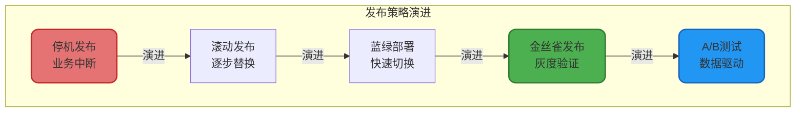
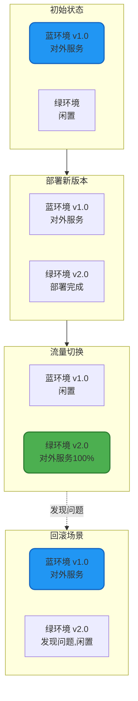
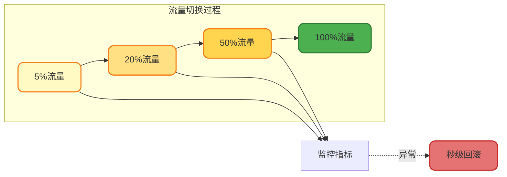
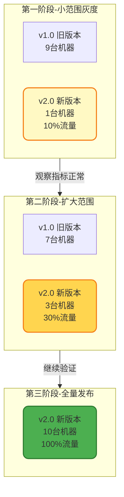
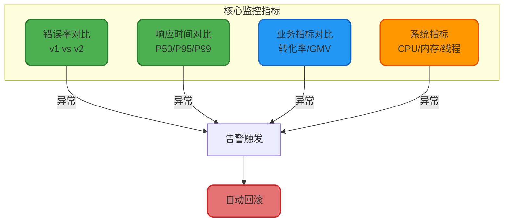
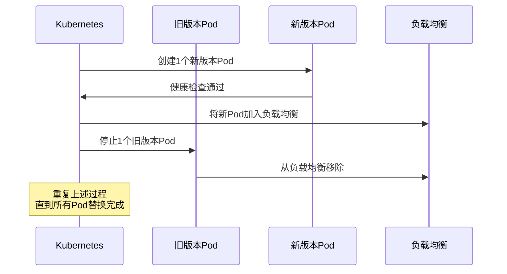

# 微服务发布与部署策略

## 发布策略的重要性

在微服务架构下,服务的频繁迭代和发布成为常态。如何在保证业务连续性的前提下快速发布新版本,如何在出现问题时快速回滚,如何最小化发布风险,这些都是发布策略需要解决的核心问题。

合理的发布策略能够:
- **降低发布风险**: 通过灰度验证,及早发现问题
- **保障用户体验**: 发布过程对用户透明,无感知
- **快速故障恢复**: 秒级回滚到稳定版本
- **提升发布效率**: 自动化流程,减少人工介入



## 蓝绿部署

### 核心思想

蓝绿部署的核心理念是维护两套完全相同的生产环境:**蓝环境**和**绿环境**。在任何时刻,只有一套环境对外提供服务,另一套环境处于闲置状态。发布新版本时,先将新版本部署到闲置环境,经过验证后,通过流量切换将用户请求导向新环境。

### 发布流程



### 流量切换策略

蓝绿部署的流量切换并非一刀切,而是采用逐步放量的策略降低风险:

**阶段一**: 切流5%的流量到绿环境,观察核心指标(错误率、响应时间、业务转化率)
**阶段二**: 如果指标正常,扩大到20% → 50% → 100%
**阶段三**: 全量切换完成,蓝环境转为闲置状态



### 实战案例 - Kubernetes蓝绿部署

**蓝环境部署配置**:

```yaml
apiVersion: apps/v1
kind: Deployment
metadata:
  name: order-service-blue
  labels:
    app: order-service
    version: v1.0
spec:
  replicas: 3
  selector:
    matchLabels:
      app: order-service
      version: v1.0
  template:
    metadata:
      labels:
        app: order-service
        version: v1.0
    spec:
      containers:
      - name: order-service
        image: registry.example.com/order-service:v1.0
        ports:
        - containerPort: 8080
        resources:
          requests:
            memory: "512Mi"
            cpu: "500m"
          limits:
            memory: "1Gi"
            cpu: "1000m"
```

**Service流量指向蓝环境**:

```yaml
apiVersion: v1
kind: Service
metadata:
  name: order-service
spec:
  selector:
    app: order-service
    version: v1.0  # 指向蓝环境
  ports:
  - protocol: TCP
    port: 80
    targetPort: 8080
  type: LoadBalancer
```

**部署绿环境(v2.0)**:

```yaml
apiVersion: apps/v1
kind: Deployment
metadata:
  name: order-service-green
  labels:
    app: order-service
    version: v2.0
spec:
  replicas: 3
  selector:
    matchLabels:
      app: order-service
      version: v2.0
  template:
    metadata:
      labels:
        app: order-service
        version: v2.0
    spec:
      containers:
      - name: order-service
        image: registry.example.com/order-service:v2.0
        ports:
        - containerPort: 8080
```

**切换流量到绿环境**:

```bash
# 修改Service的selector,指向绿环境
kubectl patch service order-service -p \
  '{"spec":{"selector":{"version":"v2.0"}}}'

# 验证流量切换
kubectl get endpoints order-service
```

**一键回滚到蓝环境**:

```bash
kubectl patch service order-service -p \
  '{"spec":{"selector":{"version":"v1.0"}}}'
```

### 优势与局限

**优势**:
- ✅ 回滚速度快,秒级切换
- ✅ 新旧版本物理隔离,互不影响
- ✅ 可以充分测试新版本后再切流量

**局限**:
- ❌ 资源消耗大,需要双倍机器
- ❌ 数据库schema变更需要兼容新旧两个版本
- ❌ 成本较高,适合核心业务

## 金丝雀发布(灰度发布)

### 设计理念

金丝雀发布得名于煤矿工人用金丝雀检测矿井毒气的做法。在微服务发布中,我们先将新版本部署到少量机器上,引导一小部分流量进行验证,如果运行稳定,再逐步扩大范围,最终完成全量发布。

相比蓝绿部署,金丝雀发布更加节省资源,也更加灵活,是生产环境最常用的发布策略。

### 灰度策略

**按机器数量灰度**:



**按用户特征灰度**:

除了按机器比例,还可以根据用户特征进行精准灰度:

- **地域灰度**: 先发布华东地区,再扩展到全国
- **用户等级灰度**: 先对内部员工、VIP用户开放
- **设备类型灰度**: 先发布iOS客户端,再发布Android
- **用户ID灰度**: 根据userId取模,控制灰度比例

```java
@Service
public class GrayReleaseService {
    
    @Autowired
    private ConfigService configService;
    
    /**
     * 判断用户是否命中灰度
     */
    public boolean isGrayUser(Long userId, String feature) {
        // 1. 获取灰度配置
        GrayReleaseConfig config = configService.getGrayConfig(feature);
        
        if (!config.isEnabled()) {
            return false; // 灰度未开启
        }
        
        // 2. 白名单用户直接命中
        if (config.getWhiteList().contains(userId)) {
            return true;
        }
        
        // 3. 黑名单用户不命中
        if (config.getBlackList().contains(userId)) {
            return false;
        }
        
        // 4. 按比例灰度(根据userId取模)
        int grayPercentage = config.getGrayPercentage(); // 10表示10%
        return userId % 100 < grayPercentage;
    }
    
    /**
     * 根据灰度规则路由到不同版本的服务
     */
    public <T> T routeByGray(Long userId, String serviceName, 
                             Supplier<T> v1Logic, Supplier<T> v2Logic) {
        
        if (isGrayUser(userId, serviceName)) {
            // 命中灰度,调用新版本
            return v2Logic.get();
        } else {
            // 未命中灰度,调用旧版本
            return v1Logic.get();
        }
    }
}

// 使用示例
@Service
public class ProductSearchService {
    
    @Autowired
    private GrayReleaseService grayService;
    
    @Autowired
    private ProductSearchV1 searchV1;
    
    @Autowired
    private ProductSearchV2 searchV2;
    
    /**
     * 商品搜索(灰度新版搜索算法)
     */
    public List<ProductDTO> searchProducts(Long userId, String keyword) {
        return grayService.routeByGray(
            userId,
            "product-search-v2",
            () -> searchV1.search(keyword),  // 旧版算法
            () -> searchV2.search(keyword)   // 新版算法
        );
    }
}
```

### Istio实现灰度发布

**VirtualService配置 - 按比例分流**:

```yaml
apiVersion: networking.istio.io/v1beta1
kind: VirtualService
metadata:
  name: order-service-gray
spec:
  hosts:
  - order-service
  http:
  - match:
    - headers:
        x-user-type:
          exact: "vip"  # VIP用户走新版本
    route:
    - destination:
        host: order-service
        subset: v2
      weight: 100
  - route:
    - destination:
        host: order-service
        subset: v1
      weight: 90  # 90%流量走旧版本
    - destination:
        host: order-service
        subset: v2
      weight: 10  # 10%流量走新版本
```

**DestinationRule定义服务版本**:

```yaml
apiVersion: networking.istio.io/v1beta1
kind: DestinationRule
metadata:
  name: order-service
spec:
  host: order-service
  subsets:
  - name: v1
    labels:
      version: v1.0
  - name: v2
    labels:
      version: v2.0
```

### 灰度监控指标

灰度过程中需要重点关注以下指标:



**自动化灰度发布脚本**:

```bash
#!/bin/bash

# 灰度发布脚本
SERVICE_NAME="order-service"
NEW_VERSION="v2.0"
GRAY_STAGES=(10 30 50 100)  # 灰度阶段:10% -> 30% -> 50% -> 100%

for stage in "${GRAY_STAGES[@]}"; do
    echo "开始灰度至 ${stage}%..."
    
    # 更新Istio VirtualService的流量比例
    kubectl patch virtualservice ${SERVICE_NAME}-gray \
        --type=json \
        -p="[{'op': 'replace', 'path': '/spec/http/0/route/1/weight', 'value': ${stage}}]"
    
    # 等待观察期(5分钟)
    echo "等待观察期 5分钟..."
    sleep 300
    
    # 检查错误率
    ERROR_RATE=$(curl -s "http://prometheus:9090/api/v1/query?query=rate(http_requests_total{job=\"${SERVICE_NAME}\",status=~\"5..\"}[5m])" | jq -r '.data.result[0].value[1]')
    
    if (( $(echo "$ERROR_RATE > 0.01" | bc -l) )); then
        echo "错误率过高($ERROR_RATE),触发回滚!"
        kubectl patch virtualservice ${SERVICE_NAME}-gray \
            --type=json \
            -p="[{'op': 'replace', 'path': '/spec/http/0/route/1/weight', 'value': 0}]"
        exit 1
    fi
    
    echo "灰度 ${stage}% 验证通过"
done

echo "灰度发布完成!"
```

## 滚动发布

滚动发布是Kubernetes默认的发布策略,通过逐步替换Pod的方式平滑升级服务。

### 发布流程



**Deployment配置**:

```yaml
apiVersion: apps/v1
kind: Deployment
metadata:
  name: payment-service
spec:
  replicas: 10
  strategy:
    type: RollingUpdate
    rollingUpdate:
      maxSurge: 2        # 最多额外创建2个Pod
      maxUnavailable: 1  # 最多允许1个Pod不可用
  template:
    metadata:
      labels:
        app: payment-service
    spec:
      containers:
      - name: payment
        image: registry.example.com/payment-service:v2.0
        readinessProbe:  # 就绪探针
          httpGet:
            path: /actuator/health
            port: 8080
          initialDelaySeconds: 30
          periodSeconds: 10
        livenessProbe:  # 存活探针
          httpGet:
            path: /actuator/health/liveness
            port: 8080
          initialDelaySeconds: 60
          periodSeconds: 10
```

## 快速回滚机制

### 基线管理

发布前记录完整的基线信息,包括:
- 应用版本(Git CommitID)
- 配置文件快照
- 依赖的中间件版本
- 环境变量

```java
@Data
public class DeploymentBaseline {
    private String deployId;
    private String serviceName;
    private String version;
    private String gitCommit;
    private LocalDateTime deployTime;
    
    // 镜像信息
    private String dockerImage;
    private String dockerTag;
    
    // 配置信息
    private Map<String, String> configSnapshot;
    
    // 依赖信息
    private List<DependencyInfo> dependencies;
    
    /**
     * 保存发布基线
     */
    public void saveBaseline() {
        String baselineJson = JSON.toJSONString(this);
        // 保存到数据库或对象存储
        baselineRepository.save(deployId, baselineJson);
    }
    
    /**
     * 基于基线快速回滚
     */
    public void rollbackByBaseline() {
        // 1. 回滚镜像
        k8sClient.updateDeployment(serviceName, dockerImage + ":" + dockerTag);
        
        // 2. 回滚配置
        configService.batchUpdate(configSnapshot);
        
        // 3. 验证回滚结果
        boolean healthy = healthCheckService.check(serviceName);
        if (!healthy) {
            throw new RollbackException("回滚后健康检查失败");
        }
    }
}
```

### 一键回滚脚本

```bash
#!/bin/bash

SERVICE_NAME=$1
TARGET_VERSION=$2

echo "开始回滚服务: ${SERVICE_NAME} 到版本: ${TARGET_VERSION}"

# 1. 查询基线信息
BASELINE=$(curl -s "http://baseline-api/query?service=${SERVICE_NAME}&version=${TARGET_VERSION}")
IMAGE=$(echo $BASELINE | jq -r '.dockerImage')
TAG=$(echo $BASELINE | jq -r '.dockerTag')

# 2. 执行回滚
kubectl set image deployment/${SERVICE_NAME} \
    ${SERVICE_NAME}=${IMAGE}:${TAG} \
    --record

# 3. 等待回滚完成
kubectl rollout status deployment/${SERVICE_NAME} --timeout=300s

# 4. 验证健康检查
READY_REPLICAS=$(kubectl get deployment ${SERVICE_NAME} -o jsonpath='{.status.readyReplicas}')
DESIRED_REPLICAS=$(kubectl get deployment ${SERVICE_NAME} -o jsonpath='{.spec.replicas}')

if [ "$READY_REPLICAS" -eq "$DESIRED_REPLICAS" ]; then
    echo "回滚成功! 所有Pod已就绪"
else
    echo "回滚失败! 期望${DESIRED_REPLICAS}个Pod,实际只有${READY_REPLICAS}个就绪"
    exit 1
fi
```

## 发布策略选型

| 策略 | 资源成本 | 回滚速度 | 风险控制 | 适用场景 |
|-----|---------|---------|---------|---------|
| **蓝绿部署** | 高(2倍) | 极快(秒级) | 高 | 核心交易系统 |
| **金丝雀发布** | 低 | 较快(分钟级) | 高 | 通用业务系统 |
| **滚动发布** | 低 | 较慢(回滚整个集群) | 中 | 内部服务 |
| **A/B测试** | 中 | 快 | 高 | 需要数据验证的功能 |

选择发布策略时,需要综合考虑:
- **业务重要性**: 核心业务选蓝绿,一般业务选灰度
- **资源预算**: 资源充足选蓝绿,资源有限选灰度
- **团队成熟度**: 运维能力强选灰度(更灵活),能力一般选滚动(更简单)

合理的发布策略是保障微服务稳定性的最后一道防线,值得投入精力精心设计和持续优化。
