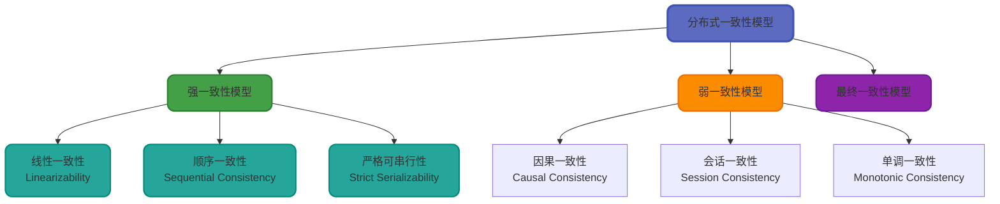
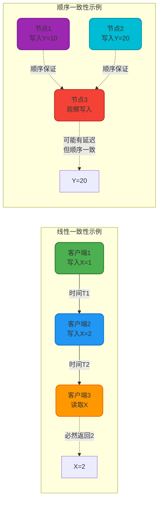
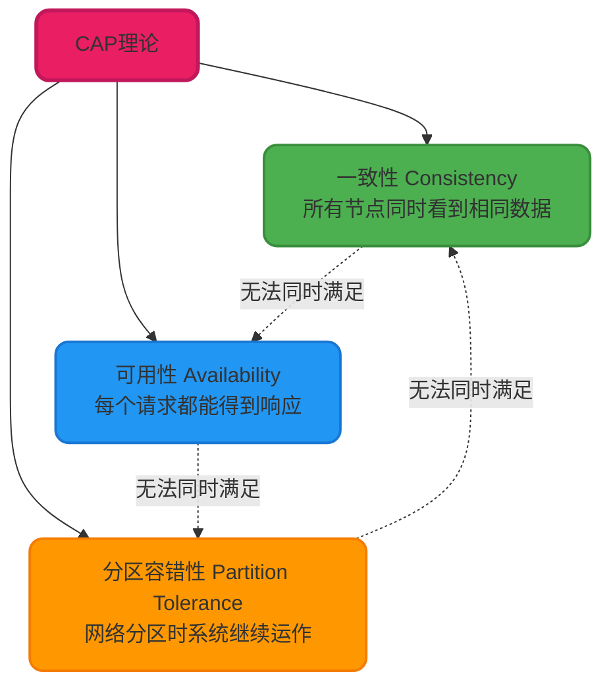
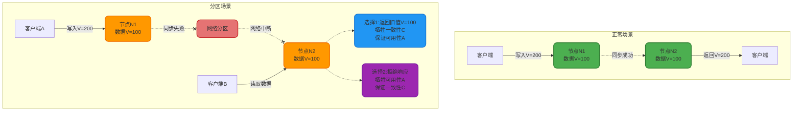
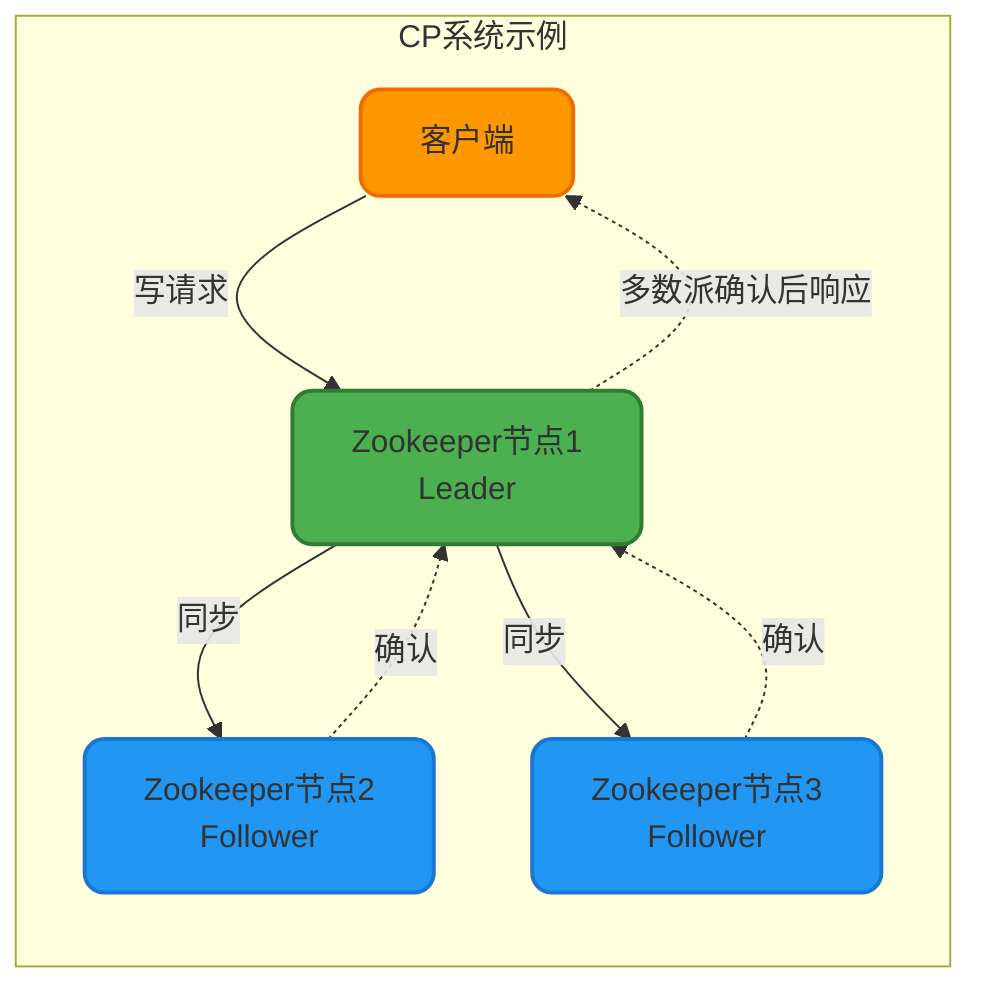
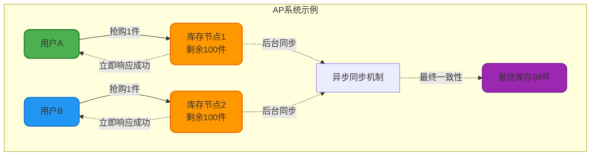
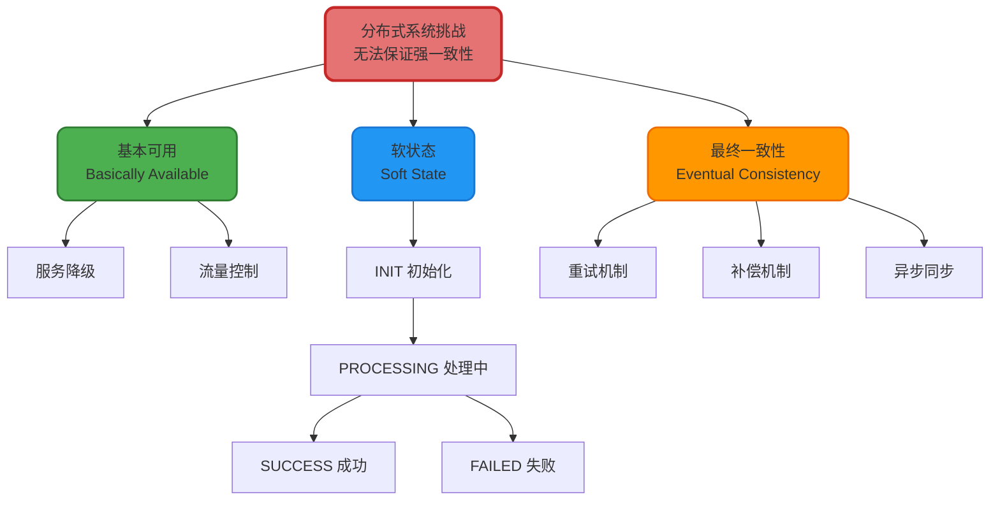
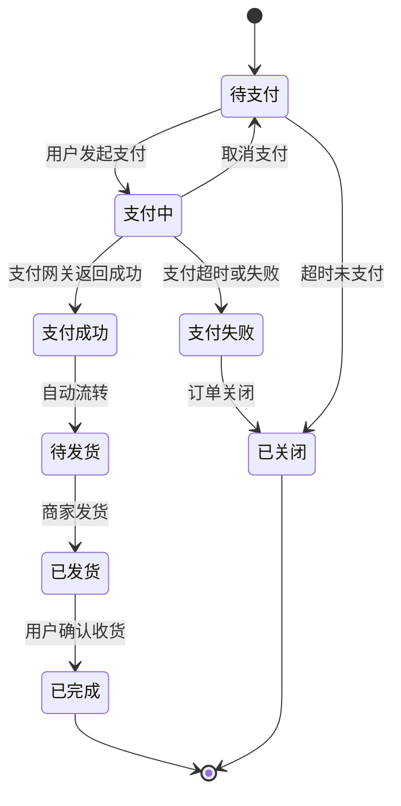
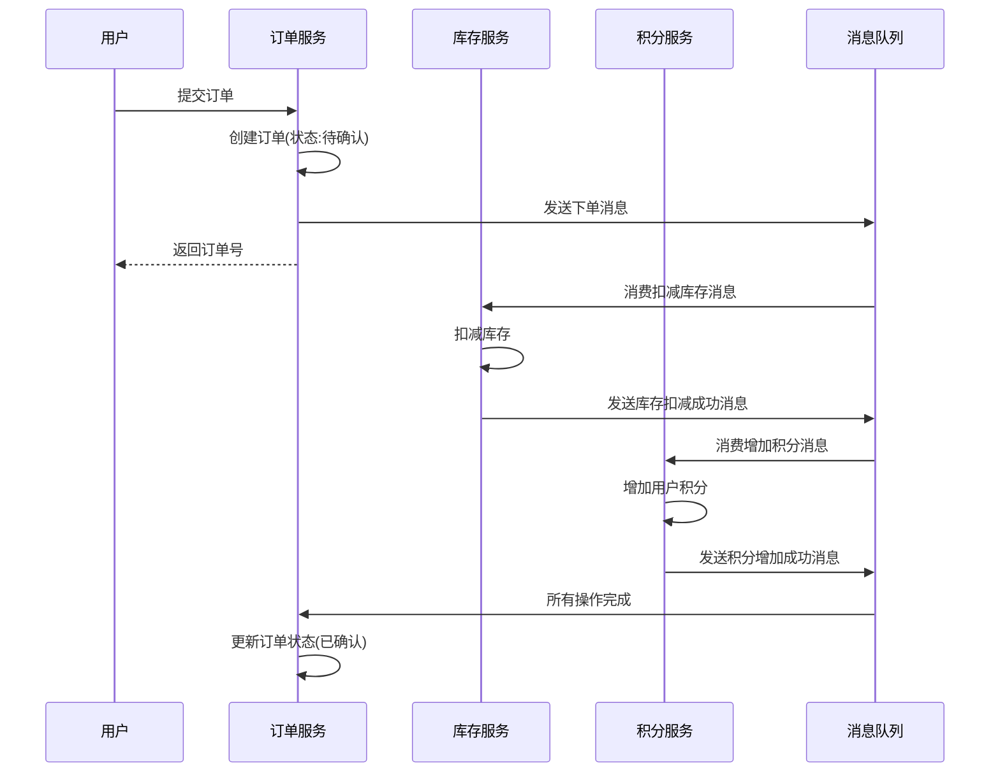

# 分布式系统一致性理论详解

## 一致性理论概述

在分布式系统中,数据通常会被复制到多个节点以提高可用性和容错性。一致性是指这些副本数据之间能否保持同步和一致的特性。一致性理论为分布式系统的设计提供了重要的理论基础,帮助工程师在不同场景下做出合理的权衡决策。

分布式系统的一致性模型定义了系统中数据访问和更新的行为规则,面对网络延迟和节点故障等分布式环境下的挑战,不同的一致性模型提供了不同的保证级别和性能特征。

## 一致性模型分类

分布式系统中的一致性模型主要分为三大类:强一致性、弱一致性和最终一致性。

### 强一致性模型

强一致性模型确保系统中的任何读操作都能获取到最新的写入结果,所有节点在任意时刻看到的数据视图完全相同。这种模型牺牲了部分可用性和性能来换取数据的绝对一致性。

**线性一致性(Linearizability)** 是最严格的一致性模型,它要求操作在真实时间轴上保持严格的先后顺序。如果操作A在真实时间上早于操作B完成,那么系统中所有节点观察到的顺序也必须是A先于B。这种模型强调实时性,常用于分布式数据库和协调服务。

**顺序一致性(Sequential Consistency)** 相对宽松一些,它只要求所有节点看到的操作顺序一致,但不强制要求操作按真实时间顺序执行。例如Zookeeper采用ZAB协议保证的就是顺序一致性,各个节点的写入顺序保持一致,但允许一定的时间延迟。

### 弱一致性与最终一致性

**弱一致性模型**允许不同节点之间存在数据不一致的时间窗口,通过放松一致性约束来获得更高的性能和可用性。因果一致性保证有因果关系的操作按顺序执行,会话一致性保证同一会话内的操作顺序可见。

**最终一致性模型**是一致性要求最宽松的模型,它只保证在没有新的更新操作后,经过一段时间系统最终会达到一致状态。这个时间窗口内允许出现数据不一致,但最终结果是一致的。这种模型在互联网高可用系统中广泛应用。

## CAP理论深度解析

CAP理论是分布式系统设计的基石理论,由Eric Brewer在2000年提出。该理论指出:在分布式系统中,一致性(Consistency)、可用性(Availability)和分区容错性(Partition Tolerance)这三个特性无法同时满足,最多只能同时保证其中两项。

### CAP三要素详解

**一致性(Consistency)**:每次读操作都能获取到最新写入的数据或者返回错误,而不是过期数据。这里的一致性特指强一致性,不同的系统可能采用线性一致性或顺序一致性等不同的强一致性模型。

**可用性(Availability)**:每个请求都能在合理时间内收到非错误的响应,但不保证数据是最新的。系统的可用性通常用年度停机时间来衡量,例如99.999%的可用性意味着全年停机时间少于5分钟。

**分区容错性(Partition Tolerance)**:当网络分区导致节点间通信中断时,系统仍能继续提供服务。在分布式环境中,网络分区是必然会发生的,因此P是分布式系统的基本要求。

### CAP不可兼得的证明

我们通过一个经典场景来理解为什么CAP无法同时满足:

当网络分区发生时,节点N1和N2之间无法通信。此时客户端A向N1写入新值V=200,但无法同步到N2。如果客户端B向N2发起读请求,系统面临两个选择:

1. 返回旧值V=100,保证可用性但牺牲一致性(AP模式)
2. 拒绝响应或等待同步,保证一致性但牺牲可用性(CP模式)

这个场景清晰地证明了在分区容错的前提下,一致性和可用性无法同时满足。

### CAP权衡策略

在实际系统设计中,由于分区容错性P是分布式系统的基本要求,我们主要在C和A之间做权衡:

**CP模式 - 优先保证一致性**

典型代表:Zookeeper、HBase、Etcd

这类系统在网络分区时宁可暂停服务,也要保证数据的强一致性。例如Zookeeper在半数以上节点无法通信时会拒绝写入请求,确保所有写入都经过多数派确认。适用于对数据准确性要求极高的场景,如配置中心、分布式锁。

**AP模式 - 优先保证可用性**

典型代表:Cassandra、DynamoDB、电商系统

这类系统允许在网络分区期间出现数据不一致,但保证每个请求都能快速响应。例如电商抢购场景中,允许短时间内库存数据不一致,通过后续的对账和补偿机制达到最终一致性。适用于对可用性要求极高的互联网业务。

## BASE理论与柔性事务

BASE理论是对CAP理论的延伸和补充,由eBay架构师Dan Pritchett提出。它为无法实现强一致性的分布式系统提供了一种可行的设计思路。

BASE是三个概念的缩写:

- **基本可用(Basically Available)**:允许损失部分可用性,保证核心功能可用
- **软状态(Soft State)**:允许系统存在中间状态,该状态不影响整体可用性
- **最终一致性(Eventual Consistency)**:经过一定时间后,所有副本最终达到一致

### BASE核心思想

### 基本可用策略

在高并发场景下,系统可能无法提供100%的服务能力,但需要保证核心业务的基本可用。

**电商大促场景示例**:

在双11零点抢购时,系统面临平时100倍的流量压力。此时可采取以下降级策略:

- 商品详情页的评论功能临时关闭,只保留购买功能
- 推荐系统降级为静态推荐,节省计算资源
- 部分用户引导到等待页面,实施流量削峰
- 非核心接口返回默认数据而非实时查询

这些措施损失了部分用户体验,但保证了下单支付等核心流程的稳定性。

### 软状态设计

软状态允许系统在数据同步过程中存在中间状态,这些中间状态为实现最终一致性提供了基础。

**订单状态机示例**:

订单在"支付中"状态时,本地订单系统已标记为支付中,但支付网关可能尚未完成扣款。这个中间状态允许系统进行异步处理和重试,最终通过回调或轮询机制达到一致。

### 最终一致性实现

**分布式事务场景**:用户下单购买商品,涉及订单服务、库存服务、积分服务三个独立系统。

在这个流程中:
1. 订单服务先创建订单并立即响应用户,此时订单处于软状态
2. 通过消息队列异步调用库存和积分服务
3. 各服务独立处理,即使某个服务暂时失败也可通过消息重试
4. 最终所有操作完成后,订单状态更新为最终状态

这种设计保证了可用性(用户快速得到响应),也通过异步机制和重试保证了最终一致性。

### ACID与BASE的对比

| 特性维度 | ACID | BASE |
|---------|------|------|
| 应用场景 | 传统关系型数据库 | 分布式系统 |
| 一致性保证 | 强一致性 | 最终一致性 |
| 性能特点 | 牺牲性能保证一致性 | 牺牲一致性保证性能 |
| 可用性 | 相对较低 | 高可用 |
| 实现复杂度 | 数据库层面保证 | 业务层面设计 |
| 典型代表 | MySQL事务、Oracle | Cassandra、电商系统 |

ACID和BASE代表了两种不同的设计哲学,在实际系统中往往是结合使用:核心业务数据使用ACID保证强一致性,非核心数据采用BASE提升性能和可用性。例如在支付系统中,账户余额使用强一致性事务,而操作日志可以采用最终一致性。

## 工程实践建议

### 选择合适的一致性模型

不同业务场景对一致性的要求差异很大:

**强一致性场景**:
- 金融交易系统:账户余额必须精确一致
- 库存扣减:防止超卖
- 分布式锁:保证互斥性

**最终一致性场景**:
- 社交网络:点赞数、评论数允许短暂延迟
- 内容分发:文章更新可以逐步同步到各节点
- 数据分析:统计数据允许一定误差

### 实现最终一致性的常用模式

**消息队列模式**:通过可靠消息传递保证操作最终执行

**事件溯源模式**:记录所有状态变更事件,通过重放事件达到一致

**TCC模式**:Try-Confirm-Cancel三阶段提交

**Saga模式**:长事务拆分为多个本地事务,通过补偿机制保证一致性

这些模式在实际项目中可以灵活组合使用,关键是理解其背后的一致性保证机制。
