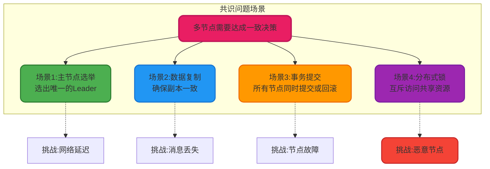
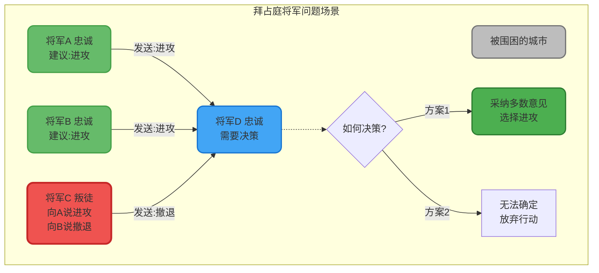
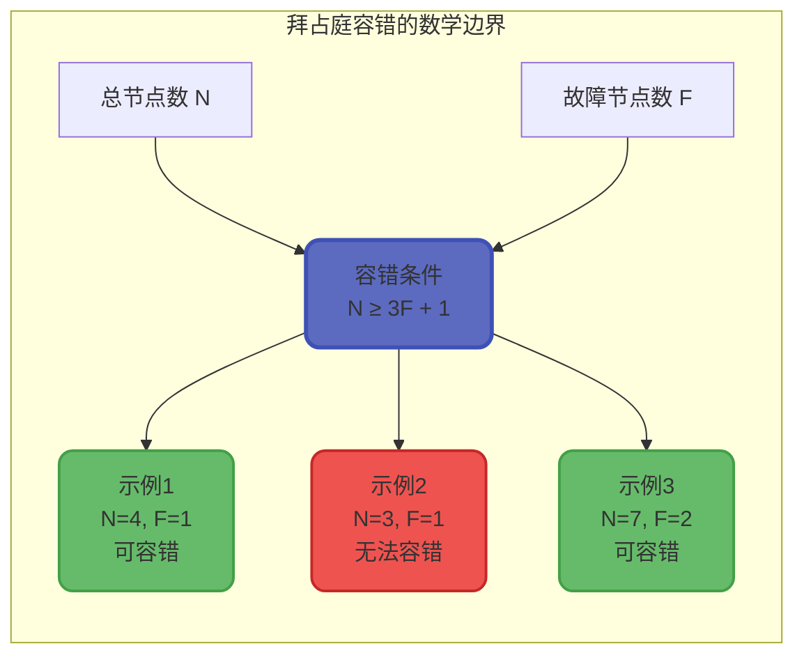
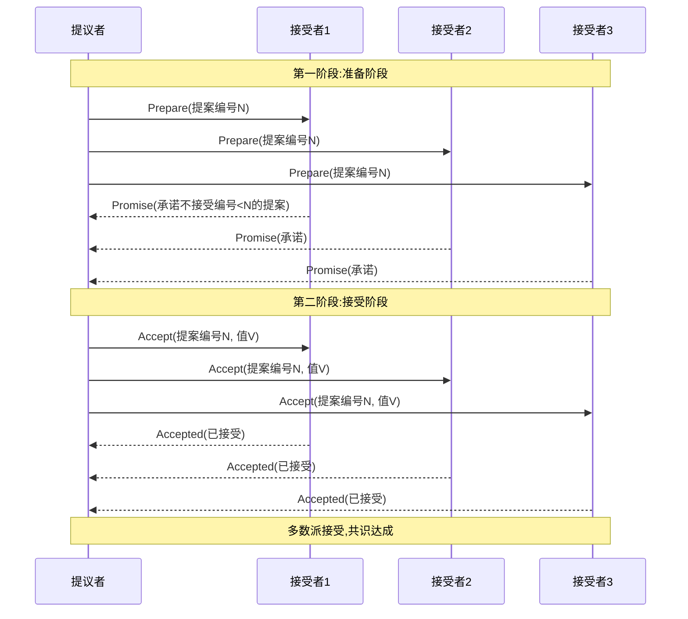
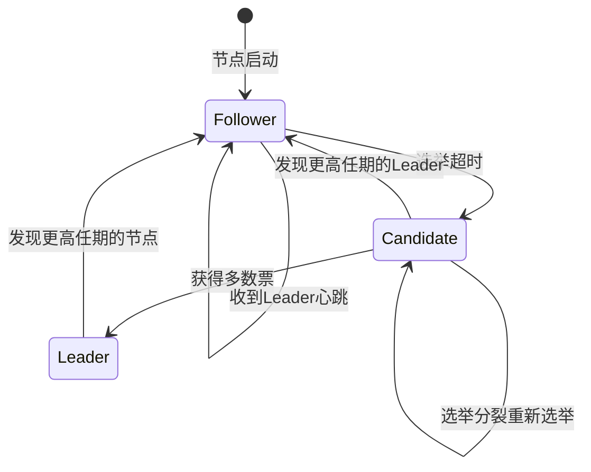
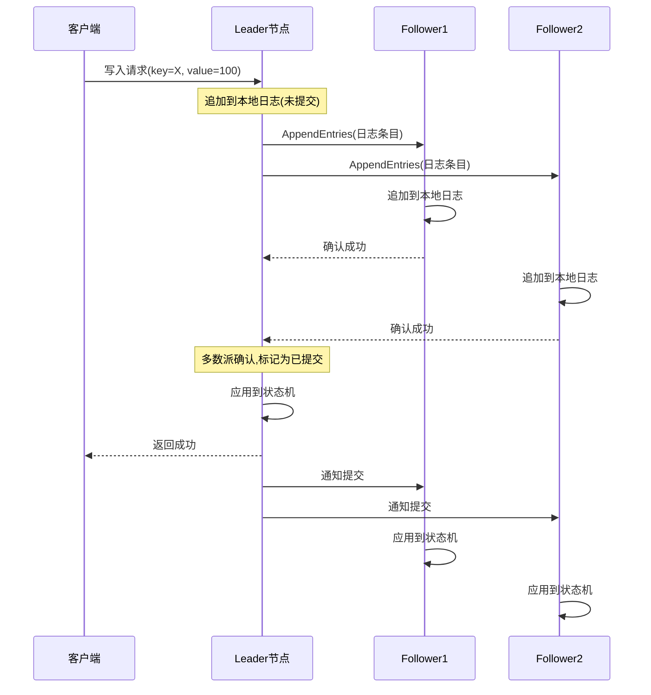
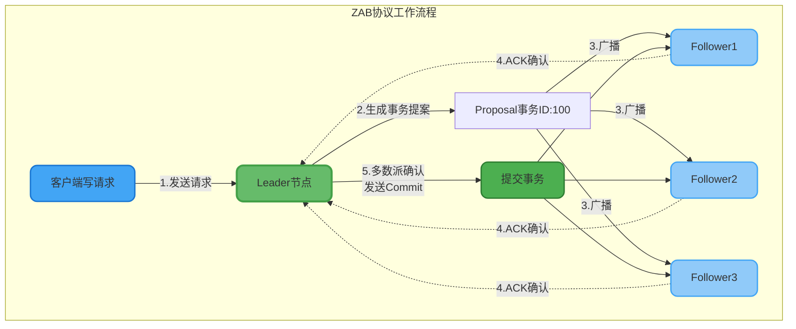
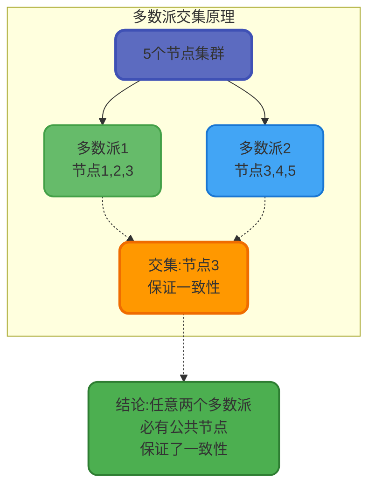
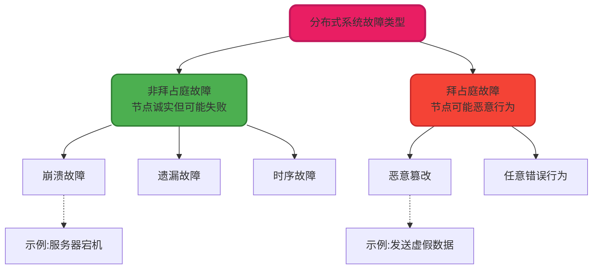

# 分布式共识算法与拜占庭问题

## 分布式共识问题的由来

在分布式系统中,多个节点需要对某个值或决策达成一致意见,这就是共识问题。这个看似简单的问题,在分布式环境下却极具挑战性,因为我们面临着网络延迟、消息丢失、节点故障等诸多不确定因素。

### 为什么需要共识

**分布式数据库场景**:当用户在电商平台下单时,订单数据需要同步到多个数据库副本。如果各个副本对订单状态的理解不一致(有的认为已支付,有的认为未支付),就会导致严重的业务错误。

**分布式锁场景**:多个服务实例竞争同一资源的访问权限,需要确保同一时刻只有一个实例获得锁。如果共识机制失效,可能导致多个实例同时获得锁,破坏互斥性。

**配置管理场景**:微服务架构中,配置中心需要确保所有服务节点获取到一致的配置信息。配置不一致可能导致部分节点行为异常。

## 拜占庭将军问题详解

### 问题起源与背景

拜占庭将军问题由Leslie Lamport等人在1982年提出,是对分布式共识问题的一个经典抽象模型。这个问题源于这样一个历史场景:

拜占庭帝国派遣多支军队包围一座敌方城市,每支军队由一位将军指挥。将军们只能通过信使传递消息进行沟通。他们必须共同决定是进攻还是撤退,只有所有忠诚的将军达成一致,行动才能成功。

然而,军队中可能存在叛徒将军,他们会:
- 向不同的将军发送不同的消息(对A说进攻,对B说撤退)
- 篡改或延迟其他将军的消息
- 故意提供错误的情报

**问题的核心**:如何设计一个算法,使得忠诚的将军能够在不知道谁是叛徒的情况下,达成一致的决策?

### 问题的数学描述

假设有N个将军,其中F个是叛徒。拜占庭容错算法需要满足以下条件:

**一致性(Agreement)**:所有忠诚的将军必须做出相同的决策

**正确性(Validity)**:如果所有忠诚的将军都提议相同的值,那么最终决策必须是这个值

**终止性(Termination)**:算法必须在有限时间内结束,不能无限期等待

### 理论边界与限制

Lamport等人证明了一个重要结论:

**在同步系统中,当且仅当叛徒数量F少于总数N的三分之一时,即N大于等于3F+1,拜占庭容错算法才存在解。**

这意味着:
- 3个将军,最多容忍0个叛徒(无法容错)
- 4个将军,最多容忍1个叛徒
- 7个将军,最多容忍2个叛徒
- 10个将军,最多容忍3个叛徒

### 为什么需要3F+1个节点?

我们通过一个具体例子来理解:

假设有3个将军(A、B、C),其中C是叛徒。A提议进攻,B提议进攻,C向A说自己提议撤退,向B说自己提议进攻。

从A的视角:
- A自己提议进攻
- A收到B的消息:进攻
- A收到C的消息:撤退
- A看到的投票是2:1,选择进攻

从B的视角:
- B自己提议进攻
- B收到A的消息:进攻
- B收到C的消息:进攻
- B看到的投票是3:0,选择进攻

这个例子中虽然A和B最终都选择进攻,但如果C足够狡猾,可以构造更复杂的消息模式,使得忠诚的将军无法达成一致。

当有4个将军时,即使有1个叛徒,忠诚的将军可以通过多轮投票和消息验证,最终识别出不一致的信息,达成共识。

## 主流共识算法

### 基于投票的共识算法

分布式系统中常用的共识算法都基于"多数派"原则,通过投票机制确保一致性。

**Paxos算法**

Paxos是最著名的共识算法之一,由Leslie Lamport提出。它通过两阶段协议达成共识:

Paxos的关键思想:
- 提案编号保证顺序性
- 多数派机制保证一致性
- 承诺机制防止旧提案覆盖新提案

**Raft算法**

Raft是对Paxos的简化和改进,更易于理解和实现。它将共识问题分解为三个子问题:

1. **领导者选举**:集群中选出一个Leader节点
2. **日志复制**:Leader接收客户端请求,复制到Follower节点
3. **安全性**:确保已提交的日志不会丢失

Raft的日志复制过程:

**ZAB协议**

ZAB(Zookeeper Atomic Broadcast)是Zookeeper使用的共识协议,与Raft类似但有所区别:

核心流程:
1. 选举Leader
2. Leader向Follower同步数据
3. 广播写入请求
4. 多数派确认后提交

ZAB保证了顺序一致性,即所有节点按相同的顺序应用事务。

### 多数派原则的核心逻辑

所有这些算法都基于一个核心思想:**超过半数节点的确认**。

为什么是半数而不是全部?
- 全部确认无法容忍任何节点故障
- 半数确认既保证一致性,又具备容错能力

数学证明:
- 假设集群有N个节点
- 多数派需要N/2+1个节点确认
- 如果有两个多数派集合,它们至少有1个公共节点
- 这个公共节点保证了两个多数派的一致性

## 非拜占庭容错与拜占庭容错

### 故障模型分类

分布式系统中的节点故障可以分为两大类:

**非拜占庭故障(Crash Fault)**

节点可能崩溃停止工作,但不会发送错误或恶意的消息。这是大多数分布式系统假设的故障模型。

典型场景:
- 服务器宕机
- 网络分区
- 进程崩溃
- 消息丢失

**拜占庭故障(Byzantine Fault)**

节点可能表现出任意异常行为,包括:
- 发送虚假消息
- 向不同节点发送不一致的消息  
- 篡改数据
- 恶意攻击

### 算法容错能力对比

| 算法 | 容错类型 | 容错数量 | 性能开销 | 应用场景 |
|-----|---------|---------|---------|---------|
| Raft | 非拜占庭 | (N-1)/2 | 低 | 配置中心、分布式数据库 |
| Paxos | 非拜占庭 | (N-1)/2 | 中 | 分布式协调系统 |
| ZAB | 非拜占庭 | (N-1)/2 | 低 | Zookeeper集群 |
| PBFT | 拜占庭 | (N-1)/3 | 高 | 区块链、高安全要求系统 |

**PBFT(实用拜占庭容错)算法**

PBFT是第一个实用的拜占庭容错算法,在N≥3F+1的情况下,可以容忍F个拜占庭故障节点。

工作流程:
1. 客户端向主节点发送请求
2. 主节点广播请求给所有副本节点
3. 副本节点执行三阶段协议:预准备、准备、提交
4. 每个阶段都需要2F+1个节点确认
5. 提交后向客户端返回结果

PBFT的代价是高通信复杂度,消息数量为O(N²),因此主要用于节点数较少但安全性要求极高的场景,如联盟链。

## 工程实践中的选择

### 何时需要拜占庭容错?

**需要拜占庭容错的场景**:
- 公有区块链:节点完全不可信
- 跨组织协作:参与方可能存在利益冲突
- 高安全场景:防范恶意攻击

**不需要拜占庭容错的场景**:
- 企业内部系统:节点可信
- 私有云环境:物理隔离保证安全
- 配置中心:节点由同一团队维护

### 主流系统的选择

**Etcd/Consul**:使用Raft,假设节点诚实,适合内部系统

**Zookeeper**:使用ZAB,假设节点诚实,高性能低延迟

**比特币**:使用PoW工作量证明,容忍拜占庭故障,适合去中心化场景

**Hyperledger Fabric**:使用PBFT,容忍拜占庭故障,适合联盟链

### 性能与安全的权衡

拜占庭容错算法提供了更强的安全保证,但代价是:
- 更多的消息通信(O(N²)复杂度)
- 更长的确认延迟(需要更多轮次)
- 需要更多节点才能达到相同容错能力

在大多数企业应用中,非拜占庭容错算法已经足够,因为:
- 内部网络相对安全
- 节点由可信团队维护
- 性能要求高于极端安全性

理解这些共识算法的原理和适用场景,能够帮助我们在系统设计时做出正确的技术选型。
