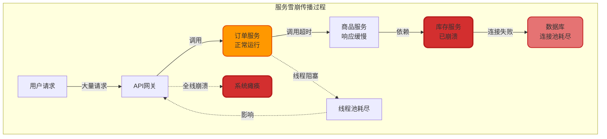
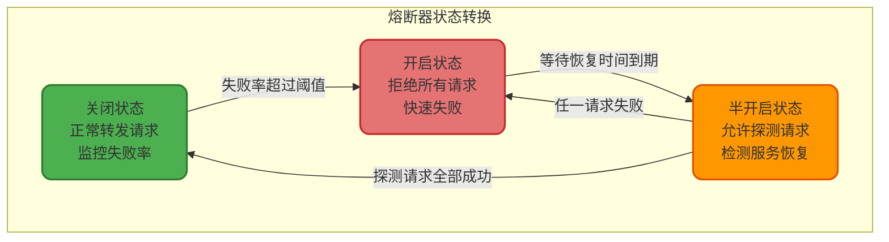
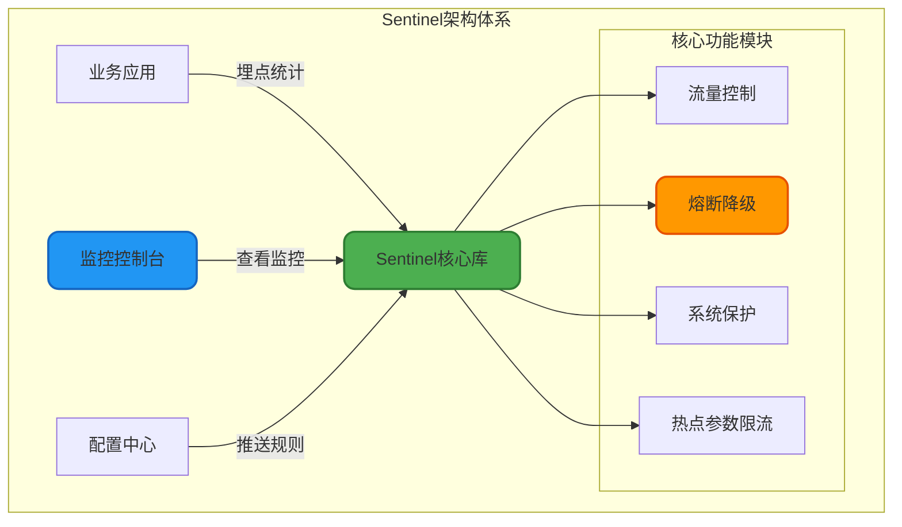
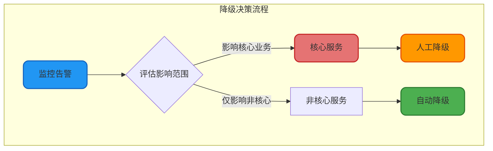

# 熔断降级机制与实践

## 服务熔断机制

### 服务雪崩问题

在大规模分布式系统中,服务之间通过RPC进行远程调用形成复杂的依赖链路。当某个下游服务因故障导致响应缓慢或完全不可用时,上游服务的调用线程会被长时间阻塞,导致线程池资源耗尽,进而影响到更上层的服务,最终引发整个系统的级联故障,这种现象被称为**服务雪崩**。



### 熔断器原理

熔断器(Circuit Breaker)是一种自动化的故障隔离机制,通过监控服务调用的失败率或响应时间,当异常指标超过阈值时,主动切断对故障服务的调用,快速失败并返回降级结果,避免资源浪费和故障扩散。

熔断器具有三种状态,通过状态机模式实现自动切换:

**关闭状态(Closed)**: 熔断器默认处于关闭状态,所有请求正常转发到下游服务。熔断器内部维护一个失败计数器,记录调用失败次数。当失败次数或失败率达到预设阈值时,熔断器切换到开启状态。

**开启状态(Open)**: 熔断器开启后,所有请求直接被拒绝,不再调用下游服务,立即返回失败或执行降级逻辑。同时启动一个恢复定时器,经过一定时间后自动切换到半开启状态。

**半开启状态(Half-Open)**: 熔断器允许部分探测请求通过,如果这些请求全部成功,说明下游服务已恢复,熔断器切换回关闭状态并重置计数器;如果任一请求失败,则立即回到开启状态,重新计时。



### 熔断器的核心价值

**快速失败**: 当下游服务不可用时,上游服务不再等待超时,而是立即失败返回,释放系统资源,避免线程池被占满。

**自动恢复**: 熔断器通过定期探测机制,自动检测下游服务是否恢复,无需人工干预即可恢复正常调用链路。

**故障隔离**: 将故障控制在局部范围,防止异常在服务间传播,保护核心业务功能的可用性。

## 熔断器实现框架

### Hystrix

Hystrix是Netflix开源的容错框架,提供了完整的熔断、隔离、降级功能。虽然官方在2018年宣布不再开发新特性,但其稳定的1.5.18版本仍被广泛使用。

#### Hystrix核心功能

**线程池隔离**: 为每个依赖服务分配独立的线程池,即使某个服务调用阻塞,也不会影响其他服务的调用。

**信号量隔离**: 使用信号量控制并发调用数量,适用于内部服务调用的轻量级隔离场景。

**熔断机制**: 基于滑动窗口统计失败率,自动开启和关闭熔断器。

**降级回退**: 当服务调用失败或被熔断时,执行预定义的降级逻辑,返回默认值或缓存数据。

```java
public class ProductQueryService {
    
    /**
     * 查询商品详情,支持熔断降级
     */
    @HystrixCommand(
        fallbackMethod = "getProductFromCache",
        commandProperties = {
            // 熔断器请求阈值:10秒内至少20个请求
            @HystrixProperty(name = "circuitBreaker.requestVolumeThreshold", value = "20"),
            // 熔断器错误比例阈值:失败率超过50%时开启熔断
            @HystrixProperty(name = "circuitBreaker.errorThresholdPercentage", value = "50"),
            // 熔断器开启时长:5秒后进入半开启状态
            @HystrixProperty(name = "circuitBreaker.sleepWindowInMilliseconds", value = "5000"),
            // 调用超时时间:2秒
            @HystrixProperty(name = "execution.isolation.thread.timeoutInMilliseconds", value = "2000")
        },
        threadPoolProperties = {
            // 线程池核心大小
            @HystrixProperty(name = "coreSize", value = "10"),
            // 队列最大长度
            @HystrixProperty(name = "maxQueueSize", value = "50")
        }
    )
    public ProductDTO getProductDetail(Long productId) {
        // 调用远程商品服务
        return productRpcClient.queryProduct(productId);
    }
    
    /**
     * 降级方法:从缓存获取商品信息
     */
    public ProductDTO getProductFromCache(Long productId, Throwable throwable) {
        logger.warn("商品服务调用失败,使用缓存数据,productId: {}, error: {}", 
                    productId, throwable.getMessage());
        
        // 尝试从Redis缓存获取
        ProductDTO cachedProduct = redisTemplate.opsForValue()
            .get("product:detail:" + productId);
        
        if (cachedProduct != null) {
            cachedProduct.setFromCache(true);
            return cachedProduct;
        }
        
        // 返回默认商品信息
        return ProductDTO.builder()
            .productId(productId)
            .productName("商品服务暂时不可用")
            .available(false)
            .build();
    }
}
```

### Resilience4j

Resilience4j是Hystrix官方推荐的替代方案,采用函数式编程风格,提供更加轻量和灵活的容错能力。

#### 核心特性

**装饰器模式**: 通过装饰器方式为业务方法添加熔断、限流、重试等功能,代码侵入性更低。

**环状缓冲区**: 采用固定大小的环状缓冲区记录调用结果,相比Hystrix的滑动窗口,内存占用更小且性能更好。

**多阈值策略**: 半开启状态支持配置多次探测和阈值判断,提高熔断器状态切换的稳定性。

```java
public class OrderServiceWithResilience {
    
    private final CircuitBreakerRegistry circuitBreakerRegistry;
    private final CircuitBreaker circuitBreaker;
    
    public OrderServiceWithResilience() {
        // 配置熔断器参数
        CircuitBreakerConfig config = CircuitBreakerConfig.custom()
            // 环状缓冲区大小:记录100次调用结果
            .slidingWindowSize(100)
            // 失败率阈值:60%
            .failureRateThreshold(60)
            // 慢调用比例阈值:50%
            .slowCallRateThreshold(50)
            // 慢调用时间阈值:2秒
            .slowCallDurationThreshold(Duration.ofSeconds(2))
            // 半开启状态允许的调用数:10次
            .permittedNumberOfCallsInHalfOpenState(10)
            // 最小调用次数:20次
            .minimumNumberOfCalls(20)
            // 开启状态持续时间:30秒
            .waitDurationInOpenState(Duration.ofSeconds(30))
            .build();
        
        circuitBreakerRegistry = CircuitBreakerRegistry.of(config);
        circuitBreaker = circuitBreakerRegistry.circuitBreaker("orderService");
    }
    
    /**
     * 创建订单,带熔断保护
     */
    public OrderResult createOrder(OrderRequest request) {
        // 使用熔断器装饰业务方法
        Supplier<OrderResult> decoratedSupplier = CircuitBreaker
            .decorateSupplier(circuitBreaker, () -> executeCreateOrder(request));
        
        try {
            return decoratedSupplier.get();
        } catch (CallNotPermittedException e) {
            // 熔断器开启,执行降级逻辑
            logger.error("订单服务熔断,orderId: {}", request.getOrderId());
            return OrderResult.builder()
                .success(false)
                .message("订单系统繁忙,请稍后重试")
                .build();
        }
    }
    
    private OrderResult executeCreateOrder(OrderRequest request) {
        // 实际的订单创建逻辑
        return orderRepository.save(request);
    }
}
```

### Sentinel

Sentinel是阿里巴巴开源的流控降级组件,提供实时监控控制台和丰富的限流降级规则,特别适合国内业务场景。

#### Sentinel优势

**多维度流控**: 支持QPS限流、线程数限流、系统负载保护等多种流控维度。

**实时监控**: 提供可视化的实时监控面板,展示每个资源的通过量、拒绝量、响应时间等指标。

**规则动态配置**: 支持通过控制台或配置中心动态调整限流熔断规则,无需重启应用。

**链路限流**: 可以根据调用链路的来源进行精细化限流,实现更灵活的流控策略。



```java
public class PaymentServiceWithSentinel {
    
    /**
     * 支付接口,支持熔断降级
     */
    @SentinelResource(
        value = "paymentProcess",
        blockHandler = "handleBlock",
        fallback = "handleFallback"
    )
    public PaymentResult processPayment(PaymentRequest request) {
        // 调用第三方支付服务
        return thirdPartyPaymentService.pay(request);
    }
    
    /**
     * 限流处理方法
     */
    public PaymentResult handleBlock(PaymentRequest request, BlockException e) {
        logger.warn("支付请求被限流,userId: {}", request.getUserId());
        return PaymentResult.builder()
            .success(false)
            .code("RATE_LIMIT")
            .message("当前支付人数过多,请稍后重试")
            .build();
    }
    
    /**
     * 熔断降级方法
     */
    public PaymentResult handleFallback(PaymentRequest request, Throwable throwable) {
        logger.error("支付服务异常,userId: {}, error: {}", 
                     request.getUserId(), throwable.getMessage());
        
        // 将支付请求放入延迟队列,稍后重试
        delayQueue.offer(request);
        
        return PaymentResult.builder()
            .success(false)
            .code("SERVICE_UNAVAILABLE")
            .message("支付服务暂时不可用,系统将自动重试")
            .build();
    }
    
    /**
     * 初始化熔断降级规则
     */
    @PostConstruct
    public void initDegradeRules() {
        List<DegradeRule> rules = new ArrayList<>();
        
        DegradeRule rule = new DegradeRule("paymentProcess")
            // 熔断策略:异常比例
            .setGrade(CircuitBreakerStrategy.ERROR_RATIO)
            // 异常比例阈值:30%
            .setCount(0.3)
            // 统计时长:10秒
            .setStatIntervalMs(10000)
            // 最小请求数:20
            .setMinRequestAmount(20)
            // 熔断时长:60秒
            .setTimeWindow(60);
        
        rules.add(rule);
        DegradeRuleManager.loadRules(rules);
    }
}
```

## 服务降级策略

### 降级的概念

服务降级是指在系统资源紧张或流量高峰时期,主动关闭或弱化非核心功能,保障核心业务的可用性。与熔断机制不同,降级通常不是完全不可用,而是采用默认返回、异步处理、延迟执行等方式降低服务质量。

### 降级场景分类

#### 延迟服务

将非实时性的操作延迟处理,通过异步队列在系统空闲时执行。

**应用场景**: 用户发表评论后,评论内容立即展示,但积分奖励、消息推送等操作放入延迟队列,在流量平稳后再执行。

```java
public class CommentService {
    
    @Autowired
    private RabbitTemplate rabbitTemplate;
    
    /**
     * 发表评论,积分计算降级为异步处理
     */
    public CommentResult publishComment(CommentRequest request) {
        // 核心功能:保存评论内容
        CommentEntity comment = new CommentEntity();
        comment.setContent(request.getContent());
        comment.setUserId(request.getUserId());
        comment.setCreateTime(new Date());
        commentRepository.save(comment);
        
        // 降级功能:积分奖励异步处理
        PointsTask pointsTask = PointsTask.builder()
            .userId(request.getUserId())
            .points(10)
            .reason("发表评论")
            .build();
        rabbitTemplate.convertAndSend("points.delay.queue", pointsTask);
        
        return CommentResult.success("评论发表成功");
    }
}
```

#### 功能降级

在流量高峰期关闭非核心功能模块,减少系统负载。

**典型案例**: 电商大促期间,商品详情页关闭"为你推荐"、"看了又看"等推荐模块,仅保留商品信息、价格、库存、加购等核心功能。

```java
public class ProductDetailService {
    
    @Autowired
    private DegradeConfigService degradeConfig;
    
    /**
     * 获取商品详情,支持功能降级
     */
    public ProductDetailVO getProductDetail(Long productId) {
        ProductDetailVO detail = new ProductDetailVO();
        
        // 核心信息:始终加载
        detail.setBasicInfo(loadBasicInfo(productId));
        detail.setPriceInfo(loadPriceInfo(productId));
        detail.setStockInfo(loadStockInfo(productId));
        
        // 非核心信息:根据降级开关决定是否加载
        if (!degradeConfig.isDegraded("product.recommend")) {
            detail.setRecommendList(loadRecommendProducts(productId));
        }
        
        if (!degradeConfig.isDegraded("product.reviews")) {
            detail.setReviewList(loadProductReviews(productId));
        }
        
        return detail;
    }
}
```

#### 读降级

在数据库压力过大时,降级为只读缓存,牺牲数据的实时一致性。

```java
public class UserProfileService {
    
    @Autowired
    private RedisTemplate<String, UserProfile> redisTemplate;
    
    @Autowired
    private DegradeSwitch degradeSwitch;
    
    /**
     * 查询用户信息,支持读降级
     */
    public UserProfile getUserProfile(Long userId) {
        String cacheKey = "user:profile:" + userId;
        
        // 检查是否开启读降级
        if (degradeSwitch.isReadDegraded()) {
            // 降级模式:仅从缓存读取,不查询数据库
            UserProfile cachedProfile = redisTemplate.opsForValue().get(cacheKey);
            if (cachedProfile != null) {
                logger.info("读降级:从缓存返回用户信息,userId: {}", userId);
                return cachedProfile;
            }
            // 缓存未命中,返回默认信息
            return UserProfile.getDefault(userId);
        }
        
        // 正常模式:缓存穿透,查询数据库
        UserProfile profile = userRepository.findById(userId).orElse(null);
        if (profile != null) {
            redisTemplate.opsForValue().set(cacheKey, profile, 1, TimeUnit.HOURS);
        }
        return profile;
    }
}
```

#### 写降级

在秒杀等高并发写场景中,先更新缓存,异步同步到数据库,保证最终一致性。

```java
public class FlashSaleService {
    
    @Autowired
    private RedisTemplate<String, Integer> redisTemplate;
    
    @Autowired
    private AsyncStockSyncService asyncSync;
    
    /**
     * 秒杀扣减库存,写降级
     */
    public boolean deductStock(Long productId, Integer quantity) {
        String stockKey = "flashsale:stock:" + productId;
        
        // 降级策略:仅更新Redis缓存
        Long remainStock = redisTemplate.opsForValue()
            .decrement(stockKey, quantity);
        
        if (remainStock != null && remainStock >= 0) {
            // 异步同步库存到数据库
            asyncSync.syncStockToDb(productId, remainStock);
            return true;
        }
        
        // 库存不足,回滚
        redisTemplate.opsForValue().increment(stockKey, quantity);
        return false;
    }
}
```

### 降级触发机制

#### 自动降级

系统根据预设的监控指标,自动触发降级策略。

**常见触发条件**:
- **服务超时**: 依赖服务响应时间超过阈值
- **失败率超标**: 接口调用失败率超过设定比例
- **系统负载过高**: CPU使用率超过80%,内存使用超过90%
- **限流触发**: QPS超过系统承载能力

```java
@Component
public class AutoDegradeMonitor {
    
    @Scheduled(fixedRate = 5000)
    public void monitorSystemLoad() {
        OperatingSystemMXBean osBean = ManagementFactory.getOperatingSystemMXBean();
        double cpuLoad = osBean.getSystemLoadAverage();
        
        Runtime runtime = Runtime.getRuntime();
        long usedMemory = runtime.totalMemory() - runtime.freeMemory();
        double memoryUsage = (double) usedMemory / runtime.maxMemory();
        
        // CPU负载超过阈值,开启降级
        if (cpuLoad > 0.8) {
            degradeManager.enableDegrade("non-core-services");
            logger.warn("CPU负载过高:{},开启服务降级", cpuLoad);
        }
        
        // 内存使用超过阈值,开启降级
        if (memoryUsage > 0.9) {
            degradeManager.enableDegrade("memory-intensive-services");
            logger.warn("内存使用率过高:{},开启服务降级", memoryUsage);
        }
    }
}
```

#### 人工降级

运维人员根据业务需求或系统状况,通过配置中心或管理后台手动触发降级。

**应用场景**:
- 大促活动前,提前降级非核心功能
- 数据库主库故障,切换为只读模式
- 依赖的第三方服务维护,临时关闭相关功能



## 熔断与降级的区别

熔断和降级虽然都是保护系统的手段,但其触发时机、作用范围和实现方式存在明显差异:

| 对比维度 | 熔断机制 | 降级策略 |
|---------|---------|---------|
| 触发条件 | 依赖服务故障或响应超时 | 系统资源紧张或流量高峰 |
| 作用目标 | 保护调用方,防止资源耗尽 | 保障核心功能,牺牲非核心功能 |
| 触发方式 | 自动触发,基于失败率等指标 | 自动或人工触发 |
| 恢复机制 | 自动探测并恢复 | 需要手动或定时恢复 |
| 用户感知 | 接口调用失败或返回降级数据 | 部分功能不可用或服务质量下降 |

**典型区别场景**:
- **熔断**: 订单服务调用支付服务超时,熔断器开启后,后续订单创建请求不再调用支付服务,直接返回"支付服务暂时不可用"
- **降级**: 双十一期间,商品详情页关闭用户评论展示功能,将评论查询服务降级,减轻数据库压力

两者通常结合使用,构建完整的容错体系:熔断保护服务间调用,降级保障系统整体可用性。
