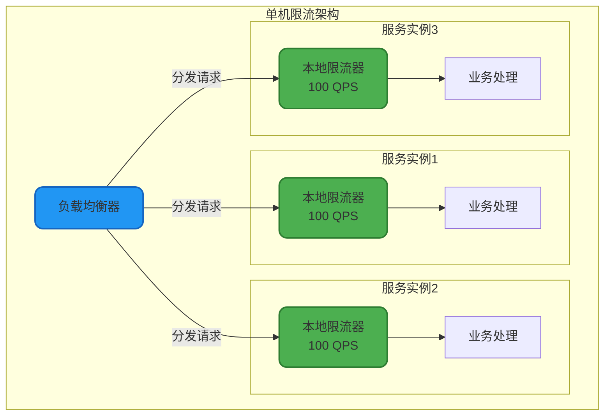
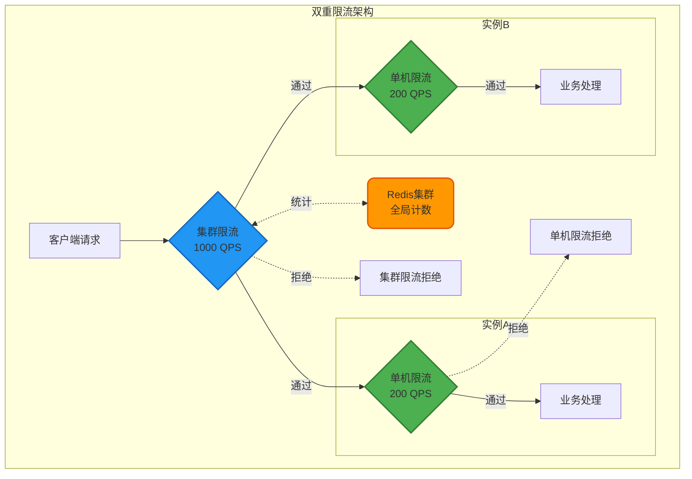
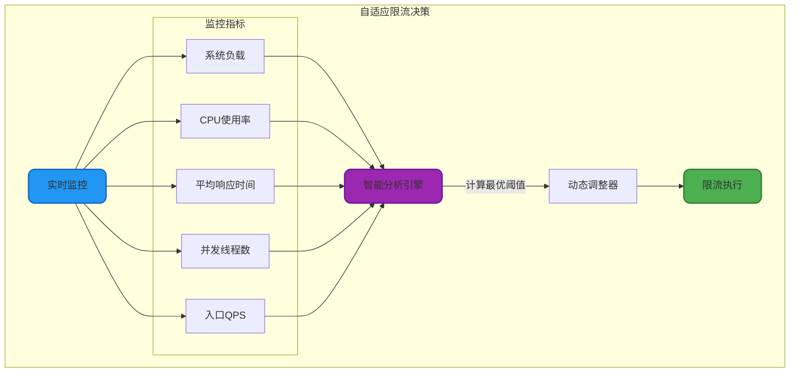
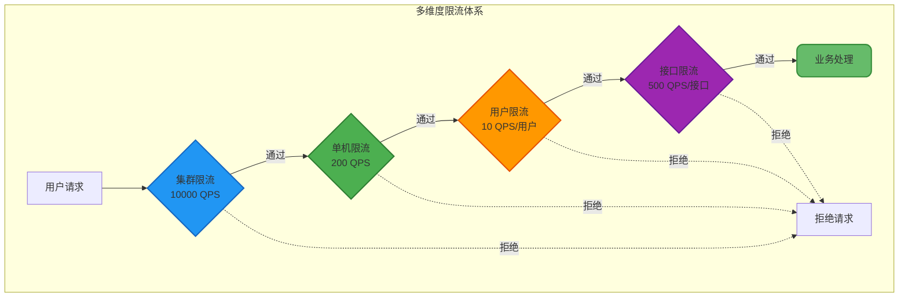

# 高级限流策略与应用

## 单机限流与集群限流

### 单机限流

单机限流是指在单个服务实例上进行流量控制,通过限制单台服务器的请求处理速率来保护服务的稳定性。这是最基础也是最常用的限流方式。

#### 实现方式

单机限流通常采用本地内存实现,无需依赖外部存储,性能开销小,响应速度快。常用的实现工具包括Guava RateLimiter、Sentinel等。

```java
public class StandaloneRateLimiterService {
    
    // 创建单机限流器:每秒允许100个请求
    private final RateLimiter rateLimiter = RateLimiter.create(100.0);
    
    /**
     * 用户登录接口限流
     */
    public LoginResult login(LoginRequest request) {
        // 尝试获取令牌,最多等待200毫秒
        if (rateLimiter.tryAcquire(1, 200, TimeUnit.MILLISECONDS)) {
            return authService.authenticate(request);
        } else {
            throw new RateLimitException("登录请求过于频繁,请稍后再试");
        }
    }
    
    /**
     * 动态调整限流速率
     */
    public void adjustRateLimit(double newRate) {
        rateLimiter.setRate(newRate);
        logger.info("限流速率已调整为: {} 请求/秒", newRate);
    }
}
```

#### 单机限流的优势

**性能优异**: 基于本地内存计算,无网络开销,延迟通常在微秒级别。

**实现简单**: 不依赖外部中间件,部署和维护成本低。

**故障隔离**: 每个实例独立限流,不会因为其他实例的故障而受影响。



### 集群限流

集群限流是在整个服务集群层面进行统一的流量控制,确保所有实例的请求总量不超过设定阈值。这需要借助分布式协调机制来实现全局计数。

#### 实现方案

集群限流通常基于Redis等分布式存储实现,利用其原子性操作特性来保证计数的准确性。

```java
public class ClusterRateLimiterService {
    
    @Autowired
    private RedisTemplate<String, String> redisTemplate;
    
    /**
     * 集群限流检查
     * @param resource 资源标识
     * @param maxRequests 集群总QPS限制
     * @param timeWindow 时间窗口(秒)
     * @return true表示允许通过
     */
    public boolean tryAcquire(String resource, int maxRequests, int timeWindow) {
        String key = "cluster:ratelimit:" + resource;
        long currentTime = System.currentTimeMillis();
        long windowStart = currentTime - timeWindow * 1000;
        
        // 使用Redis的ZSET实现滑动窗口
        ZSetOperations<String, String> zset = redisTemplate.opsForZSet();
        
        // 移除过期数据
        zset.removeRangeByScore(key, 0, windowStart);
        
        // 统计当前窗口内的请求数
        Long count = zset.zCard(key);
        
        if (count != null && count < maxRequests) {
            // 添加当前请求
            String requestId = UUID.randomUUID().toString();
            zset.add(key, requestId, currentTime);
            redisTemplate.expire(key, timeWindow, TimeUnit.SECONDS);
            return true;
        }
        
        return false;
    }
    
    /**
     * API接口集群限流
     */
    public ApiResponse handleApiRequest(ApiRequest request) {
        // 集群限制:所有实例合计每秒1000个请求
        if (tryAcquire("api:query", 1000, 1)) {
            return apiService.process(request);
        } else {
            return ApiResponse.rateLimitExceeded("集群流量已达上限");
        }
    }
}
```

#### Sentinel集群限流

Sentinel提供了专业的集群限流解决方案,通过Token Server统一管理令牌分配。

```java
@Configuration
public class SentinelClusterConfig {
    
    /**
     * 初始化集群限流规则
     */
    @PostConstruct
    public void initClusterRules() {
        // 定义集群限流规则
        List<FlowRule> rules = new ArrayList<>();
        
        FlowRule clusterRule = new FlowRule("payment:process")
            .setCount(500)  // 集群总QPS限制
            .setGrade(RuleConstant.FLOW_GRADE_QPS)
            .setClusterMode(true)  // 开启集群模式
            .setClusterConfig(new ClusterFlowConfig()
                .setThresholdType(ClusterRuleConstant.FLOW_THRESHOLD_GLOBAL)  // 全局阈值
                .setFallbackToLocalWhenFail(true));  // Token Server故障时降级为本地限流
        
        rules.add(clusterRule);
        FlowRuleManager.loadRules(rules);
    }
}
```

### 单机与集群限流的协同

在实际生产环境中,通常同时使用单机限流和集群限流,形成双重保护机制。



#### 为什么需要双重限流

**集群限流的必要性**: 即使每台机器都做了单机限流,随着集群规模扩大,总流量仍可能超过下游系统的承载能力。例如,10台服务器每台限流500 QPS,集群总流量可达5000 QPS,可能超过数据库或缓存的承载上限。

**单机限流的必要性**: 即使做了集群限流,也无法避免流量在各实例间的不均衡分布。由于负载均衡策略、网络延迟、同机房优先等因素,某些实例可能承受更高的流量,需要单机限流进行保护。

```java
public class HybridRateLimiterService {
    
    @Autowired
    private ClusterRateLimiterService clusterLimiter;
    
    private final RateLimiter localLimiter = RateLimiter.create(200.0);
    
    /**
     * 双重限流保护
     */
    public OrderResult createOrder(OrderRequest request) {
        // 第一层:集群限流检查
        if (!clusterLimiter.tryAcquire("order:create", 1000, 1)) {
            logger.warn("集群限流拒绝,总QPS超过1000");
            return OrderResult.fail("系统繁忙,请稍后重试");
        }
        
        // 第二层:单机限流检查
        if (!localLimiter.tryAcquire(1, 100, TimeUnit.MILLISECONDS)) {
            logger.warn("单机限流拒绝,本机QPS超过200");
            return OrderResult.fail("当前服务器负载过高,请稍后重试");
        }
        
        // 执行业务逻辑
        return orderService.createOrder(request);
    }
}
```

## 自适应限流

### 自适应限流原理

传统的静态限流需要预先设定固定的QPS阈值,但系统的实际承载能力会随着负载、资源使用情况而动态变化。自适应限流通过实时监控系统指标,动态调整限流阈值,使系统始终运行在最优状态。

#### 监控指标

**系统负载(Load)**: Linux系统的平均负载,反映CPU的繁忙程度。一般设置为CPU核心数的2.5倍作为基准。

**CPU使用率**: 当前CPU的利用率,取值范围0.0-1.0,通常以0.6(60%)作为警戒线。

**平均响应时间(RT)**: 所有入口流量的平均响应时长,超过阈值说明系统处理能力下降。

**并发线程数**: 当前处理请求的活跃线程数,超过系统容量时触发限流。

**入口QPS**: 单位时间内的请求数量,用于快速判断流量是否异常。



### Sentinel自适应限流

Sentinel提供了开箱即用的自适应限流能力,通过系统保护规则实现。

```java
@Configuration
public class AdaptiveRateLimitConfig {
    
    /**
     * 配置系统自适应规则
     */
    @PostConstruct
    public void initSystemRule() {
        SystemRule rule = new SystemRule();
        
        // 系统负载阈值:超过CPU核心数的2.5倍时触发限流
        rule.setHighestSystemLoad(Runtime.getRuntime().availableProcessors() * 2.5);
        
        // CPU使用率阈值:超过60%时触发限流
        rule.setHighestCpuUsage(0.6);
        
        // 平均响应时间阈值:超过100ms时触发限流
        rule.setAvgRt(100);
        
        // 并发线程数阈值:超过200时触发限流
        rule.setMaxThread(200);
        
        // 入口QPS阈值:超过1000时触发限流
        rule.setQps(1000);
        
        SystemRuleManager.loadRules(Collections.singletonList(rule));
        
        logger.info("自适应限流规则已加载: CPU核心数={}, Load阈值={}", 
                    Runtime.getRuntime().availableProcessors(), 
                    rule.getHighestSystemLoad());
    }
}
```

### 自适应限流实战案例

```java
public class AdaptiveLimitService {
    
    private final SystemMetrics systemMetrics = new SystemMetrics();
    private volatile double currentQpsLimit = 1000.0;
    private final RateLimiter adaptiveLimiter = RateLimiter.create(currentQpsLimit);
    
    /**
     * 自适应调整限流阈值
     */
    @Scheduled(fixedRate = 5000)
    public void adjustLimitDynamically() {
        double cpuUsage = systemMetrics.getCpuUsage();
        double avgResponseTime = systemMetrics.getAvgResponseTime();
        int activeThreads = systemMetrics.getActiveThreads();
        
        double newLimit = currentQpsLimit;
        
        // CPU使用率低于40%,且响应时间正常,可以提升限流阈值
        if (cpuUsage < 0.4 && avgResponseTime < 50) {
            newLimit = currentQpsLimit * 1.2;  // 提升20%
            logger.info("系统负载较低,提升限流阈值至: {}", newLimit);
        }
        // CPU使用率超过70%,或响应时间过长,降低限流阈值
        else if (cpuUsage > 0.7 || avgResponseTime > 200) {
            newLimit = currentQpsLimit * 0.8;  // 降低20%
            logger.warn("系统负载过高,降低限流阈值至: {}, CPU={}, RT={}", 
                        newLimit, cpuUsage, avgResponseTime);
        }
        
        // 限制阈值范围:最低100,最高5000
        newLimit = Math.max(100, Math.min(5000, newLimit));
        
        if (Math.abs(newLimit - currentQpsLimit) > 10) {
            currentQpsLimit = newLimit;
            adaptiveLimiter.setRate(newLimit);
        }
    }
    
    /**
     * 查询商品接口,使用自适应限流
     */
    @SentinelResource(value = "queryProduct", blockHandler = "handleBlock")
    public ProductDTO queryProduct(Long productId) {
        if (adaptiveLimiter.tryAcquire()) {
            return productService.getById(productId);
        } else {
            throw new RateLimitException("当前系统负载较高,请稍后重试");
        }
    }
}
```

## 预热机制

### 预热的必要性

在系统冷启动或流量突增场景下,如果立即放开全部流量,可能导致系统瞬间过载。预热机制通过逐步提升流量阈值,给系统一个"热身"的过程,避免冷启动冲击。

#### 典型应用场景

**缓存预热**: 系统重启后缓存为空,此时大量请求直接打到数据库,可能引发雪崩。通过预热逐步加载热点数据到缓存。

**JVM预热**: Java应用刚启动时,JIT编译器尚未进行优化,代码执行效率较低。通过预热让JVM有时间进行编译优化。

**秒杀场景**: 秒杀活动开始前,提前生成令牌并预热缓存,确保活动开始时系统能快速响应。

```mermaid
graph TB
    subgraph 无预热情况
        Start1[系统启动]
        ColdCache1[缓存为空]
        FullTraffic1[全量流量涌入]
        DBOverload1[数据库过载]
        Crash1[系统崩溃]
        
        Start1 --> ColdCache1
        ColdCache1 --> FullTraffic1
        FullTraffic1 --> DBOverload1
        DBOverload1 --> Crash1
    end
    
    subgraph 有预热机制
        Start2[系统启动]
        Warmup[预热阶段<br/>逐步放开流量]
        CacheLoaded[缓存加载完成]
        StableTraffic[稳定流量处理]
        Healthy[系统健康运行]
        
        Start2 --> Warmup
        Warmup --> CacheLoaded
        CacheLoaded --> StableTraffic
        StableTraffic --> Healthy
    end
    
    style Crash1 fill:#D32F2F,stroke:#B71C1C,stroke-width:3px,rx:10,ry:10
    style Warmup fill:#FF9800,stroke:#E65100,stroke-width:2px,rx:10,ry:10
    style Healthy fill:#4CAF50,stroke:#2E7D32,stroke-width:2px,rx:10,ry:10
```



### 缓存预热实现

```java
@Component
public class CacheWarmupService {
    
    @Autowired
    private RedisTemplate<String, ProductDTO> redisTemplate;
    
    @Autowired
    private ProductRepository productRepository;
    
    /**
     * 应用启动时预热热点商品缓存
     */
    @PostConstruct
    public void warmupHotProducts() {
        logger.info("开始预热热点商品缓存...");
        
        // 查询热销商品列表
        List<Long> hotProductIds = getHotProductIds();
        
        int batchSize = 100;
        int totalBatches = (hotProductIds.size() + batchSize - 1) / batchSize;
        
        for (int i = 0; i < totalBatches; i++) {
            int start = i * batchSize;
            int end = Math.min(start + batchSize, hotProductIds.size());
            List<Long> batchIds = hotProductIds.subList(start, end);
            
            // 批量加载商品数据
            List<ProductDTO> products = productRepository.findByIdIn(batchIds);
            
            // 写入Redis缓存
            products.forEach(product -> {
                String key = "product:detail:" + product.getId();
                redisTemplate.opsForValue().set(key, product, 1, TimeUnit.HOURS);
            });
            
            logger.info("预热进度: {}/{}, 已加载{}个商品", 
                        i + 1, totalBatches, end);
            
            // 避免预热过程占用过多资源
            try {
                Thread.sleep(100);
            } catch (InterruptedException e) {
                Thread.currentThread().interrupt();
            }
        }
        
        logger.info("缓存预热完成,共加载{}个热点商品", hotProductIds.size());
    }
    
    /**
     * 获取热销商品ID列表
     */
    private List<Long> getHotProductIds() {
        // 从统计数据中获取近30天销量前1000的商品
        return analyticsService.getTopSellingProducts(30, 1000);
    }
}
```

### 限流预热

Guava RateLimiter支持预热模式,在预热期内逐步提升流量阈值。

```java
public class WarmupRateLimiterService {
    
    /**
     * 创建带预热的限流器
     * 前5秒从20 QPS逐步提升到100 QPS
     */
    private final RateLimiter warmupLimiter = RateLimiter.create(
        100.0,                      // 稳定速率:100 QPS
        5,                          // 预热时长:5秒
        TimeUnit.SECONDS            // 时间单位
    );
    
    /**
     * 秒杀活动预热
     */
    public void prepareFlashSale(Long activityId) {
        logger.info("秒杀活动预热开始,activityId: {}", activityId);
        
        // 预热缓存:提前加载活动商品信息
        FlashSaleActivity activity = flashSaleService.getActivity(activityId);
        List<ProductDTO> products = productService.getByIds(activity.getProductIds());
        
        products.forEach(product -> {
            String key = "flashsale:product:" + product.getId();
            redisTemplate.opsForValue().set(key, product, 1, TimeUnit.HOURS);
        });
        
        // 预热库存:将数据库库存同步到Redis
        products.forEach(product -> {
            String stockKey = "flashsale:stock:" + product.getId();
            Integer stock = inventoryService.getStock(product.getId());
            redisTemplate.opsForValue().set(stockKey, stock.toString());
        });
        
        logger.info("秒杀活动预热完成,已加载{}个商品", products.size());
    }
    
    /**
     * 秒杀请求处理,带预热限流
     */
    public FlashSaleResult processFlashSale(Long userId, Long productId) {
        // 使用预热限流器,前5秒逐步提升到100 QPS
        if (warmupLimiter.tryAcquire(1, 100, TimeUnit.MILLISECONDS)) {
            return flashSaleService.tryPurchase(userId, productId);
        } else {
            return FlashSaleResult.fail("手速太慢了,请继续尝试");
        }
    }
}
```

### Sentinel预热模式

Sentinel的流控规则支持Warm Up预热策略,通过冷启动因子控制预热过程。

```java
@Configuration
public class SentinelWarmupConfig {
    
    @PostConstruct
    public void initWarmupRule() {
        FlowRule warmupRule = new FlowRule("hot-api")
            .setGrade(RuleConstant.FLOW_GRADE_QPS)
            .setCount(1000)  // 稳定阈值:1000 QPS
            .setControlBehavior(RuleConstant.CONTROL_BEHAVIOR_WARM_UP)  // 预热模式
            .setWarmUpPeriodSec(60);  // 预热时长:60秒
        
        // 预热期间,流量从 1000 / 冷启动因子(默认3) = 333 QPS 逐步提升到 1000 QPS
        
        FlowRuleManager.loadRules(Collections.singletonList(warmupRule));
        logger.info("Sentinel预热规则已加载: 预热时长=60秒, 稳定阈值=1000 QPS");
    }
}
```

## 高级限流策略综合应用

### 多维度限流

在实际业务中,通常需要从多个维度进行限流,构建立体化的流控体系。

```java
@Service
public class MultiDimensionRateLimiterService {
    
    @Autowired
    private ClusterRateLimiterService clusterLimiter;
    
    private final RateLimiter localLimiter = RateLimiter.create(200.0);
    private final Map<String, RateLimiter> userLimiters = new ConcurrentHashMap<>();
    
    /**
     * 多维度限流检查
     */
    public boolean checkAllDimensions(String userId, String apiPath) {
        // 维度1:集群总限流
        if (!clusterLimiter.tryAcquire("global", 10000, 1)) {
            logger.warn("集群总流量超限");
            return false;
        }
        
        // 维度2:单机限流
        if (!localLimiter.tryAcquire()) {
            logger.warn("单机流量超限");
            return false;
        }
        
        // 维度3:用户维度限流(每个用户每秒最多10个请求)
        RateLimiter userLimiter = userLimiters.computeIfAbsent(
            userId, 
            k -> RateLimiter.create(10.0)
        );
        if (!userLimiter.tryAcquire()) {
            logger.warn("用户{}请求过于频繁", userId);
            return false;
        }
        
        // 维度4:接口维度限流
        String apiKey = "api:" + apiPath;
        if (!clusterLimiter.tryAcquire(apiKey, 500, 1)) {
            logger.warn("接口{}流量超限", apiPath);
            return false;
        }
        
        return true;
    }
    
    /**
     * 支付接口多维度限流
     */
    public PaymentResult processPayment(String userId, PaymentRequest request) {
        if (!checkAllDimensions(userId, "/api/payment/process")) {
            return PaymentResult.fail("请求过于频繁,请稍后重试");
        }
        
        return paymentService.process(request);
    }
}
```



### 限流策略选型矩阵

根据不同的业务场景,选择合适的限流策略组合:

| 业务场景 | 推荐策略组合 | 关键配置 |
|---------|-------------|---------|
| API网关 | 集群限流 + 用户限流 + 接口限流 | 集群限流保护后端,用户限流防刷,接口限流差异化控制 |
| 秒杀系统 | 预热 + 令牌桶 + 集群限流 | 提前预热缓存和令牌,集群限流保护库存服务 |
| 数据库保护 | 单机限流 + 自适应限流 | 根据数据库连接池使用率动态调整 |
| 第三方调用 | 漏桶限流 + 熔断降级 | 平滑控制调用速率,失败时快速熔断 |
| 消息队列 | 漏桶限流 + 削峰填谷 | 恒定速率消费,避免下游过载 |

通过合理组合使用单机限流、集群限流、自适应限流和预热机制,可以构建一个既能保护系统稳定性,又能充分利用系统资源的高效限流体系。
