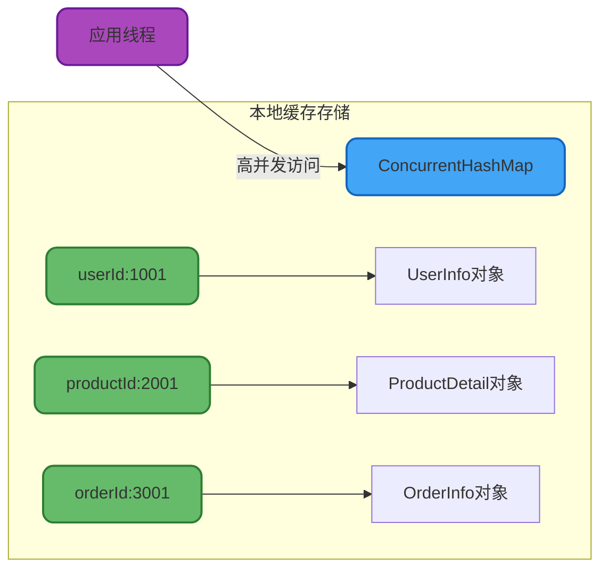
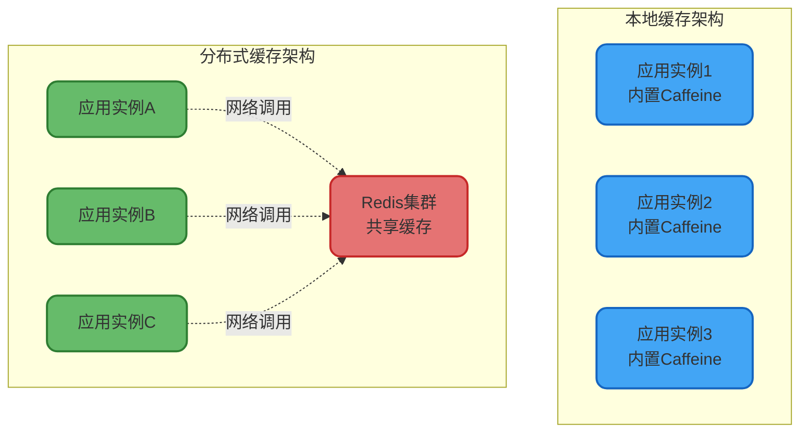
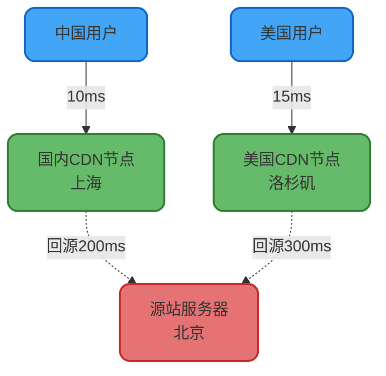

# 本地缓存实现与应用

## 本地缓存架构设计

### 什么是本地缓存

本地缓存是指与应用服务器部署在同一JVM进程内的缓存组件,将热点数据存储在应用程序的堆内存中,通过消除网络调用开销,实现微秒级的数据访问速度。相比分布式缓存,本地缓存的访问延迟可降低100倍以上。

### 核心设计要素

实现一个高质量的本地缓存需要解决以下关键问题:

#### 数据结构选型

采用键值对(Key-Value)结构是业界共识,既要保证查询效率,又要支持高并发访问:



#### 线程安全保障

本地缓存通常是全局单例对象,会被多个业务线程并发访问。必须采用线程安全的数据结构,如ConcurrentHashMap,或通过锁机制保护临界区。

#### 容量限制管理

JVM堆内存有限,必须严格控制缓存容量上限,防止内存溢出:

```java
// 设置缓存最大容量为10000个条目
Cache<String, UserInfo> userCache = Caffeine.newBuilder()
    .maximumSize(10000)
    .build();
```

#### 淘汰策略配置

当缓存达到容量上限时,通过淘汰算法选择移除的数据。常见策略包括:
- **LRU**(最近最少使用): 淘汰最久未访问的数据
- **LFU**(最少频次使用): 淘汰访问次数最少的数据  
- **FIFO**(先进先出): 淘汰最早加入的数据
- **软引用/弱引用**: 在GC压力下自动回收

#### 过期时间设置

双重保障机制确保数据及时更新:

```java
Cache<String, ProductInfo> productCache = Caffeine.newBuilder()
    .expireAfterWrite(10, TimeUnit.MINUTES)    // 写入后10分钟过期
    .expireAfterAccess(5, TimeUnit.MINUTES)    // 最后访问后5分钟过期
    .build();
```

## 实现方案对比

### 基于HashMap的基础实现

最简单的方案是使用ConcurrentHashMap:

```java
public class SimpleLocalCache {
    
    private final ConcurrentHashMap<String, CachedObject> cache;
    
    public SimpleLocalCache() {
        this.cache = new ConcurrentHashMap<>();
    }
    
    /**
     * 存储数据到缓存
     */
    public void put(String key, Object value, long ttlSeconds) {
        CachedObject cachedObj = new CachedObject(
            value, 
            System.currentTimeMillis() + ttlSeconds * 1000
        );
        cache.put(key, cachedObj);
    }
    
    /**
     * 从缓存获取数据
     */
    public Object get(String key) {
        CachedObject cachedObj = cache.get(key);
        if (cachedObj == null) {
            return null;
        }
        
        // 检查是否过期
        if (System.currentTimeMillis() > cachedObj.getExpireTime()) {
            cache.remove(key);
            return null;
        }
        
        return cachedObj.getValue();
    }
    
    /**
     * 缓存对象包装类
     */
    private static class CachedObject {
        private final Object value;
        private final long expireTime;
        
        public CachedObject(Object value, long expireTime) {
            this.value = value;
            this.expireTime = expireTime;
        }
        
        public Object getValue() {
            return value;
        }
        
        public long getExpireTime() {
            return expireTime;
        }
    }
}
```

**优点**: 实现简单,无外部依赖

**缺点**: 需要手动实现容量控制、过期清理、淘汰策略等功能,生产环境不推荐

### 主流开源框架选型

| 框架 | 性能 | 功能丰富度 | 推荐指数 |
|------|------|-----------|----------|
| Caffeine | ⭐⭐⭐⭐⭐ | ⭐⭐⭐⭐⭐ | ⭐⭐⭐⭐⭐ |
| Guava Cache | ⭐⭐⭐⭐ | ⭐⭐⭐⭐ | ⭐⭐⭐ |
| Ehcache | ⭐⭐⭐ | ⭐⭐⭐⭐⭐ | ⭐⭐⭐ |

### Caffeine最佳实践

Caffeine是Spring 5官方推荐的本地缓存方案,性能卓越:

```java
import com.github.benmanes.caffeine.cache.Cache;
import com.github.benmanes.caffeine.cache.Caffeine;
import org.springframework.stereotype.Component;

import java.util.concurrent.TimeUnit;

/**
 * 商品信息本地缓存管理器
 */
@Component
public class ProductLocalCache {
    
    private final Cache<String, ProductDetailVO> cache;
    
    public ProductLocalCache() {
        this.cache = Caffeine.newBuilder()
            // 初始容量
            .initialCapacity(1000)
            // 最大容量10000条
            .maximumSize(10000)
            // 写入后8分钟自动过期
            .expireAfterWrite(8, TimeUnit.MINUTES)
            // 最后访问后5分钟过期
            .expireAfterAccess(5, TimeUnit.MINUTES)
            // 移除监听器
            .removalListener((key, value, cause) -> {
                System.out.println("商品缓存移除 - Key: " + key + ", 原因: " + cause);
            })
            .build();
    }
    
    /**
     * 存入缓存,如果已存在则不覆盖
     */
    public void putIfAbsent(String productId, ProductDetailVO productDetail) {
        if (cache.getIfPresent(productId) == null) {
            cache.put(productId, productDetail);
        }
    }
    
    /**
     * 强制更新缓存
     */
    public void put(String productId, ProductDetailVO productDetail) {
        cache.put(productId, productDetail);
    }
    
    /**
     * 获取缓存数据
     */
    public ProductDetailVO get(String productId) {
        return cache.getIfPresent(productId);
    }
    
    /**
     * 主动删除缓存
     */
    public void invalidate(String productId) {
        cache.invalidate(productId);
    }
    
    /**
     * 清空所有缓存
     */
    public void invalidateAll() {
        cache.invalidateAll();
    }
    
    /**
     * 获取缓存统计信息
     */
    public void printStats() {
        System.out.println("缓存统计: " + cache.stats());
    }
}
```

### Caffeine性能优势解析

Caffeine相比Guava Cache的核心改进:

1. **W-TinyLFU淘汰算法**: 命中率提升约15%,内存占用降低90%
2. **异步加载支持**: 避免缓存加载阻塞业务线程
3. **精准的过期识别**: 正确区分SIZE淘汰和EXPIRED淘汰
4. **智能的替换策略**: 值引用相同时不触发监听器,减少无效通知
5. **高效的并发设计**: 任务异步化处理,充分利用多核能力

## 本地缓存与分布式缓存对比

### 架构差异



### 核心区别分析

#### 存储位置

**本地缓存**: 数据存储在单个应用进程的JVM堆内存中,与应用生命周期绑定

**分布式缓存**: 数据存储在独立的缓存服务器集群,多个应用实例共享

#### 访问性能

**本地缓存**: 
- 访问延迟: 微秒级(1-10μs)
- 无网络开销,直接内存访问
- QPS可达百万级

**分布式缓存**:
- 访问延迟: 毫秒级(1-5ms)
- 存在网络传输和序列化开销
- QPS受网络带宽限制

#### 数据一致性

**本地缓存**: 
- 多实例数据独立,天然存在不一致
- 更新数据后需要主动通知其他实例清理缓存
- 适合能容忍短暂不一致的场景

**分布式缓存**:
- 所有实例访问同一份数据
- 天然保证多实例间的数据一致性
- 适合强一致性要求的场景

#### 容量扩展

**本地缓存**:
- 容量受单机内存限制
- 每个实例独立占用内存
- 集群总内存 = 单机内存 × 实例数(存在冗余)

**分布式缓存**:
- 容量可通过增加节点水平扩展
- 多实例共享缓存,无冗余
- 支持TB级数据存储

#### 高可用性

**本地缓存**:
- 单实例故障不影响其他实例
- 缓存数据随实例重启丢失
- 需要预热机制

**分布式缓存**:
- 通过主从复制、哨兵、集群等机制保证高可用
- 缓存服务故障影响所有应用实例
- 数据持久化可减少丢失风险

### 选型建议

| 场景 | 推荐方案 | 原因 |
|------|----------|------|
| 字典数据、配置信息 | 本地缓存 | 数据量小,变更频率低,访问频繁 |
| 用户会话、购物车 | 分布式缓存 | 需要跨实例共享,一致性要求高 |
| 商品详情(读多写少) | 本地缓存 | 极高QPS,可容忍短暂不一致 |
| 库存数据 | 分布式缓存 | 强一致性要求,需要分布式锁 |
| 热点商品榜单 | 多级缓存 | 本地+分布式,兼顾性能和一致性 |

## 近端缓存技术

### 概念界定

近端缓存(Edge Cache)是指物理距离用户更近的缓存层,旨在通过缩短数据传输路径,降低访问延迟。

### 典型实现方式

#### CDN边缘缓存

将静态资源缓存到全球各地的边缘节点:



#### 应用层本地缓存

在应用服务器部署本地缓存,相比远程Redis调用延迟降低100倍:

- 本地缓存访问: 2微秒
- 同机房Redis: 1毫秒
- 跨机房Redis: 10-50毫秒

#### 客户端Redis实例

在应用服务器本地部署Redis实例,消除网络传输开销,同时保留Redis丰富的数据结构能力。适合需要复杂数据操作但又追求极致性能的场景。

**技术权衡**: 牺牲了数据共享能力,换取了访问性能的提升,本质上将分布式缓存退化为本地缓存。
