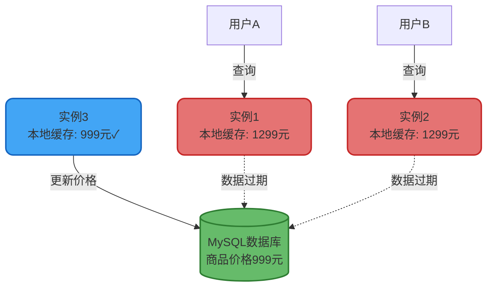
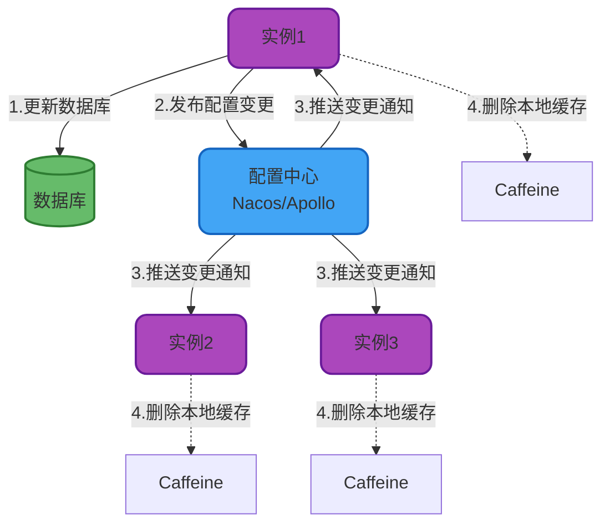
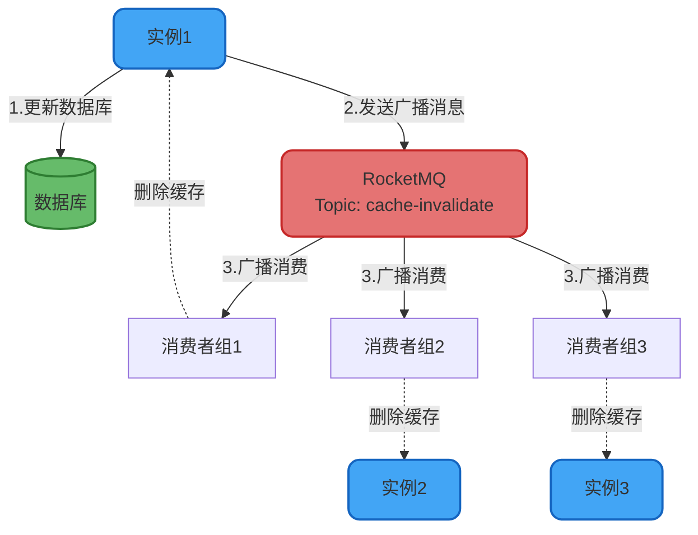
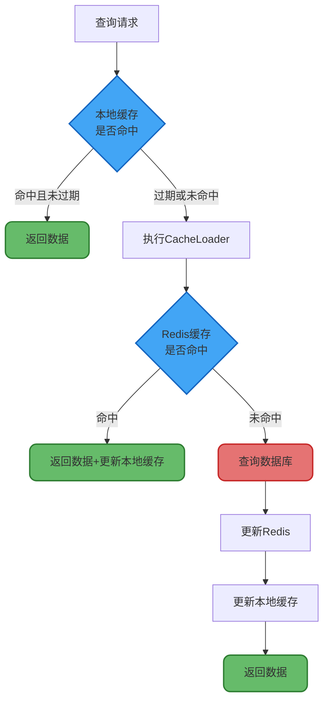

# 本地缓存一致性保障方案

## 本地缓存一致性挑战

### 问题根源

本地缓存通过牺牲一致性来换取性能提升,这是分布式系统CAP理论的实际体现。在选择了AP(可用性+分区容错性)的同时,必然要放弃C(强一致性)。

在集群环境中,每个应用实例都维护独立的本地缓存副本。当某个实例更新数据库后,其他实例的本地缓存仍然保存着旧数据,导致数据不一致:



### 核心认知

**重要原则**: 如果业务对数据一致性有强要求,应直接使用分布式缓存或数据库,不应该选择本地缓存。

本地缓存适用于以下场景:
- 数据变更频率低(如字典表、配置项)
- 业务能容忍短时间内的数据不一致(如商品详情展示)
- 对性能要求极高,一致性要求相对宽松

**反模式警告**: 库存扣减、余额变更等强一致性场景绝不能使用本地缓存。

## 一致性保障方案

虽然本地缓存无法做到强一致性,但可以通过技术手段追求最终一致性,将不一致窗口期控制在业务可接受范围内。

### 方案一:配置中心同步

#### 实现原理

利用配置中心的变更推送能力,实现跨实例的缓存同步:



#### 代码实现

```java
@Component
public class ConfigCenterCacheInvalidator {
    
    @Autowired
    private LocalCacheManager localCache;
    
    @Autowired
    private NacosConfigService nacosConfig;
    
    /**
     * 更新商品价格并失效缓存
     */
    @Transactional
    public void updateProductPrice(String productId, BigDecimal newPrice) {
        // 1. 更新数据库
        productRepository.updatePrice(productId, newPrice);
        
        // 2. 删除本地缓存
        localCache.invalidate("product:" + productId);
        
        // 3. 发布配置变更,通知其他实例
        CacheInvalidateEvent event = new CacheInvalidateEvent();
        event.setCacheKey("product:" + productId);
        event.setTimestamp(System.currentTimeMillis());
        
        nacosConfig.publishConfig(
            "cache-invalidate-events",
            JSON.toJSONString(event)
        );
    }
    
    /**
     * 监听配置中心的缓存失效事件
     */
    @NacosConfigListener(dataId = "cache-invalidate-events")
    public void onCacheInvalidateEvent(String eventJson) {
        CacheInvalidateEvent event = JSON.parseObject(eventJson, CacheInvalidateEvent.class);
        
        // 删除本地缓存
        localCache.invalidate(event.getCacheKey());
        
        log.info("收到缓存失效通知,已删除本地缓存: {}", event.getCacheKey());
    }
}
```

#### 优缺点分析

**优点**:
- 实时性较好,配置推送延迟通常在秒级
- 依赖成熟的配置中心组件,稳定性有保障

**缺点**:
- 引入额外的基础设施依赖
- 配置中心故障会影响缓存一致性
- 不适合高频变更场景,可能产生配置变更风暴

### 方案二:MQ广播消息

#### 架构设计

利用消息队列的广播特性,实现缓存失效通知的全局分发:



#### 实现代码

```java
@Service
public class MqCacheSyncService {
    
    @Autowired
    private RocketMQTemplate rocketMQTemplate;
    
    @Autowired
    private ProductLocalCache productCache;
    
    /**
     * 更新商品信息并发送缓存失效消息
     */
    @Transactional
    public void updateProductInfo(String productId, ProductUpdateDTO updateDTO) {
        // 1. 更新数据库
        productService.updateProduct(productId, updateDTO);
        
        // 2. 删除本地缓存
        productCache.invalidate(productId);
        
        // 3. 发送MQ广播消息
        CacheInvalidateMessage message = CacheInvalidateMessage.builder()
            .cacheType("PRODUCT")
            .cacheKey(productId)
            .operationType("UPDATE")
            .timestamp(System.currentTimeMillis())
            .build();
        
        rocketMQTemplate.syncSend(
            "cache-invalidate-topic",
            message,
            3000 // 超时时间3秒
        );
        
        log.info("已发送商品缓存失效通知: {}", productId);
    }
    
    /**
     * 消费缓存失效广播消息
     */
    @RocketMQMessageListener(
        topic = "cache-invalidate-topic",
        consumerGroup = "${spring.application.name}",
        messageModel = MessageModel.BROADCASTING // 广播模式
    )
    @Component
    public class CacheInvalidateListener implements RocketMQListener<CacheInvalidateMessage> {
        
        @Autowired
        private ProductLocalCache productCache;
        
        @Override
        public void onMessage(CacheInvalidateMessage message) {
            try {
                if ("PRODUCT".equals(message.getCacheType())) {
                    // 删除商品本地缓存
                    productCache.invalidate(message.getCacheKey());
                    log.info("已处理商品缓存失效消息: {}", message.getCacheKey());
                }
            } catch (Exception e) {
                log.error("处理缓存失效消息异常", e);
            }
        }
    }
}
```

#### 优势分析

- 解耦性强,业务代码与缓存同步逻辑分离
- 天然支持广播,一条消息通知所有实例
- 消息可靠性有保障,支持重试和死信队列
- 适合中高频变更场景

### 方案三:自动过期+主动刷新

这是生产环境最常用且最推荐的方案,通过合理设置过期策略,在性能和一致性之间找到平衡点。

#### 自动失效策略

利用Caffeine的过期机制,确保过期数据最终被清理:

```java
@Configuration
public class CacheConfiguration {
    
    @Bean
    public Cache<String, ProductDetailVO> productCache() {
        return Caffeine.newBuilder()
            // 写入后8分钟自动过期
            .expireAfterWrite(8, TimeUnit.MINUTES)
            // 最后访问5分钟后过期
            .expireAfterAccess(5, TimeUnit.MINUTES)
            // 最大容量
            .maximumSize(50000)
            .build();
    }
}
```

**过期时间设定原则**:
- 评估业务可容忍的最大不一致时长
- 过期时间应略小于业务容忍度(留出安全边际)
- 热点数据设置较短的过期时间
- 低频变更数据可适当延长过期时间

#### 自动刷新机制

Caffeine支持异步刷新,在过期前主动加载最新数据:

```java
@Component
public class ProductCacheLoader {
    
    @Autowired
    private ProductRepository productRepository;
    
    @Autowired
    private RedisTemplate<String, ProductDetailVO> redisTemplate;
    
    @Bean
    public LoadingCache<String, ProductDetailVO> autoRefreshProductCache() {
        return Caffeine.newBuilder()
            .maximumSize(10000)
            .expireAfterWrite(10, TimeUnit.MINUTES)
            // 写入后5分钟开始异步刷新
            .refreshAfterWrite(5, TimeUnit.MINUTES)
            .build(new CacheLoader<String, ProductDetailVO>() {
                
                @Override
                public ProductDetailVO load(String productId) {
                    // 缓存未命中时的加载逻辑
                    return loadProductDetail(productId);
                }
                
                @Override
                public ProductDetailVO reload(String productId, ProductDetailVO oldValue) {
                    // 缓存刷新时的加载逻辑
                    return loadProductDetail(productId);
                }
                
                private ProductDetailVO loadProductDetail(String productId) {
                    // 1. 先查询Redis分布式缓存
                    ProductDetailVO detail = redisTemplate.opsForValue()
                        .get("product:detail:" + productId);
                    
                    if (detail != null) {
                        return detail;
                    }
                    
                    // 2. Redis未命中,查询数据库
                    detail = productRepository.findById(productId)
                        .map(this::convertToVO)
                        .orElse(null);
                    
                    // 3. 回写Redis
                    if (detail != null) {
                        redisTemplate.opsForValue().set(
                            "product:detail:" + productId,
                            detail,
                            30,
                            TimeUnit.MINUTES
                        );
                    }
                    
                    return detail;
                }
            });
    }
    
    /**
     * 查询商品详情(自动刷新)
     */
    public ProductDetailVO getProductDetail(String productId) {
        return autoRefreshProductCache().get(productId);
    }
}
```

#### 工作流程



#### 方案优势

- **零侵入**: 无需改造现有业务逻辑
- **自治性强**: 每个实例独立完成缓存维护
- **故障隔离**: 不依赖外部通知机制,某个实例故障不影响其他实例
- **性能最优**: 后台异步刷新,不阻塞查询请求

### 方案四:Redis Pub/Sub通知(不推荐)

#### 技术方案

利用Redis的键空间通知功能,监听缓存数据的变更事件:

```java
@Component
public class RedisCacheEventListener {
    
    @Autowired
    private LocalCacheManager localCache;
    
    /**
     * 监听Redis键删除事件
     */
    @Bean
    public RedisMessageListenerContainer redisMessageListenerContainer(
            RedisConnectionFactory connectionFactory) {
        
        RedisMessageListenerContainer container = new RedisMessageListenerContainer();
        container.setConnectionFactory(connectionFactory);
        
        // 订阅键删除事件
        container.addMessageListener(new MessageListener() {
            @Override
            public void onMessage(Message message, byte[] pattern) {
                String channel = new String(message.getChannel());
                String key = new String(message.getBody());
                
                // 解析事件类型
                if (channel.contains("del") || channel.contains("expired")) {
                    // 同步删除本地缓存
                    localCache.invalidate(key);
                    log.info("Redis键变更,已删除本地缓存: {}", key);
                }
            }
        }, new PatternTopic("__keyevent@0__:del"));
        
        return container;
    }
}
```

#### 关键问题

**消息可靠性差**: Redis Pub/Sub是"即发即弃"模式,客户端断线期间的消息会丢失,无法保证通知必达。

**性能开销**: 需要为每个缓存键订阅事件,大量缓存会产生性能压力。

**Redis配置要求**: 需要开启键空间通知,可能影响Redis性能。

**不推荐理由**: 在有更优方案的情况下,不应选择可靠性不足的方案。

## 最佳实践建议

### 场景化选型

| 业务场景 | 推荐方案 | 理由 |
|----------|---------|------|
| 低频变更的字典数据 | 自动过期 | 变更少,简单有效 |
| 商品详情(读多写少) | 自动过期+刷新 | 平衡性能和一致性 |
| 需要实时失效的场景 | MQ广播 | 通知及时,可靠性高 |
| 对一致性要求极高 | 不用本地缓存 | 直接使用分布式缓存 |

### 关键原则

1. **容忍度优先**: 选择本地缓存前,必须明确业务对不一致的容忍程度
2. **简单为美**: 优先选择自动过期等简单方案,避免过度设计
3. **防御性设计**: 设置合理的过期时间作为最后防线
4. **监控告警**: 监控缓存命中率和一致性指标,及时发现问题
5. **降级准备**: 本地缓存故障时,应能自动降级到分布式缓存或数据库

### 反模式警告

- ❌ 用本地缓存存储库存、余额等强一致性数据
- ❌ 不设置过期时间,期望通过通知机制保证一致性
- ❌ 过度依赖Redis Pub/Sub等不可靠的通知机制
- ❌ 在不一致窗口期内执行关键业务决策

合理使用本地缓存,在性能和一致性之间找到适合业务的平衡点,是架构设计的关键能力。
