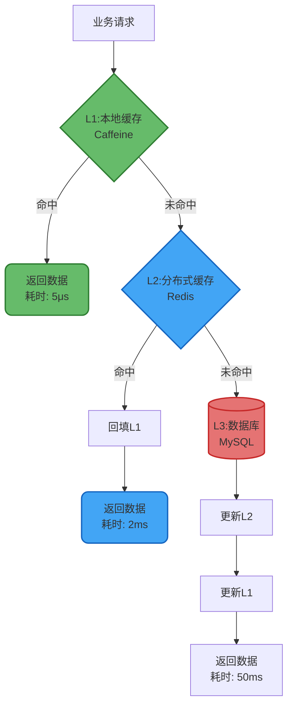
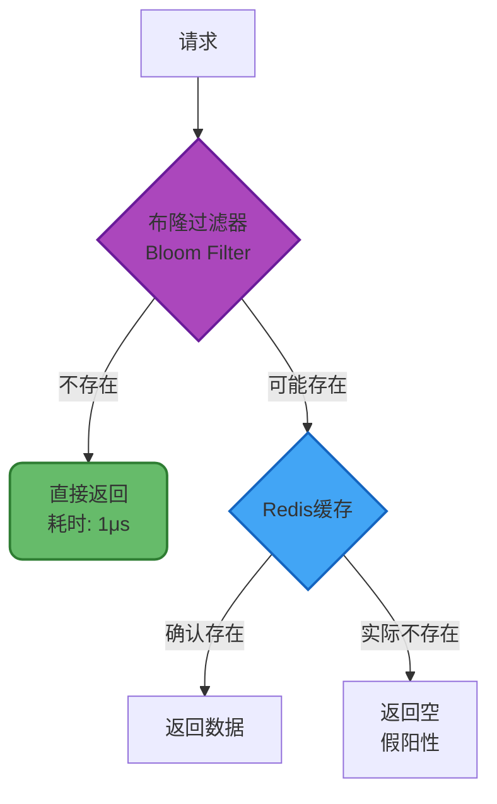
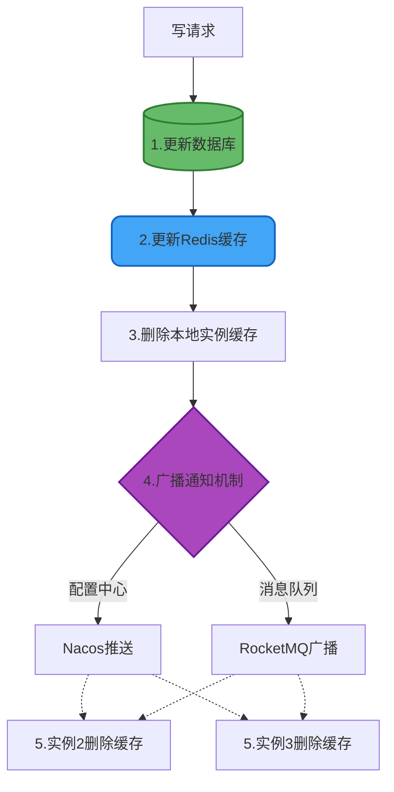
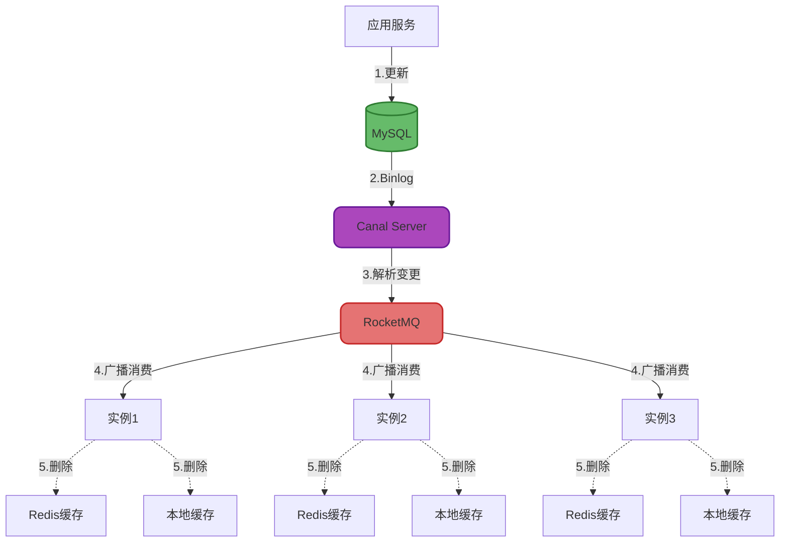
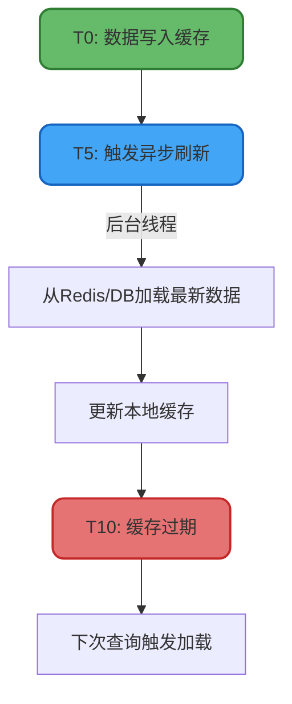

# 多级缓存架构设计与实践

## 多级缓存架构概述

### 架构理念

多级缓存是一种分层的缓存策略,通过在不同层次部署缓存组件,构建从近到远的数据访问路径。核心思想是将热点数据尽可能靠近访问源,以最小的延迟提供数据服务。

在Java应用场景中,典型的多级缓存架构由本地缓存和分布式缓存两层构成,分别承担不同的职责:



### 性能收益分析

| 缓存层级 | 访问延迟 | 吞吐能力 | 容量限制 |
|---------|---------|---------|---------|
| 本地缓存(L1) | 1-10μs | 100万QPS+ | 受JVM堆内存限制 |
| 分布式缓存(L2) | 1-5ms | 10万QPS | 可水平扩展至TB级 |
| 数据库(L3) | 10-100ms | 1万QPS | 受磁盘IO限制 |

通过多级缓存,可将99%的请求拦截在本地缓存,大幅降低数据库压力和网络开销。

## 技术选型与实现

### 本地缓存层选型

**推荐方案**: Caffeine / Guava Cache

Caffeine采用W-TinyLFU淘汰算法,在相同容量下命中率比Guava提升15%,且性能更优:

```java
@Configuration
public class LocalCacheConfig {
    
    /**
     * 商品本地缓存
     */
    @Bean
    public Cache<String, ProductVO> productLocalCache() {
        return Caffeine.newBuilder()
            .initialCapacity(5000)
            .maximumSize(50000) // 最多缓存5万个商品
            .expireAfterWrite(5, TimeUnit.MINUTES) // 写入后5分钟过期
            .expireAfterAccess(3, TimeUnit.MINUTES) // 最后访问3分钟后过期
            .recordStats() // 开启统计
            .build();
    }
    
    /**
     * 用户信息本地缓存
     */
    @Bean
    public LoadingCache<String, UserVO> userLocalCache(UserService userService) {
        return Caffeine.newBuilder()
            .maximumSize(10000)
            .expireAfterWrite(10, TimeUnit.MINUTES)
            .build(userId -> userService.loadUserFromRedis(userId));
    }
}
```

### 分布式缓存层选型

**主流方案**: Redis / Memcached

Redis凭借丰富的数据结构和持久化能力,成为分布式缓存的首选:

```java
@Service
public class MultiLevelCacheService {
    
    @Autowired
    private Cache<String, ProductVO> productLocalCache;
    
    @Autowired
    private RedisTemplate<String, ProductVO> redisTemplate;
    
    @Autowired
    private ProductRepository productRepository;
    
    /**
     * 多级缓存查询商品详情
     */
    public ProductVO getProductDetail(String productId) {
        // L1: 查询本地缓存
        ProductVO product = productLocalCache.getIfPresent(productId);
        if (product != null) {
            log.debug("命中本地缓存: {}", productId);
            return product;
        }
        
        // L2: 查询Redis
        String redisKey = "product:detail:" + productId;
        product = redisTemplate.opsForValue().get(redisKey);
        if (product != null) {
            log.info("命中Redis缓存: {}", productId);
            // 回填本地缓存
            productLocalCache.put(productId, product);
            return product;
        }
        
        // L3: 查询数据库
        log.warn("缓存全部未命中,查询数据库: {}", productId);
        product = productRepository.findById(productId)
            .map(this::convertToVO)
            .orElse(null);
        
        if (product != null) {
            // 更新Redis(30分钟)
            redisTemplate.opsForValue().set(redisKey, product, 30, TimeUnit.MINUTES);
            // 更新本地缓存
            productLocalCache.put(productId, product);
        }
        
        return product;
    }
}
```

### 布隆过滤器加速方案

针对黑名单、去重等场景,可使用布隆过滤器作为L1缓存,利用其空间效率优势:



**应用场景示例**:

```java
@Service
public class BlacklistCacheService {
    
    private final BloomFilter<String> localBloomFilter;
    
    @Autowired
    private RedisTemplate<String, Boolean> redisTemplate;
    
    public BlacklistCacheService() {
        // 初始化布隆过滤器:预期100万条数据,误判率0.01
        this.localBloomFilter = BloomFilter.create(
            Funnels.stringFunnel(Charset.defaultCharset()),
            1000000,
            0.01
        );
    }
    
    /**
     * 检查用户是否在黑名单
     */
    public boolean isUserInBlacklist(String userId) {
        // L1: 布隆过滤器快速判断
        if (!localBloomFilter.mightContain(userId)) {
            // 绝对不存在,直接返回
            return false;
        }
        
        // L2: Redis精确查询
        Boolean inBlacklist = redisTemplate.opsForValue()
            .get("blacklist:user:" + userId);
        
        return Boolean.TRUE.equals(inBlacklist);
    }
    
    /**
     * 添加用户到黑名单
     */
    public void addToBlacklist(String userId) {
        // 更新Redis
        redisTemplate.opsForValue().set(
            "blacklist:user:" + userId,
            true,
            Duration.ofDays(30)
        );
        
        // 更新布隆过滤器
        localBloomFilter.put(userId);
    }
}
```

## 多级缓存一致性方案

### 核心原则

多级缓存的一致性保障遵循"放弃强一致,追求最终一致"的原则。这是CAP理论在缓存场景的体现:选择了高可用性(A)和分区容错性(P),必然要牺牲强一致性(C)。

**关键认知**: 如果业务对一致性有严格要求,应放弃多级缓存方案,直接使用分布式缓存或数据库。

### 与Redis数据库一致性的差异

多级缓存一致性方案与Redis-DB一致性方案的主要区别:

1. **过期时间策略**: 本地缓存通常设置更短的TTL(分钟级),利用框架的自动过期和刷新机制
2. **同步复杂度**: 分布式缓存只需操作一次(集群有内部同步),但本地缓存需要通知所有应用实例

### 方案一:先更新Redis,再删除本地缓存(推荐)

#### 实现流程



#### MQ广播实现

```java
@Service
public class MultiLevelCacheSyncService {
    
    @Autowired
    private ProductLocalCache localCache;
    
    @Autowired
    private RedisTemplate<String, ProductVO> redisTemplate;
    
    @Autowired
    private RocketMQTemplate mqTemplate;
    
    /**
     * 更新商品信息
     */
    @Transactional
    public void updateProduct(String productId, ProductUpdateDTO updateDTO) {
        // 1. 更新数据库
        productRepository.updateById(productId, updateDTO);
        
        // 2. 更新Redis
        ProductVO latestProduct = convertToVO(updateDTO);
        redisTemplate.opsForValue().set(
            "product:detail:" + productId,
            latestProduct,
            30,
            TimeUnit.MINUTES
        );
        
        // 3. 删除本地缓存
        localCache.invalidate(productId);
        
        // 4. 发送MQ广播消息
        CacheInvalidateEvent event = CacheInvalidateEvent.builder()
            .cacheType("PRODUCT_LOCAL")
            .cacheKey(productId)
            .timestamp(System.currentTimeMillis())
            .build();
        
        mqTemplate.syncSend(
            "cache-sync-topic",
            MessageBuilder.withPayload(event).build()
        );
        
        log.info("已发送多级缓存同步消息: {}", productId);
    }
    
    /**
     * 消费缓存同步消息(广播模式)
     */
    @RocketMQMessageListener(
        topic = "cache-sync-topic",
        consumerGroup = "${spring.application.name}-cache-sync",
        messageModel = MessageModel.BROADCASTING
    )
    @Component
    public class CacheSyncListener implements RocketMQListener<CacheInvalidateEvent> {
        
        @Autowired
        private ProductLocalCache localCache;
        
        @Override
        public void onMessage(CacheInvalidateEvent event) {
            if ("PRODUCT_LOCAL".equals(event.getCacheType())) {
                localCache.invalidate(event.getCacheKey());
                log.info("收到广播消息,已删除本地缓存: {}", event.getCacheKey());
            }
        }
    }
}
```

#### 为什么删除而非更新

采用删除策略而非更新策略的原因:

1. **避免并发问题**: 更新操作可能因网络延迟导致数据版本错乱
2. **减少带宽消耗**: 删除通知只需传输key,更新需要传输完整数据
3. **懒加载优势**: 下次查询时自然加载最新数据,避免预热无效缓存

### 方案二:基于Canal监听Binlog(大厂方案)

#### 架构优势

Canal方案是对业务代码侵入性最小的优雅方案,完全解耦同步逻辑:



#### 实现代码

```java
@Component
public class BinlogCacheSyncListener {
    
    @Autowired
    private ProductLocalCache localCache;
    
    @Autowired
    private RedisTemplate<String, Object> redisTemplate;
    
    /**
     * 消费Canal binlog变更消息
     */
    @RocketMQMessageListener(
        topic = "canal-binlog-topic",
        consumerGroup = "${spring.application.name}-binlog",
        messageModel = MessageModel.BROADCASTING
    )
    public class BinlogEventListener implements RocketMQListener<CanalBinlogEvent> {
        
        @Override
        public void onMessage(CanalBinlogEvent event) {
            // 解析表名和操作类型
            String tableName = event.getTableName();
            String eventType = event.getEventType(); // INSERT/UPDATE/DELETE
            
            if ("product".equals(tableName) && 
                ("UPDATE".equals(eventType) || "DELETE".equals(eventType))) {
                
                // 获取商品ID
                String productId = event.getData().get("id");
                
                // 删除Redis缓存
                redisTemplate.delete("product:detail:" + productId);
                
                // 删除本地缓存
                localCache.invalidate(productId);
                
                log.info("Binlog触发缓存清理 - 表:{}, ID:{}, 操作:{}", 
                    tableName, productId, eventType);
            }
        }
    }
}
```

#### 方案优势

- **业务无感知**: 不需要在每个更新接口中添加缓存同步代码
- **天然广播**: 借助MQ实现多实例通知
- **数据一致**: 基于数据库变更,保证缓存与DB同步

#### 适用前提

必须依赖MySQL作为数据源,不适合纯缓存型架构(无数据库层)。

### 方案三:自动过期+自动刷新(最佳实践)

#### 设计理念

通过合理配置过期策略,无需外部通知即可保证最终一致性,是最简单可靠的方案:

```java
@Configuration
public class AutoRefreshCacheConfig {
    
    @Autowired
    private RedisTemplate<String, ProductVO> redisTemplate;
    
    @Autowired
    private ProductRepository productRepository;
    
    @Bean
    public LoadingCache<String, ProductVO> autoRefreshProductCache() {
        return Caffeine.newBuilder()
            .maximumSize(50000)
            // 写入后10分钟过期
            .expireAfterWrite(10, TimeUnit.MINUTES)
            // 写入后5分钟开始异步刷新
            .refreshAfterWrite(5, TimeUnit.MINUTES)
            .build(new CacheLoader<String, ProductVO>() {
                
                @Override
                public ProductVO load(String productId) throws Exception {
                    return loadProductFromRedisOrDB(productId);
                }
                
                @Override
                public ProductVO reload(String productId, ProductVO oldValue) 
                        throws Exception {
                    // 异步刷新逻辑
                    return loadProductFromRedisOrDB(productId);
                }
                
                /**
                 * 从Redis或DB加载商品数据
                 */
                private ProductVO loadProductFromRedisOrDB(String productId) {
                    // L2: 查询Redis
                    ProductVO product = redisTemplate.opsForValue()
                        .get("product:detail:" + productId);
                    
                    if (product != null) {
                        return product;
                    }
                    
                    // L3: 查询数据库
                    product = productRepository.findById(productId)
                        .map(this::convertToVO)
                        .orElse(null);
                    
                    if (product != null) {
                        // 回写Redis
                        redisTemplate.opsForValue().set(
                            "product:detail:" + productId,
                            product,
                            30,
                            TimeUnit.MINUTES
                        );
                    }
                    
                    return product;
                }
            });
    }
}
```

#### 配置策略

| 参数 | 配置值 | 说明 |
|------|-------|------|
| expireAfterWrite | 8-10分钟 | 略小于业务容忍的不一致时长 |
| expireAfterAccess | 5分钟 | 避免冷数据长期占用内存 |
| refreshAfterWrite | 5分钟 | 过期前异步刷新,用户无感知 |

#### 工作流程



#### 方案优势

- **零依赖**: 不依赖MQ、配置中心等外部组件
- **高可用**: 单点故障不影响其他实例
- **自适应**: 根据访问模式自动调整缓存内容
- **性能最优**: 异步刷新不阻塞查询请求

## 最佳实践总结

### 场景化选型矩阵

| 场景 | 一致性要求 | 推荐方案 | 理由 |
|------|----------|---------|------|
| 商品详情 | 可容忍5分钟延迟 | 自动过期+刷新 | 读多写少,简单高效 |
| 用户会话 | 强一致性 | 仅用Redis | 不应使用本地缓存 |
| 配置信息 | 可容忍1分钟延迟 | MQ广播 | 变更及时通知 |
| 营销活动 | 可容忍10秒延迟 | Canal+MQ | 实时性好,业务无侵入 |
| 库存扣减 | 强一致性 | 仅用Redis+分布式锁 | 绝对不能用本地缓存 |

### 架构设计原则

1. **容忍度评估**: 明确业务对不一致的最大容忍时长
2. **过期时间兜底**: 无论选择何种同步方案,都要设置合理的过期时间
3. **简单优先**: 优先选择自动过期方案,避免引入复杂的通知机制
4. **监控告警**: 监控本地缓存和Redis的命中率,及时发现异常
5. **降级预案**: 本地缓存故障时,应能自动降级到Redis

### 性能优化建议

```java
@Component
public class OptimizedMultiLevelCache {
    
    // 本地缓存命中率监控
    @Scheduled(fixedRate = 60000)
    public void monitorCacheStats() {
        CacheStats stats = productLocalCache.stats();
        
        double hitRate = stats.hitRate();
        if (hitRate < 0.8) {
            log.warn("本地缓存命中率过低: {}, 请检查容量配置", hitRate);
        }
        
        // 上报监控指标
        metricsReporter.gauge("cache.local.hitRate", hitRate);
        metricsReporter.gauge("cache.local.evictionCount", stats.evictionCount());
    }
}
```

### 反模式警告

- ❌ 在本地缓存中存储会话、令牌等需要跨实例共享的数据
- ❌ 不设置过期时间,完全依赖通知机制
- ❌ 本地缓存和Redis使用相同的过期时间
- ❌ 在不一致窗口期内执行金额计算、库存扣减等关键操作

多级缓存是性能优化的利器,但必须建立在正确理解其特性和局限性的基础上,才能发挥最大价值。
