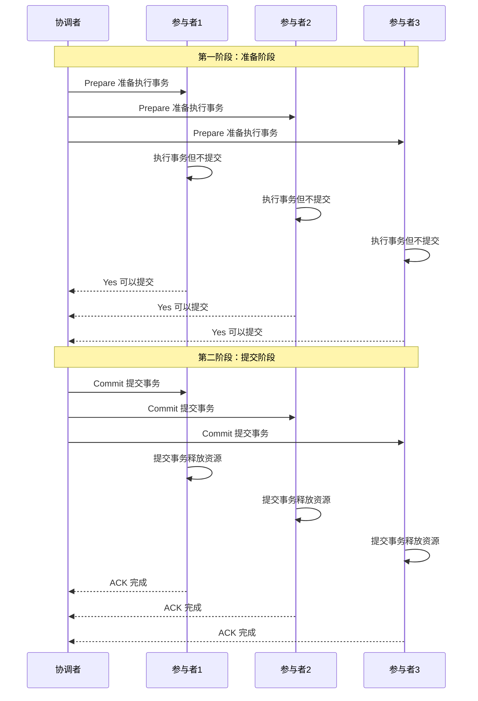
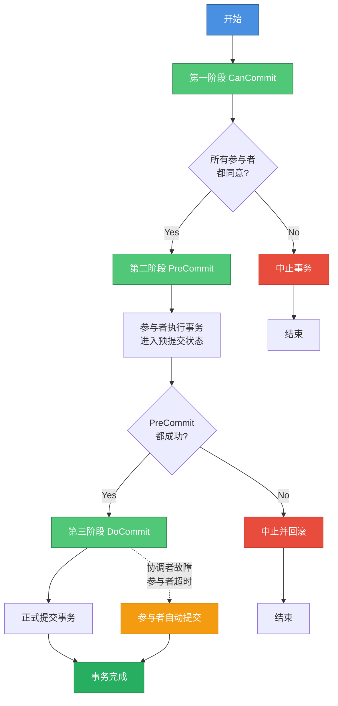

# 两阶段与三阶段提交协议

## 两阶段提交协议（2PC）

在分布式系统中，当一个事务需要跨越多个数据库节点或服务时，我们需要确保事务的ACID特性得到保障。即使操作分布在多个独立的节点上，也要保证所有节点要么全部成功提交，要么全部回滚失败，不能出现部分节点成功而部分节点失败的情况。

两阶段提交协议（Two-Phase Commit，2PC）就是为解决这个问题而设计的经典分布式事务一致性协议。该协议通过协调者（Coordinator）和参与者（Participant）的协同配合来实现分布式事务的原子性提交。

### 协议角色

**协调者（Coordinator）**

协调者通常是发起事务的应用程序或专门的事务管理器，负责驱动整个协议流程。协调者向所有参与者发送指令，并根据参与者的反馈做出最终的提交或回滚决定。

**参与者（Participants）**

参与者是分布式事务中涉及的各个独立资源管理器，例如不同的数据库实例或不同的微服务。每个参与者管理自己的本地事务，并执行协调者下达的指令。

### 执行流程

两阶段提交协议包含两个关键阶段：准备阶段和提交阶段。

**第一阶段：准备阶段（Prepare Phase）**

1. 协调者向所有参与者发送Prepare请求，询问是否可以提交事务
2. 各参与者执行事务操作，但不提交（只是写入日志或加锁，进入预提交状态）
3. 如果参与者执行成功，返回Yes；如果失败或遇到冲突，返回No
4. 此时所有参与者都处于等待协调者最终指令的状态，事务尚未真正提交

**第二阶段：提交阶段（Commit Phase）**

1. 如果所有参与者都返回Yes：
   - 协调者向所有参与者发送Commit请求
   - 参与者正式提交事务，并释放锁资源
   - 参与者向协调者返回ACK确认

2. 如果任意一个参与者返回No（或超时未响应）：
   - 协调者向所有参与者发送Rollback请求
   - 参与者回滚事务，释放锁资源
   - 参与者向协调者返回ACK确认

通过这两个阶段的协调，可以保证所有节点的操作结果保持一致。

举个生活中的例子来理解2PC协议。假设一个项目经理（协调者）需要组织团队成员（参与者）完成一个重要功能发布：

**准备阶段**：项目经理询问每位成员："你们的模块代码都准备好了吗？可以发布吗？"各成员检查自己负责的模块，完成测试和打包，然后回复"准备就绪"。

**提交阶段**：如果所有成员都回复准备就绪，项目经理下达指令"所有人执行发布"，大家同时将代码部署到生产环境；如果有任何一个成员回复"还没准备好"，项目经理就通知所有人"本次发布取消"，大家都不执行发布操作。

### XA规范

X/Open组织定义了分布式事务处理的DTP模型，其中包含应用程序（AP）、事务管理器（TM）、资源管理器（RM）、通信资源管理器（CRM）等角色。

常见的事务管理器是交易中间件，常见的资源管理器是数据库，常见的通信资源管理器是消息中间件。

在DTP模型中，本地事务是指数据库内部对多个表的操作，而全局事务是指分布式环境中多个数据库需要共同完成的工作。例如一个跨库转账操作，需要更新多个数据库的账户表，所有数据库的操作必须要么全部提交，要么全部回滚。

XA就是X/Open DTP定义的交易中间件与数据库之间的接口规范，交易中间件通过XA接口通知数据库事务的开始、结束以及提交、回滚等操作。二阶段提交协议和三阶段提交协议都是基于XA规范实现的，可以说2PC是实现XA分布式事务的核心机制。

### 优缺点分析

**优点**

1. 协议概念清晰，流程简单易理解
2. 能够保证强一致性，所有节点数据完全一致
3. 被广泛支持，多数关系型数据库都实现了XA协议

**缺点**

1. **同步阻塞问题**：参与者在回复Yes后到收到最终指令之前，其资源一直处于锁定状态，其他事务无法访问这些资源。如果协调者一直不发送指令，参与者会一直阻塞，严重影响系统性能和可用性。

2. **单点故障问题**：协调者是整个协议的核心，一旦协调者发生故障，所有参与者都会一直阻塞。虽然可以重新选举协调者，但无法解决因原协调者宕机导致的参与者阻塞问题。

3. **数据不一致风险**：在某些极端情况下可能导致数据不一致。

### 故障场景分析

**场景一：协调者故障，参与者正常**

这种情况可以通过选举新的协调者来解决。新协调者上任后，询问所有参与者最后一条事务的执行情况，根据收集到的信息决定是提交还是回滚。这种情况不会导致数据不一致，但会导致参与者阻塞等待新协调者的指令。

**场景二：参与者故障，协调者正常**

如果参与者故障后不再恢复，对整体事务没有影响，其他参与者正常执行即可。如果参与者故障后又恢复了，它会主动询问协调者当前应该如何处理未完成的事务，协调者会比对事务执行记录，告知该参与者应该提交还是回滚，保持数据一致性。

**场景三：协调者和参与者同时故障**

这是最复杂的情况，需要分阶段讨论：

*第一阶段故障*：如果在Prepare阶段协调者和某个参与者同时故障，由于还没有执行commit操作，新选出的协调者可以询问其他参与者的情况，再决定是commit还是rollback，不会导致数据不一致。

*第二阶段故障（参与者未执行操作）*：协调者和某个参与者在第二阶段故障，且该参与者在故障前没有接收到协调者的指令。新协调者选出后，只要有任何参与者执行了rollback或在第一阶段返回No，就执行rollback；如果有参与者执行了commit，就执行commit。故障参与者恢复后按照协调者指示执行即可，不会出现不一致。

*第二阶段故障（参与者已执行操作）*：**这是最危险的场景**。如果协调者和某个参与者同时故障，且该参与者在故障前已经执行了commit或rollback，但由于故障没人知道它执行了什么操作。新协调者只能根据其他未故障参与者的状态做决定，假设决定commit。但当故障参与者恢复后，如果它之前执行的是rollback，就会导致该节点与其他节点的数据不一致。虽然可以通过后续手段修复，但在这段时间内数据确实处于不一致状态。

## 三阶段提交协议（3PC）

为了解决2PC存在的阻塞和数据不一致问题，三阶段提交协议（Three-Phase Commit，3PC）在2PC基础上进行了改进。3PC通过增加一个预提交阶段，并引入超时机制，让参与者在没有收到协调者指令时也能自己做出决策，从而减少阻塞问题。

### 执行流程

3PC将2PC的准备阶段拆分为两个阶段，形成CanCommit、PreCommit、DoCommit三个阶段。

**第一阶段：CanCommit（询问阶段）**

1. 协调者向所有参与者发送CanCommit请求，询问是否可以执行事务
2. 参与者进行本地检查（不执行事务，只是检查是否满足执行条件）
3. 如果可以执行返回Yes，否则返回No

这一阶段相当于2PC的第一阶段，但只是"询问"而不实际执行，不会锁定资源。

**第二阶段：PreCommit（预提交阶段）**

1. 如果所有参与者都返回Yes：
   - 协调者向所有参与者发送PreCommit请求
   - 参与者执行事务操作（写日志、加锁），进入可以提交的安全状态
   - 参与者向协调者返回ACK

2. 如果有任何参与者返回No：
   - 协调者发送Abort请求
   - 所有参与者回滚事务

这一阶段是3PC与2PC的关键区别，参与者已经进入一个"可以提交"的安全状态，但还没有最终提交。

**第三阶段：DoCommit（提交阶段）**

1. 如果PreCommit阶段所有参与者都确认成功：
   - 协调者向所有参与者发送DoCommit请求
   - 参与者正式提交事务并释放资源
   - 参与者向协调者返回ACK

2. 如果有失败或超时：
   - 协调者发送Abort请求
   - 参与者回滚事务

**关键改进**：如果协调者在这个阶段故障，参与者可以依靠超时机制自行提交事务，从而避免无限期阻塞。

举个生活中的例子。假设部门经理要组织全员团建活动，初定时间为国庆节：

**CanCommit阶段**：经理逐个打电话问大家："我们计划国庆节团建，你有时间吗？有时间就说Yes，没时间就说No。我还要问其他人，具体安排稍后通知，你可以先去忙自己的事。"（询问但不锁定时间）

**PreCommit阶段**：经理收集完大家的意见，发现都有时间，于是再次通知："我们确定国庆节团建，你把这天的时间空出来，不要再安排其他事情了。我会逐个通知其他同事，通知完后再给你最终确认。另外，如果我没有特别通知你，你就国庆节那天直接来参加团建。"（锁定时间但还未最终确定）

**DoCommit阶段**：经理通知完所有人后，再次确认："现在正式确定了，国庆节当天上午9点在公司门口集合出发。"（最终确认执行）

如果在DoCommit阶段经理突然失联，由于之前已经告诉过大家"如果没有特别通知就按计划执行"，大家就会按照预定时间自行前往，避免了无限期等待。

### 3PC相比2PC的改进

**解决数据不一致问题**

在2PC的关键故障场景（第二阶段协调者和参与者同时故障，且故障参与者已执行操作）中，新协调者无法判断故障参与者执行了什么操作。

但在3PC中，如果故障参与者执行了commit，那么其他未故障的参与者状态必然是PreCommit或Commit（因为第一阶段所有人都同意了才会进入第三阶段）。新协调者一旦发现有参与者处于Commit或PreCommit状态，就执行commit操作。如果故障参与者执行了rollback，那么协调者和其他参与者执行的也肯定是rollback。

因此，3PC通过引入中间状态PreCommit，解决了2PC中可能出现的数据不一致问题。

**引入超时机制**

3PC为参与者引入了超时机制。在DoCommit阶段，如果参与者长时间没有收到协调者的指令，会自动执行commit操作（因为能进入DoCommit阶段说明PreCommit阶段大家都成功了）。这避免了2PC中因协调者故障导致参与者无限期阻塞的问题。

### 3PC存在的问题

虽然3PC改进了2PC的一些问题，但仍然不是完美的解决方案：

**网络分区问题**：在DoCommit阶段，如果因为网络原因，协调者发送的Abort响应没有被参与者及时接收到，参与者在等待超时后会自动执行commit操作。这时就会出现部分参与者执行了commit，部分参与者执行了rollback的数据不一致情况。

**性能开销增加**：相比2PC增加了一个阶段，网络通信次数更多，整体性能有所下降。

**仍然存在阻塞**：虽然减少了阻塞时间，但在某些阶段参与者仍然需要等待协调者的指令，完全消除阻塞问题。

因此，在实际应用中，2PC和3PC这类强一致性方案逐渐被TCC、消息队列等最终一致性方案所替代，后者在性能和可用性方面有更好的表现。
