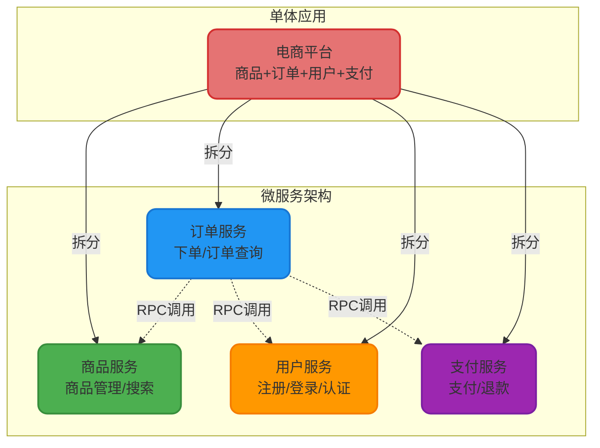
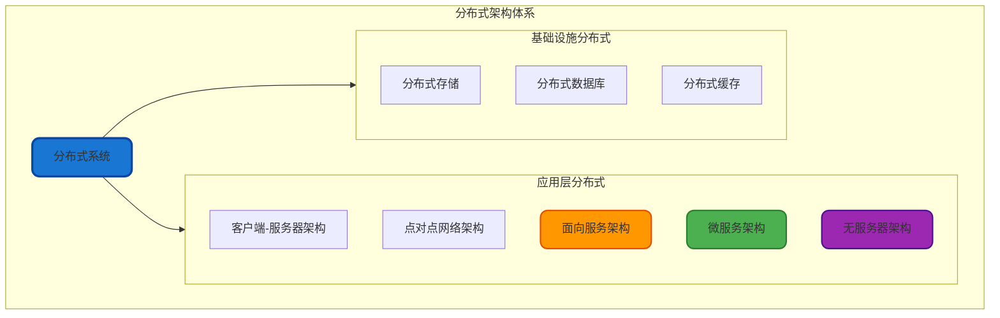
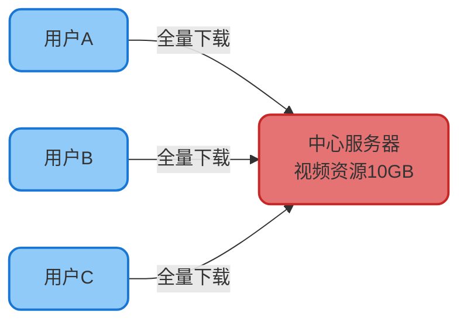
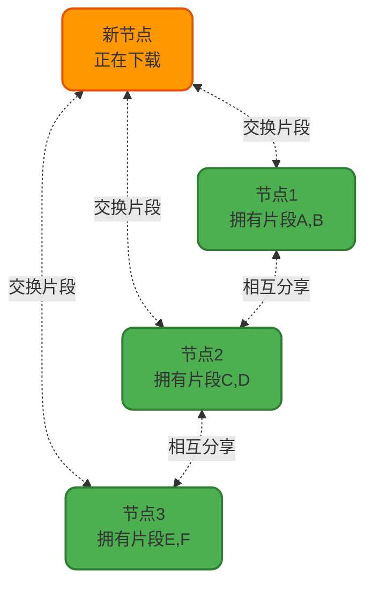
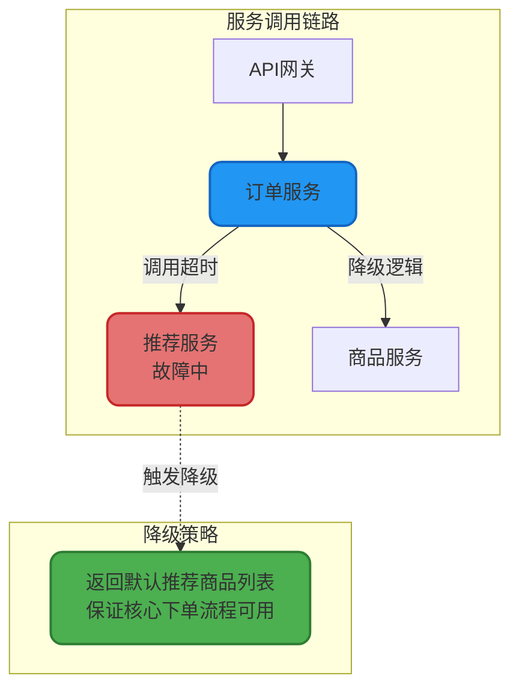

# 微服务架构设计理念

## 微服务架构核心思想

微服务架构(Microservices Architecture)是现代软件工程中的一种创新架构模式,其核心理念是将庞大的单体应用按照业务边界进行拆解,形成一组协同工作的独立服务单元。每个服务单元专注于完成特定的业务能力,通过轻量级的通信协议进行交互,最终组合成完整的应用系统。

### 架构拆分原则

在电商系统中,传统的单体应用会将所有功能模块集中在一个工程中。而采用微服务架构后,我们会将其拆分为多个独立的服务:



### 核心特征解析

微服务架构具备以下关键特性:

**服务自治性**: 每个微服务拥有独立的代码仓库、数据存储和部署流程。商品服务的数据库变更不会影响订单服务的正常运行,实现了真正的物理隔离。

**技术栈异构**: 不同服务可以根据业务特点选择最合适的技术方案。例如:
- 商品搜索服务采用Elasticsearch作为存储引擎
- 用户画像服务使用Neo4j图数据库
- 订单服务使用MySQL关系型数据库
- 实时推荐服务基于Redis内存数据库

**独立演进**: 各服务团队可以按照自己的节奏进行开发和发布。当商品服务需要重构商品详情页时,不必等待订单服务的开发周期,大大提升了迭代效率。

**弹性伸缩**: 在大促场景下,订单服务的访问量暴增,我们可以单独对订单服务进行水平扩容,而不需要对整个系统进行扩容,节省了大量资源成本。

### 代码示例

以下是订单服务调用商品服务的实现示例:

```java
@Service
public class OrderProcessService {
    
    @Autowired
    private ProductRpcClient productClient;
    
    /**
     * 创建订单流程
     * @param createRequest 订单创建请求
     * @return 订单编号
     */
    public String createOrder(OrderCreateRequest createRequest) {
        // 1. 查询商品详情
        ProductDetailDTO productDetail = productClient.queryProductDetail(
            createRequest.getProductId()
        );
        
        // 2. 校验商品状态
        if (!productDetail.isOnSale()) {
            throw new BusinessException("商品已下架,无法购买");
        }
        
        // 3. 校验库存充足性
        boolean stockAvailable = productClient.checkStock(
            createRequest.getProductId(), 
            createRequest.getQuantity()
        );
        if (!stockAvailable) {
            throw new BusinessException("商品库存不足");
        }
        
        // 4. 计算订单金额
        BigDecimal totalAmount = productDetail.getPrice()
            .multiply(new BigDecimal(createRequest.getQuantity()));
        
        // 5. 创建订单记录
        OrderEntity order = new OrderEntity();
        order.setOrderNo(generateOrderNo());
        order.setProductId(createRequest.getProductId());
        order.setQuantity(createRequest.getQuantity());
        order.setTotalAmount(totalAmount);
        orderRepository.save(order);
        
        return order.getOrderNo();
    }
}
```

## 微服务与分布式的关系

### 架构层次划分

分布式系统是一个宽泛的概念,指的是将计算任务分散到多台物理设备上协同完成的系统架构。微服务架构是分布式架构理念的一种具体落地方案,两者是包含与被包含的关系。



### 经典分布式架构模式

#### 客户端-服务器(C/S)架构

C/S架构是最经典的分布式模式,客户端向集中式的服务器发起请求并获取响应。

在视频下载场景中,传统C/S模式存在明显瓶颈:
- **单点故障风险**: 服务器宕机导致所有用户无法下载
- **带宽成为瓶颈**: 1000个用户同时下载10GB文件,服务器需要10TB的出口带宽
- **扩展成本高**: 只能通过升级服务器硬件来提升性能



#### 点对点(P2P)架构

P2P架构打破了中心化限制,每个节点既是服务消费者也是服务提供者。在文件下载场景中,用户在下载的同时将已获取的文件分片分享给其他用户,形成分布式下载网络。

**核心优势**:
- 去中心化,避免单点故障
- 带宽共享,下载速度随着参与节点增加而提升
- 成本低,充分利用每个节点的上传能力

**典型应用**: BitTorrent、迅雷P2P加速、IPFS分布式存储



#### 无服务器(Serverless)架构

Serverless架构将应用拆分为一个个无状态的函数,由云平台负责函数的自动部署、弹性扩缩容和资源管理。开发者只需关注业务逻辑,基础设施的运维工作全部交给云服务商。

**典型场景**:
- 图片上传后自动生成缩略图
- 定时任务执行(如每天凌晨生成报表)
- Webhook事件处理(如支付回调)

**代码示例** - AWS Lambda函数处理图片压缩:

```java
public class ImageCompressHandler implements RequestHandler<S3Event, String> {
    
    private static final int TARGET_WIDTH = 800;
    
    @Override
    public String handleRequest(S3Event event, Context context) {
        // 1. 获取触发事件的图片信息
        S3EventNotification.S3Entity s3Entity = event.getRecords().get(0).getS3();
        String bucketName = s3Entity.getBucket().getName();
        String objectKey = s3Entity.getObject().getKey();
        
        // 2. 从S3下载原图
        AmazonS3 s3Client = AmazonS3ClientBuilder.defaultClient();
        S3Object s3Object = s3Client.getObject(bucketName, objectKey);
        BufferedImage originalImage = ImageIO.read(s3Object.getObjectContent());
        
        // 3. 按比例压缩图片
        int targetHeight = (originalImage.getHeight() * TARGET_WIDTH) / originalImage.getWidth();
        BufferedImage resizedImage = Scalr.resize(originalImage, 
            Scalr.Method.QUALITY, 
            Scalr.Mode.FIT_EXACT,
            TARGET_WIDTH, 
            targetHeight, 
            Scalr.OP_ANTIALIAS);
        
        // 4. 上传压缩后的图片
        ByteArrayOutputStream os = new ByteArrayOutputStream();
        ImageIO.write(resizedImage, "jpg", os);
        byte[] buffer = os.toByteArray();
        
        String compressedKey = "compressed/" + objectKey;
        s3Client.putObject(bucketName, compressedKey, 
            new ByteArrayInputStream(buffer), 
            new ObjectMetadata());
        
        return "压缩完成: " + compressedKey;
    }
}
```

## 微服务的核心价值

### 敏捷开发与快速迭代

在单体应用时代,一个小功能的修改可能需要重新部署整个应用,发布周期往往以周为单位。微服务架构下,团队可以独立开发和部署自己负责的服务,实现了真正的持续集成和持续交付(CI/CD)。

**实际案例**: 某电商平台在双十一前需要上线"凑单优惠"功能,在微服务架构下,只需:
1. 促销服务团队开发凑单逻辑
2. 通过灰度发布验证功能稳定性
3. 全量发布,整个过程无需协调其他服务团队

### 技术债务隔离

当某个服务使用的技术栈过时需要重构时,可以在不影响其他服务的前提下进行技术升级。例如将老旧的Struts框架迁移到Spring Boot,只需改造对应的服务,而不是整个系统。

### 故障隔离与容错

微服务天然具备故障隔离能力。当商品推荐服务出现故障时,订单服务可以通过降级策略继续提供核心的下单能力,只是缺少了个性化推荐功能,而不是整个系统不可用。



### 团队规模与组织架构

根据康威定律,系统架构往往反映组织的沟通结构。微服务架构使得小型团队(通常5-9人)能够完全掌控一个服务的全生命周期,减少了跨团队协作的沟通成本,提升了团队的自主性和工作效率。

## 微服务架构的挑战

尽管微服务带来了诸多优势,但也引入了新的复杂度:

**分布式事务**: 订单、库存、支付的一致性保障变得困难
**服务治理**: 需要注册中心、配置中心、链路追踪等基础设施
**网络延迟**: 进程内调用变为跨网络RPC调用,延迟增加
**运维成本**: 服务数量激增,监控、日志、部署的复杂度上升

因此,选择微服务架构需要根据团队规模、业务复杂度、技术能力综合评估,而不是盲目跟风。
