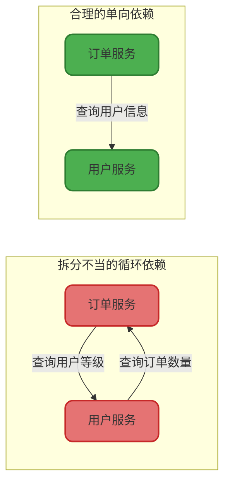
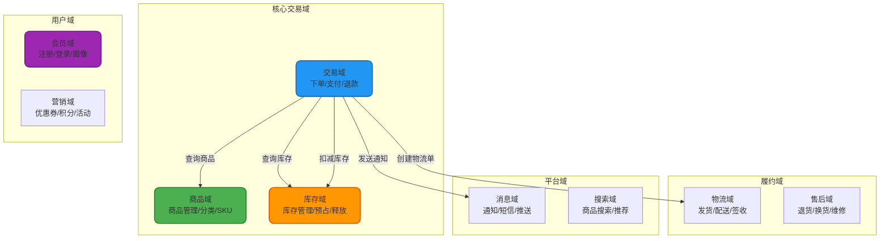
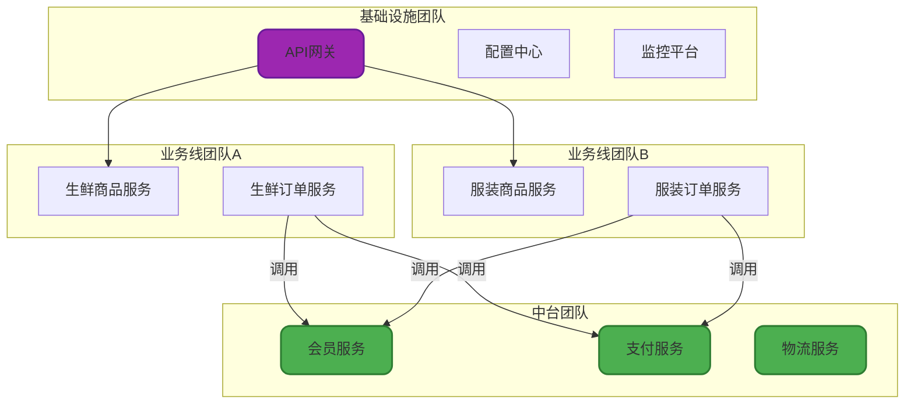

import PaidCTA from '@site/src/components/PaidCTA';

# 微服务拆分策略与实践

## 微服务拆分的本质

微服务拆分不是简单的代码物理分离,而是对业务领域的深度理解和系统边界的精准划分。拆分的核心目标是实现**高内聚、低耦合**,让每个服务专注于完成特定的业务能力,同时最小化服务间的依赖关系。

### 拆分不当的后果

如果拆分策略不合理,会导致:
- **分布式事务泛滥**: 一个业务操作需要协调多个服务完成
- **循环依赖**: 服务A调用服务B,服务B又调用服务A
- **频繁的跨服务通信**: 网络开销远大于业务处理时间
- **数据一致性难以保障**: 服务间数据同步复杂度激增



## 核心拆分维度

### 按业务领域拆分(DDD方法)

这是最常用也是最推荐的拆分方式,基于领域驱动设计(Domain-Driven Design)的思想,将系统按照业务领域进行垂直切分。每个领域对应一个或多个微服务,负责该领域的所有业务逻辑。

**电商系统领域划分示例**:



**拆分实践要点**:

1. **识别限界上下文(Bounded Context)**: 商品域的"价格"和营销域的"促销价"虽然都是价格,但属于不同的上下文,应该分别管理
2. **避免贫血模型**: 每个服务应该包含完整的业务逻辑,而不是只做CRUD操作
3. **服务粒度适中**: 太粗导致内聚性差,太细导致通信开销大

**代码示例** - 商品域的领域服务:

```java
@Service
public class ProductDomainService {
    
    @Autowired
    private ProductRepository productRepository;
    
    @Autowired
    private SkuRepository skuRepository;
    
    /**
     * 创建新商品(聚合根操作)
     * @param command 创建商品命令
     * @return 商品ID
     */
    @Transactional
    public Long createProduct(CreateProductCommand command) {
        // 1. 领域对象创建
        Product product = Product.builder()
            .name(command.getProductName())
            .categoryId(command.getCategoryId())
            .brandId(command.getBrandId())
            .status(ProductStatus.DRAFT)
            .build();
        
        // 2. 业务规则校验
        product.validateProductName(); // 领域对象自己的校验逻辑
        
        // 3. 持久化聚合根
        productRepository.save(product);
        
        // 4. 创建SKU(值对象)
        List<Sku> skuList = command.getSkuList().stream()
            .map(skuCmd -> Sku.builder()
                .productId(product.getId())
                .attributes(skuCmd.getAttributes())
                .price(skuCmd.getPrice())
                .stock(skuCmd.getInitStock())
                .build())
            .collect(Collectors.toList());
        
        skuRepository.batchSave(skuList);
        
        // 5. 发布领域事件
        DomainEventPublisher.publish(
            new ProductCreatedEvent(product.getId(), product.getName())
        );
        
        return product.getId();
    }
    
    /**
     * 商品上架(状态流转)
     */
    @Transactional
    public void publishProduct(Long productId) {
        Product product = productRepository.findById(productId)
            .orElseThrow(() -> new ProductNotFoundException(productId));
        
        // 领域逻辑:只有草稿和下架状态的商品可以上架
        product.publish();
        
        productRepository.save(product);
        
        DomainEventPublisher.publish(
            new ProductPublishedEvent(productId)
        );
    }
}
```

### 按团队组织结构拆分

康威定律指出:"系统架构受限于组织的沟通结构"。实际项目中,微服务的边界往往需要与团队边界对齐,这样才能最大化团队的自主性和开发效率。

**典型场景**:
- 公司成立了专门的**中台团队**,负责提供通用的会员服务、支付服务、消息服务
- 业务线团队各自负责自己的业务服务,如生鲜业务团队、服装业务团队
- 基础架构团队提供统一的网关、监控、日志等基础设施



<PaidCTA />