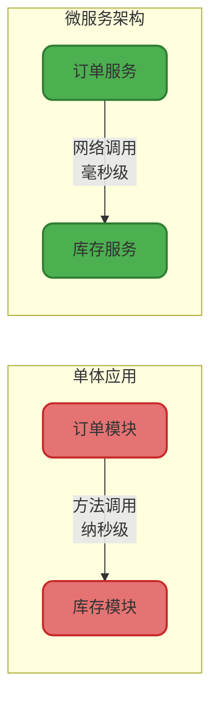
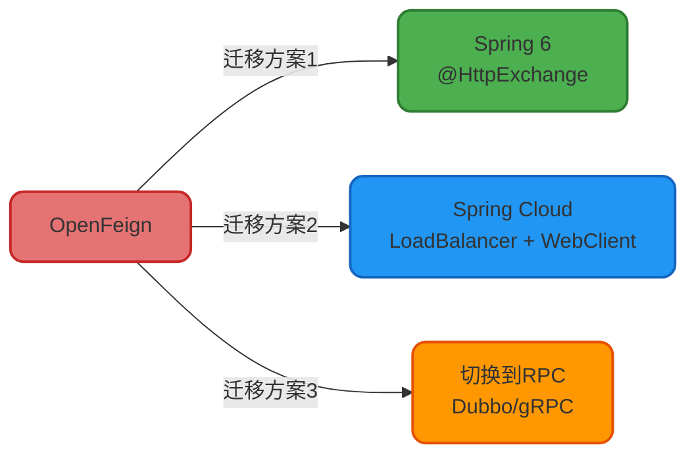
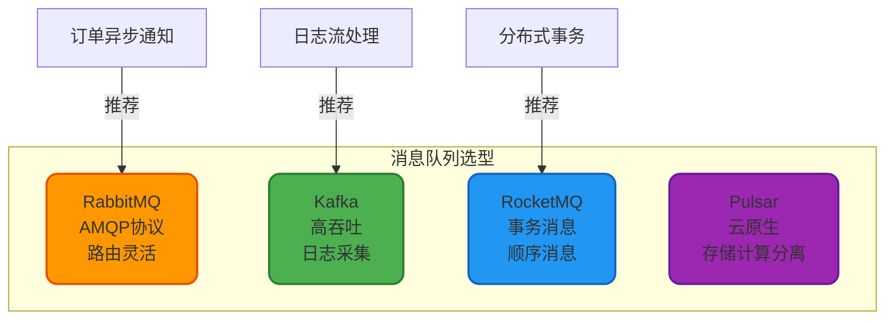
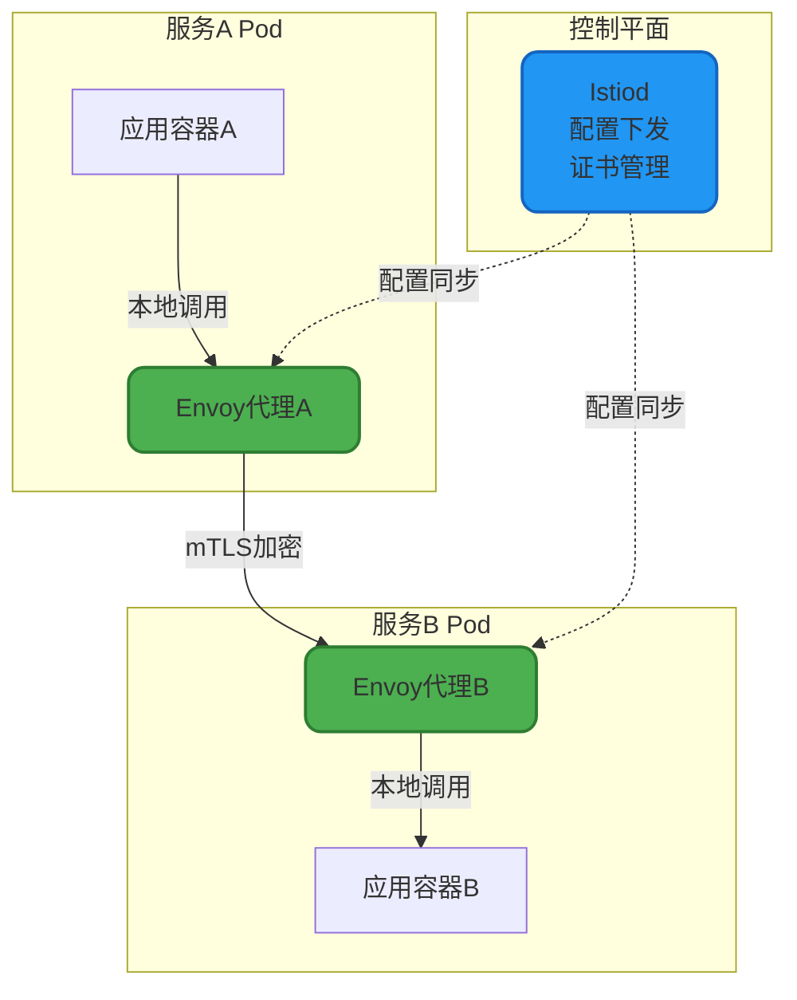

# 微服务间通信技术详解

## 微服务通信的本质

在单体应用时代,不同模块之间的调用是进程内的方法调用,延迟通常在纳秒级别。而微服务架构将系统拆分为独立部署的服务单元后,模块间的通信变成了跨进程、跨网络的远程调用,延迟提升到毫秒甚至秒级,同时还需要考虑网络异常、超时、序列化等一系列问题。

选择合适的通信方式,是保障微服务系统性能和稳定性的关键。



## HTTP通信方式

### RESTful API - 最通用的选择

RESTful API基于HTTP协议,采用标准的HTTP方法(GET/POST/PUT/DELETE)进行资源操作,是微服务间通信最常见的方式。

**核心优势**:
- 协议简单,易于理解和调试
- 跨语言支持好,几乎所有编程语言都有HTTP客户端
- 可以直接通过浏览器或curl命令测试
- 防火墙友好,通常不需要特殊配置

**代码示例** - 使用RestTemplate调用库存服务:

```java
@Service
public class WarehouseClientService {
    
    @Autowired
    private RestTemplate restTemplate;
    
    /**
     * 检查商品库存是否充足
     * @param skuId SKU编号
     * @param quantity 需要的数量
     * @return 是否有足够库存
     */
    public boolean checkInventory(Long skuId, Integer quantity) {
        String url = "http://warehouse-service/api/inventory/check";
        
        // 构建请求参数
        Map<String, Object> params = new HashMap<>();
        params.put("skuId", skuId);
        params.put("requiredQuantity", quantity);
        
        try {
            // 发起POST请求
            InventoryCheckResponse response = restTemplate.postForObject(
                url, 
                params, 
                InventoryCheckResponse.class
            );
            
            return response != null && response.isAvailable();
            
        } catch (RestClientException e) {
            // 调用失败时的容错处理
            log.error("调用库存服务失败, skuId:{}, quantity:{}", skuId, quantity, e);
            return false; // 降级策略:默认认为库存不足
        }
    }
    
    /**
     * 批量锁定库存(支持事务性操作)
     */
    @Transactional
    public boolean lockInventoryBatch(List<InventoryLockItem> items) {
        String url = "http://warehouse-service/api/inventory/lock/batch";
        
        InventoryLockRequest request = new InventoryLockRequest();
        request.setLockItems(items);
        request.setBusinessType("ORDER");
        request.setTimeoutSeconds(1800); // 锁定30分钟
        
        HttpHeaders headers = new HttpHeaders();
        headers.setContentType(MediaType.APPLICATION_JSON);
        headers.set("X-Request-Id", UUID.randomUUID().toString());
        
        HttpEntity<InventoryLockRequest> entity = new HttpEntity<>(request, headers);
        
        ResponseEntity<InventoryLockResponse> response = restTemplate.exchange(
            url,
            HttpMethod.POST,
            entity,
            InventoryLockResponse.class
        );
        
        return response.getStatusCode() == HttpStatus.OK 
            && response.getBody().isSuccess();
    }
}
```

### OpenFeign - 声明式HTTP客户端

OpenFeign是Spring Cloud的核心组件,通过接口和注解的方式简化HTTP调用,底层自动集成了负载均衡和熔断降级能力。

**代码示例** - Feign接口定义:

```java
@FeignClient(
    name = "warehouse-service",
    path = "/api/inventory",
    fallback = WarehouseFeignClientFallback.class
)
public interface WarehouseFeignClient {
    
    /**
     * 查询SKU库存详情
     */
    @GetMapping("/query")
    InventoryDetailDTO queryInventory(@RequestParam("skuId") Long skuId);
    
    /**
     * 扣减库存
     */
    @PostMapping("/deduct")
    BaseResponse<Boolean> deductInventory(@RequestBody InventoryDeductRequest request);
    
    /**
     * 释放库存
     */
    @PostMapping("/release")
    BaseResponse<Boolean> releaseInventory(@RequestBody InventoryReleaseRequest request);
}

/**
 * Feign降级处理
 */
@Component
public class WarehouseFeignClientFallback implements WarehouseFeignClient {
    
    @Override
    public InventoryDetailDTO queryInventory(Long skuId) {
        // 降级逻辑:返回默认库存信息
        InventoryDetailDTO fallback = new InventoryDetailDTO();
        fallback.setSkuId(skuId);
        fallback.setAvailableStock(0);
        fallback.setFromCache(true);
        return fallback;
    }
    
    @Override
    public BaseResponse<Boolean> deductInventory(InventoryDeductRequest request) {
        return BaseResponse.fail("库存服务暂时不可用,请稍后重试");
    }
    
    @Override
    public BaseResponse<Boolean> releaseInventory(InventoryReleaseRequest request) {
        // 释放库存失败时记录日志,后续通过补偿机制处理
        log.error("释放库存失败(服务降级), request:{}", request);
        return BaseResponse.fail("释放库存失败");
    }
}
```

**OpenFeign的现状与替代方案**:

从Spring Cloud 2022版本开始,OpenFeign进入功能完整状态,官方不再添加新特性。推荐的迁移路径:



### Spring 6 @HttpExchange

Spring 6引入的新特性,提供了类似Feign的声明式HTTP客户端能力,无需引入额外依赖。

**代码示例**:

```java
@HttpExchange("/api/payment")
public interface PaymentHttpClient {
    
    /**
     * 创建支付单
     */
    @PostExchange("/create")
    PaymentCreateResponse createPayment(@RequestBody PaymentCreateRequest request);
    
    /**
     * 查询支付状态
     */
    @GetExchange("/status/{paymentNo}")
    PaymentStatusDTO queryPaymentStatus(@PathVariable String paymentNo);
    
    /**
     * 关闭支付单
     */
    @PutExchange("/close")
    BaseResponse<Void> closePayment(@RequestParam String paymentNo);
}

// 配置类
@Configuration
public class HttpClientConfig {
    
    @Bean
    public PaymentHttpClient paymentHttpClient() {
        WebClient webClient = WebClient.builder()
            .baseUrl("http://payment-service")
            .defaultHeader(HttpHeaders.CONTENT_TYPE, MediaType.APPLICATION_JSON_VALUE)
            .build();
        
        HttpServiceProxyFactory factory = HttpServiceProxyFactory
            .builder(WebClientAdapter.forClient(webClient))
            .build();
        
        return factory.createClient(PaymentHttpClient.class);
    }
}
```

## RPC通信方式

RPC(Remote Procedure Call)通过自定义的二进制协议进行通信,相比HTTP具有更高的性能和更小的传输体积。

### Dubbo - 国内主流RPC框架

Dubbo是阿里巴巴开源的高性能RPC框架,在国内企业中有广泛应用,提供了丰富的服务治理能力。

**核心特性**:
- 基于Netty的高性能网络通信
- 支持多种序列化协议(Hessian/Protobuf/Kryo)
- 内置负载均衡、集群容错、服务降级
- 与Nacos/ZooKeeper无缝集成

**代码示例** - Dubbo服务提供者:

```java
/**
 * 会员等级服务接口
 */
public interface MemberLevelService {
    
    /**
     * 查询会员等级信息
     */
    MemberLevelDTO queryMemberLevel(Long memberId);
    
    /**
     * 升级会员等级
     */
    boolean upgradeMemberLevel(Long memberId, String targetLevel);
}

/**
 * 服务实现(提供者)
 */
@DubboService(
    version = "1.0.0",
    timeout = 3000,
    retries = 2
)
public class MemberLevelServiceImpl implements MemberLevelService {
    
    @Autowired
    private MemberLevelRepository levelRepository;
    
    @Override
    public MemberLevelDTO queryMemberLevel(Long memberId) {
        MemberLevel level = levelRepository.findByMemberId(memberId);
        
        return MemberLevelDTO.builder()
            .memberId(memberId)
            .currentLevel(level.getLevelName())
            .growthValue(level.getGrowthValue())
            .nextLevelThreshold(level.getNextLevelThreshold())
            .build();
    }
    
    @Override
    public boolean upgradeMemberLevel(Long memberId, String targetLevel) {
        MemberLevel level = levelRepository.findByMemberId(memberId);
        
        // 业务逻辑:校验升级条件
        if (!level.canUpgradeTo(targetLevel)) {
            throw new BusinessException("不满足升级条件");
        }
        
        level.setLevelName(targetLevel);
        level.setUpgradeTime(LocalDateTime.now());
        levelRepository.save(level);
        
        return true;
    }
}
```

**Dubbo服务消费者**:

```java
@Service
public class OrderBenefitService {
    
    @DubboReference(
        version = "1.0.0",
        timeout = 3000,
        check = false // 启动时不检查服务是否可用
    )
    private MemberLevelService memberLevelService;
    
    /**
     * 计算订单折扣(根据会员等级)
     */
    public BigDecimal calculateDiscount(Long memberId, BigDecimal originalAmount) {
        // 通过Dubbo RPC调用会员服务
        MemberLevelDTO memberLevel = memberLevelService.queryMemberLevel(memberId);
        
        // 根据会员等级计算折扣
        BigDecimal discountRate = switch (memberLevel.getCurrentLevel()) {
            case "GOLD" -> new BigDecimal("0.95");
            case "PLATINUM" -> new BigDecimal("0.90");
            case "DIAMOND" -> new BigDecimal("0.85");
            default -> BigDecimal.ONE;
        };
        
        return originalAmount.multiply(discountRate);
    }
}
```

### gRPC - 高性能跨语言RPC

gRPC是Google开源的RPC框架,基于HTTP/2协议和Protobuf序列化,支持多种编程语言,在微服务异构环境中表现出色。

**核心优势**:
- HTTP/2多路复用,单连接支持并发请求
- Protobuf序列化,体积小、速度快
- 支持双向流、服务端推送
- 完善的跨语言支持

**Protobuf定义**:

```protobuf
syntax = "proto3";

package com.example.notification;

// 通知服务
service NotificationService {
  // 发送单条通知
  rpc SendNotification(NotificationRequest) returns (NotificationResponse);
  
  // 批量发送通知
  rpc SendBatchNotifications(BatchNotificationRequest) returns (BatchNotificationResponse);
  
  // 服务端流式推送(实时通知)
  rpc SubscribeNotifications(SubscribeRequest) returns (stream NotificationMessage);
}

message NotificationRequest {
  string user_id = 1;
  string title = 2;
  string content = 3;
  NotificationType type = 4;
}

message NotificationResponse {
  bool success = 1;
  string message_id = 2;
  string error_message = 3;
}

enum NotificationType {
  SYSTEM = 0;
  ORDER = 1;
  PROMOTION = 2;
}
```

**Java实现示例**:

```java
@GrpcService
public class NotificationServiceImpl extends NotificationServiceGrpc.NotificationServiceImplBase {
    
    @Autowired
    private NotificationSender notificationSender;
    
    @Override
    public void sendNotification(NotificationRequest request, 
                                  StreamObserver<NotificationResponse> responseObserver) {
        try {
            // 发送通知
            String messageId = notificationSender.send(
                request.getUserId(),
                request.getTitle(),
                request.getContent(),
                request.getType()
            );
            
            // 构建响应
            NotificationResponse response = NotificationResponse.newBuilder()
                .setSuccess(true)
                .setMessageId(messageId)
                .build();
            
            responseObserver.onNext(response);
            responseObserver.onCompleted();
            
        } catch (Exception e) {
            responseObserver.onError(
                Status.INTERNAL
                    .withDescription("发送通知失败: " + e.getMessage())
                    .asRuntimeException()
            );
        }
    }
    
    @Override
    public void subscribeNotifications(SubscribeRequest request,
                                       StreamObserver<NotificationMessage> responseObserver) {
        String userId = request.getUserId();
        
        // 建立长连接,持续推送通知
        notificationSender.subscribe(userId, message -> {
            NotificationMessage grpcMessage = NotificationMessage.newBuilder()
                .setTitle(message.getTitle())
                .setContent(message.getContent())
                .setTimestamp(message.getTimestamp())
                .build();
            
            responseObserver.onNext(grpcMessage);
        });
    }
}
```

## 消息队列通信

消息队列实现了服务间的异步通信和解耦,适用于不需要实时响应的场景。

### 主流消息中间件对比



### RocketMQ异步通信示例

**消息生产者** - 订单创建后发送通知:

```java
@Service
public class OrderEventPublisher {
    
    @Autowired
    private RocketMQTemplate rocketMQTemplate;
    
    /**
     * 发布订单创建事件
     */
    public void publishOrderCreatedEvent(Order order) {
        OrderCreatedEvent event = OrderCreatedEvent.builder()
            .orderNo(order.getOrderNo())
            .userId(order.getUserId())
            .totalAmount(order.getTotalAmount())
            .createTime(order.getCreateTime())
            .build();
        
        // 异步发送消息
        rocketMQTemplate.asyncSend(
            "ORDER_TOPIC:ORDER_CREATED",
            MessageBuilder.withPayload(event).build(),
            new SendCallback() {
                @Override
                public void onSuccess(SendResult sendResult) {
                    log.info("订单事件发送成功, orderNo:{}, msgId:{}", 
                        order.getOrderNo(), sendResult.getMsgId());
                }
                
                @Override
                public void onException(Throwable throwable) {
                    log.error("订单事件发送失败, orderNo:{}", order.getOrderNo(), throwable);
                    // 发送失败补偿:记录到本地表,后续重试
                }
            }
        );
    }
}
```

**消息消费者** - 库存服务监听订单事件:

```java
@Service
@RocketMQMessageListener(
    topic = "ORDER_TOPIC",
    selectorExpression = "ORDER_CREATED",
    consumerGroup = "inventory-consumer-group"
)
public class OrderCreatedEventListener implements RocketMQListener<OrderCreatedEvent> {
    
    @Autowired
    private InventoryService inventoryService;
    
    @Override
    public void onMessage(OrderCreatedEvent event) {
        try {
            log.info("接收到订单创建事件, orderNo:{}", event.getOrderNo());
            
            // 预扣减库存
            inventoryService.preDeductInventory(
                event.getOrderNo(),
                event.getProductItems()
            );
            
        } catch (Exception e) {
            log.error("处理订单创建事件失败, orderNo:{}", event.getOrderNo(), e);
            // 抛出异常会触发消息重试
            throw new RuntimeException("库存扣减失败", e);
        }
    }
}
```

## Service Mesh - 下一代服务通信

Service Mesh将服务间通信的治理逻辑从业务代码中剥离,通过Sidecar代理实现流量管控、安全加密、可观测性等能力。

### Istio架构模式



**Service Mesh的价值**:
- 无侵入的流量治理(重试、超时、熔断)
- 自动的双向TLS加密
- 细粒度的访问控制
- 统一的可观测性(指标、日志、链路追踪)

## 通信方式选型指南

| 场景 | 推荐方案 | 原因 |
|------|---------|------|
| 同步查询数据 | HTTP/RPC | 需要实时响应,调用方等待结果 |
| 异步事件通知 | 消息队列 | 解耦服务,削峰填谷,支持重试 |
| 高性能内部调用 | Dubbo/gRPC | 二进制协议,性能优于HTTP |
| 跨语言异构系统 | gRPC/REST | 标准协议,语言无关性 |
| 复杂流量治理 | Service Mesh | 统一管控,业务代码零侵入 |

选择通信方式时,需要综合考虑性能要求、团队技术栈、运维能力等因素,没有银弹方案,适合自己的才是最好的。
