# 一致性哈希算法原理与实践

## 传统哈希算法的局限性

在分布式系统中,我们经常需要将数据分散存储到多个节点上。传统的做法是使用哈希取模算法,例如在缓存系统中,我们有8台Redis服务器,要缓存用户数据时,可以这样计算:

```
目标服务器 = hash(user_id) % 8
```

这种方式在节点数量固定时运行良好。但是当我们需要扩容或缩容时,问题就出现了。

**扩容场景**:假设业务增长迅速,8台服务器不够用了,需要扩展到16台。此时取模的基数从8变为16,几乎所有的数据映射关系都会发生变化。原本映射到服务器3的数据,现在可能映射到服务器11。这导致大量缓存失效,引发缓存雪崩。

**缩容场景**:如果某台服务器故障下线,同样会导致大量数据重新映射,影响范围远超单台服务器的数据量。


一致性哈希算法正是为了解决这个问题而诞生的,它能够在节点变化时,将数据迁移量降到最低。

## 一致性哈希核心原理

一致性哈希算法将整个哈希值空间组织成一个虚拟的环形结构,这个环的取值范围通常是0到2^32-1。

### 哈希环构建


### 节点与数据映射

**第一步:服务器节点映射**

假设我们有4台Redis缓存服务器,每台服务器通过哈希函数映射到环上的一个位置:

```
hash("redis-server-A") % 2^32 = 1500000000
hash("redis-server-B") % 2^32 = 3000000000  
hash("redis-server-C") % 2^32 = 150000000
hash("redis-server-D") % 2^32 = 4200000000
```


**第二步:数据键映射**

当需要存储或查询数据时,对数据的键进行同样的哈希运算:

```java
// 缓存用户信息示例
String cacheKey = "user:profile:888888";
long hashValue = hash(cacheKey) % (1L << 32);  // 假设结果为 2000000000
```

**第三步:顺时针查找规则**

数据映射到哈希环后,沿着顺时针方向查找,遇到的第一个服务器节点就是数据的存储位置。

```mermaid
graph LR
    subgraph 数据查找过程
        Data1[数据Key1<br/>hash=200000000]
        Data2[数据Key2<br/>hash=2000000000]
        Data3[数据Key3<br/>hash=3500000000]
        
        ServerA[Redis-A<br/>150000000]
        ServerB[Redis-B<br/>1500000000]
        ServerC[Redis-C<br/>3000000000]
        ServerD[Redis-D<br/>4200000000]
        
        Data1 -->|顺时针查找| ServerB
        Data2 -->|顺时针查找| ServerC
        Data3 -->|顺时针查找| ServerD
    end
    
    style Data1 fill:#4DD0E1,stroke:#0097A7,stroke-width:2px,rx:10,ry:10
    style Data2 fill:#4DD0E1,stroke:#0097A7,stroke-width:2px,rx:10,ry:10
    style Data3 fill:#4DD0E1,stroke:#0097A7,stroke-width:2px,rx:10,ry:10
    style ServerA fill:#81C784,stroke:#43A047,stroke-width:2px,rx:10,ry:10
    style ServerB fill:#64B5F6,stroke:#1976D2,stroke-width:2px,rx:10,ry:10
    style ServerC fill:#FFB74D,stroke:#F57C00,stroke-width:2px,rx:10,ry:10
    style ServerD fill:#BA68C8,stroke:#7B1FA2,stroke-width:2px,rx:10,ry:10
```



### 节点增减时的影响

**增加节点场景**

假设系统负载增加,需要新增一台Redis-E服务器,其哈希值为2500000000,刚好落在Redis-B和Redis-C之间。


相比传统哈希,影响范围从几乎100%缩减到约1/N(N为节点数)。只有落在新节点和前一个节点之间的数据需要迁移。

**删除节点场景**

如果Redis-B服务器故障下线,原本由它负责的数据会自动转移到下一个节点Redis-C。


## 虚拟节点优化

### 数据倾斜问题

当物理节点较少时,一致性哈希可能出现数据分布不均的问题。例如4台服务器的哈希值如果集中在环的某一侧,会导致某些服务器负载过高。


### 虚拟节点解决方案

为每个物理节点创建多个虚拟节点,使节点在环上分布更均匀。通常一个物理节点会对应100-200个虚拟节点。

```java
/**
 * 缓存路由服务 - 实现一致性哈希
 */
public class CacheRouter {
    
    // 虚拟节点倍数
    private static final int VIRTUAL_NODE_COUNT = 150;
    
    // 哈希环:虚拟节点哈希值 -> 物理服务器
    private final TreeMap<Long, String> hashRing = new TreeMap<>();
    
    /**
     * 添加缓存服务器节点
     * @param serverIp 服务器IP地址
     */
    public void addServer(String serverIp) {
        // 为每个物理节点创建150个虚拟节点
        for (int i = 0; i < VIRTUAL_NODE_COUNT; i++) {
            String virtualNodeKey = serverIp + "#virtual-" + i;
            long hashValue = hash(virtualNodeKey);
            hashRing.put(hashValue, serverIp);
        }
        System.out.println("服务器 " + serverIp + " 上线,创建 " 
            + VIRTUAL_NODE_COUNT + " 个虚拟节点");
    }
    
    /**
     * 移除缓存服务器节点
     * @param serverIp 服务器IP地址
     */
    public void removeServer(String serverIp) {
        for (int i = 0; i < VIRTUAL_NODE_COUNT; i++) {
            String virtualNodeKey = serverIp + "#virtual-" + i;
            long hashValue = hash(virtualNodeKey);
            hashRing.remove(hashValue);
        }
        System.out.println("服务器 " + serverIp + " 下线");
    }
    
    /**
     * 路由缓存请求到具体服务器
     * @param cacheKey 缓存键,例如 "product:detail:12345"
     * @return 目标服务器IP
     */
    public String routeServer(String cacheKey) {
        if (hashRing.isEmpty()) {
            throw new IllegalStateException("没有可用的缓存服务器");
        }
        
        long hashValue = hash(cacheKey);
        
        // 查找顺时针方向第一个节点
        Map.Entry<Long, String> entry = hashRing.ceilingEntry(hashValue);
        
        // 如果没找到,说明已经超过最大值,取环上第一个节点
        if (entry == null) {
            entry = hashRing.firstEntry();
        }
        
        return entry.getValue();
    }
    
    /**
     * MurmurHash算法实现
     */
    private long hash(String key) {
        // 使用MurmurHash或FNV等高性能哈希算法
        // 这里简化实现
        return Math.abs(key.hashCode()) % (1L << 32);
    }
    
    /**
     * 展示当前数据分布情况
     */
    public void showDistribution() {
        Map<String, Integer> distribution = new HashMap<>();
        
        // 统计每个物理服务器对应的虚拟节点数量
        for (String server : hashRing.values()) {
            distribution.put(server, 
                distribution.getOrDefault(server, 0) + 1);
        }
        
        System.out.println("数据分布情况:");
        distribution.forEach((server, count) -> {
            System.out.println("  " + server + ": " + count + " 个虚拟节点");
        });
    }
}
```

### 应用示例

```java
/**
 * 商品详情缓存场景
 */
public class ProductCacheExample {
    
    public static void main(String[] args) {
        CacheRouter router = new CacheRouter();
        
        // 初始化4台缓存服务器
        router.addServer("192.168.1.101");
        router.addServer("192.168.1.102");
        router.addServer("192.168.1.103");
        router.addServer("192.168.1.104");
        
        // 路由商品缓存请求
        String product1 = router.routeServer("product:detail:10001");
        String product2 = router.routeServer("product:detail:10002");
        String product3 = router.routeServer("product:detail:10003");
        
        System.out.println("商品10001 -> " + product1);
        System.out.println("商品10002 -> " + product2);
        System.out.println("商品10003 -> " + product3);
        
        // 模拟服务器故障
        System.out.println("\n服务器192.168.1.102故障下线");
        router.removeServer("192.168.1.102");
        
        // 原本路由到102的数据会自动转移到其他服务器
        String product2New = router.routeServer("product:detail:10002");
        System.out.println("商品10002迁移至 -> " + product2New);
        
        // 扩容场景:新增一台服务器
        System.out.println("\n系统扩容,新增服务器192.168.1.105");
        router.addServer("192.168.1.105");
        
        router.showDistribution();
    }
}
```


## 一致性哈希的优势与局限

### 核心优势

**数据迁移最小化**

在节点数量为N的集群中,增加或删除一个节点,平均只影响1/N的数据,而传统哈希几乎影响所有数据。这在大规模缓存系统中意味着:
- 减少缓存失效导致的数据库压力
- 降低数据迁移的网络开销
- 提升系统扩展的平滑性

**高扩展性**

支持动态增减节点而不影响整体服务,特别适合云环境下的弹性伸缩场景。

**去中心化**

不需要集中式的元数据服务器,每个节点通过相同的哈希算法就能确定数据位置,降低了系统复杂度。

### 存在的局限

**哈希碰撞风险**

虽然虚拟节点减轻了数据倾斜,但在节点数极少且哈希函数质量不高时,仍可能出现分布不均。

**节点频繁变更**

如果节点频繁上下线,虽然每次影响范围小,但累积的数据迁移量仍可能很大,需要配合缓存预热等策略。

**无法处理热点数据**

如果某些数据访问频率极高(如爆款商品),会导致某个节点压力过大。需要配合其他策略如数据多副本、本地缓存等。

## 工程实践建议

### 选择合适的哈希算法

推荐使用MurmurHash3或FNV-1a等高性能哈希算法,避免使用Java默认的hashCode(),因为其碰撞率相对较高。

### 虚拟节点数量配置

- 节点数少于10时,建议每个物理节点对应150-200个虚拟节点
- 节点数在10-100时,可减少到50-100个虚拟节点
- 节点数超过100时,甚至可以不使用虚拟节点

### 与其他策略结合

- **配合主从复制**:每个节点配置备份节点,提升可用性
- **数据多副本**:热点数据在多个节点存储副本
- **客户端缓存**:减少对后端节点的访问压力

一致性哈希是分布式系统中的基础算法,理解其原理对于设计高可用、可扩展的系统至关重要。
