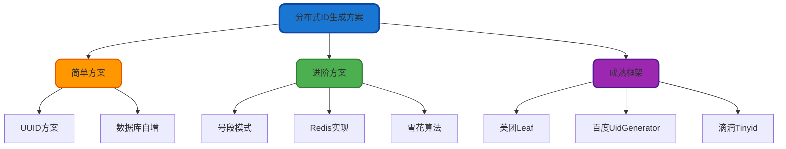
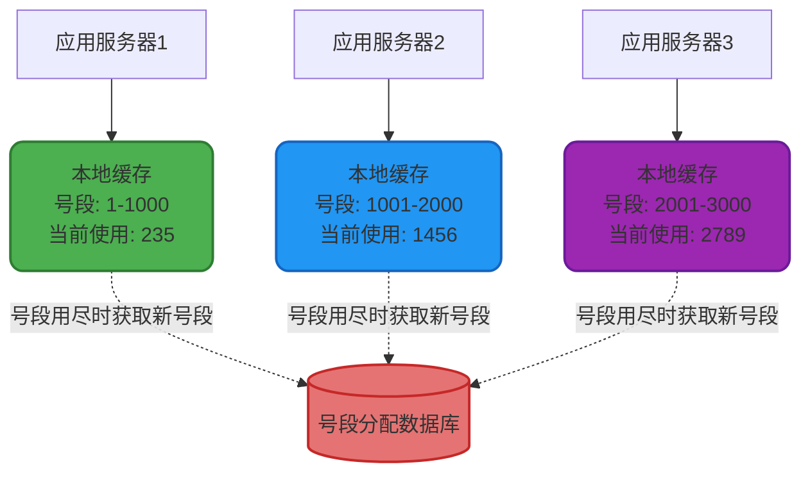
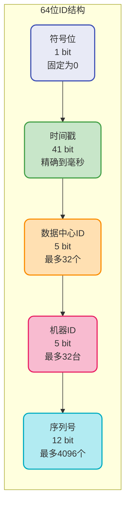
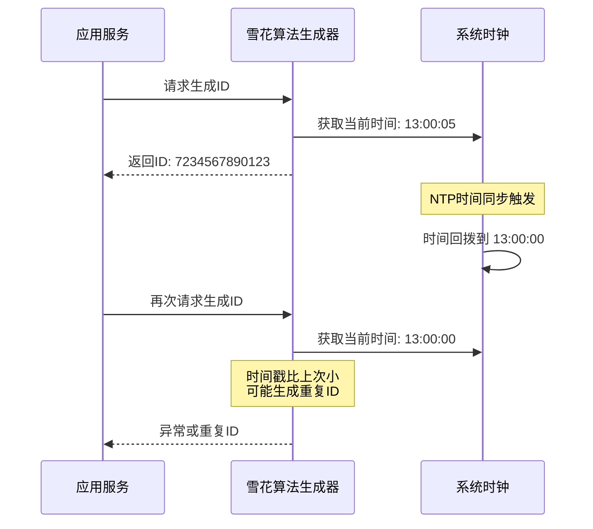
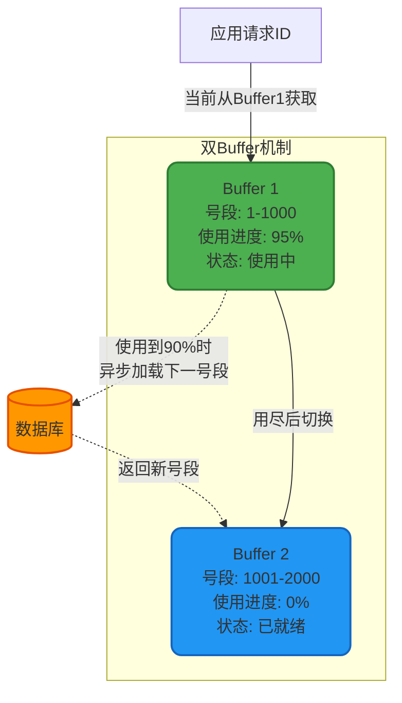
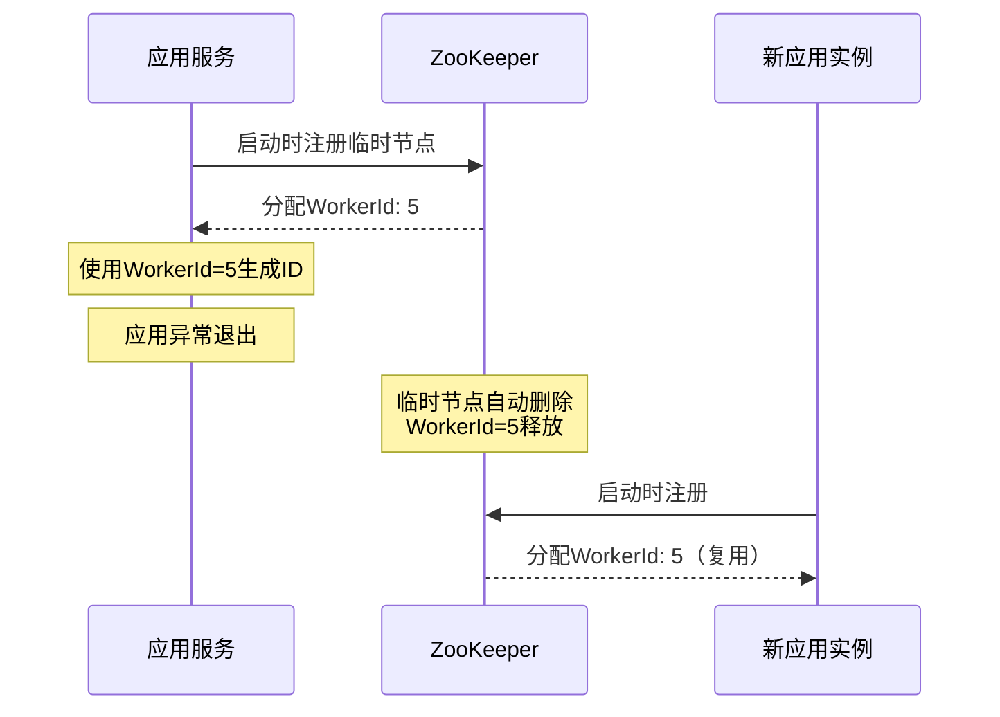
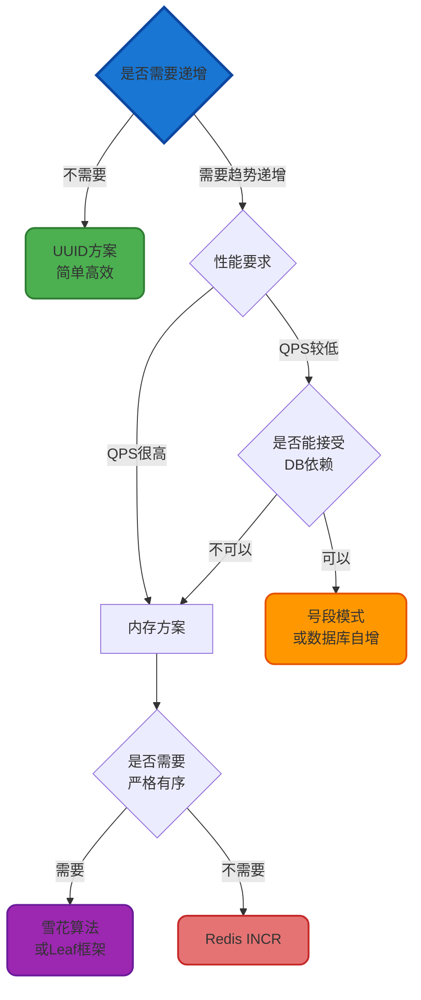

# 分布式ID生成方案详解

## 为什么需要分布式ID

在传统单体应用架构中，我们通常依赖数据库的自增主键来生成唯一标识符，这种方式简单高效且能保证全局唯一。然而，随着业务规模的快速增长，当单表数据量突破千万级甚至亿级时，单库单表的性能瓶颈愈发明显。此时，分库分表成为必然选择。

在分库分表场景下，数据被分散存储到多个数据库实例的多张物理表中。假设订单表被水平拆分为16个分片，每个分片独立维护自增ID，就会出现不同分片生成相同ID的情况，导致全局唯一性被破坏。因此，我们需要一套能够跨库跨表生成全局唯一标识的方案，这就是分布式ID的核心价值。

### 分布式ID的核心要求

一个优秀的分布式ID生成方案应当满足以下关键特性：

**全局唯一性**：这是最基本也是最核心的要求。无论在哪个数据分片、哪台应用服务器上生成的ID，都必须保证在整个分布式系统中绝对唯一，不能出现任何重复。

**高性能与高可用**：ID生成服务往往是系统的核心基础组件，几乎所有业务操作都依赖它。因此必须保证极高的响应速度（通常要求毫秒级）和接近100%的服务可用性，不能成为系统瓶颈。

**趋势递增**：根据不同的业务场景，对递增性有不同层次的要求：
- 基础要求：整体呈现递增趋势，新生成的ID大概率比旧ID大
- 中级要求：单个服务节点内保证严格递增
- 高级要求：全局范围内保证严格单调递增

为什么需要递增特性？主要有两个原因：一是MySQL的InnoDB引擎使用B+树索引，递增ID能够避免页分裂，显著提升写入性能；二是递增ID便于进行范围查询和数据归档。

## 主流分布式ID生成方案



### UUID方案

UUID（Universally Unique Identifier）全局唯一标识符，是一种在单机环境下就能生成全局唯一ID的算法。标准UUID由32位16进制数字组成，格式为`xxxxxxxx-xxxx-xxxx-xxxx-xxxxxxxxxxxx`，长度为36个字符（包含4个连字符）。

UUID的生成依赖多种因素的组合：当前时间戳、时钟序列、网卡MAC地址等信息，通过特定算法计算得出。这些因素的组合确保了在不同时间、不同机器上生成的UUID几乎不可能重复。

#### 实践案例

在文件存储系统中，我们可以使用UUID作为文件的唯一标识：

```java
@Service
public class FileStorageService {
    
    @Autowired
    private OSSClient ossClient;
    
    /**
     * 上传文件并生成唯一标识
     */
    public String uploadFile(MultipartFile file) {
        // 生成UUID作为文件唯一标识
        String fileId = UUID.randomUUID().toString();
        
        // 获取原始文件扩展名
        String originalFilename = file.getOriginalFilename();
        String extension = originalFilename.substring(
            originalFilename.lastIndexOf(".")
        );
        
        // 构造存储文件名
        String storageFileName = fileId + extension;
        
        // 存储文件到云存储服务
        ossClient.putObject(bucketName, storageFileName, 
            file.getInputStream());
        
        return fileId;
    }
    
    /**
     * 根据文件ID下载文件
     */
    public InputStream downloadFile(String fileId, String extension) {
        String storageFileName = fileId + extension;
        return ossClient.getObject(bucketName, storageFileName);
    }
}
```

#### 优缺点分析

**优势所在**：
- 本地生成，性能极高，单机每秒可生成数百万个UUID
- 无需依赖外部服务，不存在网络开销和单点故障风险
- 实现简单，Java标准库即可直接使用

**明显缺陷**：
- 长度过长：36个字符作为主键会占用较多存储空间，且影响索引效率
- 无业务语义：类似`550e8400-e29b-41d4-a716-446655440000`的字符串完全无法体现业务含义，给问题排查和运维带来困难
- 不支持递增：无序的UUID作为主键会导致MySQL InnoDB引擎频繁的页分裂，严重影响写入性能
- 不便于展示：在用户界面显示UUID不够友好，用户体验较差

### 数据库自增方案

利用MySQL等关系型数据库的AUTO_INCREMENT特性来生成全局唯一ID，是最直观的实现方式。

#### 基础实现

创建一个专门用于生成ID的数据表：

```sql
CREATE TABLE id_generator (
    id BIGINT UNSIGNED NOT NULL AUTO_INCREMENT PRIMARY KEY,
    business_type VARCHAR(50) NOT NULL COMMENT '业务类型',
    created_time TIMESTAMP DEFAULT CURRENT_TIMESTAMP
) ENGINE=InnoDB;
```

应用程序通过插入并获取自增ID：

```java
@Service
public class DbIdGeneratorService {
    
    @Autowired
    private JdbcTemplate jdbcTemplate;
    
    /**
     * 生成唯一ID
     */
    public Long generateId(String businessType) {
        // 插入一条记录
        jdbcTemplate.update(
            "INSERT INTO id_generator(business_type) VALUES(?)",
            businessType
        );
        
        // 获取刚插入的自增ID
        Long id = jdbcTemplate.queryForObject(
            "SELECT LAST_INSERT_ID()",
            Long.class
        );
        
        return id;
    }
}
```

#### 高可用改进

单库方案存在明显的单点故障问题。改进方案是部署主从架构，并设置不同的自增步长：

```sql
-- 主库配置
SET @@auto_increment_increment = 2;  -- 步长为2
SET @@auto_increment_offset = 1;     -- 起始值为1，生成1,3,5,7...

-- 从库配置
SET @@auto_increment_increment = 2;  -- 步长为2
SET @@auto_increment_offset = 2;     -- 起始值为2，生成2,4,6,8...
```

这种方案的问题在于扩容困难，如果需要再增加一个节点，就必须调整所有节点的步长配置，系统风险较高。

**优缺点总结**：
- 优势：ID单调递增，实现简单，符合DBA运维习惯
- 劣势：存在单点故障风险，性能受限于数据库，扩展性差

### 号段模式

号段模式是对数据库自增方案的性能优化，核心思想是批量获取ID，减少数据库交互次数。

#### 工作原理

每次应用服务器启动时，不是每次生成ID都去访问数据库，而是一次性从数据库中获取一个号段（比如1000个连续的ID），缓存在本地内存中。当需要生成ID时，直接从内存中的号段分配，这一批用完后再去数据库获取下一个号段。

为了防止多个服务实例之间发生冲突，采用号段隔离的方式：
- 服务实例A获取号段：1 ~ 1000
- 服务实例B获取号段：1001 ~ 2000
- 服务实例C获取号段：2001 ~ 3000
- 当实例A的号段用完后，再次获取时得到：3001 ~ 4000

#### 架构设计



#### 数据库设计

```sql
CREATE TABLE id_segment (
    biz_tag VARCHAR(50) NOT NULL PRIMARY KEY COMMENT '业务标识',
    max_id BIGINT NOT NULL DEFAULT 0 COMMENT '当前已分配的最大ID',
    step INT NOT NULL DEFAULT 1000 COMMENT '号段步长',
    update_time TIMESTAMP DEFAULT CURRENT_TIMESTAMP ON UPDATE CURRENT_TIMESTAMP
) ENGINE=InnoDB;
```

#### 代码实现

```java
@Service
public class SegmentIdGenerator {
    
    @Autowired
    private JdbcTemplate jdbcTemplate;
    
    // 本地缓存的号段信息
    private static class Segment {
        private long currentId;
        private long maxId;
    }
    
    private final ConcurrentHashMap<String, Segment> segmentMap = new ConcurrentHashMap<>();
    
    /**
     * 生成分布式ID
     */
    public synchronized long nextId(String bizTag) {
        Segment segment = segmentMap.get(bizTag);
        
        // 首次获取或号段已用尽
        if (segment == null || segment.currentId >= segment.maxId) {
            segment = loadNewSegment(bizTag);
            segmentMap.put(bizTag, segment);
        }
        
        return ++segment.currentId;
    }
    
    /**
     * 从数据库加载新的号段
     */
    private Segment loadNewSegment(String bizTag) {
        // 使用数据库行锁保证并发安全
        Long newMaxId = jdbcTemplate.queryForObject(
            "UPDATE id_segment SET max_id = max_id + step " +
            "WHERE biz_tag = ? " +
            "RETURNING max_id",
            Long.class,
            bizTag
        );
        
        Integer step = jdbcTemplate.queryForObject(
            "SELECT step FROM id_segment WHERE biz_tag = ?",
            Integer.class,
            bizTag
        );
        
        Segment segment = new Segment();
        segment.currentId = newMaxId - step;
        segment.maxId = newMaxId;
        
        return segment;
    }
}
```

#### 优缺点总结

**优势**：
- 大幅减少数据库访问次数，性能远超直接数据库自增
- 单个服务实例内生成的ID严格递增
- 即使数据库短时间不可用，本地缓存的号段仍可继续使用

**劣势**：
- 无法保证全局严格递增，只能保证趋势递增
- 服务重启会导致部分号段浪费
- 仍然依赖数据库，存在单点故障风险（但影响已大幅降低）

许多分库分表中间件如TDDL Sequence就采用号段模式生成主键ID。

### Redis实现方案

利用Redis的INCR命令实现原子性自增，也是一种高性能的分布式ID生成方案。

#### 实现方式

```java
@Service
public class RedisIdGenerator {
    
    @Autowired
    private StringRedisTemplate redisTemplate;
    
    /**
     * 生成分布式ID
     */
    public Long generateId(String businessKey) {
        String redisKey = "distributed:id:" + businessKey;
        
        // Redis INCR命令保证原子性
        Long id = redisTemplate.opsForValue().increment(redisKey);
        
        return id;
    }
    
    /**
     * 带日期前缀的ID生成
     */
    public String generateIdWithDate(String businessKey) {
        String datePrefix = LocalDate.now().format(
            DateTimeFormatter.ofPattern("yyyyMMdd")
        );
        
        String redisKey = "distributed:id:" + businessKey + ":" + datePrefix;
        
        // 每天重新计数，并设置过期时间
        Long seq = redisTemplate.opsForValue().increment(redisKey);
        redisTemplate.expire(redisKey, 2, TimeUnit.DAYS);
        
        // 生成格式：20231215000001
        return datePrefix + String.format("%06d", seq);
    }
}
```

#### 优缺点分析

**优势**：
- 基于内存操作，性能极高，单机QPS可达10万+
- 通过Redis集群可以解决单点故障问题
- 实现简单，易于理解和维护

**劣势**：
- 依赖Redis的持久化机制，无论是RDB快照还是AOF日志，都无法完全避免数据丢失
- 如果Redis发生故障恢复，可能会出现ID重复的风险
- 网络开销相比本地生成略高

### Snowflake雪花算法

Snowflake是Twitter开源的分布式ID生成算法，它能够在分布式环境下生成全局唯一、趋势递增的64位长整型ID。

#### 算法结构

雪花算法生成的ID由以下几个部分组成：



**各部分详解**：

1. **符号位（1 bit）**：预留的符号位，始终为0，保证生成的ID为正数
2. **时间戳（41 bit）**：精确到毫秒级别，41位时间戳可以使用69年（2^41 / (365 * 24 * 60 * 60 * 1000) ≈ 69）
3. **数据中心标识（5 bit）**：支持最多32个不同的数据中心（2^5 = 32）
4. **机器标识（5 bit）**：每个数据中心内支持最多32台机器（2^5 = 32）
5. **序列号（12 bit）**：同一毫秒内可以生成4096个不同的ID（2^12 = 4096）

#### 唯一性保证机制

雪花算法通过多个维度的组合来保证ID的全局唯一性：

**时间戳维度**：时间戳位于ID的最高位，保证新生成的ID比旧的ID大。在不同的毫秒内，时间戳肯定不一样，因此ID必然不同。

**空间隔离维度**：引入数据中心标识和机器标识，这两个标识都是手动配置的，确保不同的数据中心和不同的机器生成的ID在这两个维度上有所区别。

**序列号维度**：用来解决同一毫秒内多次生成ID的问题。每次生成ID时序列号都会自增，因此同一台机器在同一毫秒内生成的ID，也能通过序列号区分开来。

**综合来看**：基于时间戳 + 数据中心标识 + 机器标识 + 序列号的组合，就保证了在不同进程中ID的全局唯一性，以及在相同进程中ID的有序性。

#### 代码实现

```java
public class SnowflakeIdGenerator {
    
    // 起始时间戳（2023-01-01 00:00:00）
    private final long epoch = 1672531200000L;
    
    // 各部分的位数
    private final long workerIdBits = 5L;
    private final long datacenterIdBits = 5L;
    private final long sequenceBits = 12L;
    
    // 各部分的最大值
    private final long maxWorkerId = ~(-1L << workerIdBits);
    private final long maxDatacenterId = ~(-1L << datacenterIdBits);
    private final long sequenceMask = ~(-1L << sequenceBits);
    
    // 各部分的位移量
    private final long workerIdShift = sequenceBits;
    private final long datacenterIdShift = sequenceBits + workerIdBits;
    private final long timestampShift = sequenceBits + workerIdBits + datacenterIdBits;
    
    private final long workerId;
    private final long datacenterId;
    private long sequence = 0L;
    private long lastTimestamp = -1L;
    
    public SnowflakeIdGenerator(long workerId, long datacenterId) {
        if (workerId > maxWorkerId || workerId < 0) {
            throw new IllegalArgumentException("Worker ID 超出范围");
        }
        if (datacenterId > maxDatacenterId || datacenterId < 0) {
            throw new IllegalArgumentException("Datacenter ID 超出范围");
        }
        this.workerId = workerId;
        this.datacenterId = datacenterId;
    }
    
    /**
     * 生成分布式ID
     */
    public synchronized long nextId() {
        long timestamp = currentTimeMillis();
        
        // 处理时钟回拨
        if (timestamp < lastTimestamp) {
            throw new RuntimeException(
                "时钟回拨异常，拒绝生成ID。回拨时长：" + (lastTimestamp - timestamp) + "ms"
            );
        }
        
        // 同一毫秒内，序列号自增
        if (timestamp == lastTimestamp) {
            sequence = (sequence + 1) & sequenceMask;
            // 序列号溢出，等待下一毫秒
            if (sequence == 0) {
                timestamp = waitNextMillis(lastTimestamp);
            }
        } else {
            // 不同毫秒，序列号重置为0
            sequence = 0L;
        }
        
        lastTimestamp = timestamp;
        
        // 组装64位ID
        return ((timestamp - epoch) << timestampShift)
                | (datacenterId << datacenterIdShift)
                | (workerId << workerIdShift)
                | sequence;
    }
    
    /**
     * 等待下一毫秒
     */
    private long waitNextMillis(long lastTimestamp) {
        long timestamp = currentTimeMillis();
        while (timestamp <= lastTimestamp) {
            timestamp = currentTimeMillis();
        }
        return timestamp;
    }
    
    private long currentTimeMillis() {
        return System.currentTimeMillis();
    }
}
```

#### 使用示例

```java
@Configuration
public class IdGeneratorConfig {
    
    @Bean
    public SnowflakeIdGenerator snowflakeIdGenerator() {
        // 从配置中心获取当前机器的workerId和datacenterId
        long workerId = getWorkerIdFromConfig();
        long datacenterId = getDatacenterIdFromConfig();
        
        return new SnowflakeIdGenerator(workerId, datacenterId);
    }
}

@Service
public class TradeService {
    
    @Autowired
    private SnowflakeIdGenerator idGenerator;
    
    /**
     * 创建交易订单
     */
    public String createTradeOrder(TradeRequest request) {
        // 生成唯一的订单ID
        long orderId = idGenerator.nextId();
        
        TradeOrder order = new TradeOrder();
        order.setOrderId(orderId);
        order.setAmount(request.getAmount());
        order.setUserId(request.getUserId());
        
        tradeRepository.save(order);
        
        return String.valueOf(orderId);
    }
}
```

#### 优势分析

**高性能与高可用**：完全在内存中生成，不依赖于任何外部服务，单机每秒可生成数百万个ID，且不存在单点故障。

**趋势递增**：由于时间戳在高位，生成的ID整体呈现递增趋势。在单个进程内，可以保证严格递增，适合作为MySQL的主键使用。

**信息丰富**：从ID中可以解析出生成时间、机器位置等信息，便于问题排查和数据分析。

#### 局限性分析

**机器ID配置复杂**：在Snowflake原始实现中，每个节点的机器ID和数据中心ID都需要硬编码在代码中，而且这些ID必须全局唯一。当某个节点故障或需要扩容时，就需要更改配置、重新编译代码、重新部署系统，运维成本较高。如果配置错误，将两个节点设置成相同的机器ID，就会导致ID重复。

**依赖时间一致性**：雪花算法强依赖于系统时间的准确性和单调性。如果系统时间被回拨（比如NTP时间同步导致时间倒退），可能会造成ID重复。这是雪花算法最严重的问题。

## 时钟回拨问题详解

### 什么是时钟回拨

时钟回拨是指生成分布式ID的服务器上的系统时间，由于某种原因，突然相比之前的时间发生倒退。

#### 产生原因

**网络时间协议（NTP）同步**：这是最常见的原因。操作系统会自动与NTP服务器同步时间，如果本地时间快了，NTP会强制将时间回调。例如，服务器时间是13:00:05，而NTP标准时间是13:00:00，同步时就会发生5秒的时钟回拨。

**人工手动修改**：运维人员误操作，手动将系统时间改错了。虽然现代运维规范中很少发生，但仍然是一个潜在风险。

**闰秒调整**：极少数情况下，操作系统处理闰秒时可能采用"倒退一秒"的策略。不过这种情况非常罕见。

#### 危害分析

当前时间的时间戳作为雪花算法中的重要组成部分，一旦时间戳倒退，就意味着单台机器上生成的ID可能会出现不顺序递增的情况。更严重的是可能发生ID重复。

因为对于同一台机器来说，数据中心标识、机器标识都是固定不变的。如果时间戳又出现了相同的情况，那么一旦序列号也恰好一致，就会生成完全相同的ID，导致数据冲突。时钟回拨会使ID重复的概率大大升高。

#### 时钟回拨场景示例



### 时钟回拨解决方案

#### 方案一：等待法

如果回拨时间非常短（比如几百毫秒左右），我们可以选择等待一小段时间，让系统时间追上来。实现方式就是让当前线程sleep，等待时钟恢复到上次记录的时间之后再继续。

```java
public synchronized long nextId() {
    long currentTimestamp = System.currentTimeMillis();
    
    // 检测到时钟回拨
    if (currentTimestamp < lastTimestamp) {
        long offset = lastTimestamp - currentTimestamp;
        
        // 回拨时间较短，等待恢复
        if (offset <= 5) {
            try {
                Thread.sleep(offset << 1);
                currentTimestamp = System.currentTimeMillis();
                
                // 等待后仍未恢复，抛出异常
                if (currentTimestamp < lastTimestamp) {
                    throw new RuntimeException("时钟回拨异常");
                }
            } catch (InterruptedException e) {
                throw new RuntimeException("等待时钟恢复被中断", e);
            }
        } else {
            // 回拨时间过长，直接拒绝
            throw new RuntimeException("时钟回拨时间过长: " + offset + "ms");
        }
    }
    
    // ... 后续ID生成逻辑
}
```

**适用场景**：回拨时间在几毫秒到几秒之间，且对系统可用性要求不是特别严格的场景。

**优点**：实现简单，能够自动恢复。

**缺点**：会阻塞ID生成请求，影响系统性能；如果回拨时间过长，等待不可接受。

#### 方案二：动态切换机器标识

如果发生时钟回拨，可以通过动态切换机器标识或数据中心标识的方式，来避免生成重复ID。

因为机器ID有5个bit，理论上支持32台机器。我们可以提前预留一些备用的机器ID，当出现时钟回拨时，就切换到备用的机器ID。这样即使时间戳和序列号都相同，由于机器ID变了，整个生成的ID也就不一样了。

```java
public class AdaptiveSnowflakeGenerator {
    
    private long workerId;
    private final long baseWorkerId;
    private final long maxWorkerId = 31;
    
    public AdaptiveSnowflakeGenerator(long workerId) {
        this.baseWorkerId = workerId;
        this.workerId = workerId;
    }
    
    public synchronized long nextId() {
        long currentTimestamp = System.currentTimeMillis();
        
        // 检测到时钟回拨
        if (currentTimestamp < lastTimestamp) {
            // 切换到备用workerId
            workerId = (workerId + 1) % maxWorkerId;
            
            // 如果所有workerId都用过了，抛出异常
            if (workerId == baseWorkerId) {
                throw new RuntimeException("所有备用Worker ID已耗尽");
            }
            
            // 记录切换日志
            logger.warn("检测到时钟回拨，切换WorkerId: {} -> {}", 
                workerId - 1, workerId);
        }
        
        // ... 后续ID生成逻辑
    }
}
```

**适用场景**：机器数量未达到上限，有富余的机器ID可以使用。

**优点**：不需要等待，能够立即恢复服务。

**缺点**：机器ID资源有限，多次回拨后可能耗尽；单机生成的ID不再严格递增。

#### 方案三：直接抛异常

这种看似不像方案的方案其实用得也挺多的，比如美团的Leaf、百度的UidGenerator都采用过。

因为时钟回拨并不常见，而且就算发生了，也不代表生成的ID一定会重复。所以重复其实是个低概率事件。而且，就算时钟不回拨，雪花算法在极端情况下也有重复的可能（并发极高，在同一台机器、时间戳相同、序列号也刚好相同的情况）。

因此，遇到时钟回拨的情况，直接阻断流程并告警，让运维人员介入处理，这也是一种务实的方案。至少能避免数据重复导致更大的业务损失。

```java
public synchronized long nextId() {
    long currentTimestamp = System.currentTimeMillis();
    
    // 检测到时钟回拨，直接拒绝服务
    if (currentTimestamp < lastTimestamp) {
        long offset = lastTimestamp - currentTimestamp;
        
        // 记录告警日志
        logger.error("严重告警：检测到时钟回拨 {}ms，拒绝生成ID", offset);
        
        // 发送告警通知
        alertService.sendAlert("时钟回拨告警", 
            "服务器: " + serverIp + ", 回拨时长: " + offset + "ms");
        
        // 抛出异常，拒绝生成ID
        throw new ClockBackwardException(
            "时钟回拨异常，回拨时长: " + offset + "ms"
        );
    }
    
    // ... 后续ID生成逻辑
}
```

**适用场景**：对数据一致性要求极高，宁可服务不可用也不能出现ID重复的场景。

**优点**：彻底避免因时钟回拨导致的ID重复问题。

**缺点**：会导致服务短暂不可用，需要人工介入处理。

#### 方案四：提前生成ID备用

在前面方案的基础上，如果时钟回拨的时间比较长，也可以考虑提前生成一批ID，存储在Redis等缓存中。一旦出现时钟回拨，就从缓存中取出之前生成好的ID来使用。

```java
@Service
public class IdBufferService {
    
    @Autowired
    private StringRedisTemplate redisTemplate;
    
    @Autowired
    private SnowflakeIdGenerator snowflakeGenerator;
    
    /**
     * 定时任务：预生成ID存入缓存
     */
    @Scheduled(fixedRate = 1000)
    public void preGenerateIds() {
        String bufferKey = "id:buffer:snowflake";
        
        // 保持缓存中有10000个备用ID
        Long bufferSize = redisTemplate.opsForList().size(bufferKey);
        if (bufferSize < 10000) {
            List<String> ids = new ArrayList<>();
            for (int i = 0; i < 5000; i++) {
                long id = snowflakeGenerator.nextId();
                ids.add(String.valueOf(id));
            }
            redisTemplate.opsForList().rightPushAll(bufferKey, ids);
        }
    }
    
    /**
     * 从缓存获取ID（时钟回拨时使用）
     */
    public Long getIdFromBuffer() {
        String bufferKey = "id:buffer:snowflake";
        String id = redisTemplate.opsForList().leftPop(bufferKey);
        
        if (id == null) {
            throw new RuntimeException("备用ID缓存已耗尽");
        }
        
        return Long.parseLong(id);
    }
}
```

**适用场景**：允许短期内ID不严格递增，但必须保证服务持续可用。

**优点**：即使时钟回拨也能继续提供服务，可用性高。

**缺点**：增加了系统复杂度；单机生成的ID不再严格递增；依赖Redis等外部存储。

## 美团Leaf框架详解

Leaf是美团开源的分布式ID生成框架，提供了两种生成模式：Segment（号段模式）和Snowflake（雪花模式）。Leaf在原有方案的基础上进行了大量优化，解决了很多实际生产环境中的痛点问题。

### Segment号段模式

Leaf的Segment模式是对传统号段模式的改进和增强。

#### 核心优化：双Buffer机制

传统号段模式存在一个问题：当一个号段用尽时，需要同步等待数据库返回新的号段，这段时间内无法生成ID，会导致服务暂时阻塞。

Leaf引入了双Buffer（双缓冲）机制来解决这个问题：



**工作流程**：

1. 系统同时维护两个Buffer，一个正在使用（Current Buffer），一个处于备用状态（Next Buffer）
2. 当Current Buffer的使用率达到某个阈值（比如90%）时，异步触发加载下一个号段到Next Buffer
3. 当Current Buffer完全用尽时，立即切换到Next Buffer，原来的Next Buffer变成Current Buffer
4. 同时异步加载新的号段作为新的Next Buffer

#### 优势分析

**高可用性**：即使数据库短时间不可用（比如1-2秒），由于有双Buffer缓存，系统仍然可以继续生成ID，不会影响业务。

**性能平滑**：消除了号段切换时的等待时间，ID生成性能更加平滑稳定。

**不依赖时钟**：完全不依赖系统时间，不存在时钟回拨问题。

#### 实现示例

```java
public class LeafSegmentGenerator {
    
    private static class SegmentBuffer {
        private final Segment[] segments = new Segment[2];
        private volatile int currentIndex = 0;
        private volatile boolean nextReady = false;
        
        public Segment getCurrent() {
            return segments[currentIndex];
        }
        
        public Segment getNext() {
            return segments[1 - currentIndex];
        }
        
        public void switchBuffer() {
            currentIndex = 1 - currentIndex;
        }
    }
    
    private static class Segment {
        private final AtomicLong value = new AtomicLong(0);
        private volatile long max;
        private volatile int step;
        
        public long getAndIncrement() {
            long val = value.getAndIncrement();
            if (val > max) {
                return -1; // 号段已用尽
            }
            return val;
        }
        
        public boolean isNeedLoadNext() {
            // 使用超过90%时需要加载下一个号段
            return value.get() >= (max - step * 0.1);
        }
    }
    
    private final SegmentBuffer buffer = new SegmentBuffer();
    
    /**
     * 生成ID
     */
    public long nextId(String bizTag) {
        while (true) {
            Segment current = buffer.getCurrent();
            
            // 检查是否需要异步加载下一个号段
            if (current.isNeedLoadNext() && !buffer.nextReady) {
                synchronized (this) {
                    if (!buffer.nextReady) {
                        loadNextSegment(bizTag);
                        buffer.nextReady = true;
                    }
                }
            }
            
            long id = current.getAndIncrement();
            
            // 当前号段未用尽，直接返回
            if (id >= 0) {
                return id;
            }
            
            // 当前号段已用尽，切换到下一个号段
            synchronized (this) {
                if (buffer.getCurrent() == current) {
                    buffer.switchBuffer();
                    buffer.nextReady = false;
                }
            }
        }
    }
    
    /**
     * 异步加载下一个号段
     */
    private void loadNextSegment(String bizTag) {
        // 从数据库获取新号段
        // ... 数据库操作
    }
}
```

### Snowflake雪花模式

Leaf的Snowflake模式在Twitter原始实现的基础上进行了多项优化。

#### 优化点一：WorkerId自动分配

原始Snowflake需要手动配置每台机器的WorkerId，容易出错且扩容困难。Leaf通过ZooKeeper实现WorkerId的自动分配：



#### 优化点二：时钟回拨处理

Leaf采用ZooKeeper持久化存储每个节点上次生成ID的时间戳。启动时会进行两次时钟校验：

1. **本地时间校验**：比较当前系统时间与上次生成ID的时间，如果回拨超过阈值（比如5秒），启动失败
2. **全局时间校验**：从ZooKeeper读取所有节点上报的时间戳，计算平均值，如果本机时间与平均值偏差过大，启动失败

```java
public class LeafSnowflakeGenerator {
    
    @Autowired
    private CuratorFramework zkClient;
    
    private final String ZK_TIME_PATH = "/leaf/snowflake/time";
    
    /**
     * 启动时检查时钟
     */
    public void init() throws Exception {
        long lastTimestamp = loadLastTimestamp();
        long currentTime = System.currentTimeMillis();
        
        // 检查本地时钟回拨
        if (currentTime < lastTimestamp) {
            long offset = lastTimestamp - currentTime;
            if (offset > 5000) {  // 回拨超过5秒
                throw new RuntimeException(
                    "严重的时钟回拨，回拨时长: " + offset + "ms，启动失败"
                );
            }
        }
        
        // 检查与集群时间的偏差
        long avgClusterTime = getAvgClusterTime();
        long timeOffset = Math.abs(currentTime - avgClusterTime);
        if (timeOffset > 10000) {  // 偏差超过10秒
            throw new RuntimeException(
                "本机时间与集群平均时间偏差过大: " + timeOffset + "ms"
            );
        }
        
        // 定时上报时间戳到ZK
        startTimeReportTask();
    }
    
    /**
     * 获取集群平均时间
     */
    private long getAvgClusterTime() throws Exception {
        List<String> children = zkClient.getChildren()
            .forPath(ZK_TIME_PATH);
        
        long sum = 0;
        for (String child : children) {
            byte[] data = zkClient.getData()
                .forPath(ZK_TIME_PATH + "/" + child);
            sum += Long.parseLong(new String(data));
        }
        
        return sum / children.size();
    }
}
```

#### 优化点三：号段预分配降低ZK依赖

为了减轻对ZooKeeper的依赖，Leaf引入了号段概念：每次从ZooKeeper获取一段时间范围（比如10秒），在这个时间范围内产生ID，避免了每次生成ID都要访问ZK。

```java
public class LeafSnowflake {
    
    private long timeSegmentStart;  // 时间段起始
    private long timeSegmentEnd;    // 时间段结束
    private final long SEGMENT_DURATION = 10000;  // 10秒一个时间段
    
    public synchronized long nextId() {
        long currentTime = System.currentTimeMillis();
        
        // 当前时间段已用尽，获取新的时间段
        if (currentTime >= timeSegmentEnd) {
            acquireNewTimeSegment();
        }
        
        // ... 正常的雪花算法ID生成逻辑
    }
    
    private void acquireNewTimeSegment() {
        // 从ZK获取新的时间段授权
        timeSegmentStart = System.currentTimeMillis();
        timeSegmentEnd = timeSegmentStart + SEGMENT_DURATION;
        
        // 持久化到ZK
        saveTimeSegmentToZK(timeSegmentEnd);
    }
}
```

### 其他分布式ID框架

除了美团Leaf，业界还有其他优秀的分布式ID生成框架：

**百度UidGenerator**：也是基于Snowflake算法，特点是将时间戳和序列号的位数进行了调整，序列号扩展到了22位，使得单机并发能力大幅提升。同时支持自定义WorkerId生成策略。

**滴滴Tinyid**：采用号段模式，提供了HTTP和Tinyid-client两种获取方式，支持多DB（号段ID可存储在多个数据库中），使用简单，适合小规模应用快速接入。

## 方案选型建议

不同的业务场景对分布式ID的要求不同，选择合适的方案至关重要：

### 选型决策树



### 具体场景建议

**文件系统、日志追踪等场景**：使用UUID即可，无需递增，简单可靠。

**电商订单号**：建议使用号段模式或雪花算法，既保证唯一性又具备递增特性，便于数据库索引优化。同时可以在ID中加入业务前缀，如日期、业务类型等。

**高并发秒杀场景**：优先选择雪花算法或美团Leaf的Snowflake模式，完全内存生成，性能极高，单机可支持百万级QPS。

**金融交易流水号**：建议使用成熟的分布式ID框架（如Leaf、UidGenerator），这些框架经过大规模生产验证，稳定性和可靠性更有保障。

**多数据中心部署**：必须选择支持数据中心标识的方案，如雪花算法，通过数据中心ID实现物理隔离。

通过对不同方案特点的深入理解，结合业务实际需求，选择最适合的分布式ID生成方案，才能在保证系统稳定性的同时，实现最优的性能表现。
