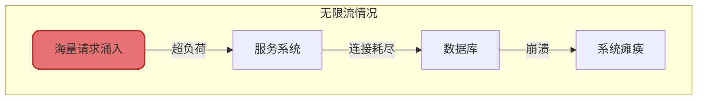
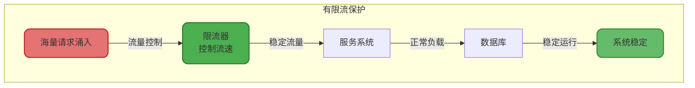
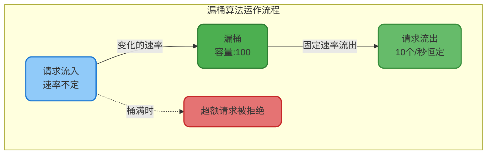
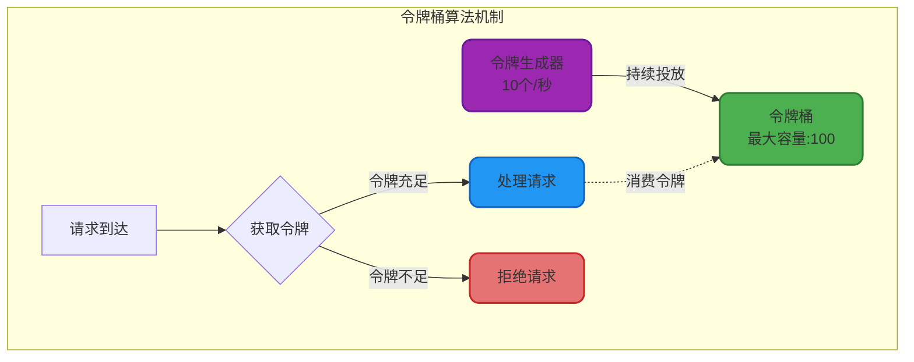
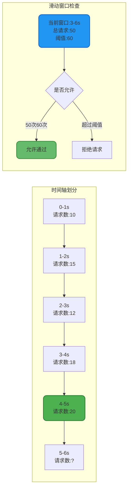
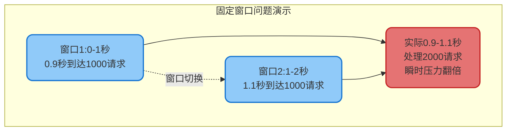
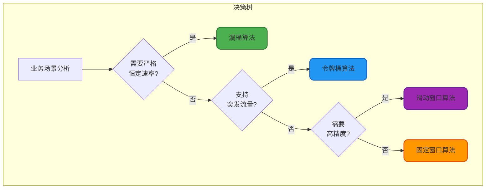

# 限流算法原理与实现

## 限流机制概述

限流是一种至关重要的流量控制技术,其核心目标是保护系统免受流量洪峰的冲击,确保服务在可控的负载范围内稳定运行。通过精细化的请求速率或数量控制,限流机制能够有效防止系统因突发流量或恶意攻击而崩溃。

### 限流的应用场景

在实际的分布式系统中,限流机制被广泛应用于以下场景:

**API接口保护**: 对外开放的API接口需要控制调用频率,防止单个用户占用过多资源。例如,某电商平台的商品查询接口限制每个用户每秒最多调用100次,超出限制的请求将被拒绝。

**资源防护**: 对于数据库连接、线程池等稀缺资源,需要通过限流避免资源耗尽。当系统检测到数据库连接池使用率超过80%时,自动触发限流策略,保护数据库不被打垮。

**防止雪崩**: 在微服务架构中,某个服务的异常可能引发连锁反应。通过对上游服务进行限流,可以有效阻断故障传播,保证核心服务的可用性。

**成本控制**: 对于按调用量计费的第三方服务,合理的限流策略能够精确控制成本开销。





## 经典限流算法详解

### 漏桶算法

漏桶算法(Leaky Bucket)是一种流量整形技术,其工作原理类似于一个底部有小孔的水桶。无论进入漏桶的水流速度如何变化,水都会以恒定的速率从底部流出,从而实现流量的平滑输出。

#### 核心机制

漏桶维护一个固定容量的缓冲区,系统请求首先进入漏桶,然后以恒定速率从漏桶中取出并执行。当漏桶已满时,新到达的请求将被直接拒绝或进入等待队列。



#### 代码实现示例

以下是基于Java的漏桶限流器实现:

```java
public class LeakyBucketRateLimiter {
    
    // 漏桶容量
    private final int capacity;
    // 漏出速率(每秒处理的请求数)
    private final int leakRate;
    // 当前桶中的水量
    private int water;
    // 上次漏水时间戳
    private long lastLeakTime;
    
    private final Object lock = new Object();
    
    public LeakyBucketRateLimiter(int capacity, int leakRate) {
        this.capacity = capacity;
        this.leakRate = leakRate;
        this.water = 0;
        this.lastLeakTime = System.currentTimeMillis();
    }
    
    /**
     * 尝试通过限流检查
     * @param permits 请求的配额数量
     * @return true表示通过,false表示被限流
     */
    public boolean tryAcquire(int permits) {
        synchronized (lock) {
            // 计算当前时刻应该漏出的水量
            long currentTime = System.currentTimeMillis();
            long elapsedTime = currentTime - lastLeakTime;
            int leaked = (int) (elapsedTime * leakRate / 1000);
            
            // 更新桶中的水量
            water = Math.max(0, water - leaked);
            lastLeakTime = currentTime;
            
            // 检查是否可以容纳新请求
            if (water + permits <= capacity) {
                water += permits;
                return true;
            }
            
            return false;
        }
    }
    
    /**
     * 订单处理场景示例
     */
    public void processOrder(String orderId) {
        if (tryAcquire(1)) {
            System.out.println("订单 " + orderId + " 开始处理");
            // 执行订单处理逻辑
            handleOrderBusiness(orderId);
        } else {
            System.out.println("订单 " + orderId + " 因流量限制被拒绝,请稍后重试");
        }
    }
    
    private void handleOrderBusiness(String orderId) {
        // 订单处理的核心业务逻辑
    }
}
```

#### 漏桶算法的局限性

漏桶算法的最大问题在于**无法应对突发流量**。即使系统在过去一段时间内处于空闲状态,也无法快速处理突然到来的大量请求。

**场景举例**: 在视频网站中,一部热门剧集刚刚更新,在前5秒内没有任何请求,但第6秒突然涌入1000个观看请求。由于漏桶以固定速率(假设每秒处理200个)流出,第6秒仍然只能处理200个请求,其余800个请求被拒绝,导致用户体验下降。

### 令牌桶算法

令牌桶算法(Token Bucket)通过预先生成令牌来解决漏桶无法应对突发流量的问题。系统以固定速率向桶中投放令牌,请求到达时需要从桶中获取令牌才能执行,令牌不足则请求被拒绝。

#### 核心优势

**支持突发流量**: 令牌可以在桶中累积(直到桶满),当突发流量到来时,可以一次性消费多个令牌,快速处理大量请求。

**灵活性更强**: 可以通过调整令牌生成速率和桶容量来精细控制流量特性。



#### Guava RateLimiter实现

Google Guava库提供了高性能的令牌桶实现:

```java
public class TokenBucketExample {
    
    // 创建限流器:每秒生成100个令牌
    private final RateLimiter rateLimiter = RateLimiter.create(100.0);
    
    /**
     * 商品查询服务限流示例
     */
    public ProductDTO queryProduct(Long productId) {
        // 尝试获取1个令牌,最多等待500毫秒
        if (rateLimiter.tryAcquire(1, 500, TimeUnit.MILLISECONDS)) {
            // 获取令牌成功,执行查询
            return productService.getProductById(productId);
        } else {
            // 获取令牌失败,快速失败
            throw new RateLimitException("商品查询服务繁忙,请稍后重试");
        }
    }
    
    /**
     * 秒杀场景:允许突发流量
     */
    public boolean flashSale(Long userId, Long productId) {
        // 创建支持突发的限流器:每秒1000个令牌,允许瞬时处理5000个请求
        RateLimiter flashLimiter = RateLimiter.create(1000.0);
        
        // 预热阶段:提前5秒开始生成令牌
        flashLimiter.acquire(5000);
        
        // 秒杀开始:快速处理突发请求
        if (flashLimiter.tryAcquire()) {
            return seckillService.tryKill(userId, productId);
        }
        return false;
    }
}
```

### 滑动窗口算法

滑动窗口限流(Sliding Window)通过将时间轴划分为多个连续的小窗口,实时统计窗口内的请求数量,从而实现更加精细的流量控制。

#### 实现原理

时间轴被划分为多个固定大小的时间片段(如1秒),同时定义一个滑动的时间窗口(如10秒)。当新请求到达时,系统检查当前窗口内的请求总数是否超过阈值。



#### 滑动窗口的优势

**平滑流量控制**: 相比固定窗口,滑动窗口能够更均匀地分配请求,避免窗口边界的流量突刺问题。

**精确限流**: 实时统计时间窗口内的请求数,限流精度更高,不会出现固定窗口中"临界突破"的问题。

**灵活应对**: 可以根据业务特点调整窗口大小和时间片粒度,适应不同的流量模式。

#### Redis实现滑动窗口

```java
public class SlidingWindowRateLimiter {
    
    @Autowired
    private RedisTemplate<String, String> redisTemplate;
    
    /**
     * 滑动窗口限流检查
     * @param userId 用户ID
     * @param windowSize 时间窗口大小(秒)
     * @param maxRequests 窗口内最大请求数
     * @return true表示通过限流检查
     */
    public boolean isAllowed(String userId, int windowSize, int maxRequests) {
        String key = "rate_limit:user:" + userId;
        long currentTime = System.currentTimeMillis();
        long windowStart = currentTime - windowSize * 1000;
        
        // 使用Redis的ZSET数据结构存储请求时间戳
        ZSetOperations<String, String> zset = redisTemplate.opsForZSet();
        
        // 移除窗口外的旧数据
        zset.removeRangeByScore(key, 0, windowStart);
        
        // 统计当前窗口内的请求数
        Long count = zset.zCard(key);
        
        if (count != null && count < maxRequests) {
            // 添加当前请求时间戳
            zset.add(key, String.valueOf(currentTime), currentTime);
            // 设置key过期时间
            redisTemplate.expire(key, windowSize, TimeUnit.SECONDS);
            return true;
        }
        
        return false;
    }
    
    /**
     * 用户评论接口限流示例
     */
    public boolean postComment(String userId, String content) {
        // 限制:每个用户每分钟最多发表10条评论
        if (isAllowed(userId, 60, 10)) {
            commentService.saveComment(userId, content);
            return true;
        } else {
            throw new RateLimitException("评论过于频繁,请稍后再试");
        }
    }
}
```

### 固定窗口算法

固定窗口算法是滑动窗口的简化版本,它将时间划分为固定大小的窗口,每个窗口开始时计数器清零,窗口内累计请求数达到阈值后拒绝后续请求。

#### 临界问题

固定窗口存在明显的"临界突破"缺陷。假设限流规则为每秒最多1000个请求,某个用户在0.9秒时发送了1000个请求,又在1.1秒时发送了1000个请求,虽然每个窗口内都未超限,但在0.9秒到1.1秒这200毫秒内系统实际处理了2000个请求,瞬时流量是阈值的10倍。



## 算法对比与选型建议

不同的限流算法适用于不同的业务场景,以下是各算法的特性对比:

| 算法类型 | 流量平滑性 | 突发流量支持 | 实现复杂度 | 适用场景 |
|---------|-----------|------------|-----------|---------|
| 漏桶算法 | 非常好 | 不支持 | 简单 | 需要严格控制输出速率的场景 |
| 令牌桶算法 | 好 | 支持 | 中等 | 需要兼顾平均速率和突发流量的场景 |
| 滑动窗口 | 很好 | 较好 | 较复杂 | 需要精确统计时间窗口内请求数的场景 |
| 固定窗口 | 一般 | 不支持 | 简单 | 对限流精度要求不高的场景 |

### 选型建议

**消息队列场景**: 使用漏桶算法,确保下游系统以恒定速率消费消息,避免压力波动。

**API网关限流**: 采用令牌桶算法,既能限制平均调用速率,又能应对合理的突发流量。

**秒杀系统**: 结合令牌桶预热机制和滑动窗口精确控制,在秒杀开始前预先生成令牌,秒杀过程中实时监控窗口内请求数。

**防刷接口**: 使用滑动窗口算法,精确统计用户在时间窗口内的操作次数,有效识别异常行为。


