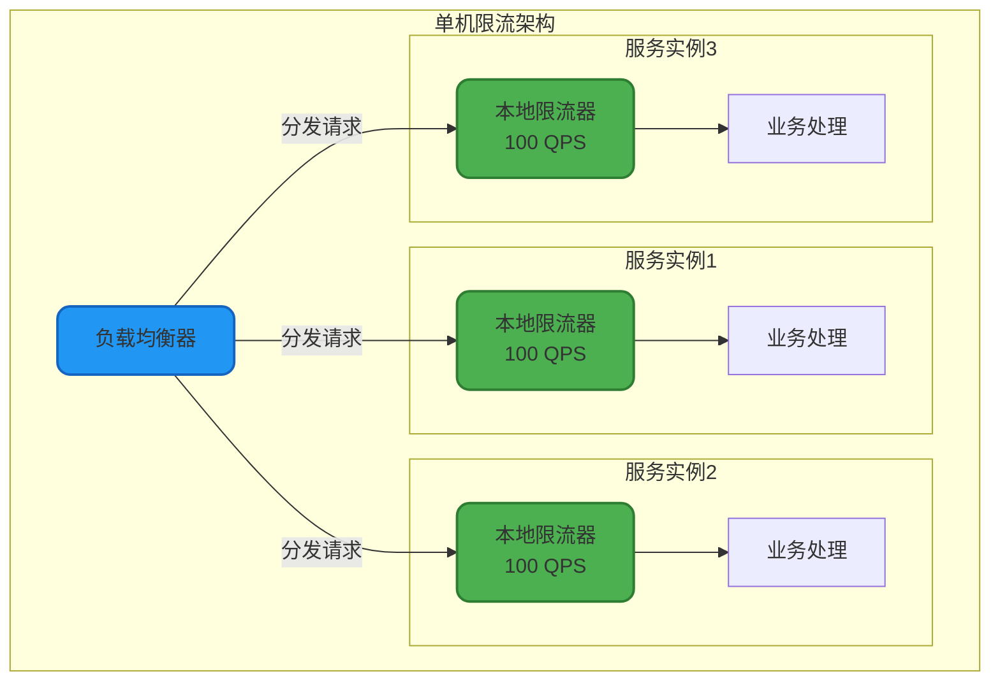

import PaidCTA from '@site/src/components/PaidCTA';

# 高级限流策略与应用

## 单机限流与集群限流

### 单机限流

单机限流是指在单个服务实例上进行流量控制,通过限制单台服务器的请求处理速率来保护服务的稳定性。这是最基础也是最常用的限流方式。

#### 实现方式

单机限流通常采用本地内存实现,无需依赖外部存储,性能开销小,响应速度快。常用的实现工具包括Guava RateLimiter、Sentinel等。

```java
public class StandaloneRateLimiterService {
    
    // 创建单机限流器:每秒允许100个请求
    private final RateLimiter rateLimiter = RateLimiter.create(100.0);
    
    /**
     * 用户登录接口限流
     */
    public LoginResult login(LoginRequest request) {
        // 尝试获取令牌,最多等待200毫秒
        if (rateLimiter.tryAcquire(1, 200, TimeUnit.MILLISECONDS)) {
            return authService.authenticate(request);
        } else {
            throw new RateLimitException("登录请求过于频繁,请稍后再试");
        }
    }
    
    /**
     * 动态调整限流速率
     */
    public void adjustRateLimit(double newRate) {
        rateLimiter.setRate(newRate);
        logger.info("限流速率已调整为: {} 请求/秒", newRate);
    }
}
```

#### 单机限流的优势

**性能优异**: 基于本地内存计算,无网络开销,延迟通常在微秒级别。

**实现简单**: 不依赖外部中间件,部署和维护成本低。

**故障隔离**: 每个实例独立限流,不会因为其他实例的故障而受影响。



### 集群限流

集群限流是在整个服务集群层面进行统一的流量控制,确保所有实例的请求总量不超过设定阈值。这需要借助分布式协调机制来实现全局计数。

#### 实现方案

集群限流通常基于Redis等分布式存储实现,利用其原子性操作特性来保证计数的准确性。

<PaidCTA />