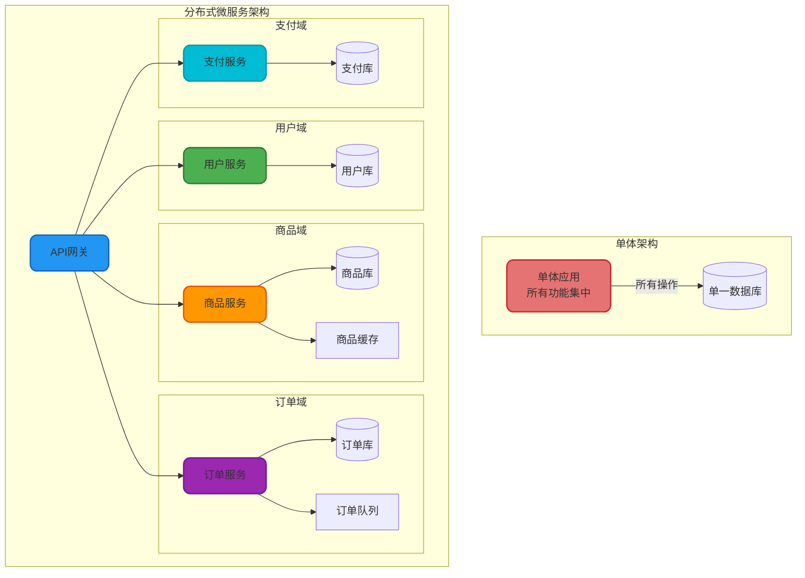
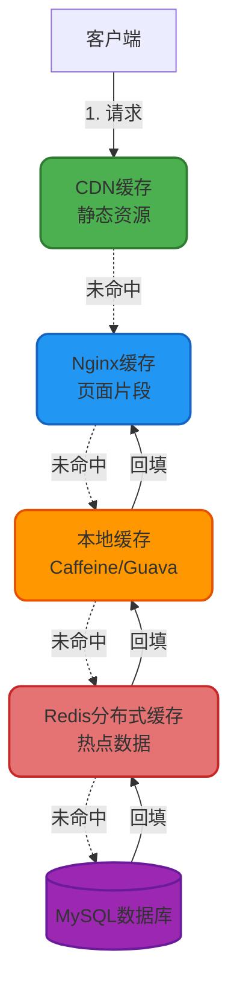

import PaidCTA from '@site/src/components/PaidCTA';

# 高并发系统设计实践

## 高并发系统架构设计

设计一个能够支持高并发的系统需要从架构、性能优化、容错机制和可伸缩性等多个维度进行综合考虑。本文将系统性地介绍构建高并发系统的核心技术和最佳实践。

### 分布式架构设计

将庞大的单体应用拆解为多个独立的微服务模块,通过分布式架构降低单点故障风险,提升系统的可伸缩性和整体性能。



### 集群部署与负载均衡

通过集群化部署提升系统的吞吐量和可用性,结合负载均衡技术将请求均匀分配到各个服务实例。

```java
@Configuration
public class LoadBalancerConfig {
    
    /**
     * 配置Ribbon负载均衡策略
     */
    @Bean
    public IRule ribbonRule() {
        // 使用加权响应时间规则:响应时间越短的实例获得更多请求
        return new WeightedResponseTimeRule();
    }
    
    /**
     * 订单服务调用,自动负载均衡
     */
    @Service
    public class OrderClientService {
        
        @Autowired
        private RestTemplate restTemplate;
        
        @LoadBalanced
        public OrderDTO createOrder(OrderRequest request) {
            // Ribbon自动选择可用的订单服务实例
            String url = "http://order-service/api/order/create";
            return restTemplate.postForObject(url, request, OrderDTO.class);
        }
    }
}
```

## 缓存架构优化

### 多级缓存体系

构建从客户端到数据库的多层缓存架构,最大化减少对数据库的访问压力。



### 缓存实践案例

<PaidCTA />