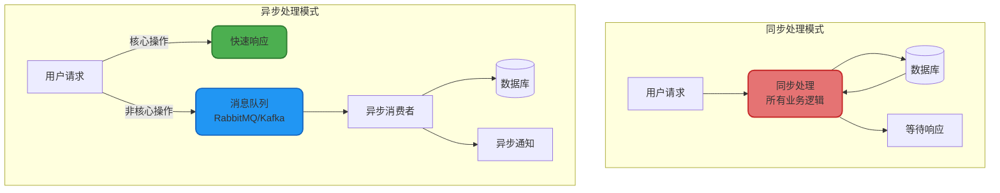
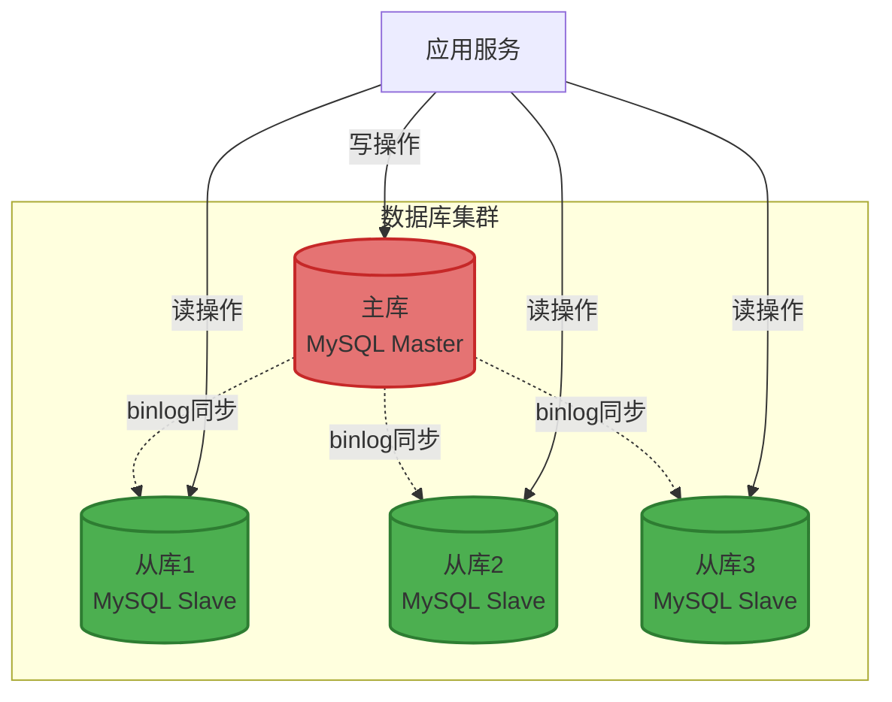

# 高并发系统设计实践

## 高并发系统架构设计

设计一个能够支持高并发的系统需要从架构、性能优化、容错机制和可伸缩性等多个维度进行综合考虑。本文将系统性地介绍构建高并发系统的核心技术和最佳实践。

### 分布式架构设计

将庞大的单体应用拆解为多个独立的微服务模块,通过分布式架构降低单点故障风险,提升系统的可伸缩性和整体性能。


### 集群部署与负载均衡

通过集群化部署提升系统的吞吐量和可用性,结合负载均衡技术将请求均匀分配到各个服务实例。

```java
@Configuration
public class LoadBalancerConfig {
    
    /**
     * 配置Ribbon负载均衡策略
     */
    @Bean
    public IRule ribbonRule() {
        // 使用加权响应时间规则:响应时间越短的实例获得更多请求
        return new WeightedResponseTimeRule();
    }
    
    /**
     * 订单服务调用,自动负载均衡
     */
    @Service
    public class OrderClientService {
        
        @Autowired
        private RestTemplate restTemplate;
        
        @LoadBalanced
        public OrderDTO createOrder(OrderRequest request) {
            // Ribbon自动选择可用的订单服务实例
            String url = "http://order-service/api/order/create";
            return restTemplate.postForObject(url, request, OrderDTO.class);
        }
    }
}
```

## 缓存架构优化

### 多级缓存体系

构建从客户端到数据库的多层缓存架构,最大化减少对数据库的访问压力。


### 缓存实践案例

```java
@Service
public class ProductCacheService {
    
    @Autowired
    private RedisTemplate<String, ProductDTO> redisTemplate;
    
    @Autowired
    private ProductRepository productRepository;
    
    // 本地缓存:Caffeine
    private final LoadingCache<Long, ProductDTO> localCache = Caffeine.newBuilder()
        .maximumSize(10000)  // 最多缓存1万个商品
        .expireAfterWrite(5, TimeUnit.MINUTES)  // 5分钟过期
        .recordStats()  // 记录统计信息
        .build(this::loadFromRedis);
    
    /**
     * 查询商品详情,三级缓存
     */
    public ProductDTO getProduct(Long productId) {
        try {
            // L1缓存:本地缓存
            return localCache.get(productId);
        } catch (Exception e) {
            logger.error("缓存查询失败,productId: {}", productId, e);
            // 降级:直接查数据库
            return productRepository.findById(productId).orElse(null);
        }
    }
    
    /**
     * 从Redis加载(L2缓存)
     */
    private ProductDTO loadFromRedis(Long productId) {
        String redisKey = "product:detail:" + productId;
        ProductDTO product = redisTemplate.opsForValue().get(redisKey);
        
        if (product == null) {
            // L3缓存未命中:查询数据库
            product = productRepository.findById(productId).orElse(null);
            if (product != null) {
                // 回填Redis缓存,设置随机过期时间避免雪崩
                int randomExpire = 3600 + new Random().nextInt(600);
                redisTemplate.opsForValue().set(redisKey, product, 
                    randomExpire, TimeUnit.SECONDS);
            }
        }
        
        return product;
    }
    
    /**
     * 缓存预热:提前加载热点商品
     */
    public void warmupHotProducts(List<Long> hotProductIds) {
        logger.info("开始预热{}个热点商品", hotProductIds.size());
        
        hotProductIds.forEach(productId -> {
            ProductDTO product = productRepository.findById(productId).orElse(null);
            if (product != null) {
                // 写入Redis
                String redisKey = "product:detail:" + productId;
                redisTemplate.opsForValue().set(redisKey, product, 1, TimeUnit.HOURS);
                
                // 写入本地缓存
                localCache.put(productId, product);
            }
        });
        
        logger.info("缓存预热完成");
    }
}
```

## 异步处理架构

### 消息队列削峰填谷

通过消息队列将同步操作转换为异步处理,降低请求响应时间,提升系统吞吐量。



### 异步订单处理

```java
@Service
public class AsyncOrderService {
    
    @Autowired
    private RabbitTemplate rabbitTemplate;
    
    @Autowired
    private OrderRepository orderRepository;
    
    /**
     * 创建订单:异步处理非核心流程
     */
    @Transactional
    public OrderResult createOrder(OrderRequest request) {
        // 核心流程:同步执行
        // 1. 扣减库存
        boolean stockReduced = inventoryService.reduceStock(
            request.getProductId(), 
            request.getQuantity()
        );
        
        if (!stockReduced) {
            return OrderResult.fail("库存不足");
        }
        
        // 2. 创建订单记录
        OrderEntity order = OrderEntity.builder()
            .orderNo(generateOrderNo())
            .userId(request.getUserId())
            .productId(request.getProductId())
            .quantity(request.getQuantity())
            .status(OrderStatus.CREATED)
            .createTime(new Date())
            .build();
        
        orderRepository.save(order);
        
        // 非核心流程:异步处理
        // 3. 发送订单消息到MQ
        OrderMessage message = OrderMessage.builder()
            .orderNo(order.getOrderNo())
            .userId(request.getUserId())
            .productId(request.getProductId())
            .build();
        
        rabbitTemplate.convertAndSend("order.exchange", "order.created", message);
        
        // 快速响应用户
        return OrderResult.success(order.getOrderNo());
    }
    
    /**
     * 异步消费订单消息
     */
    @RabbitListener(queues = "order.process.queue")
    public void processOrderAsync(OrderMessage message) {
        try {
            // 发送订单确认邮件
            emailService.sendOrderConfirmation(message.getUserId(), message.getOrderNo());
            
            // 更新用户积分
            pointsService.addPoints(message.getUserId(), 10, "下单奖励");
            
            // 更新销量统计
            statisticsService.incrementSales(message.getProductId(), 1);
            
            logger.info("订单异步处理完成,orderNo: {}", message.getOrderNo());
        } catch (Exception e) {
            logger.error("订单异步处理失败,orderNo: {}", message.getOrderNo(), e);
            // 失败重试或记录到死信队列
        }
    }
}
```

## 数据库优化策略

### 读写分离架构

通过主从复制实现读写分离,主库负责写操作,从库负责读操作,提升数据库整体并发能力。



```java
@Configuration
public class DataSourceConfig {
    
    /**
     * 主数据源
     */
    @Bean
    @ConfigurationProperties(prefix = "spring.datasource.master")
    public DataSource masterDataSource() {
        return DataSourceBuilder.create().build();
    }
    
    /**
     * 从数据源
     */
    @Bean
    @ConfigurationProperties(prefix = "spring.datasource.slave")
    public DataSource slaveDataSource() {
        return DataSourceBuilder.create().build();
    }
    
    /**
     * 动态数据源路由
     */
    @Bean
    public DataSource dynamicDataSource() {
        DynamicRoutingDataSource dataSource = new DynamicRoutingDataSource();
        
        Map<Object, Object> targetDataSources = new HashMap<>();
        targetDataSources.put("master", masterDataSource());
        targetDataSources.put("slave", slaveDataSource());
        
        dataSource.setTargetDataSources(targetDataSources);
        dataSource.setDefaultTargetDataSource(masterDataSource());
        
        return dataSource;
    }
}

/**
 * 读写分离注解
 */
@Service
public class UserService {
    
    @Autowired
    private UserRepository userRepository;
    
    /**
     * 写操作:路由到主库
     */
    @Master
    @Transactional
    public void createUser(UserDTO userDTO) {
        UserEntity user = new UserEntity();
        BeanUtils.copyProperties(userDTO, user);
        userRepository.save(user);
    }
    
    /**
     * 读操作:路由到从库
     */
    @Slave
    @Transactional(readOnly = true)
    public UserDTO getUserById(Long userId) {
        return userRepository.findById(userId)
            .map(this::convertToDTO)
            .orElse(null);
    }
}
```

### 分库分表

当单表数据量超过千万级别时,通过分库分表水平拆分数据,提升查询性能。

```java
@Configuration
public class ShardingConfig {
    
    /**
     * 配置订单表分片策略
     */
    @Bean
    public DataSource shardingDataSource() throws SQLException {
        // 配置真实数据源
        Map<String, DataSource> dataSourceMap = new HashMap<>();
        dataSourceMap.put("ds0", createDataSource("order_db_0"));
        dataSourceMap.put("ds1", createDataSource("order_db_1"));
        
        // 配置订单表规则
        ShardingTableRuleConfiguration orderTableRule = new ShardingTableRuleConfiguration(
            "t_order",
            "ds${0..1}.t_order_${0..3}"
        );
        
        // 分库策略:根据user_id取模
        orderTableRule.setDatabaseShardingStrategyConfig(
            new InlineShardingStrategyConfiguration("user_id", "ds${user_id % 2}")
        );
        
        // 分表策略:根据order_id取模
        orderTableRule.setTableShardingStrategyConfig(
            new InlineShardingStrategyConfiguration("order_id", "t_order_${order_id % 4}")
        );
        
        // 配置分片规则
        ShardingRuleConfiguration shardingRuleConfig = new ShardingRuleConfiguration();
        shardingRuleConfig.getTableRuleConfigs().add(orderTableRule);
        
        return ShardingDataSourceFactory.createDataSource(dataSourceMap, shardingRuleConfig, new Properties());
    }
    
    private DataSource createDataSource(String database) {
        HikariConfig config = new HikariConfig();
        config.setJdbcUrl("jdbc:mysql://localhost:3306/" + database);
        config.setUsername("root");
        config.setPassword("password");
        return new HikariDataSource(config);
    }
}
```

## 性能优化实践

### 减小锁粒度

通过细化锁的范围和使用无锁数据结构,降低锁竞争,提升并发性能。

```java
public class InventoryService {
    
    // 错误示例:粗粒度锁
    private final Object globalLock = new Object();
    private final Map<Long, Integer> stockMap = new HashMap<>();
    
    public boolean reduceStockBad(Long productId, int quantity) {
        synchronized (globalLock) {  // 所有商品共用一把锁,并发度低
            Integer stock = stockMap.get(productId);
            if (stock != null && stock >= quantity) {
                stockMap.put(productId, stock - quantity);
                return true;
            }
            return false;
        }
    }
    
    // 优化示例:细粒度锁
    private final ConcurrentHashMap<Long, AtomicInteger> stockMapOptimized = 
        new ConcurrentHashMap<>();
    
    public boolean reduceStockGood(Long productId, int quantity) {
        AtomicInteger stock = stockMapOptimized.get(productId);
        if (stock == null) {
            return false;
        }
        
        // 使用CAS无锁操作
        while (true) {
            int currentStock = stock.get();
            if (currentStock < quantity) {
                return false;
            }
            
            if (stock.compareAndSet(currentStock, currentStock - quantity)) {
                return true;
            }
        }
    }
}
```

### 避免长事务

长事务会持有数据库锁,阻塞其他请求,严重影响并发性能。

```java
@Service
public class OrderOptimizedService {
    
    /**
     * 错误示例:长事务
     */
    @Transactional
    public void createOrderBad(OrderRequest request) {
        // 查询商品详情(可能很慢)
        ProductDTO product = productRpcClient.getProduct(request.getProductId());
        
        // 复杂的业务计算(耗时操作)
        BigDecimal totalAmount = calculateTotalAmount(product, request);
        
        // 调用第三方接口(网络延迟)
        boolean limitCheck = riskService.checkUserLimit(request.getUserId());
        
        // 保存订单(整个事务期间持有锁)
        orderRepository.save(buildOrder(request, totalAmount));
    }
    
    /**
     * 优化示例:缩短事务范围
     */
    public void createOrderGood(OrderRequest request) {
        // 非事务操作:提前执行
        ProductDTO product = productRpcClient.getProduct(request.getProductId());
        BigDecimal totalAmount = calculateTotalAmount(product, request);
        boolean limitCheck = riskService.checkUserLimit(request.getUserId());
        
        if (!limitCheck) {
            throw new BusinessException("用户额度不足");
        }
        
        // 仅在必要时开启事务
        saveOrderInTransaction(buildOrder(request, totalAmount));
    }
    
    @Transactional
    private void saveOrderInTransaction(OrderEntity order) {
        // 事务范围最小化:仅包含数据库写操作
        orderRepository.save(order);
    }
}
```

## 容错与监控

### 限流熔断降级

综合运用限流、熔断、降级技术,构建多层次的容错保护体系。

```java
@Service
public class RobustPaymentService {
    
    @Autowired
    private ThirdPartyPaymentClient paymentClient;
    
    private final CircuitBreaker circuitBreaker;
    private final RateLimiter rateLimiter;
    
    public RobustPaymentService() {
        // 配置熔断器
        this.circuitBreaker = CircuitBreaker.of("payment", CircuitBreakerConfig.custom()
            .failureRateThreshold(50)  // 失败率50%触发熔断
            .waitDurationInOpenState(Duration.ofSeconds(60))
            .build());
        
        // 配置限流器:每秒100个支付请求
        this.rateLimiter = RateLimiter.create(100.0);
    }
    
    /**
     * 支付处理:限流+熔断+降级
     */
    public PaymentResult processPayment(PaymentRequest request) {
        // 第一层:限流保护
        if (!rateLimiter.tryAcquire(1, 500, TimeUnit.MILLISECONDS)) {
            logger.warn("支付请求限流,userId: {}", request.getUserId());
            return PaymentResult.fail("支付服务繁忙,请稍后重试");
        }
        
        // 第二层:熔断保护
        try {
            return circuitBreaker.executeSupplier(() -> {
                return paymentClient.pay(request);
            });
        } catch (CallNotPermittedException e) {
            // 熔断器开启,执行降级逻辑
            logger.error("支付服务熔断,使用降级方案,userId: {}", request.getUserId());
            return executeFallback(request);
        } catch (Exception e) {
            logger.error("支付失败,userId: {}", request.getUserId(), e);
            return PaymentResult.fail("支付失败,请重试");
        }
    }
    
    /**
     * 降级方案:异步支付
     */
    private PaymentResult executeFallback(PaymentRequest request) {
        // 将支付请求放入延迟队列,稍后重试
        paymentDelayQueue.offer(request);
        
        return PaymentResult.builder()
            .success(false)
            .message("支付处理中,请稍后查看支付结果")
            .needRetry(true)
            .build();
    }
}
```

### 实时监控告警

```java
@Component
public class SystemHealthMonitor {
    
    @Autowired
    private MeterRegistry meterRegistry;
    
    /**
     * 监控接口响应时间
     */
    public void monitorApiLatency(String apiName, long latencyMs) {
        Timer.builder("api.latency")
            .tag("api", apiName)
            .register(meterRegistry)
            .record(latencyMs, TimeUnit.MILLISECONDS);
        
        // 响应时间超过阈值告警
        if (latencyMs > 1000) {
            alertService.sendAlert("接口响应缓慢", 
                String.format("接口%s响应时间%dms,超过1秒", apiName, latencyMs));
        }
    }
    
    /**
     * 监控数据库连接池
     */
    @Scheduled(fixedRate = 10000)
    public void monitorConnectionPool() {
        HikariDataSource dataSource = (HikariDataSource) this.dataSource;
        HikariPoolMXBean poolMXBean = dataSource.getHikariPoolMXBean();
        
        int activeConnections = poolMXBean.getActiveConnections();
        int totalConnections = poolMXBean.getTotalConnections();
        double usage = (double) activeConnections / totalConnections;
        
        // 记录指标
        meterRegistry.gauge("db.connection.active", activeConnections);
        meterRegistry.gauge("db.connection.usage", usage);
        
        // 连接池使用率超过80%告警
        if (usage > 0.8) {
            alertService.sendAlert("数据库连接池告警", 
                String.format("连接池使用率%.1f%%,建议扩容", usage * 100));
        }
    }
}
```

## 高并发系统设计清单

构建高并发系统需要综合运用以下技术和策略:

### 架构层面
- **分布式架构**: 服务拆分、微服务治理
- **集群部署**: 负载均衡、水平扩展
- **异地多活**: 跨地域部署、容灾备份

### 性能优化
- **多级缓存**: CDN、本地缓存、分布式缓存
- **异步处理**: 消息队列、事件驱动
- **代码优化**: 减小锁粒度、避免长事务、优化算法

### 数据库优化
- **索引优化**: 合理设计索引、覆盖索引
- **读写分离**: 主从复制、读写路由
- **分库分表**: 水平拆分、垂直拆分

### 容错保障
- **限流**: 单机限流、集群限流、自适应限流
- **熔断**: 快速失败、自动恢复
- **降级**: 功能降级、读写降级

### 监控运维
- **实时监控**: 性能指标、业务指标
- **告警机制**: 阈值告警、智能告警
- **压力测试**: 全链路压测、容量评估

通过系统性地应用这些技术和最佳实践,可以构建一个高性能、高可用、可伸缩的高并发系统,满足业务快速增长的需求。
