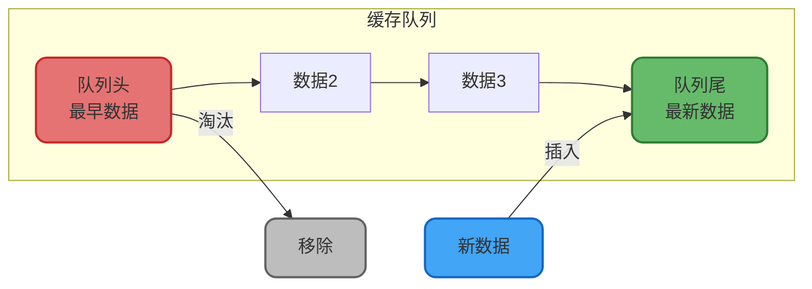
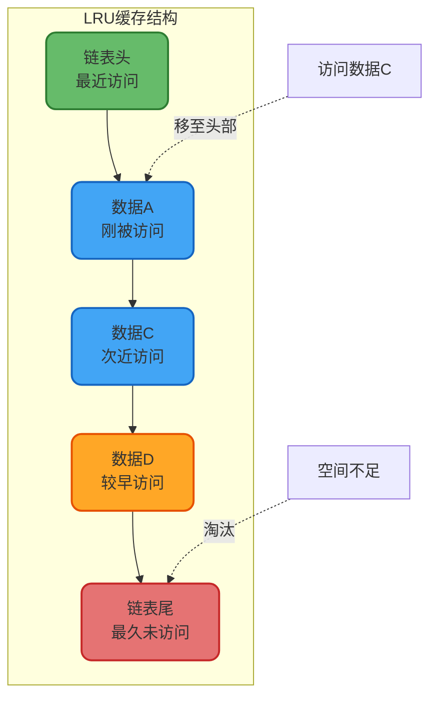

import PaidCTA from '@site/src/components/PaidCTA';

# 缓存淘汰策略详解

## 缓存淘汰策略概述

在缓存系统设计中,由于内存资源的有限性,必须通过合理的淘汰策略来管理缓存数据。当缓存空间不足时,需要选择性地移除部分数据以腾出空间存储新数据。一个优秀的淘汰算法能够显著提升缓存命中率,从而提高系统整体性能。

主流的缓存淘汰策略包括FIFO、LRU、LFU以及更先进的Window TinyLFU算法。这些算法各有特点,适用于不同的应用场景。

## FIFO先进先出策略

### 核心思想

FIFO(First In First Out)策略基于一个简单的假设:最先进入缓存的数据,在将来被访问的概率相对较小。因此当缓存满时,优先淘汰最早加入的数据。

### 实现机制

FIFO策略天然契合队列数据结构的特性,具体流程如下:

**执行流程**:

1. 新数据到达时,插入到队列尾部
2. 缓存中的数据按时间顺序向前移动
3. 当空间不足时,移除队列头部的数据

### 应用场景

FIFO适用于数据访问模式相对均匀的场景,例如:
- 日志缓存系统
- 消息队列缓冲区
- 静态资源CDN缓存

## LRU最近最少使用策略

### 核心原理

LRU(Least Recently Used)算法基于时间局部性原理:如果一个数据最近没有被访问,那么在未来一段时间内被访问的概率也较低。算法始终淘汰最久未被访问的数据。

### 数据结构设计

LRU通常采用双向链表实现,配合哈希表实现O(1)时间复杂度的查找:

**操作流程**:

1. 新数据加入时,插入到链表头部
2. 数据被访问时,将其移动到链表头部
3. 缓存满时,删除链表尾部的数据

### 实际案例分析

假设缓存容量为4,数据访问序列为: **商品A → 商品B → 商品C → 商品D → 商品A → 商品C → 商品C → 商品D**

在访问完成后,各商品的最后访问时间顺序为: D(最近) → C → A → B(最久)

此时若需要淘汰一个商品,LRU会选择商品B,因为它的最后访问时间最早。

### 应用实践

<PaidCTA />