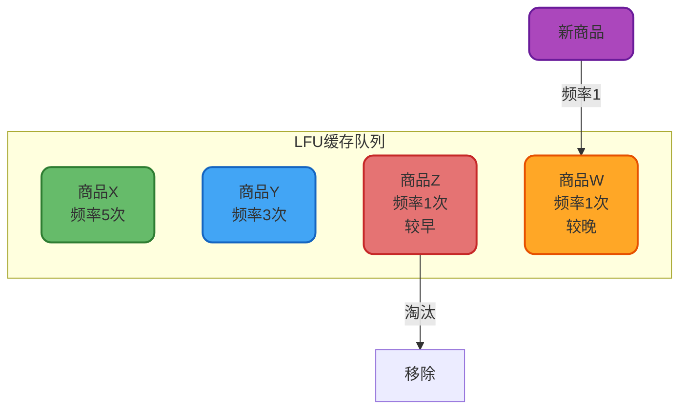
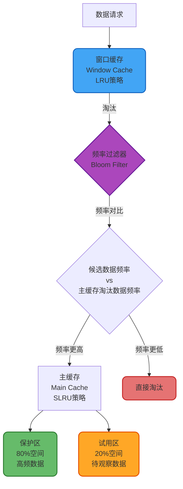

# 缓存淘汰策略详解

## 缓存淘汰策略概述

在缓存系统设计中,由于内存资源的有限性,必须通过合理的淘汰策略来管理缓存数据。当缓存空间不足时,需要选择性地移除部分数据以腾出空间存储新数据。一个优秀的淘汰算法能够显著提升缓存命中率,从而提高系统整体性能。

主流的缓存淘汰策略包括FIFO、LRU、LFU以及更先进的Window TinyLFU算法。这些算法各有特点,适用于不同的应用场景。

## FIFO先进先出策略

### 核心思想

FIFO(First In First Out)策略基于一个简单的假设:最先进入缓存的数据,在将来被访问的概率相对较小。因此当缓存满时,优先淘汰最早加入的数据。

### 实现机制

FIFO策略天然契合队列数据结构的特性,具体流程如下:


**执行流程**:

1. 新数据到达时,插入到队列尾部
2. 缓存中的数据按时间顺序向前移动
3. 当空间不足时,移除队列头部的数据

### 应用场景

FIFO适用于数据访问模式相对均匀的场景,例如:
- 日志缓存系统
- 消息队列缓冲区
- 静态资源CDN缓存

## LRU最近最少使用策略

### 核心原理

LRU(Least Recently Used)算法基于时间局部性原理:如果一个数据最近没有被访问,那么在未来一段时间内被访问的概率也较低。算法始终淘汰最久未被访问的数据。

### 数据结构设计

LRU通常采用双向链表实现,配合哈希表实现O(1)时间复杂度的查找:


**操作流程**:

1. 新数据加入时,插入到链表头部
2. 数据被访问时,将其移动到链表头部
3. 缓存满时,删除链表尾部的数据

### 实际案例分析

假设缓存容量为4,数据访问序列为: **商品A → 商品B → 商品C → 商品D → 商品A → 商品C → 商品C → 商品D**

在访问完成后,各商品的最后访问时间顺序为: D(最近) → C → A → B(最久)

此时若需要淘汰一个商品,LRU会选择商品B,因为它的最后访问时间最早。

### 应用实践

```java
public class ProductCacheManager {
    
    private final LoadingCache<String, ProductDetail> productCache;
    
    public ProductCacheManager() {
        // 使用Caffeine实现LRU缓存
        this.productCache = Caffeine.newBuilder()
            .maximumSize(10000) // 最多缓存1万个商品
            .expireAfterAccess(Duration.ofMinutes(30)) // 30分钟未访问则过期
            .build(productId -> loadFromDatabase(productId));
    }
    
    /**
     * 查询商品详情
     */
    public ProductDetail getProductDetail(String productId) {
        return productCache.get(productId);
    }
    
    /**
     * 从数据库加载商品信息
     */
    private ProductDetail loadFromDatabase(String productId) {
        // 实际业务逻辑:从MySQL查询商品详情
        return productRepository.findById(productId);
    }
}
```

## LFU最少频次使用策略

### 算法思想

LFU(Least Frequently Used)关注数据的访问频率而非访问时间。算法假设:在一段时间内访问次数较少的数据,未来被访问的可能性也较低,应优先淘汰。

### 实现细节

LFU为每个数据维护访问计数器,并按访问频率排序。相同频率的数据则按时间顺序排列:



**工作机制**:

1. 新加入的数据初始访问频率为1,插入到频率队列末尾
2. 数据被访问后,频率计数器加1,并重新排序
3. 淘汰时选择频率最低且时间最早的数据

### 对比案例

延续前面的访问序列: **商品A → 商品B → 商品C → 商品D → 商品A → 商品C → 商品C → 商品D**

统计各商品访问频次:
- 商品C: 3次
- 商品A: 2次
- 商品D: 2次
- 商品B: 1次

LFU会淘汰商品B,因为它的访问频次最低。

**LRU与LFU的本质区别**:
- LRU只关注最后一次访问时间(时间维度)
- LFU关注累计访问次数(频率维度)

## Window TinyLFU高级策略

### 背景与动机

传统LFU虽然命中率高,但存在三个致命缺陷:

1. **空间开销巨大**: 需要为每个键维护精确的访问计数,内存消耗难以接受
2. **历史数据固化**: 早期高频访问的数据会长期占据缓存,无法响应访问模式的变化
3. **新数据劣势**: 刚加入的数据频率为0,可能立即被淘汰,即使它可能是热点数据

### W-TinyLFU架构设计

Window TinyLFU通过巧妙的分层架构,融合了LRU的时效性和LFU的高命中率:



### 核心组件解析

**窗口缓存(Window Cache)**:
- 采用LRU策略,占总容量的1%
- 为新加入的数据提供缓冲期,避免因频率低而被直接淘汰
- 给予数据积累访问频率的机会

**频率过滤器**:
- 基于Count-Min Sketch算法,用极小空间估算访问频率
- 当数据从窗口缓存被淘汰时,与主缓存中最易淘汰的数据进行频率PK
- 只有频率更高的数据才能进入主缓存

**分段LRU主缓存(SLRU)**:
- **试用区(Probation)**: 新进入主缓存的数据先在此区域观察
- **保护区(Protected)**: 被再次访问的数据晋升至保护区,享受更长的存活时间

### 优势总结

W-TinyLFU成功平衡了多个设计目标:
- **高命中率**: 继承LFU的频率优势
- **低内存占用**: 通过概率数据结构大幅降低空间开销
- **动态适应**: 定期重置频率统计,跟踪访问模式变化
- **新数据友好**: 窗口缓存机制给予新数据公平竞争机会

该算法已在Caffeine等高性能缓存框架中得到广泛应用,成为工业界的事实标准。

## 策略选择建议

| 策略 | 优势 | 劣势 | 适用场景 |
|------|------|------|----------|
| FIFO | 实现简单,性能稳定 | 无法识别热点数据 | 访问模式均匀的系统 |
| LRU | 响应访问时序变化快 | 容易受扫描操作影响 | 通用缓存场景 |
| LFU | 命中率高,适合稳定负载 | 无法适应访问模式变化 | 热点数据明确的系统 |
| W-TinyLFU | 高命中率+低内存+自适应 | 实现复杂度较高 | 高并发生产环境 |

在实际工程中,推荐优先选择Caffeine的W-TinyLFU实现,它在绝大多数场景下都能提供最佳性能表现。
