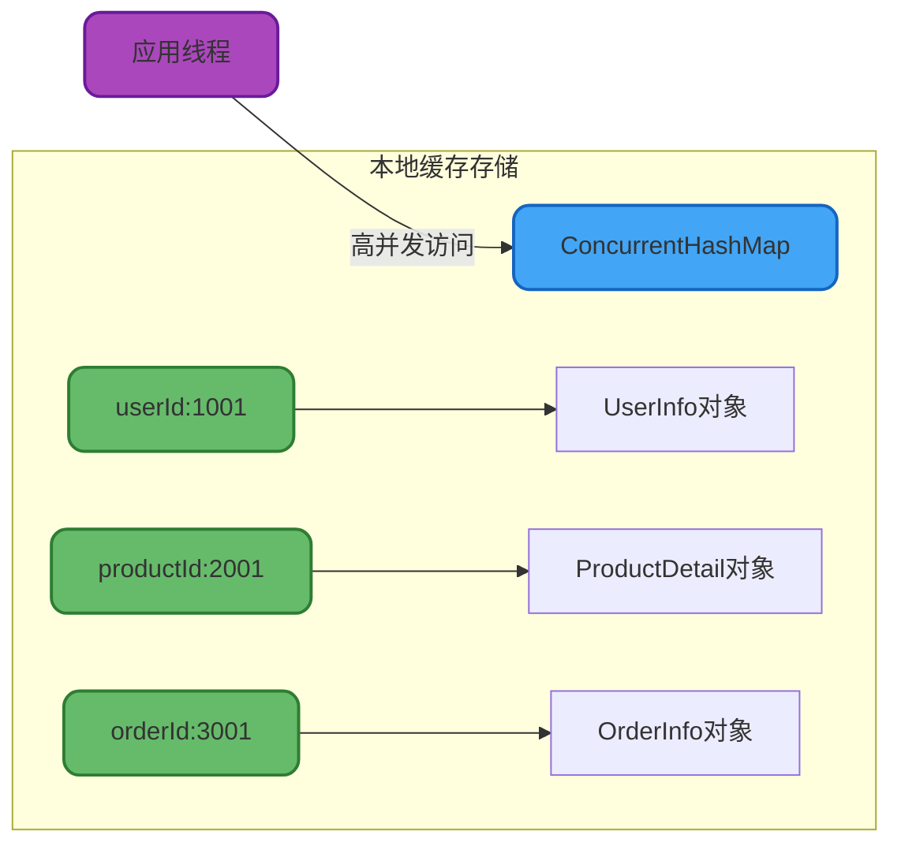

import PaidCTA from '@site/src/components/PaidCTA';

# 本地缓存实现与应用

## 本地缓存架构设计

### 什么是本地缓存

本地缓存是指与应用服务器部署在同一JVM进程内的缓存组件,将热点数据存储在应用程序的堆内存中,通过消除网络调用开销,实现微秒级的数据访问速度。相比分布式缓存,本地缓存的访问延迟可降低100倍以上。

### 核心设计要素

实现一个高质量的本地缓存需要解决以下关键问题:

#### 数据结构选型

采用键值对(Key-Value)结构是业界共识,既要保证查询效率,又要支持高并发访问:



#### 线程安全保障

本地缓存通常是全局单例对象,会被多个业务线程并发访问。必须采用线程安全的数据结构,如ConcurrentHashMap,或通过锁机制保护临界区。

#### 容量限制管理

JVM堆内存有限,必须严格控制缓存容量上限,防止内存溢出:

```java
// 设置缓存最大容量为10000个条目
Cache<String, UserInfo> userCache = Caffeine.newBuilder()
    .maximumSize(10000)
    .build();
```

#### 淘汰策略配置

当缓存达到容量上限时,通过淘汰算法选择移除的数据。常见策略包括:
- **LRU**(最近最少使用): 淘汰最久未访问的数据
- **LFU**(最少频次使用): 淘汰访问次数最少的数据  
- **FIFO**(先进先出): 淘汰最早加入的数据
- **软引用/弱引用**: 在GC压力下自动回收

#### 过期时间设置

双重保障机制确保数据及时更新:

```java
Cache<String, ProductInfo> productCache = Caffeine.newBuilder()
    .expireAfterWrite(10, TimeUnit.MINUTES)    // 写入后10分钟过期
    .expireAfterAccess(5, TimeUnit.MINUTES)    // 最后访问后5分钟过期
    .build();
```

## 实现方案对比

### 基于HashMap的基础实现

最简单的方案是使用ConcurrentHashMap:

```java
public class SimpleLocalCache {
    
    private final ConcurrentHashMap<String, CachedObject> cache;
    
    public SimpleLocalCache() {
        this.cache = new ConcurrentHashMap<>();
    }
    
    /**
     * 存储数据到缓存
     */
    public void put(String key, Object value, long ttlSeconds) {
        CachedObject cachedObj = new CachedObject(
            value, 
            System.currentTimeMillis() + ttlSeconds * 1000
        );
        cache.put(key, cachedObj);
    }
    
    /**
     * 从缓存获取数据
     */
    public Object get(String key) {
        CachedObject cachedObj = cache.get(key);
        if (cachedObj == null) {
            return null;
        }
        
        // 检查是否过期
        if (System.currentTimeMillis() > cachedObj.getExpireTime()) {
            cache.remove(key);
            return null;
        }
        
        return cachedObj.getValue();
    }
    
    /**
     * 缓存对象包装类
     */
    private static class CachedObject {
        private final Object value;
        private final long expireTime;
        
        public CachedObject(Object value, long expireTime) {
            this.value = value;
            this.expireTime = expireTime;
        }
        
        public Object getValue() {
            return value;
        }
        
        public long getExpireTime() {
            return expireTime;
        }
    }
}
```

**优点**: 实现简单,无外部依赖

**缺点**: 需要手动实现容量控制、过期清理、淘汰策略等功能,生产环境不推荐

### 主流开源框架选型

| 框架 | 性能 | 功能丰富度 | 推荐指数 |
|------|------|-----------|----------|
| Caffeine | ⭐⭐⭐⭐⭐ | ⭐⭐⭐⭐⭐ | ⭐⭐⭐⭐⭐ |
| Guava Cache | ⭐⭐⭐⭐ | ⭐⭐⭐⭐ | ⭐⭐⭐ |
| Ehcache | ⭐⭐⭐ | ⭐⭐⭐⭐⭐ | ⭐⭐⭐ |

### Caffeine最佳实践

Caffeine是Spring 5官方推荐的本地缓存方案,性能卓越:

<PaidCTA />