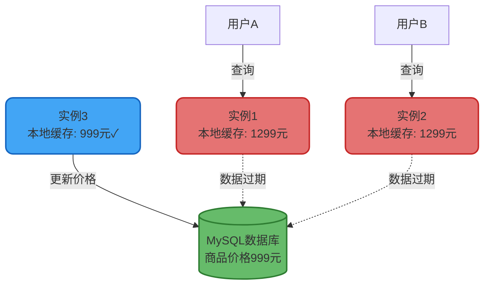
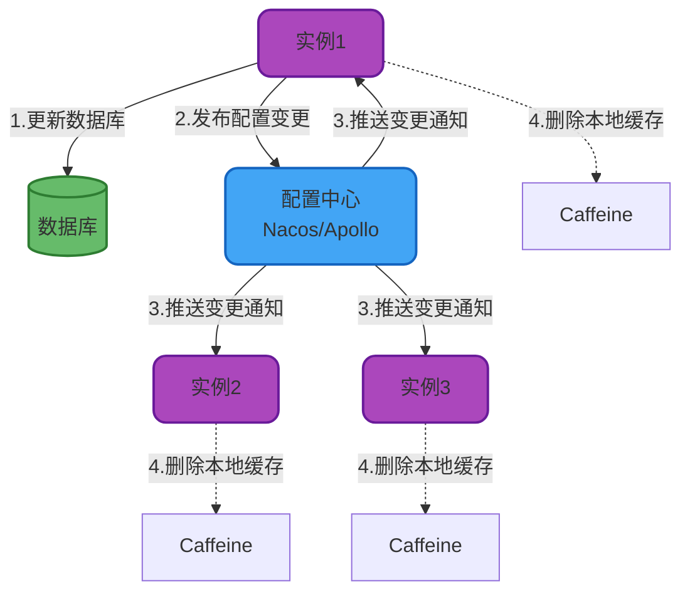

import PaidCTA from '@site/src/components/PaidCTA';

# 本地缓存一致性保障方案

## 本地缓存一致性挑战

### 问题根源

本地缓存通过牺牲一致性来换取性能提升,这是分布式系统CAP理论的实际体现。在选择了AP(可用性+分区容错性)的同时,必然要放弃C(强一致性)。

在集群环境中,每个应用实例都维护独立的本地缓存副本。当某个实例更新数据库后,其他实例的本地缓存仍然保存着旧数据,导致数据不一致:

### 核心认知

**重要原则**: 如果业务对数据一致性有强要求,应直接使用分布式缓存或数据库,不应该选择本地缓存。

本地缓存适用于以下场景:
- 数据变更频率低(如字典表、配置项)
- 业务能容忍短时间内的数据不一致(如商品详情展示)
- 对性能要求极高,一致性要求相对宽松

**反模式警告**: 库存扣减、余额变更等强一致性场景绝不能使用本地缓存。

## 一致性保障方案

虽然本地缓存无法做到强一致性,但可以通过技术手段追求最终一致性,将不一致窗口期控制在业务可接受范围内。

### 方案一:配置中心同步

#### 实现原理

利用配置中心的变更推送能力,实现跨实例的缓存同步:

#### 代码实现

<PaidCTA />