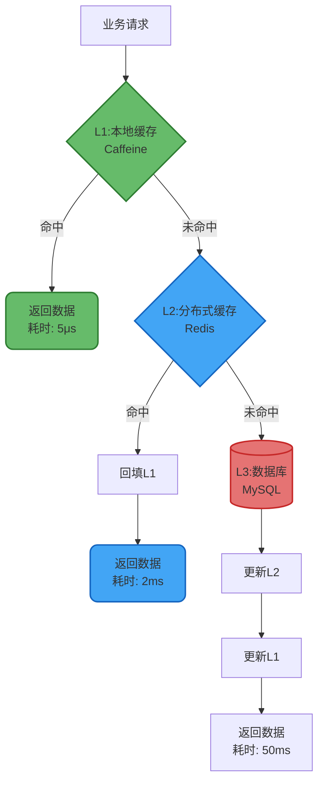

import PaidCTA from '@site/src/components/PaidCTA';

# 多级缓存架构设计与实践

## 多级缓存架构概述

### 架构理念

多级缓存是一种分层的缓存策略,通过在不同层次部署缓存组件,构建从近到远的数据访问路径。核心思想是将热点数据尽可能靠近访问源,以最小的延迟提供数据服务。

在Java应用场景中,典型的多级缓存架构由本地缓存和分布式缓存两层构成,分别承担不同的职责:

### 性能收益分析

| 缓存层级 | 访问延迟 | 吞吐能力 | 容量限制 |
|---------|---------|---------|---------|
| 本地缓存(L1) | 1-10μs | 100万QPS+ | 受JVM堆内存限制 |
| 分布式缓存(L2) | 1-5ms | 10万QPS | 可水平扩展至TB级 |
| 数据库(L3) | 10-100ms | 1万QPS | 受磁盘IO限制 |

通过多级缓存,可将99%的请求拦截在本地缓存,大幅降低数据库压力和网络开销。

## 技术选型与实现

### 本地缓存层选型

**推荐方案**: Caffeine / Guava Cache

Caffeine采用W-TinyLFU淘汰算法,在相同容量下命中率比Guava提升15%,且性能更优:

<PaidCTA />