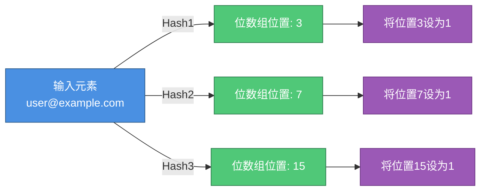
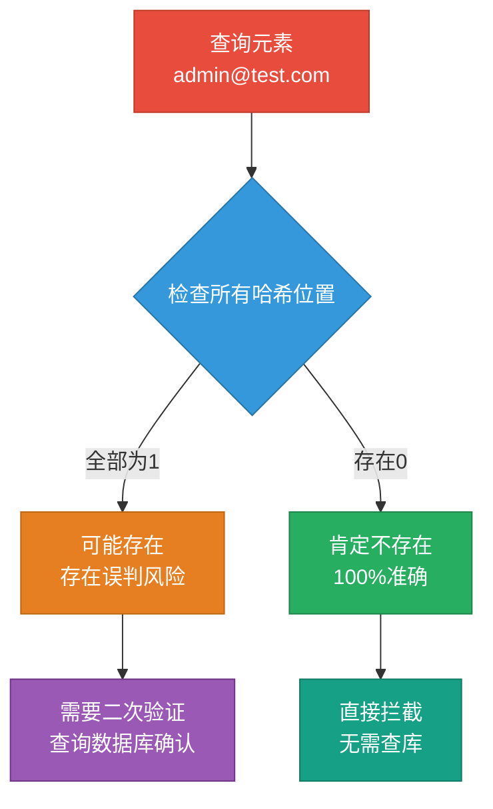
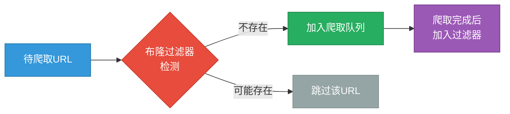
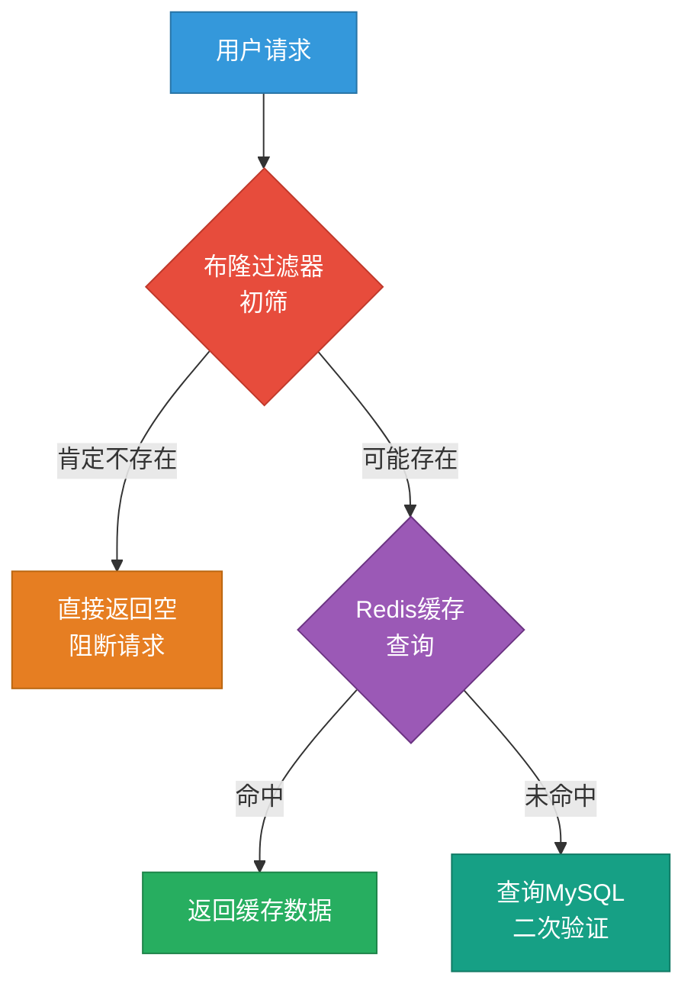
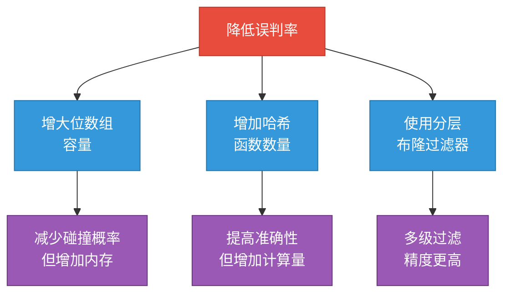
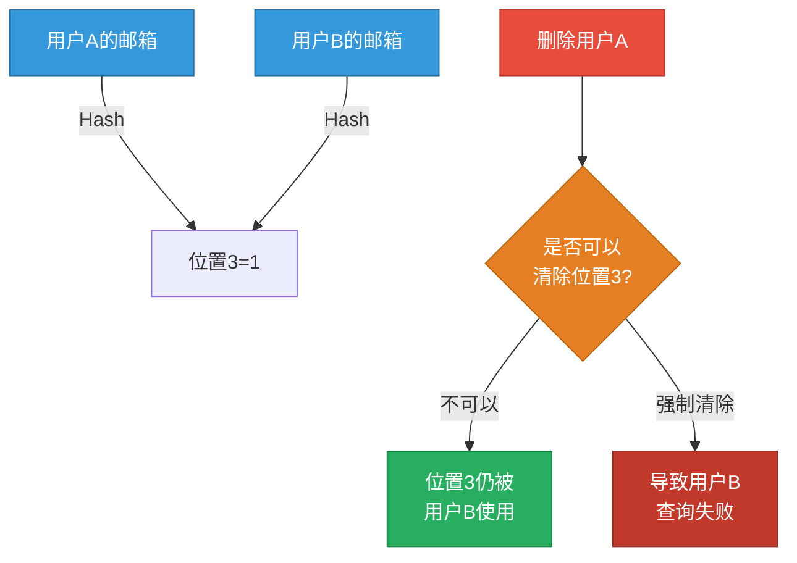
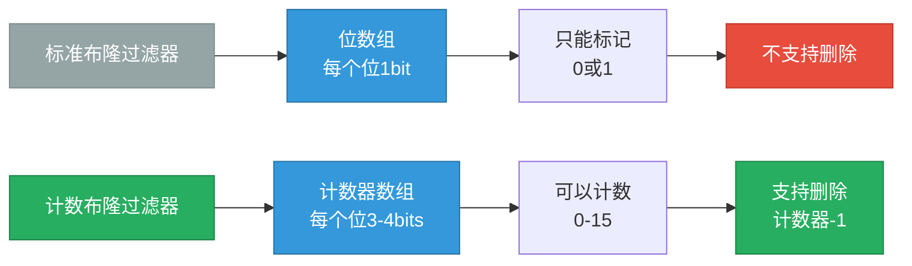

# 布隆过滤器原理与实战应用

## 布隆过滤器概述

布隆过滤器是一种高效的概率型数据结构，专门用于快速判断某个元素是否可能存在于海量数据集合中。它通过极小的内存开销，实现了高性能的成员查询功能，在分布式系统和大数据场景中得到了广泛应用。

布隆过滤器的核心思想是利用多个独立的哈希函数，将待检索的元素映射到位数组（Bit Array）的多个位置上。当需要查询某个元素时，只需检查这些位置是否全部被标记即可。

### 工作原理

布隆过滤器基于位数组和多哈希函数的组合来实现高效过滤。其底层存储结构是一个固定长度的二进制数组，初始状态下所有位均为0。



**添加元素的完整流程：**

1. **初始化阶段**：创建布隆过滤器时需指定两个关键参数——预期元素数量和可接受的误判率。系统会根据这些参数自动计算出最优的位数组大小和哈希函数数量。

2. **元素插入**：当向布隆过滤器添加元素时，该元素会依次经过k个不同的哈希函数计算，得到k个数组索引位置。随后将这k个位置的值全部设置为1。如果某些位置已经是1，则保持不变。

3. **查询检测**：查询某个元素是否存在时，同样使用相同的k个哈希函数计算索引位置，然后检查这k个位置的值。若全部为1，则判定元素**可能存在**；只要有一个位置为0，则元素**肯定不存在**。

### 误判特性分析

布隆过滤器具有独特的误判特性：**它能够100%准确地判断一个元素不存在，但无法保证元素一定存在。**



**误判产生的原因：**

假设我们向布隆过滤器中插入了元素A和元素B，它们经过哈希计算后可能恰好将位数组的第3、7、15位设置为1。当查询一个实际不存在的元素C时，如果C的哈希结果也映射到这三个位置，就会产生误判——即认为C存在，但实际上这些位是被A和B设置的。

这种哈希碰撞是不可避免的，但可以通过以下方式降低误判率：

- **扩大位数组容量**：增加位数组的长度，降低不同元素映射到相同位置的概率
- **增加哈希函数数量**：使用更多的哈希函数，提高碰撞检测的准确性
- **合理设置容量参数**：根据实际业务场景预估数据量，避免过度填充

## 实战应用场景

布隆过滤器因其出色的时空效率，在众多高并发、大数据场景中发挥着重要作用：

### 网络爬虫去重

网络爬虫在运行过程中需要记录已访问的URL，避免重复抓取。传统方案使用HashSet存储所有URL，但面对亿级URL时内存消耗巨大。布隆过滤器可以用极小的空间（通常是HashSet的1/10）实现URL去重判断。



### 缓存穿透防护

在高并发系统中，恶意请求可能反复查询不存在的数据，导致请求穿透缓存层直接打到数据库。通过在缓存层前置布隆过滤器，可以快速拦截这些无效请求。



### 分布式系统

在分布式缓存架构中，使用布隆过滤器可以避免向所有节点发起查询。先通过本地布隆过滤器判断数据是否可能存在于某个节点，显著降低了网络开销和查询延迟。

### 垃圾邮件识别

邮件系统维护一个已知垃圾邮件发送者的黑名单，布隆过滤器可以快速判断发件人地址是否在黑名单中，实现毫秒级的邮件过滤。

### IP黑名单过滤

安全系统需要拦截来自恶意IP的请求。使用布隆过滤器存储黑名单IP，可以在网关层实现高性能的访问控制，避免恶意流量进入内部系统。

## Java实现方案

在Java生态中，有多种成熟的布隆过滤器实现方案可供选择，每种方案都有其适用场景。

### Google Guava实现

Guava是Google提供的Java核心库扩展，其布隆过滤器实现简单高效，适合单机场景。

```java
import com.google.common.hash.BloomFilter;
import com.google.common.hash.Funnels;
import java.nio.charset.StandardCharsets;

public class UserBloomFilterExample {
    public static void main(String[] args) {
        // 创建布隆过滤器，预计存储10000个用户邮箱，误判率为1%
        BloomFilter<String> userFilter = BloomFilter.create(
            Funnels.stringFunnel(StandardCharsets.UTF_8), 
            10000, 
            0.01
        );

        // 添加用户邮箱到过滤器
        userFilter.put("alice@company.com");
        userFilter.put("bob@company.com");
        userFilter.put("charlie@company.com");

        // 检测邮箱是否可能存在
        System.out.println(userFilter.mightContain("alice@company.com"));  // true
        System.out.println(userFilter.mightContain("unknown@company.com")); // false
    }
}
```

### Apache Commons实现

Apache Commons Collection提供了另一种布隆过滤器实现，功能更为丰富。

```java
import org.apache.commons.collections4.bloomfilter.BloomFilter;
import org.apache.commons.collections4.bloomfilter.SimpleBloomFilter;
import org.apache.commons.collections4.bloomfilter.hasher.HashFunctionIdentity;
import org.apache.commons.collections4.bloomfilter.hasher.Hasher;

public class ProductBloomFilterExample {
    public static void main(String[] args) {
        // 创建布隆过滤器，预计存储5000个商品ID
        BloomFilter<String> productFilter = new SimpleBloomFilter(
            HashFunctionIdentity.MURMUR3_128,
            5000,
            0.01
        );

        // 添加商品ID
        productFilter.put("PROD_10001");
        productFilter.put("PROD_10002");
        productFilter.put("PROD_10003");

        // 检测商品是否存在
        System.out.println(productFilter.contains("PROD_10001"));  // true
        System.out.println(productFilter.contains("PROD_99999"));  // false
    }
}
```

### Redis + Redisson实现

对于分布式系统，Redis结合Redisson客户端可以实现分布式布隆过滤器，多个应用实例共享同一个过滤器。

```java
import org.redisson.Redisson;
import org.redisson.api.RBloomFilter;
import org.redisson.api.RedissonClient;
import org.redisson.config.Config;

public class DistributedBloomFilterExample {
    public static void main(String[] args) {
        // 配置Redis连接
        Config config = new Config();
        config.useSingleServer().setAddress("redis://127.0.0.1:6379");

        RedissonClient redissonClient = Redisson.create(config);
        
        // 获取分布式布隆过滤器
        RBloomFilter<String> orderFilter = redissonClient.getBloomFilter("order_filter");
        
        // 初始化过滤器：预计20000个订单，误判率0.5%
        orderFilter.tryInit(20000, 0.005);
        
        // 添加订单号
        orderFilter.add("ORDER_2024001");
        orderFilter.add("ORDER_2024002");
        orderFilter.add("ORDER_2024003");
        
        // 查询订单是否存在
        System.out.println(orderFilter.contains("ORDER_2024001"));  // true
        System.out.println(orderFilter.contains("ORDER_9999999"));  // false
        
        redissonClient.shutdown();
    }
}
```

### Jedis直接操作Redis

也可以直接使用Jedis客户端操作Redis的布隆过滤器模块：

```java
import redis.clients.jedis.Jedis;

public class JedisBloomFilterExample {
    public static void main(String[] args) {
        Jedis jedis = new Jedis("localhost", 6379);
        
        // 创建布隆过滤器
        jedis.execute("BF.RESERVE", "session_filter", "0.01", "8000");
        
        // 添加会话ID
        jedis.execute("BF.ADD", "session_filter", "SESSION_ABC123");
        jedis.execute("BF.ADD", "session_filter", "SESSION_DEF456");
        jedis.execute("BF.ADD", "session_filter", "SESSION_GHI789");
        
        // 检测会话是否存在
        System.out.println(jedis.execute("BF.EXISTS", "session_filter", "SESSION_ABC123"));
        System.out.println(jedis.execute("BF.EXISTS", "session_filter", "SESSION_XYZ000"));
        
        jedis.close();
    }
}
```

### 关键参数说明

在实际使用中，需要合理设置两个核心参数：

**预期容量（Expected Insertions）**：估算将要存储的元素总数。这个值不是硬限制，超出后仍可继续添加元素，但误判率会逐渐升高。建议设置为实际需求的1.2-1.5倍。

**误判率（False Positive Probability）**：可接受的误判概率。常用值为0.01（1%）或0.001（0.1%）。误判率越低，所需的位数组空间越大。需根据业务场景权衡：
- 黑名单场景：可设置为0.001，容忍极低误判
- 缓存穿透防护：可设置为0.01，适度平衡性能与准确性

## 核心缺陷与解决方案

布隆过滤器虽然强大，但也存在一些固有的局限性，需要在使用时充分了解并采取相应的应对策略。

### 误判问题的应对

**问题本质：**

布隆过滤器的误判是由哈希碰撞引起的结构性问题，无法完全消除。当多个元素的哈希值映射到相同的位时，就会导致将不存在的元素判断为存在。

**降低误判的策略：**



**二次验证机制：**

在实际应用中，当布隆过滤器返回"可能存在"时，必须进行二次查询确认。这看似增加了工作量，但实际上布隆过滤器已经帮助我们过滤掉了绝大多数不存在的查询，显著降低了数据库压力。

例如在黑名单场景中：
- 95%的正常用户会被布隆过滤器直接放行（返回"不存在"）
- 只有5%的可疑用户需要查询数据库进行二次确认
- 即使存在1%的误判，实际影响也仅为总请求的0.05%

### 无法删除元素的解决方案

**问题根源：**

布隆过滤器无法删除元素的根本原因在于：一个位可能被多个元素共同使用。当我们试图删除某个元素时，如果直接将其对应的位置0，可能会影响其他元素的查询结果。



#### 方案一：定期重建

最常用的解决方案是定期基于最新的有效数据重建布隆过滤器。

**实现思路：**

虽然无法删除元素会导致误判率逐渐上升，但由于查询命中后会进行二次验证，不会影响最终结果的准确性，只是增加了数据库查询次数。因此可以采取定期重建策略：

- **应用启动时重建**：从数据库加载最新的有效数据，构建新的布隆过滤器
- **定时任务重建**：每隔一定时间（如每天凌晨）基于最新数据重建
- **双实例切换**：构建新过滤器的同时保留旧过滤器，构建完成后无缝切换

```java
public class BloomFilterManager {
    private volatile BloomFilter<String> currentFilter;
    private final Map<String, BloomFilter<String>> filterMap = new ConcurrentHashMap<>();
    
    // 定时重建布隆过滤器
    @Scheduled(cron = "0 0 2 * * ?")  // 每天凌晨2点执行
    public void rebuildBloomFilter() {
        // 从数据库查询最新的有效用户邮箱列表
        List<String> activeEmails = userRepository.findAllActiveEmails();
        
        // 创建新的布隆过滤器
        BloomFilter<String> newFilter = BloomFilter.create(
            Funnels.stringFunnel(StandardCharsets.UTF_8),
            activeEmails.size(),
            0.01
        );
        
        // 批量添加元素
        activeEmails.forEach(newFilter::put);
        
        // 原子性替换旧过滤器
        filterMap.put("user_email_filter", newFilter);
        this.currentFilter = newFilter;
    }
}
```

#### 方案二：计数布隆过滤器

计数布隆过滤器（Counting Bloom Filter）通过将每个位扩展为一个计数器来支持删除操作。

**核心改进：**

- 将位数组的每个位（1 bit）扩展为计数器（通常3-4 bits，可表示0-15）
- 添加元素时：对应位置的计数器+1
- 查询元素时：检查所有对应位置的计数器是否都大于0
- 删除元素时：对应位置的计数器-1



**优缺点分析：**

- **优点**：真正支持元素删除，实现简单
- **缺点**：
  - 空间开销增加300%-400%（每个位从1bit扩展到3-4bits）
  - 存在计数器溢出风险（如果同一位置被添加超过15次）
  - 相比传统Set仍然节省空间，但优势减弱

#### 方案三：布谷鸟过滤器

布谷鸟过滤器（Cuckoo Filter）是布隆过滤器的改进版本，原生支持删除操作，且空间效率更高。它采用了不同的存储策略，将元素的指纹（fingerprint）存储在哈希表中，通过布谷鸟哈希算法解决冲突。

相比计数布隆过滤器，布谷鸟过滤器在支持删除的同时保持了更高的空间利用率，是一个更优的替代方案。

### 其他使用注意事项

**不支持模糊查询**：布隆过滤器只能判断精确匹配，无法进行前缀匹配、正则匹配等模糊查询操作。

**参数设置需要经验**：
- 容量预估：建议设置为实际需求的1.5倍，预留一定冗余
  - 1000万级数据：设置为15,000,000
  - 100万级数据：设置为1,500,000
- 误判率选择：
  - 高精度场景（金融风控）：0.001（千分之一）
  - 普通缓存场景：0.01（百分之一）
  - 低精度场景（爬虫去重）：0.05（百分之五）

**容量超限影响**：当实际存储的元素数量超过初始设置的容量时，布隆过滤器不会报错或拒绝插入，但误判率会显著上升。因此需要通过监控系统跟踪实际使用量，当接近容量上限时及时扩容或重建。
