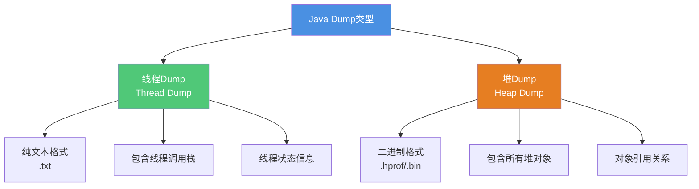
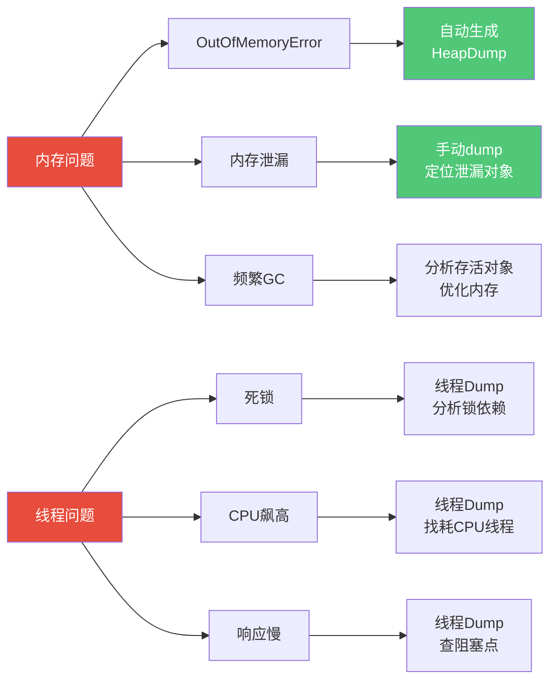
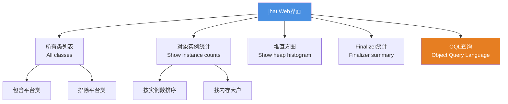
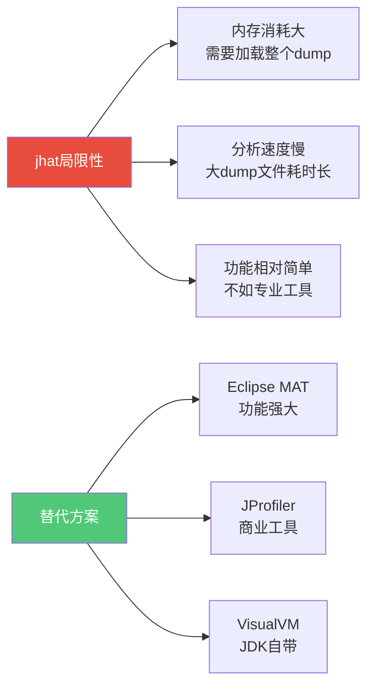
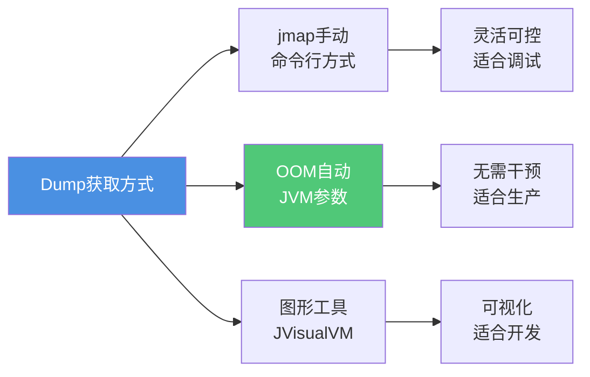
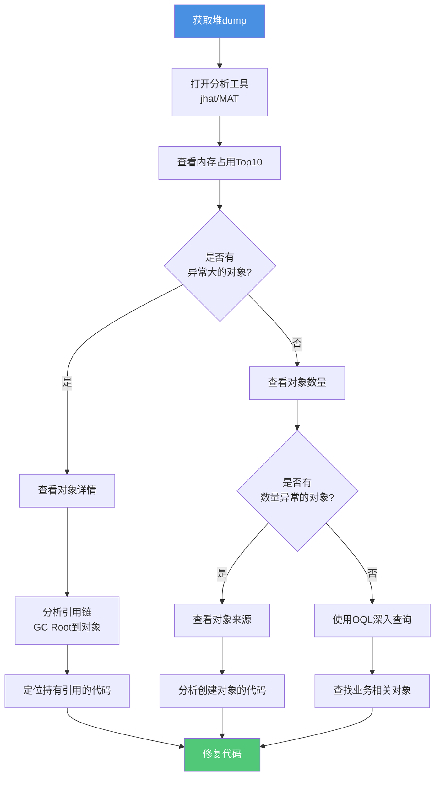
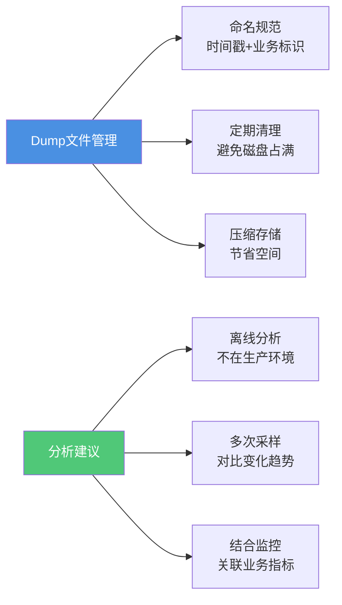

# 堆内存分析与Dump文件处理

## 堆内存分析基础

在生产环境中,内存问题是最常见也最棘手的故障之一。当应用出现内存溢出、内存泄漏或频繁Full GC时,我们需要通过堆内存分析来定位根本原因。Java提供了完整的堆内存诊断方案,核心是Dump技术。

### 什么是Java Dump

Dump是Java虚拟机运行时的快照文件,它将JVM在特定时刻的状态和信息完整地保存下来,就像给虚拟机拍了一张"照片"。根据包含内容的不同,Dump主要分为两类:



### Dump的应用场景



Dump文件补足了传统Bug分析手段的不足:
- 可在任何Java环境使用,无需特殊工具
- 信息量充足,包含完整的运行时状态
- 特别适合定位多线程并发问题和内存泄漏

## jmap - 堆内存映射工具

### 核心功能

jmap是JDK自带的内存映射工具,主要用于生成堆Dump文件,也可以查看堆内存的实时使用情况。当程序出现内存不足或频繁GC时,jmap是首选的诊断工具。

:::warning 重要提示
执行jmap命令时,JVM会进入安全点并暂停所有线程。对于大堆内存的应用,这个过程可能持续数秒甚至数十秒,因此应避免在业务高峰期执行。
:::

### 命令格式与参数

```bash
# 基本格式
jmap [option] <pid>

# 主要选项:
# -heap              : 查看堆摘要信息
# -histo[:live]      : 查看堆中对象统计
# -dump:<选项>        : 生成堆dump文件
# -finalizerinfo     : 查看等待finalize的对象
# -F                 : 强制执行(进程无响应时使用)
```

### 查看堆内存配置

当我们怀疑堆内存配置不合理时,可以使用`jmap -heap`查看详细配置:

```bash
$ jmap -heap 31846

Attaching to process ID 31846, please wait...
Debugger attached successfully.
Server compiler detected.
JVM version is 24.71-b01

using thread-local object allocation.
Parallel GC with 4 thread(s)

Heap Configuration:
   MinHeapFreeRatio         = 0          # 最小堆空闲比率
   MaxHeapFreeRatio         = 100        # 最大堆空闲比率
   MaxHeapSize              = 2082471936 (1986.0MB)  # 最大堆大小
   NewSize                  = 1310720 (1.25MB)       # 新生代初始大小
   MaxNewSize               = 17592186044415 MB      # 新生代最大大小
   OldSize                  = 5439488 (5.1875MB)     # 老年代大小
   NewRatio                 = 2          # 新生代与老年代比例
   SurvivorRatio            = 8          # Eden与Survivor比例
   PermSize                 = 21757952 (20.75MB)     # 永久代初始大小
   MaxPermSize              = 85983232 (82.0MB)      # 永久代最大大小

Heap Usage:
PS Young Generation
Eden Space:
   capacity = 33030144 (31.5MB)
   used     = 1524040 (1.45MB)
   free     = 31506104 (30.05MB)
   4.61% used

From Space:
   capacity = 5242880 (5.0MB)
   used     = 0 (0.0MB)
   free     = 5242880 (5.0MB)
   0.0% used

To Space:
   capacity = 5242880 (5.0MB)
   used     = 0 (0.0MB)
   free     = 5242880 (5.0MB)
   0.0% used

PS Old Generation:
   capacity = 86507520 (82.5MB)
   used     = 0 (0.0MB)
   free     = 86507520 (82.5MB)
   0.0% used

PS Perm Generation:
   capacity = 22020096 (21.0MB)
   used     = 2496528 (2.38MB)
   free     = 19523568 (18.62MB)
   11.34% used
```

### 统计堆中对象分布

使用`-histo`参数可以查看堆中每种对象的数量和占用内存:

```bash
$ jmap -histo 35621

num     #instances         #bytes  class name
----------------------------------------------
   1:        125678       45678912  [B
   2:         89234       12456780  java.lang.String
   3:         56789        9876543  java.util.HashMap$Node
   4:         45612        7345678  com.example.order.OrderInfo
   5:         34567        5543210  java.util.ArrayList
   6:         28901        4567823  com.example.user.UserSession
   7:         23456        3765432  java.lang.Integer
   8:         19876        3187654  java.util.concurrent.ConcurrentHashMap$Node
```

列含义解析:
- **num**: 序号
- **instances**: 对象实例数量
- **bytes**: 占用的总字节数
- **class name**: 类名(数组类型用[表示,如[B表示byte数组)

:::tip 性能优化
使用`jmap -histo:live`会先触发一次Full GC,只统计存活对象。这对于定位内存泄漏很有帮助,但会造成较长时间的停顿。
:::

### 生成堆Dump文件

当发现内存异常时,最重要的操作是生成堆Dump文件:

```bash
# 标准方式:dump所有对象
jmap -dump:format=b,file=heap_all.hprof 35621

# 推荐方式:只dump存活对象(会先触发Full GC)
jmap -dump:live,format=b,file=heap_live.hprof 35621

# 强制dump(进程挂起无响应时)
jmap -F -dump:format=b,file=heap_force.hprof 35621
```

### 实战案例:电商订单系统内存分析

假设某电商系统在大促期间频繁出现Full GC,我们来诊断问题:

```java
// 问题代码示例
public class OrderCache {
    // 静态缓存,永不清理
    private static Map<String, Order> orderCache = new HashMap<>();
    
    public void cacheOrder(Order order) {
        // 持续往缓存中添加订单,导致内存泄漏
        orderCache.put(order.getId(), order);
    }
    
    public Order getOrder(String orderId) {
        return orderCache.get(orderId);
    }
}
```

诊断步骤:

```bash
# 1. 先查看堆使用情况
$ jmap -heap 42156
# 发现Old区使用率持续在90%以上

# 2. 查看对象分布
$ jmap -histo:live 42156 | head -20
num     #instances         #bytes  class name
   1:        856234      456789123  com.example.order.Order
   2:        856234      287654321  java.util.HashMap$Node
   
# 3. 生成堆dump进行深入分析
$ jmap -dump:live,format=b,file=/tmp/order_heap.hprof 42156
Dumping heap to /tmp/order_heap.hprof ...
Heap dump file created
```

从上述输出可以看出,Order对象和HashMap的Node对象数量异常庞大,初步怀疑是缓存未清理导致的内存泄漏。

## jhat - 堆分析工具

### 核心功能

jhat(Java Heap Analysis Tool)是JDK自带的堆分析工具,它可以解析jmap生成的Dump文件,并启动一个Web服务器,通过浏览器以可视化的方式查看堆内存详情。

### 基本使用

```bash
# 解析堆dump文件并启动web服务
$ jhat heap_live.hprof

Reading from heap_live.hprof...
Dump file created Thu Dec 02 14:30:25 CST 2025
Snapshot read, resolving...
Resolving 341297 objects...
Chasing references, expect 68 dots....................................................................
Eliminating duplicate references....................................................................
Snapshot resolved.
Started HTTP server on port 7000
Server is ready.
```

启动成功后,访问 `http://localhost:7000/` 即可查看堆分析结果。

### Web界面功能



### 关键查询功能

访问jhat web页面后,主要使用以下几个查询:

**1. 查看所有类(排除平台类)**
```
Show instance counts for all classes (excluding platform)
```
这会列出所有应用类的实例数量,方便定位哪些对象占用最多内存:

| Class | Instance Count | Total Size |
|-------|---------------|------------|
| com.example.order.Order | 856234 | 456MB |
| com.example.user.UserSession | 234567 | 128MB |
| com.example.cache.CacheEntry | 189234 | 95MB |

**2. 查看堆直方图**
```
Show heap histogram
```
以树状图形式展示堆的整体情况,可以直观看到内存分布。

**3. 使用OQL查询**

jhat支持类SQL的对象查询语言(OQL),可以精确查找特定对象:

```sql
-- 查找所有Order对象
select o from com.example.order.Order o

-- 查找金额大于10000的订单
select o from com.example.order.Order o where o.amount > 10000

-- 查找特定用户的订单
select o from com.example.order.Order o where o.userId == "user12345"

-- 统计对象数量
select count(o) from com.example.order.Order o
```

### 实战案例:定位内存泄漏

继续前面的订单系统案例,使用jhat深入分析:

```bash
# 启动jhat分析
$ jhat -port 8888 /tmp/order_heap.hprof
```

访问 `http://localhost:8888/`,执行以下分析:

**步骤1**: 点击"Show instance counts for all classes (excluding platform)",发现:
- `com.example.order.Order`: 856,234 instances
- `com.example.order.OrderCache`: 1 instance

**步骤2**: 点击OrderCache类,查看该唯一实例,发现:
- 引用了一个HashMap
- HashMap中包含856,234个Entry
- 这些Entry全部指向Order对象

**步骤3**: 使用OQL查询订单创建时间:

```sql
select o.createTime from com.example.order.Order o
```

发现大量订单创建时间是几个月前,确认是缓存未清理导致的内存泄漏。

### jhat的局限性

虽然jhat功能强大,但存在一些局限:



对于大型应用(堆内存几个GB),建议使用Eclipse MAT等专业工具进行分析。

## Dump文件获取方式

### 方式一:手动生成

使用jmap命令手动生成,适合问题复现时主动抓取:

```bash
# 生成包含所有对象的dump
jmap -dump:format=b,file=heap_$(date +%Y%m%d_%H%M%S).hprof <pid>

# 生成只包含存活对象的dump(推荐)
jmap -dump:live,format=b,file=heap_live_$(date +%Y%m%d_%H%M%S).hprof <pid>
```

### 方式二:OOM时自动生成

通过JVM参数配置,在发生OOM时自动生成堆dump:

```bash
java -XX:+HeapDumpOnOutOfMemoryError \
     -XX:HeapDumpPath=/var/logs/heapdump/ \
     -jar application.jar
```

配置参数说明:
- `-XX:+HeapDumpOnOutOfMemoryError`: 启用OOM时自动dump
- `-XX:HeapDumpPath`: 指定dump文件保存路径

:::tip 生产环境建议
强烈建议在生产环境配置自动dump参数。当OOM发生时,dump文件能保留第一现场,是定位问题的关键证据。
:::

### 方式三:使用图形化工具

使用JDK自带的JVisualVM或JConsole:

1. 启动JVisualVM: `jvisualvm`
2. 连接到目标Java进程
3. 在"监视"标签页点击"堆Dump"按钮
4. dump文件会自动保存并打开分析界面



## 堆Dump分析流程

### 标准分析流程



### 常见内存问题模式

**1. 集合类内存泄漏**

```java
// 典型问题代码
public class CacheManager {
    private static final Map<String, Object> cache = new HashMap<>();
    
    public void put(String key, Object value) {
        // 只增不删,导致内存泄漏
        cache.put(key, value);
    }
}

// 解决方案
public class CacheManager {
    // 使用LRU缓存,自动淘汰
    private static final Map<String, Object> cache = 
        new LinkedHashMap<String, Object>(16, 0.75f, true) {
            protected boolean removeEldestEntry(Map.Entry eldest) {
                return size() > 10000;
            }
        };
}
```

**2. 监听器未注销**

```java
// 问题代码
public class EventPublisher {
    private List<EventListener> listeners = new ArrayList<>();
    
    public void addListener(EventListener listener) {
        listeners.add(listener);
        // 未提供remove方法,监听器无法释放
    }
}

// 解决方案
public class EventPublisher {
    private List<WeakReference<EventListener>> listeners = new ArrayList<>();
    
    public void addListener(EventListener listener) {
        listeners.add(new WeakReference<>(listener));
    }
    
    public void removeListener(EventListener listener) {
        listeners.removeIf(ref -> ref.get() == listener || ref.get() == null);
    }
}
```

**3. 数据库连接未关闭**

```java
// 问题代码
public List<User> queryUsers() {
    Connection conn = dataSource.getConnection();
    Statement stmt = conn.createStatement();
    ResultSet rs = stmt.executeQuery("SELECT * FROM users");
    // 未关闭资源,导致连接泄漏
    return parseResultSet(rs);
}

// 解决方案
public List<User> queryUsers() {
    try (Connection conn = dataSource.getConnection();
         Statement stmt = conn.createStatement();
         ResultSet rs = stmt.executeQuery("SELECT * FROM users")) {
        return parseResultSet(rs);
    } catch (SQLException e) {
        throw new RuntimeException(e);
    }
}
```

## 最佳实践建议

### dump文件管理



### 问题定位技巧

1. **对比分析法**: 生成多个时间点的dump,对比对象数量变化
2. **GC Root追踪**: 从根对象追踪引用链,找到不能被回收的原因
3. **业务关联**: 结合业务日志,定位异常对象产生的时间和业务场景
4. **压测复现**: 在测试环境压测复现问题,便于反复分析

### 性能优化要点

```java
// 示例:优化大对象缓存
public class ImageCache {
    // 使用软引用,内存不足时自动释放
    private Map<String, SoftReference<byte[]>> cache = new ConcurrentHashMap<>();
    
    public byte[] getImage(String imageId) {
        SoftReference<byte[]> ref = cache.get(imageId);
        if (ref != null) {
            byte[] image = ref.get();
            if (image != null) {
                return image;
            }
        }
        
        // 从磁盘加载
        byte[] image = loadFromDisk(imageId);
        cache.put(imageId, new SoftReference<>(image));
        return image;
    }
    
    private byte[] loadFromDisk(String imageId) {
        // 加载逻辑
        return new byte[0];
    }
}
```

## 总结

堆内存分析是Java性能诊断的核心技能,本文介绍的工具和方法构成了完整的诊断链路:

- **jmap**: 生成堆快照,查看内存使用情况
- **jhat**: 快速分析堆dump,定位内存问题
- **Dump技术**: 保存运行时快照,为问题定位提供第一手资料

掌握这些工具的组合使用,配合合理的分析流程和最佳实践,能够高效解决生产环境中的内存问题。记住,预防胜于治疗,在代码编写阶段就要注意资源管理和内存使用规范。
